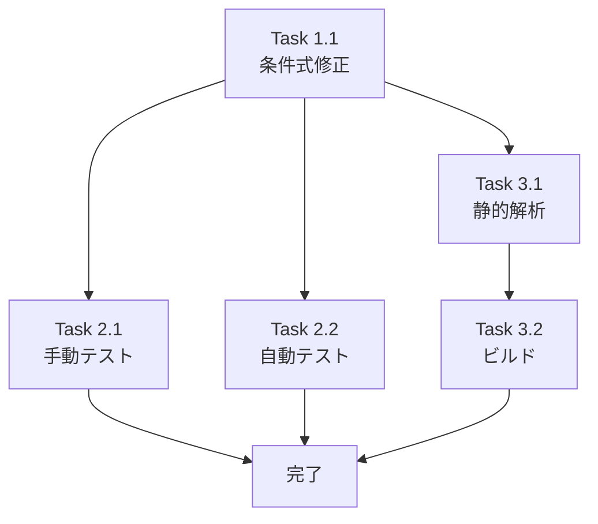

# Issue #129: 作業計画

## Issue概要

| 項目 | 内容 |
|------|------|
| **Issue番号** | #129 |
| **タイトル** | リポジトリが1つしか存在しない場合削除出来ない |
| **ラベル** | bug |
| **サイズ** | S（1行の条件式変更） |
| **優先度** | Medium |
| **依存Issue** | なし |

### 問題概要
リポジトリが1つの場合、フィルタUI全体（削除ボタン含む）が非表示になり、削除操作にアクセスできない。

### 解決方針
`WorktreeList.tsx`のリポジトリフィルタ表示条件を`repositories.length > 1`から`repositories.length > 0`に変更する。

---

## 詳細タスク分解

### Phase 1: 実装タスク

#### Task 1.1: リポジトリフィルタ表示条件の修正
- **成果物**: `src/components/worktree/WorktreeList.tsx`
- **変更内容**: 299行目付近の条件式を修正
- **依存**: なし
- **工数**: 5分

```tsx
// 変更前
{repositories.length > 1 && (

// 変更後
{repositories.length > 0 && (
```

### Phase 2: テストタスク

#### Task 2.1: 手動テストの実行
- **成果物**: テスト結果の確認
- **依存**: Task 1.1
- **工数**: 15分

| # | テストケース | 期待結果 |
|---|-------------|---------|
| 1 | リポジトリを1つ登録 | フィルタUIが表示され、削除ボタンが見える |
| 2 | リポジトリ1つの状態で削除ボタンをクリック | 確認ダイアログが表示される |
| 3 | 確認ダイアログで削除を実行 | リポジトリが削除され、0件状態になる |
| 4 | リポジトリ0件の状態 | フィルタUIが非表示 |
| 5 | 複数リポジトリの状態でフィルタ操作 | 既存動作と同じ |
| 6 | リポジトリ1つの状態でフィルタボタンをクリック | フィルタUIは表示されたまま |

#### Task 2.2: 既存テストの実行
- **成果物**: テスト結果（全パス）
- **依存**: Task 1.1
- **工数**: 5分

```bash
npm run test:unit
npm run test:integration
```

### Phase 3: 品質チェック

#### Task 3.1: 静的解析
- **成果物**: エラー0件の確認
- **依存**: Task 1.1
- **工数**: 2分

```bash
npm run lint
npx tsc --noEmit
```

#### Task 3.2: ビルド確認
- **成果物**: ビルド成功の確認
- **依存**: Task 3.1
- **工数**: 3分

```bash
npm run build
```

---

## タスク依存関係



---

## 品質チェック項目

| チェック項目 | コマンド | 基準 |
|-------------|----------|------|
| ESLint | `npm run lint` | エラー0件 |
| TypeScript | `npx tsc --noEmit` | 型エラー0件 |
| Unit Test | `npm run test:unit` | 全テストパス |
| Integration Test | `npm run test:integration` | 全テストパス |
| Build | `npm run build` | 成功 |

---

## 成果物チェックリスト

### コード
- [ ] `src/components/worktree/WorktreeList.tsx` - 条件式修正

### テスト
- [ ] 手動テスト6ケース実行
- [ ] 既存ユニットテスト全パス
- [ ] 既存結合テスト全パス

### 検証
- [ ] ESLint エラー0件
- [ ] TypeScript 型エラー0件
- [ ] ビルド成功

---

## Definition of Done

Issue完了条件：
- [x] 設計方針書作成済み（v1.3）
- [x] マルチステージ設計レビュー完了（4段階）
- [ ] 実装タスク完了（条件式1行変更）
- [ ] 手動テスト6ケース全パス
- [ ] 自動テスト全パス（unit, integration）
- [ ] CIチェック全パス（lint, type-check, build）
- [ ] 受け入れ条件4項目すべて満たす

### 受け入れ条件
- [ ] リポジトリが1つの場合でも削除UIにアクセスできる
- [ ] 最後の1つのリポジトリを削除できる
- [ ] 削除後にリポジトリ一覧が0件になった場合の表示が適切である
- [ ] 既存の複数リポジトリがある場合の動作に影響がない

---

## 工数見積もり

| Phase | タスク | 工数 |
|-------|--------|------|
| Phase 1 | 実装 | 5分 |
| Phase 2 | テスト | 20分 |
| Phase 3 | 品質チェック | 5分 |
| **合計** | | **30分** |

---

## 次のアクション

作業計画承認後：

1. **ブランチ作成**
   ```bash
   git checkout -b fix/129-single-repository-delete
   ```

2. **実装**
   - `/tdd-impl` または `/pm-auto-dev` で自動実行
   - または手動で条件式を修正

3. **テスト・検証**
   ```bash
   npm run lint
   npx tsc --noEmit
   npm run test:unit
   npm run test:integration
   npm run build
   ```

4. **PR作成**
   ```bash
   /create-pr
   ```

---

## 関連ドキュメント

- **Issue**: https://github.com/Kewton/CommandMate/issues/129
- **設計方針書**: `dev-reports/design/issue-129-single-repository-delete-design-policy.md`
- **Issueレビュー結果**: `dev-reports/issue/129/issue-review/`
- **設計レビュー結果**: `dev-reports/issue/129/multi-stage-design-review/`

---

*Generated by /work-plan command*
