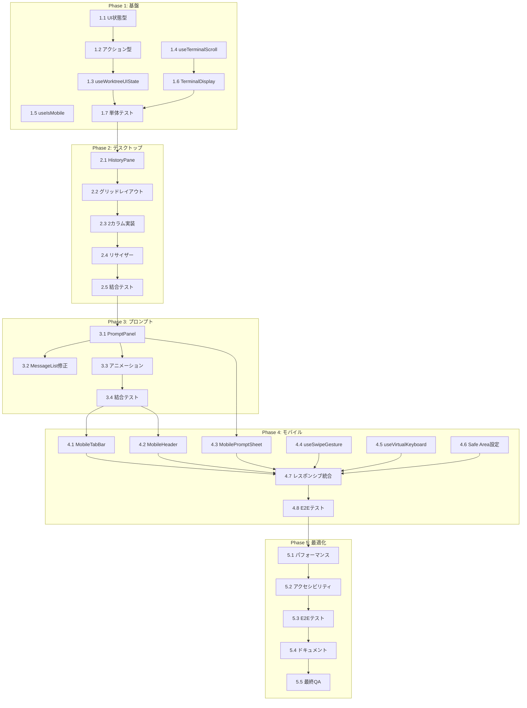

# Issue #13 UX改善 作業計画

**作成日**: 2026-01-06
**Issue番号**: #13
**タイトル**: UX改善

---

## 1. Issue概要

| 項目 | 内容 |
|------|------|
| **Issue番号** | #13 |
| **タイトル** | UX改善 |
| **サイズ** | L（大規模リファクタリング） |
| **優先度** | High |
| **依存Issue** | なし |
| **設計書** | `dev-reports/design/issue-13-ux-improvement-design-policy.md` |
| **レビュー結果** | 承認済み（`dev-reports/review/2026-01-06-issue-13-architecture-review.md`）|

### 要件サマリ

画面を4つの論理ブロックに分割し、Claude Codeとの対話UIを改善：

| ブロック | 役割 | 表示条件 |
|---------|------|---------|
| **A. ターミナル** | リアルタイム出力（独立スクロール） | 常時表示 |
| **B. プロンプト応答** | yes/no/複数選択 | プロンプト検出時のみ |
| **C. ユーザー入力** | メッセージ送信 | 常時表示 |
| **D. 入力履歴** | 過去のユーザー入力一覧 | 常時表示（左ペイン） |

---

## 2. 詳細タスク分解

### Phase 1: 基盤コンポーネント（状態管理・型定義）

| タスクID | タスク名 | 成果物 | 依存 |
|----------|---------|--------|------|
| **1.1** | UI状態型定義 | `src/types/ui-state.ts` | なし |
| **1.2** | UIアクション型定義 | `src/types/ui-actions.ts` | 1.1 |
| **1.3** | useWorktreeUIState フック | `src/hooks/useWorktreeUIState.ts` | 1.2 |
| **1.4** | useTerminalScroll フック | `src/hooks/useTerminalScroll.ts` | なし |
| **1.5** | useIsMobile フック | `src/hooks/useIsMobile.ts` | なし |
| **1.6** | TerminalDisplay コンポーネント | `src/components/worktree/TerminalDisplay.tsx` | 1.4 |
| **1.7** | Phase 1 単体テスト | `tests/unit/hooks/*.test.ts` | 1.3-1.6 |

#### Task 1.1: UI状態型定義
```typescript
// src/types/ui-state.ts
export type UIPhase = 'idle' | 'waiting' | 'receiving' | 'prompt' | 'complete';
export interface TerminalState { ... }
export interface PromptState { ... }
export interface LayoutState { ... }
export interface ErrorState { ... }
export interface WorktreeUIState { ... }
```

#### Task 1.3: useWorktreeUIState フック
```typescript
// src/hooks/useWorktreeUIState.ts
// 設計書セクション16の実装
export function useWorktreeUIState() {
  const [state, dispatch] = useReducer(worktreeUIReducer, initialState);
  // ... action creators
  return { state, dispatch, actions };
}
```

#### Task 1.6: TerminalDisplay コンポーネント
```typescript
// src/components/worktree/TerminalDisplay.tsx
interface TerminalDisplayProps {
  output: string;
  isActive: boolean;
  isThinking?: boolean;
  autoScroll?: boolean;
  onScrollChange?: (isAtBottom: boolean) => void;
}
```

---

### Phase 2: デスクトップレイアウト再構成

| タスクID | タスク名 | 成果物 | 依存 |
|----------|---------|--------|------|
| **2.1** | HistoryPane コンポーネント分離 | `src/components/worktree/HistoryPane.tsx` | Phase 1 |
| **2.2** | WorktreeDetail グリッドレイアウト | `src/components/worktree/WorktreeDetail.tsx`（修正）| 2.1 |
| **2.3** | 2カラムレイアウト実装 | 同上 | 2.2 |
| **2.4** | リサイザー実装 | `src/components/worktree/PaneResizer.tsx` | 2.3 |
| **2.5** | Phase 2 結合テスト | `tests/integration/desktop-layout.test.ts` | 2.4 |

#### Task 2.1: HistoryPane コンポーネント
```typescript
// src/components/worktree/HistoryPane.tsx
interface HistoryPaneProps {
  messages: ChatMessage[];
  worktreeId: string;
  onFilePathClick: (path: string) => void;
}
```

#### Task 2.2-2.3: WorktreeDetail レイアウト変更
```tsx
// 現在: 796行の単一コンポーネント
// 変更後: ~300行 + 分離コンポーネント
<div className="grid grid-cols-2 gap-4">
  <ErrorBoundary componentName="履歴">
    <HistoryPane messages={messages} />
  </ErrorBoundary>
  <ErrorBoundary componentName="ターミナル">
    <TerminalDisplay output={terminalOutput} />
  </ErrorBoundary>
</div>
```

---

### Phase 3: プロンプト分離

| タスクID | タスク名 | 成果物 | 依存 |
|----------|---------|--------|------|
| **3.1** | PromptPanel コンポーネント | `src/components/worktree/PromptPanel.tsx` | Phase 2 |
| **3.2** | MessageList からプロンプト表示削除 | `src/components/worktree/MessageList.tsx`（修正）| 3.1 |
| **3.3** | プロンプトアニメーション | 3.1に含む | 3.1 |
| **3.4** | Phase 3 結合テスト | `tests/integration/prompt-panel.test.ts` | 3.3 |

#### Task 3.1: PromptPanel コンポーネント
```typescript
// src/components/worktree/PromptPanel.tsx
interface PromptPanelProps {
  promptData: PromptData | null;
  messageId: string | null;
  visible: boolean;
  answering: boolean;
  onRespond: (answer: string) => Promise<void>;
}
```

---

### Phase 4: モバイル対応

| タスクID | タスク名 | 成果物 | 依存 |
|----------|---------|--------|------|
| **4.1** | MobileTabBar コンポーネント | `src/components/mobile/MobileTabBar.tsx` | Phase 3 |
| **4.2** | MobileHeader コンポーネント | `src/components/mobile/MobileHeader.tsx` | Phase 3 |
| **4.3** | MobilePromptSheet コンポーネント | `src/components/mobile/MobilePromptSheet.tsx` | 3.1 |
| **4.4** | useSwipeGesture フック | `src/hooks/useSwipeGesture.ts` | なし |
| **4.5** | useVirtualKeyboard フック | `src/hooks/useVirtualKeyboard.ts` | なし |
| **4.6** | Tailwind Safe Area 設定 | `tailwind.config.js`（修正）| なし |
| **4.7** | レスポンシブレイアウト統合 | `src/components/worktree/WorktreeDetail.tsx`（修正）| 4.1-4.6 |
| **4.8** | Phase 4 E2Eテスト | `tests/e2e/mobile/*.test.ts` | 4.7 |

#### Task 4.1: MobileTabBar
```typescript
// src/components/mobile/MobileTabBar.tsx
interface MobileTabBarProps {
  activeTab: 'terminal' | 'history' | 'logs' | 'info';
  onTabChange: (tab: string) => void;
}
```

---

### Phase 5: 最適化・仕上げ

| タスクID | タスク名 | 成果物 | 依存 |
|----------|---------|--------|------|
| **5.1** | パフォーマンスチューニング | 各コンポーネント（修正）| Phase 4 |
| **5.2** | アクセシビリティ対応 | 各コンポーネント（修正）| 5.1 |
| **5.3** | E2Eテスト（デスクトップ/モバイル）| `tests/e2e/*.test.ts` | 5.2 |
| **5.4** | ドキュメント更新 | `README.md`, `docs/*` | 5.3 |
| **5.5** | 最終レビュー・QA | - | 5.4 |

---

## 3. タスク依存関係



---

## 4. 成果物一覧

### 新規作成ファイル

| Phase | ファイルパス | 説明 |
|-------|-------------|------|
| 1 | `src/types/ui-state.ts` | UI状態型定義 |
| 1 | `src/types/ui-actions.ts` | UIアクション型定義 |
| 1 | `src/hooks/useWorktreeUIState.ts` | 状態管理フック |
| 1 | `src/hooks/useTerminalScroll.ts` | スクロール制御フック |
| 1 | `src/hooks/useIsMobile.ts` | モバイル検出フック |
| 1 | `src/components/worktree/TerminalDisplay.tsx` | ターミナル表示 |
| 2 | `src/components/worktree/HistoryPane.tsx` | 履歴ペイン |
| 2 | `src/components/worktree/PaneResizer.tsx` | ペインリサイザー |
| 3 | `src/components/worktree/PromptPanel.tsx` | プロンプトパネル |
| 4 | `src/components/mobile/MobileTabBar.tsx` | モバイルタブバー |
| 4 | `src/components/mobile/MobileHeader.tsx` | モバイルヘッダー |
| 4 | `src/components/mobile/MobilePromptSheet.tsx` | モバイルプロンプト |
| 4 | `src/hooks/useSwipeGesture.ts` | スワイプジェスチャー |
| 4 | `src/hooks/useVirtualKeyboard.ts` | キーボード検出 |

### 修正ファイル

| Phase | ファイルパス | 変更内容 |
|-------|-------------|---------|
| 2-4 | `src/components/worktree/WorktreeDetail.tsx` | レイアウト再構成（796行→~300行）|
| 3 | `src/components/worktree/MessageList.tsx` | プロンプト表示削除 |
| 4 | `tailwind.config.js` | Safe Area設定追加 |

### 既存ファイル（変更なし・活用）

| ファイルパス | 用途 |
|-------------|------|
| `src/lib/sanitize.ts` | XSSサニタイズ（実装済み）|
| `src/components/error/ErrorBoundary.tsx` | エラーバウンダリ（実装済み）|
| `src/components/error/fallbacks.tsx` | フォールバックUI（実装済み）|

---

## 5. 品質チェック項目

| チェック項目 | コマンド | 基準 |
|-------------|----------|------|
| ESLint | `npm run lint` | エラー0件 |
| TypeScript | `npx tsc --noEmit` | 型エラー0件 |
| Unit Test | `npm run test:unit` | 全テストパス |
| Integration Test | `npm run test:integration` | 全テストパス |
| E2E Test | `npm run test:e2e` | 全テストパス |
| Build | `npm run build` | 成功 |

### テストカバレッジ目標

| 種別 | カバレッジ目標 |
|------|--------------|
| 新規フック | 80%以上 |
| 新規コンポーネント | 70%以上 |
| 全体 | 60%以上維持 |

---

## 6. Definition of Done

### Phase完了条件

| Phase | 完了条件 |
|-------|---------|
| Phase 1 | 基盤フック・コンポーネントが単体テストパス |
| Phase 2 | デスクトップ2カラムレイアウトが結合テストパス |
| Phase 3 | プロンプト分離が結合テストパス |
| Phase 4 | モバイル対応がE2Eテストパス |
| Phase 5 | 全テストパス、ドキュメント更新完了 |

### Issue完了条件

- [ ] すべてのPhaseが完了
- [ ] 単体テストカバレッジ80%以上（新規コード）
- [ ] CIチェック全パス（lint, type-check, test, build）
- [ ] デスクトップ/タブレット/モバイルでの動作確認
- [ ] コードレビュー承認
- [ ] ドキュメント更新完了

---

## 7. 実装上の注意事項

### 破壊的変更の回避

1. **既存APIの維持**: `/api/worktrees/[id]/messages`, `/api/worktrees/[id]/respond` は変更しない
2. **データモデル維持**: `ChatMessage`, `PromptData` の型定義は変更しない
3. **段階的移行**: WorktreeDetailは段階的にリファクタリング（一度に全変更しない）

### セキュリティ考慮

1. **XSS対策**: `src/lib/sanitize.ts` の `sanitizeTerminalOutput` を必ず使用
2. **エラーバウンダリ**: 各ペインに `ErrorBoundary` を設置

### パフォーマンス考慮

1. **メモ化**: `React.memo`, `useMemo`, `useCallback` の適切な使用
2. **遅延読み込み**: `TerminalDisplay`, `LogViewer` は動的インポート検討
3. **適応型ポーリング**: Phase別にポーリング間隔を調整

---

## 8. 次のアクション

### 作業開始手順

1. **ブランチ作成**
   ```bash
   git checkout -b feature/13-ux-improvement
   ```

2. **Phase 1 開始**
   - Task 1.1: `src/types/ui-state.ts` 作成
   - Task 1.2: `src/types/ui-actions.ts` 作成

3. **進捗報告**
   - 各Phase完了時に `/progress-report` で報告
   - ブロッカー発生時は即座に報告

4. **PR作成**
   - Phase 5完了後、`/create-pr` で自動作成

---

## 関連ドキュメント

- [設計方針書](../../design/issue-13-ux-improvement-design-policy.md)
- [アーキテクチャレビュー](../../review/2026-01-06-issue-13-architecture-review.md)
- [CLAUDE.md](../../../CLAUDE.md)

---

**作成者**: Claude (Tech Lead)
**作成日**: 2026-01-06
**ステータス**: 承認待ち
