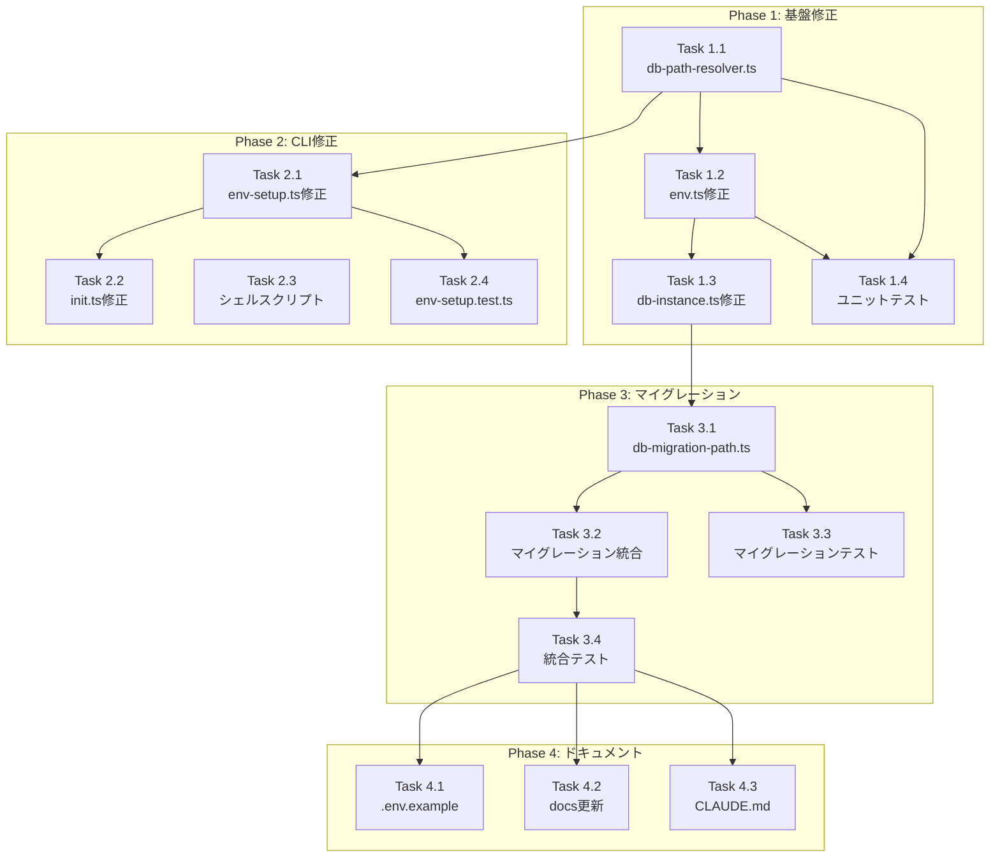

# Issue #135 作業計画書

## Issue: バージョンアップ時にDBクリア

**Issue番号**: #135
**サイズ**: L（Large）
**優先度**: High（データ損失バグ）
**ラベル**: bug
**依存Issue**: なし（#96, #119, #125, #76は完了済み）

---

## 1. 概要

グローバルインストール時にバージョンアップを実行するとリポジトリ情報が消失する重大バグを修正する。

**根本原因**:
- DBパス解決が`process.cwd()`に依存
- ファイル名不一致（`db.sqlite` vs `cm.db`）
- `DATABASE_PATH`と`CM_DB_PATH`の二重管理

---

## 2. 詳細タスク分解

### Phase 1: 基盤修正（必須）

#### Task 1.1: DBパス解決モジュール作成
- **成果物**: `src/lib/db-path-resolver.ts`
- **依存**: なし
- **内容**:
  - `getDefaultDbPath()` 関数実装
  - グローバル/ローカルインストール判定
  - 絶対パス生成

#### Task 1.2: env.ts 修正
- **成果物**: `src/lib/env.ts`（修正）
- **依存**: Task 1.1
- **内容**:
  - `getDatabasePathWithDeprecationWarning()` 追加
  - `getEnv()` で `getDefaultDbPath()` 使用
  - `validateDbPath()` でセキュリティ検証
  - セキュリティログ追加（SEC-004）

#### Task 1.3: db-instance.ts 修正
- **成果物**: `src/lib/db-instance.ts`（修正）
- **依存**: Task 1.2
- **内容**:
  - `getEnv().CM_DB_PATH` 経由でパス取得
  - `DATABASE_PATH` 直接参照を廃止
  - ディレクトリ作成時に `mode: 0o700`（SEC-003）

#### Task 1.4: ユニットテスト（Phase 1）
- **成果物**: `tests/unit/db-path-resolver.test.ts`
- **依存**: Task 1.1, 1.2
- **内容**:
  - `getDefaultDbPath()` テスト
  - グローバル/ローカルインストール判定テスト
  - `validateDbPath()` テスト

---

### Phase 2: CLI修正（必須）

#### Task 2.1: env-setup.ts 修正
- **成果物**: `src/cli/utils/env-setup.ts`（修正）
- **依存**: Task 1.1
- **内容**:
  - `ENV_DEFAULTS` から `CM_DB_PATH` 削除
  - `getDefaultDbPath()` をエクスポート（既存の`isGlobalInstall()`活用）

#### Task 2.2: init.ts 修正
- **成果物**: `src/cli/commands/init.ts`（修正）
- **依存**: Task 2.1
- **内容**:
  - `createDefaultConfig()` で `getDefaultDbPath()` 使用
  - `promptForConfig()` のデフォルト値を絶対パスに変更

#### Task 2.3: シェルスクリプト更新
- **成果物**: `scripts/health-check.sh`, `scripts/status.sh`（修正）
- **依存**: なし
- **内容**:
  - `CM_DB_PATH` を最優先参照
  - `DATABASE_PATH` をフォールバック維持
  - デフォルトファイル名を `cm.db` に変更

#### Task 2.4: env-setup.test.ts 更新
- **成果物**: `tests/unit/cli/utils/env-setup.test.ts`（修正）
- **依存**: Task 2.1
- **内容**:
  - `ENV_DEFAULTS` から `CM_DB_PATH` 削除のテスト更新
  - `getDefaultDbPath()` のテスト追加

---

### Phase 3: マイグレーション（必須）

#### Task 3.1: マイグレーションモジュール作成
- **成果物**: `src/lib/db-migration-path.ts`
- **依存**: Task 1.3
- **内容**:
  - `migrateDbIfNeeded()` 実装
  - `getLegacyDbPaths()` 実装（SEC-005対応）
  - `resolveAndValidatePath()` 実装（SEC-002対応）
  - バックアップ作成とパーミッション設定（SEC-006）

#### Task 3.2: db-instance.ts にマイグレーション統合
- **成果物**: `src/lib/db-instance.ts`（追加修正）
- **依存**: Task 3.1
- **内容**:
  - `getDbInstance()` 内でマイグレーション呼び出し
  - マイグレーション結果のログ出力

#### Task 3.3: マイグレーションテスト
- **成果物**: `tests/unit/db-migration-path.test.ts`
- **依存**: Task 3.1
- **内容**:
  - マイグレーション検出テスト
  - バックアップ作成テスト
  - シンボリックリンク検証テスト
  - システムディレクトリ拒否テスト

#### Task 3.4: 統合テスト
- **成果物**: `tests/integration/db-instance.test.ts`（修正/追加）
- **依存**: Task 3.2
- **内容**:
  - グローバルインストールシミュレーション
  - `.env` からのDBパス読み込みテスト
  - マイグレーションシナリオテスト

---

### Phase 4: ドキュメント更新

#### Task 4.1: .env.example 更新
- **成果物**: `.env.example`（修正）
- **依存**: Phase 3完了
- **内容**:
  - `CM_DB_PATH` のデフォルト値を `cm.db` に変更
  - コメント追加（グローバル/ローカルのデフォルトパス説明）

#### Task 4.2: ドキュメント更新
- **成果物**: `docs/DEPLOYMENT.md`, `docs/migration-to-commandmate.md`（修正）
- **依存**: Phase 3完了
- **内容**:
  - `DATABASE_PATH` 廃止の説明追加
  - `CM_DB_PATH` への移行手順追加

#### Task 4.3: CLAUDE.md 更新
- **成果物**: `CLAUDE.md`（修正）
- **依存**: Phase 3完了
- **内容**:
  - `db-instance.ts` の説明追加
  - `db-path-resolver.ts` の説明追加
  - `db-migration-path.ts` の説明追加

---

## 3. タスク依存関係

---

## 4. 品質チェック項目

| チェック項目 | コマンド | 基準 |
|-------------|----------|------|
| ESLint | `npm run lint` | エラー0件 |
| TypeScript | `npx tsc --noEmit` | 型エラー0件 |
| Unit Test | `npm run test:unit` | 全テストパス |
| Integration Test | `npm run test:integration` | 全テストパス |
| Build | `npm run build:all` | 成功 |

---

## 5. 成果物チェックリスト

### コード（新規）
- [ ] `src/lib/db-path-resolver.ts` - DBパス解決モジュール
- [ ] `src/lib/db-migration-path.ts` - マイグレーションモジュール

### コード（修正）
- [ ] `src/lib/env.ts` - パス解決ロジック修正
- [ ] `src/lib/db-instance.ts` - getEnv()経由に変更
- [ ] `src/cli/utils/env-setup.ts` - getDefaultDbPath()追加
- [ ] `src/cli/commands/init.ts` - 絶対パス生成
- [ ] `scripts/health-check.sh` - CM_DB_PATHフォールバック
- [ ] `scripts/status.sh` - CM_DB_PATHフォールバック

### テスト（新規/修正）
- [ ] `tests/unit/db-path-resolver.test.ts`
- [ ] `tests/unit/db-migration-path.test.ts`
- [ ] `tests/unit/cli/utils/env-setup.test.ts`（修正）
- [ ] `tests/integration/db-instance.test.ts`（修正/追加）

### ドキュメント
- [ ] `.env.example` - CM_DB_PATH更新
- [ ] `docs/DEPLOYMENT.md` - DATABASE_PATH廃止説明
- [ ] `docs/migration-to-commandmate.md` - 移行手順追加
- [ ] `CLAUDE.md` - 新規モジュール説明追加

---

## 6. 受け入れ条件（Definition of Done）

Issue完了条件：
- [ ] すべてのタスクが完了
- [ ] 単体テストカバレッジ80%以上（新規コード）
- [ ] CIチェック全パス（lint, type-check, test:unit, test:integration, build）
- [ ] 以下の受け入れ条件を満たす：
  - [ ] 旧バージョンから新バージョンへアップグレード後、リポジトリ情報が保持される
  - [ ] グローバルインストールで任意のディレクトリから `commandmate start` を実行しても同じDBを参照する
  - [ ] `commandmate init` 実行後、`.env` に絶対パスで `CM_DB_PATH` が設定される
  - [ ] `db-instance.ts` が `DATABASE_PATH` を直接参照せず、`env.ts` 経由で `CM_DB_PATH` を使用する
  - [ ] 旧バージョンのDB（`db.sqlite`）が検出された場合、`cm.db` にマイグレーションされる
  - [ ] 単体テストでDBパス解決ロジックを検証する
  - [ ] `DATABASE_PATH` 環境変数使用時にdeprecation警告が出力される

---

## 7. セキュリティ要件

| ID | 要件 | 対象ファイル |
|----|------|-------------|
| SEC-001 | ローカルインストール時のシステムディレクトリ保護 | env.ts |
| SEC-002 | シンボリックリンク解決によるTOCTOU防止 | db-migration-path.ts |
| SEC-003 | ディレクトリ作成時に mode: 0o700 | db-instance.ts |
| SEC-004 | DATABASE_PATH使用時のセキュリティログ | env.ts |
| SEC-005 | DATABASE_PATH検証後にマイグレーション対象追加 | db-migration-path.ts |
| SEC-006 | バックアップファイルのパーミッション設定 | db-migration-path.ts |

---

## 8. リスクと対策

| リスク | 影響度 | 対策 |
|-------|-------|------|
| APIルートでのDBアクセス障害 | High | 統合テストで全APIエンドポイント検証 |
| マイグレーション失敗 | High | バックアップ作成、ロールバック手順確認 |
| シェルスクリプト更新漏れ | Medium | CI/CDでのヘルスチェック実行確認 |
| 既存テストの破損 | Medium | 環境変数設定見直し、モック更新確認 |

---

## 9. 次のアクション

作業計画承認後：
1. **ブランチ作成**: `fix/135-db-path-resolution`
2. **タスク実行**: Phase 1 → Phase 2 → Phase 3 → Phase 4 の順
3. **進捗報告**: 各Phase完了時に `/progress-report` で報告
4. **PR作成**: `/create-pr` で自動作成

---

## 10. 関連ドキュメント

- **設計方針書**: `dev-reports/design/issue-135-db-path-resolution-design-policy.md`
- **Issueレビュー結果**: `dev-reports/issue/135/issue-review/summary-report.md`
- **設計レビュー結果**: `dev-reports/issue/135/multi-stage-design-review/summary-report.md`

---

*Generated by /work-plan command - 2026-02-03*
