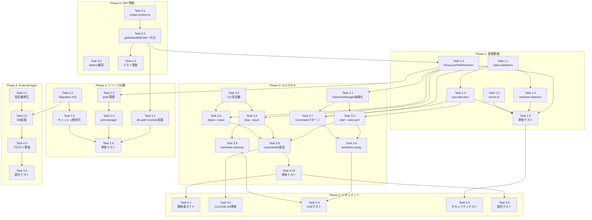

# 作業計画書: Issue #136

## Issue: Git Worktree 並列開発環境の整備

**Issue番号**: #136
**サイズ**: XL（大規模機能追加）
**優先度**: High
**依存Issue**: #135（DBパス解決ロジック修正）- 完了確認が必要

---

## 1. 概要

Git worktreeを活用した並列開発環境を整備し、複数のIssue/機能を同時に開発できるようにする。

### スコープ（Phase 1のみ）
- Worktree別リソース分離（DB、ポート、PID、ログ）
- External Apps連携（プロキシルーティング）
- Claude Codeスキル（/worktree-setup, /worktree-cleanup）
- CLIコマンド拡張（--issue、--auto-portフラグ）

### スコープ外（Phase 2以降）
- ブランチ戦略変更（develop導入）
- CI/CD変更（ci-pr.yml更新）

---

## 2. 詳細タスク分解

### Phase 0: DRY準拠リファクタリング（前提条件）

- [ ] **Task 0.1**: install-context.ts 新規作成
  - 成果物: `src/cli/utils/install-context.ts`
  - 内容: `isGlobalInstall()`, `getConfigDir()` を抽出
  - 依存: なし
  - レビューID: MF-CONS-003

- [ ] **Task 0.2**: getDefaultDbPath() 一元化
  - 成果物: `src/lib/db-path-resolver.ts` 修正
  - 内容: env-setup.ts から重複削除、db-path-resolver.ts に統合
  - 依存: Task 0.1
  - レビューID: MF-001

- [ ] **Task 0.3**: dotenv バージョン確認
  - 成果物: 確認結果ドキュメント
  - 内容: package.json の dotenv バージョン確認（v16+ 必須）
  - 依存: なし
  - レビューID: SF-IMP-002

- [ ] **Task 0.4**: 既存テスト更新（import パス修正）
  - 成果物: テストファイル修正
  - 内容: install-context.ts 導入に伴うimportパス修正
  - 依存: Task 0.1, Task 0.2
  - レビューID: MF-IMP-003

---

### Phase 1: 基盤整備

- [ ] **Task 1.1**: 入力検証モジュール作成
  - 成果物: `src/cli/utils/input-validators.ts`
  - 内容: `validateIssueNo()`, `validateBranchName()`
  - 依存: なし
  - レビューID: MF-SEC-001

- [ ] **Task 1.2**: ResourcePathResolver 実装
  - 成果物: `src/cli/utils/resource-resolvers.ts`
  - 内容: DbPathResolver, PidPathResolver, LogPathResolver
  - 依存: Task 0.2
  - レビューID: SF-001, SF-SEC-001

- [ ] **Task 1.3**: Worktree検出ユーティリティ
  - 成果物: `src/cli/utils/worktree-detector.ts`
  - 内容: 現在のWorktree検出、Issue番号抽出
  - 依存: Task 1.1
  - レビューID: -

- [ ] **Task 1.4**: ポート自動割り当てユーティリティ
  - 成果物: `src/cli/utils/port-allocator.ts`
  - 内容: 空きポート検出（3001-3100）、MAX_WORKTREES制限
  - 依存: Task 1.1
  - レビューID: SF-SEC-002

- [ ] **Task 1.5**: エラー定義モジュール
  - 成果物: `src/lib/errors.ts`
  - 内容: AppError定義、createAppError()
  - 依存: なし
  - レビューID: SF-SEC-003

- [ ] **Task 1.6**: Phase 1 単体テスト
  - 成果物: `tests/unit/cli/utils/` 配下
  - 内容: input-validators, resource-resolvers, worktree-detector, port-allocator テスト
  - 依存: Task 1.1-1.5
  - カバレッジ目標: 80%以上

---

### Phase 2: リソース分離

- [ ] **Task 2.1**: db-path-resolver.ts 拡張
  - 成果物: `src/lib/db-path-resolver.ts` 修正
  - 内容: `getIssueDbPath(issueNo)` 追加
  - 依存: Task 0.2
  - レビューID: -

- [ ] **Task 2.2**: DBマイグレーション（Migration #16）
  - 成果物: `src/lib/db-migrations.ts` 修正
  - 内容: external_apps に issue_no カラム追加
  - 依存: なし
  - レビューID: SF-CONS-002, MF-IMP-002

- [ ] **Task 2.3**: pids/ ディレクトリ管理
  - 成果物: `src/cli/utils/env-setup.ts` 修正
  - 内容: getPidFilePath(issueNo) 拡張、pids/ ディレクトリ作成（0700）
  - 依存: Task 1.2
  - レビューID: SF-SEC-004, MF-IMP-001

- [ ] **Task 2.4**: pid-manager.ts Issue番号対応
  - 成果物: `src/cli/utils/pid-manager.ts` 修正
  - 内容: PidPathResolver 使用
  - 依存: Task 1.2, Task 2.3
  - レビューID: -

- [ ] **Task 2.5**: External Apps キャッシュ無効化
  - 成果物: `src/lib/external-apps/cache.ts`, `src/lib/external-apps/cache-invalidator.ts`
  - 内容: invalidate(issueNo) メソッド追加
  - 依存: Task 2.2
  - レビューID: SF-IMP-004

- [ ] **Task 2.6**: Phase 2 単体テスト
  - 成果物: `tests/unit/` 配下
  - 内容: db-path-resolver, env-setup 回帰テスト、Migration #16 テスト
  - 依存: Task 2.1-2.5
  - カバレッジ目標: 80%以上

---

### Phase 3: CLI/スキル

- [ ] **Task 3.1**: DaemonManager 抽象化
  - 成果物: `src/cli/utils/daemon-factory.ts`
  - 内容: DaemonManagerFactory, DaemonManagerWrapper
  - 依存: Task 1.2
  - レビューID: SF-002, MF-CONS-002

- [ ] **Task 3.2**: CLI型定義拡張
  - 成果物: `src/cli/types/index.ts` 修正
  - 内容: StopOptions, StatusOptions に issue 追加
  - 依存: なし
  - レビューID: SF-CONS-001

- [ ] **Task 3.3**: start.ts --auto-port フラグ
  - 成果物: `src/cli/commands/start.ts` 修正
  - 内容: --auto-port フラグ、DaemonManagerFactory 使用
  - 依存: Task 1.4, Task 3.1
  - レビューID: -

- [ ] **Task 3.4**: stop.ts --issue フラグ
  - 成果物: `src/cli/commands/stop.ts` 修正
  - 内容: --issue フラグ、PidPathResolver 使用
  - 依存: Task 1.2, Task 3.2
  - レビューID: SF-IMP-005

- [ ] **Task 3.5**: status.ts --issue, --all フラグ
  - 成果物: `src/cli/commands/status.ts` 修正
  - 内容: --issue フラグ、--all フラグ、dotenvConfig() 追加
  - 依存: Task 1.2, Task 3.2
  - レビューID: SF-IMP-003, SF-IMP-005

- [ ] **Task 3.6**: commander設定更新
  - 成果物: `src/cli/index.ts` 修正
  - 内容: --issue オプション追加
  - 依存: Task 3.3-3.5
  - レビューID: SF-IMP-005

- [ ] **Task 3.7**: Commandパターン実装
  - 成果物: `src/cli/utils/setup-commands.ts`
  - 内容: SetupCommand インターフェース、5種のCommand実装
  - 依存: Task 1.1, Task 1.4, Task 3.1
  - レビューID: MF-002

- [ ] **Task 3.8**: /worktree-setup スキル
  - 成果物: `.claude/skills/worktree-setup/SKILL.md`
  - 内容: CLIラッパーとして実装、--independent-token オプション
  - 依存: Task 3.3, Task 3.7
  - レビューID: NTH-003, MF-SEC-002

- [ ] **Task 3.9**: /worktree-cleanup スキル
  - 成果物: `.claude/skills/worktree-cleanup/SKILL.md`
  - 内容: CLIラッパーとして実装
  - 依存: Task 3.4
  - レビューID: NTH-003

- [ ] **Task 3.10**: Phase 3 単体テスト
  - 成果物: `tests/unit/cli/commands/` 配下
  - 内容: start, stop, status の --issue フラグテスト
  - 依存: Task 3.3-3.9
  - カバレッジ目標: 80%以上

---

### Phase 4: External Apps連携

- [ ] **Task 4.1**: ExternalApp型定義修正
  - 成果物: `src/types/external-apps.ts` 修正
  - 内容: 既存実装に合わせて修正、WorktreeExternalApp 派生型
  - 依存: なし
  - レビューID: MF-CONS-001, SF-004

- [ ] **Task 4.2**: External Apps DB拡張
  - 成果物: `src/lib/external-apps/db.ts` 修正
  - 内容: isWorktreeExternalApp、issue_no フィルタ
  - 依存: Task 2.2, Task 4.1
  - レビューID: MF-IMP-002, SF-CONS-003

- [ ] **Task 4.3**: プロキシルーティング更新
  - 成果物: `src/app/proxy/[...path]/route.ts` 修正（必要に応じて）
  - 内容: commandmate_issue/{issueNo} パス対応
  - 依存: Task 4.2
  - レビューID: -

- [ ] **Task 4.4**: Phase 4 統合テスト
  - 成果物: `tests/integration/external-apps-api.test.ts` 修正
  - 内容: issueNo CRUD テスト
  - 依存: Task 4.1-4.3
  - カバレッジ目標: 80%以上

---

### Phase 5: ドキュメント・テスト

- [ ] **Task 5.1**: 開発者ガイド作成
  - 成果物: `docs/dev-guide/worktree-development.md`
  - 内容: Worktree開発フロー、ログ集約運用ガイド
  - 依存: Phase 1-4 完了
  - レビューID: SF-IMP-003

- [ ] **Task 5.2**: CLAUDE.md 更新
  - 成果物: `CLAUDE.md` 修正
  - 内容: 新CLIフラグ（--auto-port, --issue）をコマンドセクションに追加
  - 依存: Phase 3 完了
  - レビューID: NTH-IMP-003

- [ ] **Task 5.3**: E2Eテスト
  - 成果物: `tests/e2e/worktree.test.ts`
  - 内容: /worktree-setup, /worktree-cleanup の動作確認
  - 依存: Phase 1-4 完了
  - レビューID: -

- [ ] **Task 5.4**: セキュリティテスト
  - 成果物: `tests/security/` 配下
  - 内容: コマンドインジェクション防止、TOCTOU対策、ポート枯渇攻撃対策
  - 依存: Phase 1-4 完了
  - レビューID: MF-SEC-001, SF-SEC-001, SF-SEC-002

- [ ] **Task 5.5**: 統合テスト（Worktree同時起動）
  - 成果物: `tests/integration/worktree-multi.test.ts`
  - 内容: 複数Worktree同時起動、ロールバックテスト
  - 依存: Phase 1-4 完了
  - レビューID: -

---

## 3. タスク依存関係

---

## 4. 品質チェック項目

| チェック項目 | コマンド | 基準 |
|-------------|----------|------|
| ESLint | `npm run lint` | エラー0件 |
| TypeScript | `npx tsc --noEmit` | 型エラー0件 |
| Unit Test | `npm run test:unit` | 全テストパス |
| Integration Test | `npm run test:integration` | 全テストパス |
| Build | `npm run build:all` | 成功 |

---

## 5. 成果物チェックリスト

### 新規ファイル
- [ ] `src/cli/utils/install-context.ts`
- [ ] `src/cli/utils/input-validators.ts`
- [ ] `src/cli/utils/resource-resolvers.ts`
- [ ] `src/cli/utils/worktree-detector.ts`
- [ ] `src/cli/utils/port-allocator.ts`
- [ ] `src/cli/utils/daemon-factory.ts`
- [ ] `src/cli/utils/setup-commands.ts`
- [ ] `src/lib/errors.ts`
- [ ] `src/lib/external-apps/cache-invalidator.ts`
- [ ] `.claude/skills/worktree-setup/SKILL.md`
- [ ] `.claude/skills/worktree-cleanup/SKILL.md`
- [ ] `docs/dev-guide/worktree-development.md`

### 修正ファイル
- [ ] `src/lib/db-path-resolver.ts`
- [ ] `src/lib/db-migrations.ts`
- [ ] `src/cli/utils/env-setup.ts`
- [ ] `src/cli/utils/pid-manager.ts`
- [ ] `src/cli/commands/start.ts`
- [ ] `src/cli/commands/stop.ts`
- [ ] `src/cli/commands/status.ts`
- [ ] `src/cli/index.ts`
- [ ] `src/cli/types/index.ts`
- [ ] `src/types/external-apps.ts`
- [ ] `src/lib/external-apps/db.ts`
- [ ] `src/lib/external-apps/cache.ts`
- [ ] `CLAUDE.md`

### テストファイル
- [ ] `tests/unit/cli/utils/install-context.test.ts`
- [ ] `tests/unit/cli/utils/input-validators.test.ts`
- [ ] `tests/unit/cli/utils/resource-resolvers.test.ts`
- [ ] `tests/unit/cli/utils/worktree-detector.test.ts`
- [ ] `tests/unit/cli/utils/port-allocator.test.ts`
- [ ] `tests/unit/cli/commands/start.test.ts` (修正)
- [ ] `tests/unit/cli/commands/stop.test.ts` (修正)
- [ ] `tests/unit/cli/commands/status.test.ts` (修正)
- [ ] `tests/integration/external-apps-api.test.ts` (修正)
- [ ] `tests/e2e/worktree.test.ts` (新規)
- [ ] `tests/security/command-injection.test.ts` (新規)

---

## 6. Definition of Done

Issue完了条件：
- [ ] すべてのタスクが完了
- [ ] 単体テストカバレッジ80%以上
- [ ] CIチェック全パス（lint, type-check, test, build）
- [ ] セキュリティテスト全パス
- [ ] コードレビュー承認
- [ ] ドキュメント更新完了
- [ ] /worktree-setup, /worktree-cleanup スキルが動作確認済み

---

## 7. リスクと対策

| リスク | 影響度 | 対策 |
|--------|-------|------|
| Issue #135 未完了 | 高 | 先にIssue #135の状態を確認、必要なら先に完了させる |
| dotenv バージョン不足 | 中 | Phase 0 で早期に確認、必要ならアップグレード |
| 循環インポート問題 | 高 | install-context.ts で分離（設計済み） |
| 既存テスト破壊 | 中 | 回帰テストを先に作成してから変更 |
| ポート枯渇攻撃 | 中 | MAX_WORKTREES制限、クールダウン実装 |

---

## 8. 次のアクション

作業計画承認後：
1. **依存確認**: Issue #135 の完了状態を確認
2. **ブランチ作成**: `feature/136-worktree-parallel-dev`
3. **Phase 0 実行**: DRY準拠リファクタリングを先行実施
4. **Phase 1-5 順次実行**: 計画に従って実装
5. **進捗報告**: `/progress-report` で定期報告
6. **PR作成**: `/create-pr` で自動作成

---

## 関連ドキュメント

- 設計方針書: `dev-reports/design/issue-136-worktree-parallel-dev-design-policy.md`
- Issueレビュー: `dev-reports/issue/136/issue-review/summary-report.md`
- 設計レビュー: `dev-reports/issue/136/multi-stage-design-review/summary-report.md`
- GitHub Issue: https://github.com/Kewton/CommandMate/issues/136

---

*Generated by work-plan command*
*Created: 2026-02-03*
