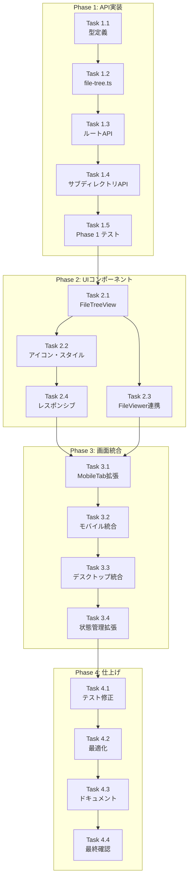

# Issue #15: ファイルツリー表示機能 作業計画書

## Issue: feat: ファイルツリー表示機能の追加

| 項目 | 値 |
|------|-----|
| **Issue番号** | #15 |
| **サイズ** | M (中規模) |
| **優先度** | Medium |
| **ラベル** | enhancement |
| **依存Issue** | なし (Issue #13 UX改善は完了済み) |
| **設計方針書** | `dev-reports/feature/15/design-policy.md` |
| **アーキテクチャレビュー** | `dev-reports/feature/15/architecture-review.md` (承認済み) |

---

## 1. 概要

Worktree 内のファイルをツリー形式で閲覧し、ファイル内容を確認できる機能を追加する。
モバイル/デスクトップ両対応のレスポンシブUIを実装する。

### 主要成果物

1. **API**: ディレクトリ一覧取得エンドポイント
2. **ビジネスロジック**: ファイルツリー走査・フィルタリング
3. **UIコンポーネント**: FileTreeView
4. **UI統合**: モバイル(Filesタブ)、デスクトップ(左ペインタブ切り替え)

---

## 2. 詳細タスク分解

### Phase 1: API 実装 (バックエンド)

#### Task 1.1: 型定義の追加
- **成果物**: `src/types/models.ts` への追加
- **依存**: なし
- **工数**: 0.5h

```typescript
// 追加する型定義
interface TreeItem {
  name: string;
  type: 'file' | 'directory';
  size?: number;
  extension?: string;
  itemCount?: number;
}

interface TreeResponse {
  path: string;
  name: string;
  items: TreeItem[];
  parentPath: string | null;
}
```

#### Task 1.2: ファイルツリービジネスロジック実装
- **成果物**: `src/lib/file-tree.ts`
- **依存**: Task 1.1
- **工数**: 2h

**実装内容**:
- [ ] `readDirectory()` - ディレクトリ走査
- [ ] `filterExcludedItems()` - 除外パターンフィルタリング
- [ ] `sortItems()` - ディレクトリ優先ソート
- [ ] `isSymbolicLink()` - シンボリックリンク検出
- [ ] 定数: `EXCLUDED_PATTERNS`, `LIMITS`

#### Task 1.3: ルートディレクトリAPI実装
- **成果物**: `src/app/api/worktrees/[id]/tree/route.ts`
- **依存**: Task 1.2
- **工数**: 1h

**実装内容**:
- [ ] `GET` ハンドラ
- [ ] パス検証 (`path-validator.ts` 使用)
- [ ] エラーハンドリング (400, 403, 404, 500)

#### Task 1.4: サブディレクトリAPI実装
- **成果物**: `src/app/api/worktrees/[id]/tree/[...path]/route.ts`
- **依存**: Task 1.3
- **工数**: 1h

**実装内容**:
- [ ] Catch-all ルートパラメータ処理
- [ ] パス結合とバリデーション
- [ ] ルートAPIとの共通ロジック再利用

#### Task 1.5: Phase 1 テスト
- **成果物**:
  - `tests/unit/lib/file-tree.test.ts`
  - `tests/integration/api-file-tree.test.ts`
- **依存**: Task 1.4
- **工数**: 2h

**テストケース**:
```markdown
ユニットテスト:
- [ ] ディレクトリ走査の正常系
- [ ] 除外パターンフィルタリング
- [ ] ソート処理（ディレクトリ優先）
- [ ] シンボリックリンク検出
- [ ] アイテム数制限

統合テスト:
- [ ] 正常系: ルートディレクトリ取得
- [ ] 正常系: サブディレクトリ取得
- [ ] 異常系: 存在しないパス (404)
- [ ] セキュリティ: パストラバーサル攻撃 (403)
- [ ] セキュリティ: 除外パターンアクセス (403)
```

---

### Phase 2: UI コンポーネント実装

#### Task 2.1: FileTreeView コンポーネント実装
- **成果物**: `src/components/worktree/FileTreeView.tsx`
- **依存**: Phase 1 完了
- **工数**: 3h

**実装内容**:
- [ ] コンポーネント構造設計
  - `FileTreeView` (メイン)
  - `FileTreeHeader` (パンくずリスト)
  - `FileTreeItem` (アイテム行)
- [ ] 状態管理 (`useState`, `useCallback`)
  - `expandedPaths: Set<string>`
  - `selectedFile: string | null`
  - `cache: Map<string, TreeItem[]>`
  - `isLoading`, `error`
- [ ] API連携 (`fetch`)
- [ ] 遅延読み込み実装

#### Task 2.2: アイコン・スタイリング
- **成果物**: `FileTreeView.tsx` 内のスタイル
- **依存**: Task 2.1
- **工数**: 1h

**実装内容**:
- [ ] ファイル/フォルダアイコン (SVG)
- [ ] 展開/折りたたみアイコン
- [ ] インデント表示
- [ ] ホバー・選択状態スタイル
- [ ] サイズ表示フォーマット

#### Task 2.3: FileViewer連携
- **成果物**: `FileTreeView.tsx` 内の連携処理
- **依存**: Task 2.1
- **工数**: 0.5h

**実装内容**:
- [ ] ファイルクリック時のコールバック
- [ ] 既存 `FileViewer` モーダルとの連携
- [ ] `onFileSelect` プロップ実装

#### Task 2.4: レスポンシブ対応
- **成果物**: `FileTreeView.tsx` のレスポンシブスタイル
- **依存**: Task 2.2
- **工数**: 1h

**実装内容**:
- [ ] モバイル向けタッチ操作最適化
- [ ] パンくずリストの省略表示
- [ ] サイズ表示の簡略化

---

### Phase 3: 画面統合

#### Task 3.1: MobileTab 型・コンポーネント拡張
- **成果物**:
  - `src/components/mobile/MobileTabBar.tsx`
- **依存**: Phase 2 完了
- **工数**: 1h

**実装内容**:
- [ ] `MobileTab` 型に `'files'` 追加
- [ ] `TABS` 配列に Files タブ追加
- [ ] アイコン設定 (フォルダアイコン)

```typescript
// 変更内容
export type MobileTab = 'terminal' | 'history' | 'logs' | 'files' | 'info';

const TABS: TabConfig[] = [
  // ... existing tabs
  { id: 'files', label: 'Files', icon: <Icon path={ICON_PATHS.files} /> },
  // ... info tab
];
```

#### Task 3.2: WorktreeDetailRefactored モバイル統合
- **成果物**: `src/components/worktree/WorktreeDetailRefactored.tsx`
- **依存**: Task 3.1
- **工数**: 1.5h

**実装内容**:
- [ ] `MobileContent` に Files ケース追加
- [ ] FileTreeView の状態管理追加
- [ ] FileViewer モーダル連携

```typescript
// MobileContent switch 追加
case 'files':
  return (
    <ErrorBoundary componentName="FileTreeView">
      <FileTreeView
        worktreeId={worktreeId}
        onFileSelect={handleFileSelect}
        className="h-full"
      />
    </ErrorBoundary>
  );
```

#### Task 3.3: デスクトップ版 左ペインタブ実装
- **成果物**:
  - `src/components/worktree/LeftPaneTabSwitcher.tsx` (新規)
  - `src/components/worktree/WorktreeDetailRefactored.tsx` (変更)
- **依存**: Task 3.2
- **工数**: 2h

**実装内容**:
- [ ] `LeftPaneTab` 型定義 (`'history' | 'files'`)
- [ ] タブ切り替えUI実装
- [ ] 状態管理追加 (`leftPaneTab`)
- [ ] `WorktreeDesktopLayout` への統合

```typescript
// LeftPaneTabSwitcher
interface LeftPaneTabSwitcherProps {
  activeTab: LeftPaneTab;
  onTabChange: (tab: LeftPaneTab) => void;
}
```

#### Task 3.4: useWorktreeUIState 拡張
- **成果物**: `src/hooks/useWorktreeUIState.ts`
- **依存**: Task 3.3
- **工数**: 0.5h

**実装内容**:
- [ ] `leftPaneTab` 状態追加
- [ ] `setLeftPaneTab` アクション追加
- [ ] 初期状態: `'history'`

---

### Phase 4: 仕上げ

#### Task 4.1: 既存テスト影響確認・修正
- **成果物**: テスト修正
- **依存**: Phase 3 完了
- **工数**: 1h

**確認対象**:
- [ ] `tests/unit/MobileTabBar.test.ts`
- [ ] `tests/e2e/mobile-navigation.spec.ts`
- [ ] `MobileTab` 型を参照する全ファイル

#### Task 4.2: パフォーマンス最適化
- **成果物**: 最適化済みコード
- **依存**: Task 4.1
- **工数**: 1h

**最適化項目**:
- [ ] `memo` によるコンポーネントメモ化
- [ ] `useMemo` / `useCallback` 適用
- [ ] キャッシュ動作確認

#### Task 4.3: ドキュメント更新
- **成果物**:
  - `docs/UI_UX_GUIDE.md` 更新
  - `README.md` 更新（必要な場合）
- **依存**: Task 4.2
- **工数**: 0.5h

**更新内容**:
- [ ] Files タブの説明追加
- [ ] デスクトップ版レイアウト図更新
- [ ] コンポーネント構成図更新

#### Task 4.4: 最終テスト・動作確認
- **成果物**: テスト結果レポート
- **依存**: Task 4.3
- **工数**: 1h

**確認項目**:
- [ ] モバイル実機確認
- [ ] デスクトップブラウザ確認
- [ ] E2Eテスト実行
- [ ] パフォーマンス確認

---

## 3. タスク依存関係



---

## 4. 工数見積もり

| Phase | タスク数 | 見積もり工数 |
|-------|---------|-------------|
| Phase 1: API実装 | 5 | 6.5h |
| Phase 2: UIコンポーネント | 4 | 5.5h |
| Phase 3: 画面統合 | 4 | 5h |
| Phase 4: 仕上げ | 4 | 3.5h |
| **合計** | **17** | **20.5h** |

### バッファ考慮

| 項目 | 工数 |
|------|------|
| 基本見積もり | 20.5h |
| バッファ (+20%) | 4h |
| **総工数** | **約 24.5h (約3日)** |

---

## 5. 開発環境設定

### 開発サーバー起動

| 項目 | 設定 |
|------|------|
| **コマンド** | `npm run dev -- -p 3001` |
| **ポート** | 3001 (3000番は使用中のため) |
| **URL** | http://localhost:3001 |

```bash
# 開発サーバー起動
npm run dev -- -p 3001
```

**注意**: デフォルトの3000番ポートは既に使用中のため、必ず3001番ポートを指定すること。

---

## 6. 品質チェック項目

### 各Phase完了時の確認

| チェック項目 | コマンド | 基準 |
|-------------|----------|------|
| ESLint | `npm run lint` | エラー0件 |
| TypeScript | `npx tsc --noEmit` | 型エラー0件 |
| Unit Test | `npm run test:unit` | 全テストパス |
| Integration Test | `npm run test:integration` | 全テストパス |
| Build | `npm run build` | 成功 |

### セキュリティチェックリスト

- [ ] パストラバーサル攻撃テスト
- [ ] 除外パターンアクセステスト
- [ ] シンボリックリンクテスト
- [ ] 大量ファイルディレクトリテスト

---

## 7. 成果物チェックリスト

### コード

**新規作成**:
- [ ] `src/types/models.ts` (型追加)
- [ ] `src/lib/file-tree.ts`
- [ ] `src/app/api/worktrees/[id]/tree/route.ts`
- [ ] `src/app/api/worktrees/[id]/tree/[...path]/route.ts`
- [ ] `src/components/worktree/FileTreeView.tsx`
- [ ] `src/components/worktree/LeftPaneTabSwitcher.tsx`

**変更**:
- [ ] `src/components/mobile/MobileTabBar.tsx`
- [ ] `src/components/worktree/WorktreeDetailRefactored.tsx`
- [ ] `src/hooks/useWorktreeUIState.ts`

### テスト

- [ ] `tests/unit/lib/file-tree.test.ts`
- [ ] `tests/integration/api-file-tree.test.ts`
- [ ] 既存テスト修正（必要に応じて）

### ドキュメント

- [ ] `docs/UI_UX_GUIDE.md` 更新

---

## 8. Definition of Done

Issue #15 完了条件:

- [ ] すべてのタスクが完了
- [ ] ディレクトリ一覧 API が動作する
- [ ] ファイルツリー UI がレスポンシブ対応
- [ ] ファイル選択でファイル内容が表示される
- [ ] モバイル/デスクトップ両対応
- [ ] セキュリティ対策（パストラバーサル防止）実装
- [ ] 単体テストカバレッジ 80%以上
- [ ] 統合テスト追加
- [ ] CIチェック全パス（lint, type-check, test, build）
- [ ] ドキュメント更新完了

---

## 9. リスクと対策

| リスク | 発生確率 | 影響度 | 対策 |
|--------|---------|--------|------|
| MobileTab型変更による既存テスト失敗 | 高 | 低 | Phase 3で早期確認 |
| 大規模リポジトリでのパフォーマンス問題 | 中 | 中 | アイテム数制限、遅延読み込み |
| シンボリックリンク循環 | 低 | 高 | lstat による検出・除外 |
| 既存 FileViewer との連携問題 | 低 | 中 | 早期統合テスト |

---

## 10. 次のアクション

作業計画承認後:

1. **ブランチ作成**: `feature/15-file-tree`
   ```bash
   git checkout -b feature/15-file-tree
   ```

2. **タスク実行**: Phase 1 から順次実装
   - TDD: `/tdd-impl` で実装

3. **進捗報告**: `/progress-report` で定期報告

4. **PR作成**: `/create-pr` で自動作成

---

## 11. 関連ドキュメント

- [Issue #15](https://github.com/Kewton/MyCodeBranchDesk/issues/15)
- [設計方針書](../feature/15/design-policy.md)
- [アーキテクチャレビュー](../feature/15/architecture-review.md)
- [UI/UX ガイド](../../docs/UI_UX_GUIDE.md)

---

**作成日**: 2026-01-07
**作成者**: Claude Code
**ステータス**: 承認待ち
