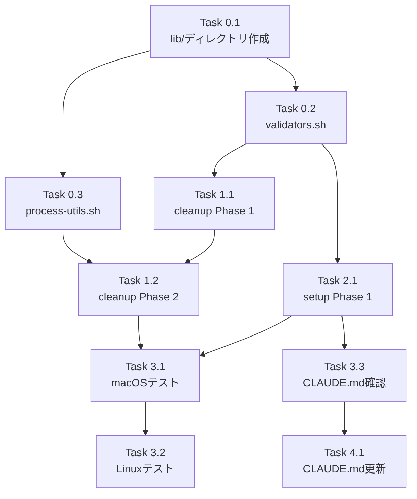

# Issue #151 作業計画書

## Issue: worktree-cleanup がWorktreeから起動中のサーバーを検出できない

**Issue番号**: #151
**サイズ**: M（Medium）
**優先度**: High（バグ修正）
**依存Issue**: #136（Git Worktree並列開発環境の整備）
**設計方針書**: `dev-reports/design/issue-151-worktree-cleanup-server-detection-design-policy.md`

---

## 1. 概要

`/worktree-cleanup` スキル実行時、Worktreeディレクトリから `npm run dev` で直接起動したサーバーを検出・停止できない問題を修正する。ポートベース検出をフォールバックとして追加し、既存のPIDファイル検出と併用する。

---

## 2. 詳細タスク分解

### Phase 0: 共通ライブラリ作成

- [ ] **Task 0.1**: `.claude/lib/` ディレクトリ作成
  - 成果物: `.claude/lib/` ディレクトリ
  - 依存: なし

- [ ] **Task 0.2**: validators.sh 作成
  - 成果物: `.claude/lib/validators.sh`
  - 内容:
    - `MAX_ISSUE_NO=2147483647` 定数
    - `validate_issue_no()` 関数
  - 依存: Task 0.1

- [ ] **Task 0.3**: process-utils.sh 作成
  - 成果物: `.claude/lib/process-utils.sh`
  - 内容:
    - `check_lsof_available()` 関数
    - `get_pid_by_port()` 関数
    - `get_process_cwd()` 関数（macOS/Linux対応）
    - `is_worktree_process()` 関数
    - `verify_process_command()` 関数
    - `verify_process_ownership()` 関数
    - `graceful_kill()` 関数（監査ログ付き）
    - `stop_server_by_port()` オーケストレーション関数
  - 依存: Task 0.1

### Phase 1: worktree-cleanup.md 修正

- [ ] **Task 1.1**: Phase 1 入力検証の更新
  - 成果物: `.claude/commands/worktree-cleanup.md` (Phase 1セクション)
  - 変更内容:
    - Issue番号検証範囲を `1-999999` から `1-2147483647` に変更
    - validators.sh を source で読み込み
    - エラーハンドリング表の文言修正
  - 依存: Task 0.2

- [ ] **Task 1.2**: Phase 2 サーバー停止の拡張
  - 成果物: `.claude/commands/worktree-cleanup.md` (Phase 2セクション)
  - 変更内容:
    - process-utils.sh を source で読み込み
    - 既存のPIDファイル検出ロジックを維持
    - ポートベース検出をフォールバックとして追加
    - 待機時間を `sleep 2` から `sleep 3` に変更
  - 依存: Task 0.3, Task 1.1

### Phase 2: worktree-setup.md 修正

- [ ] **Task 2.1**: Phase 1 入力検証の更新
  - 成果物: `.claude/commands/worktree-setup.md` (Phase 1セクション)
  - 変更内容:
    - Issue番号検証範囲を `1-999999` から `1-2147483647` に変更
    - validators.sh を source で読み込み
    - エラーハンドリング表の文言修正
  - 依存: Task 0.2

### Phase 3: テストと検証

- [ ] **Task 3.1**: macOS手動テスト
  - テスト内容:
    1. npm run dev で起動 → cleanup → サーバー検出・停止確認
    2. commandmate start で起動 → cleanup → PID+ポート両方で検出
    3. メインリポジトリのサーバー誤停止防止確認
    4. Issue番号境界値テスト（2147483647）
    5. lsof不在時の警告表示確認
  - 依存: Task 1.2, Task 2.1

- [ ] **Task 3.2**: Linux環境テスト（Docker）
  - テスト環境: Docker `node:18-alpine`
  - テスト内容:
    1. `/proc/$PID/cwd` によるcwd取得確認
    2. 基本動作確認（npm run dev → cleanup）
  - 依存: Task 3.1

- [ ] **Task 3.3**: CLAUDE.md整合性確認
  - 確認内容: Issue番号検証範囲の説明がある場合、更新が必要か確認
  - 依存: Task 2.1

### Phase 4: ドキュメント更新

- [ ] **Task 4.1**: CLAUDE.md更新（必要な場合）
  - 成果物: `CLAUDE.md`
  - 変更内容: Issue #151の実装内容を最近の実装機能セクションに追加
  - 依存: Task 3.3

---

## 3. タスク依存関係

---

## 4. 成果物一覧

### 新規作成ファイル

| ファイル | 行数（概算） | 説明 |
|---------|-------------|------|
| `.claude/lib/validators.sh` | ~15行 | Issue番号検証関数 |
| `.claude/lib/process-utils.sh` | ~80行 | プロセス関連関数群 |

### 変更ファイル

| ファイル | 変更規模 | 説明 |
|---------|---------|------|
| `.claude/commands/worktree-cleanup.md` | +60-80行 | Phase 1修正、Phase 2拡張 |
| `.claude/commands/worktree-setup.md` | +2行 | Phase 1検証範囲修正 |

---

## 5. 品質チェック項目

| チェック項目 | 方法 | 基準 |
|-------------|------|------|
| bashスクリプト構文 | `bash -n <script>` | エラー0件 |
| macOS動作確認 | 手動テスト | 全テスト項目パス |
| Linux動作確認 | Docker テスト | 全テスト項目パス |
| セキュリティ監査ログ | ログ確認 | 正常記録 |

---

## 6. セキュリティチェックリスト

- [ ] Issue番号が整数検証されている（SEC-001）
- [ ] パス検証が `~/.commandmate/` 内に限定されている（SEC-002）
- [ ] cwd検証によりWorktree外プロセスが保護されている（SEC-003）
- [ ] プロセス所有者検証が実装されている（SEC-004, SF-SEC-003）
- [ ] ポート番号が整数検証済み変数から算出されている（SEC-005）
- [ ] プロセス終了操作が監査ログに記録される（SEC-006, SF-SEC-002）
- [ ] プロセスコマンド検証（node/npm）が実装されている（SEC-007, SF-SEC-001）
- [ ] lsof出力解析がスペース対応（`lsof -F n`）になっている（MF-SEC-001）

---

## 7. Definition of Done

Issue完了条件:

- [ ] すべてのタスクが完了
- [ ] macOS手動テスト全項目パス
- [ ] Linux環境テスト（Docker）パス
- [ ] セキュリティチェックリスト全項目確認
- [ ] 受け入れ条件（Issue記載の11項目）すべて満たす
- [ ] コードレビュー承認
- [ ] CLAUDE.md更新完了（必要な場合）

---

## 8. 受け入れ条件（Issue記載）

- [ ] Phase 1のIssue番号検証範囲が既存コード（`MAX_ISSUE_NO = 2147483647`）と整合すること
- [ ] `/worktree-setup` スキルのIssue番号検証範囲も同様に更新されること
- [ ] Worktreeから `npm run dev` で起動したサーバーを検出できること
- [ ] Worktree削除前にサーバーが停止されること
- [ ] Issue専用ポート（3{issueNo}形式）も検出対象に含まれること（4桁以下）
- [ ] サーバー停止時にユーザーへ通知されること
- [ ] macOS/Linux両環境で動作すること
- [ ] 無関係なプロセス（他のWorktree/プロジェクト）を誤停止しないこと
- [ ] Graceful shutdown（SIGTERM）を試行後、必要に応じてSIGKILLを使用すること
- [ ] lsofが利用不可の場合、警告メッセージと代替コマンドを表示すること
- [ ] 既存のPIDファイル検出と新しいポートベース検出が両方機能すること

---

## 9. 次のアクション

作業計画承認後:

1. **ブランチ確認**: 現在のブランチ `fix/151-worktree-cleanup-server-detection` で作業
2. **タスク実行**: Phase 0 → Phase 1 → Phase 2 → Phase 3 → Phase 4 の順に実装
3. **進捗報告**: `/progress-report` で定期報告
4. **PR作成**: `/create-pr` で自動作成

---

## 10. 関連ドキュメント

- **設計方針書**: `dev-reports/design/issue-151-worktree-cleanup-server-detection-design-policy.md`
- **Issueレビュー結果**: `dev-reports/issue/151/issue-review/`
- **設計レビュー結果**: `dev-reports/issue/151/multi-stage-design-review/`

---

*作成日: 2026-02-04*
