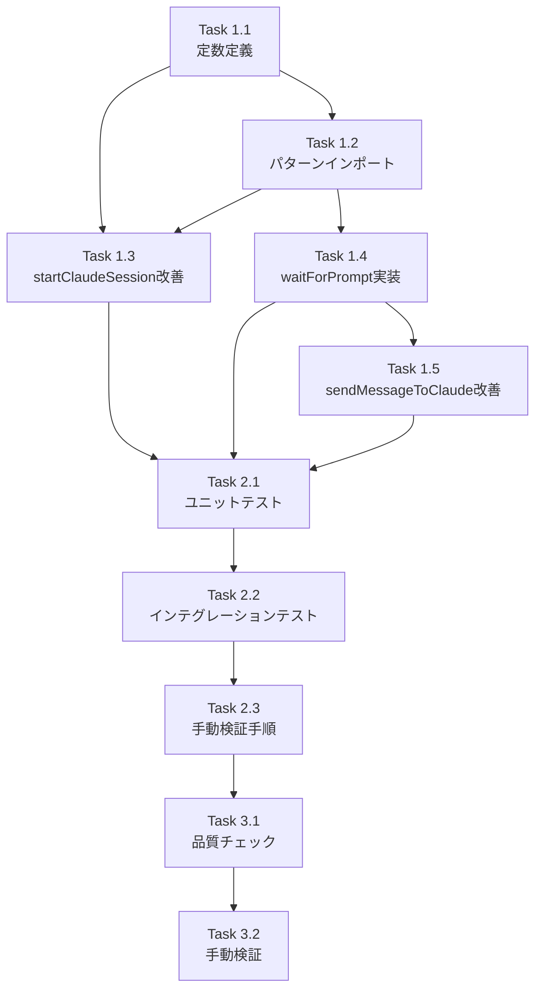

# 作業計画書: Issue #152

## Issue: セッション一発目のメッセージが送信されない

**Issue番号**: #152
**サイズ**: M（中規模）
**優先度**: High
**依存Issue**: なし
**ラベル**: bug

---

## 概要

新しいWorktreeを選択して初回メッセージを送信した際、Claude CLIが完全に初期化される前にメッセージが送信され、メッセージが無視される問題を修正する。

### 根本原因

1. `startClaudeSession()`がタイムアウト超過でもエラーなく続行
2. プロンプト検出パターンが不完全
3. プロンプト検出後の安定待機がない
4. メッセージ送信前の準備状態検証がない

---

## 詳細タスク分解

### Phase 1: コア実装（claude-session.ts）

#### Task 1.1: タイムアウト定数の定義
- **成果物**: `src/lib/claude-session.ts`（冒頭に定数追加）
- **依存**: なし
- **実装内容**:
  - `CLAUDE_INIT_TIMEOUT = 15000`
  - `CLAUDE_INIT_POLL_INTERVAL = 300`
  - `CLAUDE_POST_PROMPT_DELAY = 500`
  - `CLAUDE_PROMPT_WAIT_TIMEOUT = 5000`
  - `CLAUDE_PROMPT_POLL_INTERVAL = 200`
- **対応レビュー指摘**: OCP-001

#### Task 1.2: パターン定数のインポート
- **成果物**: `src/lib/claude-session.ts`（インポート追加）
- **依存**: Task 1.1
- **実装内容**:
  - `CLAUDE_PROMPT_PATTERN` をインポート
  - `CLAUDE_SEPARATOR_PATTERN` をインポート
- **対応レビュー指摘**: DRY-001, DRY-002

#### Task 1.3: startClaudeSession() の改善
- **成果物**: `src/lib/claude-session.ts`（165-225行目付近）
- **依存**: Task 1.1, Task 1.2
- **実装内容**:
  - タイムアウト値を定数に置換
  - プロンプト検出パターンを定数に置換
  - プロンプト検出後の安定待機（500ms）追加
  - タイムアウト時にエラースロー
- **対応レビュー指摘**: CONS-003, CONS-004, CONS-005, CONS-007, IMP-001

#### Task 1.4: waitForPrompt() 関数の新規実装
- **成果物**: `src/lib/claude-session.ts`（新規関数）
- **依存**: Task 1.1, Task 1.2
- **実装内容**:
  - プロンプト状態を検出するまでポーリング
  - タイムアウト時にエラースロー
  - `CLAUDE_PROMPT_PATTERN` を使用
- **対応レビュー指摘**: 設計書の詳細設計セクション2

#### Task 1.5: sendMessageToClaude() の改善
- **成果物**: `src/lib/claude-session.ts`（239-271行目付近）
- **依存**: Task 1.4
- **実装内容**:
  - 送信前にプロンプト状態を検証
  - Enter送信を `sendKeys()` に統一
  - `waitForPrompt()` を使用
- **対応レビュー指摘**: CONS-001, CONS-006

---

### Phase 2: テスト実装

#### Task 2.1: ユニットテスト追加
- **成果物**: `tests/unit/claude-session.test.ts`（新規または追加）
- **依存**: Phase 1完了
- **テストケース**:
  - `waitForPrompt()` - プロンプト検出成功
  - `waitForPrompt()` - タイムアウト発生
  - `startClaudeSession()` - 正常初期化
  - `startClaudeSession()` - タイムアウトエラー
- **カバレッジ目標**: 80%以上

#### Task 2.2: インテグレーションテスト更新
- **成果物**: `tests/integration/api-send-cli-tool.test.ts`
- **依存**: Task 2.1
- **実装内容**:
  - `waitForPrompt` モックの追加（エクスポートする場合）
  - タイムアウトエラーシナリオのテスト追加
- **対応レビュー指摘**: IMP-002, IMP-005

#### Task 2.3: 手動検証手順の作成
- **成果物**: 検証手順ドキュメント
- **依存**: Task 2.2
- **実装内容**:
  - 新規Worktreeでの初回メッセージ送信手順
  - サーバーログの確認ポイント
- **対応レビュー指摘**: IMP-002

---

### Phase 3: 品質確認

#### Task 3.1: 品質チェック実行
- **依存**: Phase 2完了
- **実行内容**:
  ```bash
  npm run lint
  npx tsc --noEmit
  npm run test:unit
  npm run build
  ```

#### Task 3.2: 手動検証実行
- **依存**: Task 3.1
- **実行内容**:
  1. 未起動のWorktreeを選択
  2. メッセージを入力して送信
  3. Claudeが応答することを確認
  4. サーバーログで初期化完了→メッセージ送信の順序を確認

---

## タスク依存関係



---

## 品質チェック項目

| チェック項目 | コマンド | 基準 |
|-------------|----------|------|
| ESLint | `npm run lint` | エラー0件 |
| TypeScript | `npx tsc --noEmit` | 型エラー0件 |
| Unit Test | `npm run test:unit` | 全テストパス |
| Build | `npm run build` | 成功 |

---

## 成果物チェックリスト

### コード
- [ ] `src/lib/claude-session.ts` - 定数定義
- [ ] `src/lib/claude-session.ts` - パターンインポート
- [ ] `src/lib/claude-session.ts` - `startClaudeSession()` 改善
- [ ] `src/lib/claude-session.ts` - `waitForPrompt()` 新規関数
- [ ] `src/lib/claude-session.ts` - `sendMessageToClaude()` 改善

### テスト
- [ ] `tests/unit/claude-session.test.ts` - ユニットテスト追加
- [ ] `tests/integration/api-send-cli-tool.test.ts` - テスト更新

### ドキュメント
- [ ] 手動検証手順

---

## Definition of Done

Issue完了条件：
- [ ] すべてのタスク（Phase 1-3）が完了
- [ ] 単体テストカバレッジ80%以上
- [ ] CIチェック全パス（lint, type-check, test, build）
- [ ] 手動検証で初回メッセージ送信が成功
- [ ] サーバーログで正しい初期化順序を確認
- [ ] コードレビュー承認
- [ ] 破壊的変更のリリースノート記載（IMP-001）

---

## 受け入れ条件（Issueより）

- [ ] 新規セッション起動後の初回メッセージが確実にClaude CLIに送信されること
- [ ] セッション初期化タイムアウト時に適切なエラーメッセージが表示されること
- [ ] UIにローディング状態が正しく表示されること
- [ ] 2回目以降のメッセージ送信に影響がないこと

---

## リスクと緩和策

| リスク | 影響 | 緩和策 |
|-------|------|--------|
| タイムアウト値が環境により不適切 | 一部環境で初期化失敗 | 定数化により調整容易、モニタリングで検知 |
| 既存テストがモックで実際のレース条件をテストできない | 回帰テスト漏れ | 手動検証手順を作成、E2Eテスト検討 |
| 破壊的変更による呼び出し元への影響 | 既存機能の動作変更 | 呼び出し元はtry-catchで既に保護済み |

---

## 次のアクション

作業計画承認後：
1. **ブランチ確認**: `fix/152-first-message-not-sent`（既存）
2. **タスク実行**: 計画に従って実装
3. **進捗報告**: `/progress-report` で定期報告
4. **PR作成**: `/create-pr` で自動作成

---

## 関連ドキュメント

- [設計方針書](../design/issue-152-first-message-not-sent-design-policy.md)
- [Issueレビュー結果](./issue-review/)
- [マルチステージ設計レビュー結果](./multi-stage-design-review/)

---

*作成日: 2026-02-04*
*Issue: #152*
