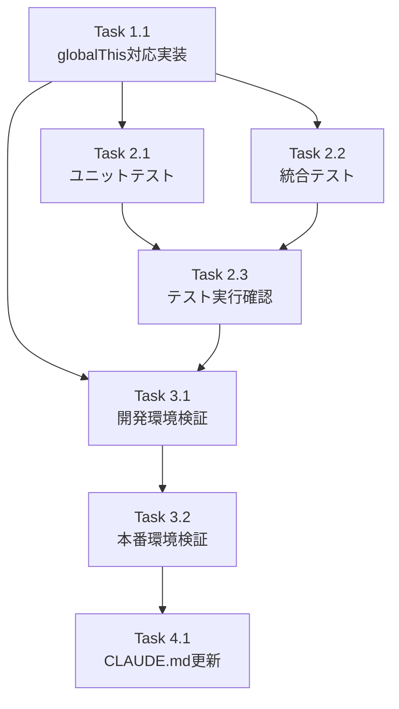

# 作業計画書: Issue #153

## Issue: Auto-Yes UIとバックグラウンドの状態不整合
**Issue番号**: #153
**サイズ**: S（約20行の変更）
**優先度**: High（本番環境でも発生確認済み）
**依存Issue**: なし（Issue #138の後続バグ修正）

---

## 1. 概要

Auto-Yesモードを有効化後、モジュール再読み込み（ホットリロード/ワーカー再起動）が発生すると、バックグラウンドでは正常動作するがUIは「オフ」と表示される問題を修正する。

**解決策**: globalThisによる状態永続化パターンを適用

---

## 2. 詳細タスク分解

### Phase 1: 実装タスク

- [ ] **Task 1.1**: auto-yes-manager.ts のglobalThis対応
  - **成果物**: `src/lib/auto-yes-manager.ts`
  - **変更内容**:
    - global型宣言の追加（`__autoYesStates`, `__autoYesPollerStates`）
    - モジュールスコープMapをglobalThis参照に変更
    - JSDocコメント追加（globalThisパターンの理由説明）
  - **変更行数**: 約20行
  - **依存**: なし

### Phase 2: テストタスク

- [ ] **Task 2.1**: ユニットテスト追加
  - **成果物**: `tests/unit/lib/auto-yes-manager.test.ts`（既存ファイルに追加）
  - **テスト内容**:
    - globalThis変数の初期化確認
    - クリア関数のglobalThis対応確認
    - 状態の永続性確認
  - **依存**: Task 1.1

- [ ] **Task 2.2**: 統合テスト追加（推奨）
  - **成果物**: `tests/integration/auto-yes-persistence.test.ts`（新規）
  - **テスト内容**:
    - vi.resetModules()を使用したモジュール再読み込みシミュレーション
    - 再読み込み後の状態維持確認
  - **依存**: Task 1.1

- [ ] **Task 2.3**: 既存テストの実行確認
  - **コマンド**: `npm run test:unit`
  - **確認内容**: 既存テストがすべてパスすること
  - **依存**: Task 2.1, Task 2.2

### Phase 3: 検証タスク

- [ ] **Task 3.1**: 開発環境での手動検証
  - **手順**:
    1. `npm run dev` でサーバー起動
    2. Worktree詳細画面でAuto-Yesを有効化
    3. `src/lib/auto-yes-manager.ts` に空白行を追加して保存（ホットリロード発生）
    4. UIのトグル状態が「オン」のままであることを確認
    5. サーバーログで `[Auto-Yes Poller]` のログが継続していることを確認
  - **依存**: Task 1.1

- [ ] **Task 3.2**: 本番環境での検証
  - **手順**:
    1. `npm run build && npm start` でサーバー起動
    2. Worktree詳細画面でAuto-Yesを有効化
    3. UIのトグル状態が維持されることを確認
  - **依存**: Task 3.1

### Phase 4: ドキュメントタスク

- [ ] **Task 4.1**: CLAUDE.md更新
  - **成果物**: `CLAUDE.md`
  - **追加内容**:
    - 「最近の実装機能」セクションにIssue #153の概要追加
    - globalThisパターンの採用理由
    - マルチプロセス環境の制限事項の注記
  - **依存**: Task 3.2

---

## 3. タスク依存関係

---

## 4. 変更ファイル一覧

| ファイル | 種別 | 変更内容 |
|---------|------|---------|
| `src/lib/auto-yes-manager.ts` | 修正 | globalThis対応（約20行） |
| `tests/unit/lib/auto-yes-manager.test.ts` | 修正 | globalThisテスト追加 |
| `tests/integration/auto-yes-persistence.test.ts` | 新規 | モジュール再読み込みテスト |
| `CLAUDE.md` | 修正 | Issue #153セクション追加 |

---

## 5. 品質チェック項目

| チェック項目 | コマンド | 基準 |
|-------------|----------|------|
| TypeScript | `npx tsc --noEmit` | 型エラー0件 |
| ESLint | `npm run lint` | エラー0件 |
| Unit Test | `npm run test:unit` | 全テストパス |
| Build | `npm run build` | 成功 |

---

## 6. 成果物チェックリスト

### コード
- [ ] globalThis型宣言（`__autoYesStates`, `__autoYesPollerStates`）
- [ ] モジュールスコープMap → globalThis参照への変更
- [ ] JSDocコメント（パターン採用理由説明）

### テスト
- [ ] globalThis初期化テスト
- [ ] クリア関数動作テスト
- [ ] モジュール再読み込みシミュレーションテスト

### ドキュメント
- [ ] CLAUDE.md Issue #153セクション

---

## 7. 受け入れ条件（Definition of Done）

Issue完了条件：

- [ ] Auto-Yesを有効化後、モジュール再読み込みが発生してもUI状態が正しく表示されること
- [ ] UIからOFFにした場合、バックグラウンドポーラーも確実に停止すること
- [ ] `lastServerResponseTimestamp`が正しく更新されること
- [ ] 開発環境・本番環境の両方で問題が発生しないことを確認
- [ ] 既存の自動テストがすべてパスすること
- [ ] CIチェック全パス（lint, type-check, test, build）

---

## 8. リスクと対策

| リスク | 影響度 | 対策 |
|--------|--------|------|
| 既存テストへの影響 | 低 | 既存のclearAll関数がglobalThis対応後も動作することを確認済み |
| 本番環境での動作 | 低 | 手動検証で確認 |
| マルチプロセス環境 | 低 | CommandMateは単一プロセス運用が前提、制限事項をドキュメント化 |

---

## 9. 次のアクション

作業計画承認後：

1. **ブランチ確認**: 現在のブランチ `fix/153-auto-yes-state-inconsistency` で作業
2. **タスク実行**: TDD方式で実装（`/tdd-impl`または`/pm-auto-dev`）
3. **PR作成**: `/create-pr`で自動作成

---

## 10. 参照ドキュメント

- **Issue**: https://github.com/Kewton/CommandMate/issues/153
- **設計方針書**: `dev-reports/design/issue-153-auto-yes-state-inconsistency-design-policy.md`
- **Issueレビュー結果**: `dev-reports/issue/153/issue-review/`
- **設計レビュー結果**: `dev-reports/issue/153/multi-stage-design-review/`
