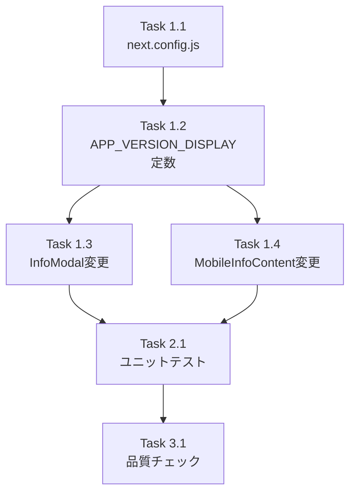

# 作業計画書: Issue #159 - infoタブにてアプリバージョン表示

## Issue概要

**Issue番号**: #159
**タイトル**: feat: infoタブにてアプリバージョン表示
**サイズ**: S（小規模変更）
**優先度**: Medium
**依存Issue**: なし
**ラベル**: enhancement

## 詳細タスク分解

### Phase 1: 実装タスク

#### Task 1.1: next.config.js にビルド時環境変数を追加
- **成果物**: `next.config.js`
- **依存**: なし
- **作業内容**:
  - `require('./package.json')` でバージョンを取得
  - `env.NEXT_PUBLIC_APP_VERSION` にバージョンを設定
- **受け入れ条件**: ビルド後に `process.env.NEXT_PUBLIC_APP_VERSION` でバージョンにアクセス可能

#### Task 1.2: APP_VERSION_DISPLAY モジュールレベル定数を追加
- **成果物**: `src/components/worktree/WorktreeDetailRefactored.tsx`
- **依存**: Task 1.1
- **作業内容**:
  - コンポーネント外のモジュールレベルに `APP_VERSION_DISPLAY` 定数を定義
  - `v` プレフィックス付与とフォールバック `-` のロジックを集約
- **受け入れ条件**: 定数が定義され、InfoModal・MobileInfoContent から参照可能

#### Task 1.3: InfoModal（デスクトップ）にバージョン表示追加
- **成果物**: `src/components/worktree/WorktreeDetailRefactored.tsx`
- **依存**: Task 1.2
- **作業内容**:
  - Last Updated セクションの後に Version セクションを追加
  - `<h2>` + `mb-1` ラベル + `
` 値（既存パターン準拠）
  - `bg-gray-50 rounded-lg p-4` カードスタイル
- **受け入れ条件**: デスクトップの info モーダルにバージョンが表示される

#### Task 1.4: MobileInfoContent（モバイル）にバージョン表示追加
- **成果物**: `src/components/worktree/WorktreeDetailRefactored.tsx`
- **依存**: Task 1.2
- **作業内容**:
  - Last Updated セクションの後に Version セクションを追加
  - `<h2>` + `mb-1` ラベル + `
` 値（既存パターン準拠）
  - `bg-white rounded-lg border border-gray-200 p-4` カードスタイル
- **受け入れ条件**: モバイルの info タブにバージョンが表示される

### Phase 2: テストタスク

#### Task 2.1: バージョン表示ユニットテスト作成
- **成果物**: `tests/unit/components/WorktreeDetailRefactored.test.tsx`
- **依存**: Task 1.3, Task 1.4
- **作業内容**:
  - `vi.resetModules()` + 動的import 方式でテスト実装
  - テストケース:
    1. バージョン表示（値あり）- InfoModal
    2. バージョン表示（値あり）- MobileInfoContent
    3. バージョン未設定フォールバック - InfoModal
    4. バージョン未設定フォールバック - MobileInfoContent
    5. 空文字列フォールバック
    6. プレリリース版表示
- **受け入れ条件**: 全テストケースがパス

### Phase 3: 検証タスク

#### Task 3.1: 品質チェック実行
- **依存**: Task 2.1
- **作業内容**:
  - `npx tsc --noEmit` - 型エラー0件
  - `npm run lint` - ESLintエラー0件
  - `npm run test:unit` - 全テストパス
  - `npm run build` - ビルド成功
- **受け入れ条件**: 全チェックパス

## タスク依存関係

## 品質チェック項目

| チェック項目 | コマンド | 基準 |
|-------------|----------|------|
| TypeScript | `npx tsc --noEmit` | 型エラー0件 |
| ESLint | `npm run lint` | エラー0件 |
| Unit Test | `npm run test:unit` | 全テストパス |
| Build | `npm run build` | 成功 |

## 成果物チェックリスト

### コード
- [ ] `next.config.js` - `env.NEXT_PUBLIC_APP_VERSION` 追加
- [ ] `src/components/worktree/WorktreeDetailRefactored.tsx` - `APP_VERSION_DISPLAY` 定数、InfoModal変更、MobileInfoContent変更

### テスト
- [ ] `tests/unit/components/WorktreeDetailRefactored.test.tsx` - バージョン表示テスト6ケース

## Definition of Done

- [ ] デスクトップの info モーダルにバージョンが表示される
- [ ] モバイルの info タブにバージョンが表示される
- [ ] 表示されるバージョンが `package.json` のバージョンと一致する
- [ ] `npm run build` が通ること
- [ ] `npm run lint` と `npx tsc --noEmit` が通ること
- [ ] ユニットテスト全パス

## 次のアクション

1. TDD実装開始（`/pm-auto-dev 159`）
2. PR作成（`/create-pr`）
