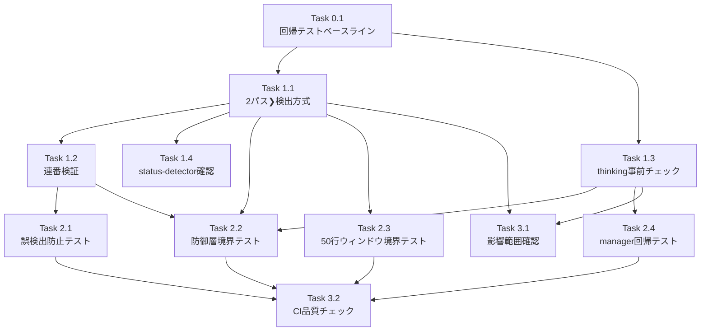

# 作業計画書: Issue #161（設計レビュー反映版）

## Issue: auto yes 実行時、それなりの頻度で"1"が送信される
**Issue番号**: #161
**サイズ**: M
**優先度**: High
**依存Issue**: なし（Issue #138, #153の既存実装を前提とする）
**ブランチ**: `feature/161-worktree`
**設計方針書**: `dev-reports/design/issue-161-auto-yes-false-positive-design-policy.md`
**設計レビュー**: 4段階レビュー完了（38件指摘、5件Must Fix、全件反映済み）

---

## 問題概要

Auto-Yesモード有効時、Claude CLIの通常出力に含まれる番号付きリスト（例：「1. ファイルを作成」「2. テストを実行」）が`detectMultipleChoicePrompt`関数で誤ってmultiple_choiceプロンプトとして検出され、「1」が自動送信される。

### 根本原因

`prompt-detector.ts`の`detectMultipleChoicePrompt`関数（L198）のパターンマッチが緩すぎる：

```typescript
const optionPattern = /^\s*([❯ ]\s*)?(\d+)\.\s*(.+)$/;
```

**問題点**:
1. `[❯ ]`の文字クラスが❯（U+276F）だけでなく**空白文字1つ**も許容し、通常の番号付きリスト行が`options`配列に蓄積される
2. 連番検証なし — 散発的な番号（1, 5, 10等）でもマッチ
3. thinking状態の判定なし — CLI処理中の出力でも検出が発動

---

## 対策方針（設計レビュー反映版）

多層防御アプローチで3つの対策案を組み合わせて実装する：

| # | 対策 | 実装箇所 | 効果 | 優先度 |
|---|------|---------|------|--------|
| 案1 | **2パス❯検出方式** | prompt-detector.ts | ❯未検出時はnormalOptionPatternを適用せず、通常の番号付きリストがoptions配列に入るのを完全排除 | Must |
| 案2 | **thinking状態での検出スキップ** | auto-yes-manager.ts（呼び出し元） | CLI処理中の誤検出を排除 | Must |
| 案3 | **連番検証** | prompt-detector.ts | 散発的な番号付きリストの誤検出を排除 | Should（防御的措置） |

> **[S1-001/S1-002]**: thinking判定はprompt-detector.ts内ではなく呼び出し元（auto-yes-manager.ts）で実施。prompt-detector.tsのCLIツール非依存性を維持する（SRP/OCP/DRY準拠）。
> **[S1-005]**: 連番検証はMust→Should（防御的措置）に変更。実際のIssue #161パターン「1. ファイルを作成\n2. テストを実行」は1始まり連番のため、この検証単体では防止不可。
> **[S2-001]**: 当初の各行独立マッチ方式から2パス検出方式に変更。❯インジケーターが存在する場合のみnormalOptionPatternを適用する。

### 多層防御の全体像

```
Claude CLI出力
    |
[Layer 1] thinking状態チェック (案2) -- 呼び出し元で実施
    |     auto-yes-manager.ts: detectThinking()事前チェック
    | (thinking中はdetectPrompt()をスキップ)
    v
[Layer 2] 2パス❯インジケーター検出 (案1) -- prompt-detector.ts内
    | パス1: 50行ウィンドウ内でdefaultOptionPattern(❯付き)をスキャン
    |   -> ❯付き行が0件なら即座にisPrompt: false
    | パス2: ❯付き行が存在する場合のみ、全行を再スキャンして選択肢収集
    v
[Layer 3] 連番検証 (案3、防御的措置) -- prompt-detector.ts内
    | (非連番はスキップ)
    v
[Layer 4] 既存チェック (options >= 2 && hasDefault) -- prompt-detector.ts内
    |
    v
検出結果 -> resolveAutoAnswer -> 応答送信
```

---

## 詳細タスク分解

### Phase 0: 回帰テストベースライン（TDDアプローチ）

> **[S3-004]**: 現在のテストファイルにはmultiple_choiceプロンプト検出のテストケースが0件。コード変更前にベースラインを確立する。

#### Task 0.1: 回帰テストのベースライン作成
- **成果物**: `tests/unit/prompt-detector.test.ts` への回帰テスト追加
- **依存**: なし
- **内容**:
  1. 設計方針書Section 5.2の回帰テストケース1-6を現在のコードに対して作成
  2. 全テストが現在のコードでパスすることを確認
  3. これにより後方互換性のベースラインを確立

| # | テストケース | 期待結果 |
|---|-------------|----------|
| 1 | 有効な❯付きmultiple_choice (`❯ 1. Yes\n  2. No`) | `isPrompt: true`, `type: 'multiple_choice'` |
| 2 | 連番+❯の3択 | `isPrompt: true`, options.length=3 |
| 3 | requiresTextInputフラグ | `options[1].requiresTextInput: true` |
| 4 | yes/noパターン | `isPrompt: true`, `type: 'yes_no'` |
| 5 | Approveパターン | `isPrompt: true`, `type: 'yes_no'` |
| 6 | [Y/n]パターン | `isPrompt: true`, `defaultOption: 'yes'` |

### Phase 1: 実装タスク

#### Task 1.1: prompt-detector.ts — 2パス❯検出方式の実装（案1）
- **成果物**: `src/lib/prompt-detector.ts` の修正
- **依存**: Task 0.1
- **内容**:
  1. **パターン分離**:
     - `defaultOptionPattern = /^\s*❯\s*(\d+)\.\s*(.+)$/` — ❯付き選択肢
     - `normalOptionPattern = /^\s*(\d+)\.\s*(.+)$/` — 通常の選択肢
  2. **パス1実装**: 50行ウィンドウ内の全行をスキャンし、`defaultOptionPattern`にマッチする行の存在を確認。❯付き行が0件なら即座に`isPrompt: false`を返す
  3. **パス2実装**: パス1で❯が確認された場合のみ、全行を再スキャンして選択肢行を収集（defaultOptionPattern → isDefault=true、normalOptionPattern → isDefault=false）
- **設計根拠**: [S2-001] normalOptionPatternは❯付き行が確認されたコンテキスト内でのみ適用。通常の番号付きリストがoptions配列に蓄積されることを完全に防止

#### Task 1.2: prompt-detector.ts — 連番検証の追加（案3、防御的措置）
- **成果物**: `src/lib/prompt-detector.ts` の修正
- **依存**: Task 1.1
- **内容**:
  1. `isConsecutiveFromOne(numbers: number[]): boolean`関数を追加
  2. 選択肢収集後、`hasDefaultIndicator`チェック前に連番検証を挿入
  3. コメントで「将来の未知パターン対策」「Issue #161の実際のパターンは1始まり連番のため本検証単体では防止不可」と明記
  4. **[S3-010]** 将来Claude CLIが非連番選択肢を出す可能性に備え、緩和方針をコメントに記載
- **設計根拠**: [S1-005] 防御的措置。案1+案2の2層で実際の問題は解決される

#### Task 1.3: auto-yes-manager.ts — thinking事前チェック追加（案2）
- **成果物**: `src/lib/auto-yes-manager.ts` の修正
- **依存**: なし（Task 1.1と並行可能）
- **内容**:
  1. **[S2-004]** 既存import文（L17の`stripAnsi`）に`detectThinking`を追加
  2. `pollAutoYes()`内で`detectPrompt()`呼び出し前に`detectThinking(cliToolId, cleanOutput)`チェックを追加
  3. thinking中は`detectPrompt()`をスキップし、次回ポーリングへ
  4. ログに「thinking状態のためスキップ」を記録
- **設計根拠**: [S1-001/S1-002] prompt-detector.tsのCLIツール非依存性を維持

#### Task 1.4: status-detector.ts — 実行順序の確認・対応
- **成果物**: `src/lib/status-detector.ts` の確認（必要に応じて修正）
- **依存**: Task 1.1
- **内容**:
  1. **[S1-006]** detectPrompt() (L80)がdetectThinking() (L91)より先に実行される問題を確認
  2. Layer 2の2パス検出修正により、thinking中のmultiple_choice誤検出が解消されるか検証
  3. 解消されない場合、detectPrompt()前にdetectThinking()チェックを追加
- **設計根拠**: prompt-detector.ts内の2パス検出修正により、ほとんどのケースで解消されるが、動作確認の上で判断

### Phase 2: テストタスク

#### Task 2.1: 誤検出防止テスト
- **成果物**: `tests/unit/prompt-detector.test.ts` への追加
- **依存**: Task 1.1, Task 1.2
- **テストケース**（設計方針書Section 5.1）:

| # | テスト内容 | 期待結果 | 保護する防御層 |
|---|-----------|----------|---------------|
| 1 | 通常の番号付きリスト | `isPrompt: false` | Layer 2（パス1で❯未検出） |
| 2 | ❯なしの番号付きリスト (`  1. Yes\n  2. No`) | `isPrompt: false` | Layer 2（パス1で❯未検出） |
| 3 | 非連番リスト (`❯ 1. Option A\n  3. Option B`) | `isPrompt: false` | Layer 3（連番検証） |
| 4 | 1始まりでないリスト (`❯ 2. Option A\n  3. Option B`) | `isPrompt: false` | Layer 3（連番検証） |
| 5 | thinking中の番号付き出力 | `isPrompt: false`（auto-yes-manager側テスト） | Layer 1 |
| 6 | CLIのステップ説明出力 | `isPrompt: false` | Layer 2（❯未検出） |
| 7 | **[S3-003]** プロンプト行の❯と番号付きリストの共存 | `isPrompt: false` | Layer 2（❯行がdefaultOptionPatternにマッチしない） |

#### Task 2.2: 防御層境界テスト
- **成果物**: `tests/unit/prompt-detector.test.ts` + `tests/unit/lib/auto-yes-manager.test.ts`
- **依存**: Task 1.1, Task 1.2, Task 1.3
- **テストケース**（設計方針書Section 5.3）:

| # | テストケース | 期待する停止層 | 実装先 |
|---|-------------|---------------|--------|
| 1 | thinking中 + ❯付き連番選択肢 | Layer 1 | auto-yes-manager.test.ts |
| 2 | thinking中でない + ❯なし番号付きリスト | Layer 2 | prompt-detector.test.ts |
| 3 | thinking中でない + ❯あり + 非連番 | Layer 3 | prompt-detector.test.ts |
| 4 | thinking中でない + ❯あり + 連番 + 選択肢1個のみ | Layer 4 | prompt-detector.test.ts |
| 5 | thinking中でない + ❯あり + 連番 + 2個以上 | 全層パス（正常検出） | prompt-detector.test.ts |

#### Task 2.3: 50行ウィンドウ境界条件テスト
- **成果物**: `tests/unit/prompt-detector.test.ts` への追加
- **依存**: Task 1.1
- **テストケース**（設計方針書Section 5.4）:

| # | テスト内容 | 期待結果 |
|---|-----------|----------|
| 1 | ❯行がウィンドウ先頭（50行目）に位置 | `isPrompt: true` |
| 2 | ❯行がウィンドウ外（51行目以降） | `isPrompt: false` |
| 3 | 回答済み古いプロンプト + 新しい番号付きリスト | 既存検証で正しく処理される |

#### Task 2.4: auto-yes-manager回帰テスト
- **成果物**: `tests/unit/lib/auto-yes-manager.test.ts` への追加、`tests/unit/lib/auto-yes-resolver.test.ts` の確認
- **依存**: Task 1.3
- **内容**:
  - **[S2-006]** thinking中にpollAutoYesがprompt検出をスキップすることのテスト
  - 既存の`auto-yes-resolver.test.ts`が全テストパスすることの確認

### Phase 3: 品質保証

#### Task 3.1: 影響範囲の動作確認
- **依存**: Task 1.1, Task 1.2, Task 1.3
- **内容**:
  - **[S3-001]** APIルート3ファイル（worktrees/route.ts, [id]/route.ts, current-output/route.ts）がdetectPrompt()の結果変更で問題ないことを確認
  - **[S3-005]** response-poller.tsの複数detectPrompt()呼び出し箇所（L248, L442, L556）がLayer 2修正で正しく保護されることを確認
  - **[S3-002]** 既存の3秒重複応答防止ウィンドウが本変更の影響を受けないことを確認
  - **[S4-001]** 提案パターンがアンカー付きでReDoS安全であることを確認
  - **[S4-008]** detectThinking()事前チェック追加後のパフォーマンス確認

#### Task 3.2: CI品質チェック
- **依存**: Task 2.1, Task 2.2, Task 2.3, Task 2.4
- **チェック項目**:

| チェック項目 | コマンド | 基準 |
|-------------|----------|------|
| ESLint | `npm run lint` | エラー0件 |
| TypeScript | `npx tsc --noEmit` | 型エラー0件 |
| Unit Test | `npm run test:unit` | 全テストパス |
| Build | `npm run build` | 成功 |

---

## タスク依存関係



---

## 変更ファイル一覧

| ファイル | 変更内容 | 変更規模 |
|---------|----------|----------|
| `src/lib/prompt-detector.ts` | 2パス検出方式、❯パターン分離、連番検証（防御的） | 中 |
| `src/lib/auto-yes-manager.ts` | thinking判定の事前チェック追加 | 小 |
| `src/lib/status-detector.ts` | detectPrompt前のthinkingチェック追加（必要に応じて） | 小 |
| `tests/unit/prompt-detector.test.ts` | 回帰テストベースライン + 誤検出防止 + 防御層境界 + 50行ウィンドウ境界 | 中 |
| `tests/unit/lib/auto-yes-resolver.test.ts` | 回帰テスト確認 | 小 |
| `tests/unit/lib/auto-yes-manager.test.ts` | thinking判定テスト + 防御層境界テスト#1 | 小 |

> **[S1-001/S1-002]** prompt-detector.tsにCLAUDE_THINKING_PATTERNをimportしない（CLIツール非依存性維持）
> **[S3-009]** UIコンポーネント（PromptPanel.tsx等）はpromptDataのnull処理が既に適切なためコード変更不要

---

## 破壊的変更のリスクと緩和策

### リスク

| 変更 | リスク | 緩和策 |
|------|--------|--------|
| 2パス❯検出方式 | ❯なしの正規選択肢が検出されなくなる | ❯は必須要件（既存条件と同じ）。回帰テストで確認 |
| 連番検証 | Claude CLIが非連番選択肢を出す場合に検出漏れ | Claude CLIは常に1始まり連番を使用。防御的措置のため影響限定的 |
| thinking判定 | thinkingパターン未カバーの状態で誤判定 | 既存detectThinking()を使用（実績あり） |
| **[S3-006]** Claude CLI出力形式変更 | ❯文字変更で2パス検出が無効化 | 将来対応: 名前付き定数抽出、統合スモークテスト（別Issue推奨） |
| **[S3-008]** thinking→プロンプト遷移遅延 | Auto-Yes応答が最大2秒遅延 | False Positive防止の方が重要。許容可能なトレードオフ |

### サーバー・クライアント間重複応答防止

> **[S3-002]** 既存の3秒重複防止ウィンドウ（`DUPLICATE_PREVENTION_WINDOW_MS`）は本変更の影響を受けない。detectPrompt()の戻り値の型・構造は変更されず、タイムスタンプ記録ロジックも変更されない。

---

## 成果物チェックリスト

### コード（Must Fix）
- [ ] **[案1/S2-001]** prompt-detector.ts — 2パス❯検出方式（パス1: ❯存在確認、パス2: 選択肢収集）
- [ ] **[S1-001/S1-002]** auto-yes-manager.ts — detectThinking()事前チェック（prompt-detector.tsにはthinking判定を追加しない）
- [ ] **[S2-004]** auto-yes-manager.ts — 既存import文にdetectThinkingを追加

### コード（Should Fix）
- [ ] **[S1-005/S3-010]** prompt-detector.ts — 連番検証（防御的措置、コメント付き）
- [ ] **[S1-006]** status-detector.ts — 実行順序確認・必要に応じて対応

### テスト
- [ ] **[S3-004]** 回帰テストベースライン（Section 5.2、6ケース）— コード変更前に全パス確認
- [ ] 誤検出防止テスト（Section 5.1、7ケース）— **[S3-003]** テスト#7含む
- [ ] **[S1-007/S2-006]** 防御層境界テスト（Section 5.3、5ケース）— テスト#1はauto-yes-manager.test.ts
- [ ] **[S3-007]** 50行ウィンドウ境界条件テスト（Section 5.4、3ケース）
- [ ] **[S2-006]** auto-yes-manager回帰テスト（Section 5.5）

### 品質
- [ ] ESLint パス
- [ ] TypeScript 型チェック パス
- [ ] 全テスト パス
- [ ] ビルド 成功

### セキュリティ確認
- [ ] **[S4-001]** 提案パターンがReDoS安全であること
- [ ] **[S4-002]** 50行ウィンドウ境界テスト#3で残存False Positiveリスクの挙動を確認
- [ ] **[S4-008]** detectThinking()評価頻度増加のパフォーマンス確認

---

## Definition of Done

- [ ] すべてのタスクが完了
- [ ] 番号付きリストを含む通常出力で誤検出しないことをテストで確認
- [ ] 既存の有効なプロンプト検出が影響を受けないことを回帰テストで確認
- [ ] 防御層境界テストで各層の独立動作を確認
- [ ] CIチェック全パス（lint, type-check, test, build）
- [ ] コードレビュー承認

---

## 次のアクション

作業計画承認後：
1. **Task 0.1**: 回帰テストベースライン作成（TDDアプローチ）
2. **Task 1.1 + 1.3**: 2パス❯検出方式 + thinking事前チェック（並行実装可能）
3. **Task 1.2**: 連番検証追加
4. **Task 1.4**: status-detector.ts確認
5. **Task 2.1-2.4**: テスト作成・実行
6. **Task 3.1**: 影響範囲の動作確認
7. **Task 3.2**: CI品質チェック実行
8. **PR作成**: `/create-pr` で自動作成
