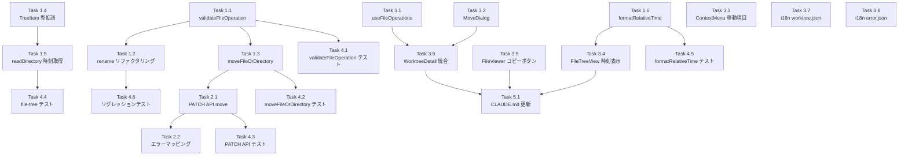

# 作業計画書: Issue #162 ファイル機能強化

## Issue概要

**Issue番号**: #162
**タイトル**: ファイル機能強化
**サイズ**: L（大規模）
**優先度**: Medium
**依存Issue**: なし

**概要**:
ファイル操作機能を3点強化する：
1. **ファイル/ディレクトリの移動** - コンテキストメニューから移動先を選択して移動
2. **ファイルの作成時刻表示** - ファイルツリーにファイルサイズと共に作成時刻を常時表示
3. **ファイル内容のコピー** - FileViewerにコピーボタンを追加し、テキストファイル全文をクリップボードにコピー

---

## 詳細タスク分解

### Phase 1: バックエンド実装（6タスク）

#### Task 1.1: 共通バリデーションヘルパーの追加
**成果物**: `src/lib/file-operations.ts` (修正)
**依存**: なし
**推定工数**: 1h

**実装内容**:
- `validateFileOperation()` 内部ヘルパー関数を追加
- ソースパスの `isPathSafe()` 検証、存在チェック、パーミッションエラーハンドリング
- **設計根拠**: MF-001（DRY原則） - `moveFileOrDirectory()` と `renameFileOrDirectory()` の重複排除

**テスト**:
- `tests/unit/lib/file-operations-validate.test.ts` (新規)
- パス検証、存在チェック、パーミッションエラーのテストケース

#### Task 1.2: renameFileOrDirectory のリファクタリング
**成果物**: `src/lib/file-operations.ts` (修正)
**依存**: Task 1.1
**推定工数**: 0.5h

**実装内容**:
- 既存の `renameFileOrDirectory()` を `validateFileOperation()` を使用するようリファクタリング

**テスト**:
- **リグレッションテスト**: 既存の `tests/unit/lib/file-operations.test.ts` が全パスすることを確認（MF-S3-001）

#### Task 1.3: moveFileOrDirectory 関数の実装
**成果物**: `src/lib/file-operations.ts` (修正)
**依存**: Task 1.1
**推定工数**: 2h

**実装内容**:
- `moveFileOrDirectory()` 関数を追加
- セキュリティチェック（5項目）:
  - **SEC-005**: ソースパスの保護ディレクトリチェック（`.git`, `node_modules` 等） ← **重大**
  - **SEC-006**: シンボリックリンク検証（`realpathSync()` 使用）
  - **SEC-007**: `MOVE_INTO_SELF` チェック（パスセパレーター含む）
  - **SEC-008**: 最終移動先パスの `isPathSafe()` 検証
  - **SEC-009**: TOCTOU 防御（EEXIST/ENOTEMPTY エラーハンドリング）
- エラーコード追加: `MOVE_SAME_PATH`, `MOVE_INTO_SELF`
- `ERROR_MESSAGES` と `ERROR_CODE_TO_HTTP_STATUS` への追加

**テスト**:
- `tests/unit/lib/file-operations-move.test.ts` (新規)
- 正常移動、保護ディレクトリ拒否、同一パスエラー、自身の子への移動防止、既存ファイル上書き防止、シンボリックリンク攻撃防止、TOCTOU 防御

#### Task 1.4: TreeItem 型の拡張
**成果物**: `src/types/models.ts` (修正)
**依存**: なし
**推定工数**: 0.5h

**実装内容**:
- `TreeItem` インターフェースに `birthtime?: string` フィールドを追加
- **設計根拠**: CO-001（YAGNI原則） - 初回は `birthtime` のみ追加、`mtime` は必要時に追加

**テスト**:
- 型チェック（`npx tsc --noEmit`）で後方互換性を確認

#### Task 1.5: readDirectory での時刻情報取得
**成果物**: `src/lib/file-tree.ts` (修正)
**依存**: Task 1.4
**推定工数**: 0.5h

**実装内容**:
- `readDirectory()` でファイルの場合に `lstat()` から `birthtime` を取得
- `toISOString()` で文字列に変換して TreeItem に格納

**テスト**:
- `tests/unit/lib/file-tree-timestamps.test.ts` (新規)
- 時刻情報の取得と形式のテスト

#### Task 1.6: formatRelativeTime ユーティリティの追加
**成果物**: `src/lib/date-utils.ts` (新規)
**依存**: なし
**推定工数**: 1h

**実装内容**:
- `formatRelativeTime()` 関数を実装
- `date-fns` の `formatDistanceToNow` を使用
- `getDateFnsLocale()` でロケール対応
- **設計根拠**: SF-001（DRY原則） - 独立したユーティリティとしてテスタビリティ向上

**テスト**:
- `tests/unit/lib/date-utils.test.ts` (新規)
- 各種時間差の表示フォーマット、ロケール対応のテスト

---

### Phase 2: APIルート実装（2タスク）

#### Task 2.1: PATCH API への move アクション追加
**成果物**: `src/app/api/worktrees/[id]/files/[...path]/route.ts` (修正)
**依存**: Task 1.3
**推定工数**: 1h

**実装内容**:
- PATCH ハンドラーに `action: "move"` を追加（switch 文で実装）
- `destination` パラメータのバリデーション（MF-S3-002）: `!destination || typeof destination !== 'string'`
- 不明アクションエラーメッセージに "move" を追加（SF-S2-002）
- レスポンスに `path` フィールドを含める（SF-S3-005）
- エラーコードマッピング追加: `MOVE_SAME_PATH: 400`, `MOVE_INTO_SELF: 400`

**テスト**:
- `tests/unit/api/files-route-move.test.ts` (新規)
- action: move のリクエスト処理、バリデーション、エラーレスポンスのテスト

#### Task 2.2: エラーコードの HTTP ステータスマッピング更新
**成果物**: `src/app/api/worktrees/[id]/files/[...path]/route.ts` (修正)
**依存**: Task 2.1
**推定工数**: 0.5h

**実装内容**:
- `ERROR_CODE_TO_HTTP_STATUS` に `MOVE_SAME_PATH: 400`, `MOVE_INTO_SELF: 400` を追加

---

### Phase 3: フロントエンド実装（8タスク）

#### Task 3.1: useFileOperations カスタムフックの作成
**成果物**: `src/hooks/useFileOperations.ts` (新規)
**依存**: なし
**推定工数**: 1.5h

**実装内容**:
- `useFileOperations()` フックを実装
- `moveTarget` state と `isMoveDialogOpen` state を管理
- `handleMove`, `handleMoveConfirm`, `handleMoveCancel` ハンドラーを実装
- **設計根拠**: MF-002（SRP/KISS原則） - WorktreeDetailRefactored の肥大化防止
- **段階的移行**: Phase 1 では `handleMove` のみ実装、Phase 2 で既存ハンドラー移行

**テスト**:
- カスタムフックテスト方針（Section 6-4）: React Testing Library でのフック単体テスト、または統合テストで間接的に検証

#### Task 3.2: MoveDialog コンポーネントの作成
**成果物**: `src/components/worktree/MoveDialog.tsx` (新規)
**依存**: なし
**推定工数**: 2h

**実装内容**:
- 移動先ディレクトリ選択ダイアログを実装
- 既存の `Modal` コンポーネントを利用
- tree API (`/api/worktrees/[id]/tree/[path]`) でディレクトリ一覧を取得
- クライアント側フィルタリング（ディレクトリのみ表示）
- 展開・折りたたみ可能なツリー表示
- ルートディレクトリ（`""`）も移動先として選択可能
- ローディングインジケーター（SF-S3-003）
- **Props**: `sourceType` を明示的に含む（バリデーション目的、CO-003）

**テスト**:
- 手動テストでUI動作確認（既存パターンに準拠）

#### Task 3.3: ContextMenu への移動メニュー項目追加
**成果物**: `src/components/worktree/ContextMenu.tsx` (修正)
**依存**: なし
**推定工数**: 0.5h

**実装内容**:
- `onMove` コールバックを `ContextMenuProps` に追加
- 「Move」メニュー項目を追加（**英語ハードコード**、MF-S2-001）
- `FolderInput` アイコン使用（lucide-react）
- ファイル・ディレクトリ両方で表示
- Rename の直後、Delete の前に配置

#### Task 3.4: FileTreeView に時刻表示を追加
**成果物**: `src/components/worktree/FileTreeView.tsx` (修正)
**依存**: Task 1.6
**推定工数**: 1.5h

**実装内容**:
- `TreeNode` コンポーネントにファイル作成時刻を表示
- `formatRelativeTime()` を `src/lib/date-utils.ts` からインポート
- `useLocale()` from `next-intl` + `getDateFnsLocale()` でロケール取得（MF-S2-002）
- `title={item.birthtime}` でツールチップ表示（CO-002）
- レスポンシブ対応: モバイルでは時刻を非表示またはスタイル調整
- `onMove` prop の追加（`FileTreeViewProps`）

**表示フォーマット**:
```
ファイル名                    1.2 KB  2h ago
```

#### Task 3.5: FileViewer にコピーボタンを追加
**成果物**: `src/components/worktree/FileViewer.tsx` (修正)
**依存**: なし
**推定工数**: 1h

**実装内容**:
- テキストファイル表示時（`!content.isImage`）にコピーボタンを追加
- ヘッダー部分（ファイルパス表示エリア）の右側に配置
- `copyToClipboard()` を呼び出し
- **フィードバック**: アイコン変更のみ（Copy → Check）、Toast 不使用（SF-S2-004）
- 成功後2秒で元のアイコンに戻る
- `Copy` / `Check` アイコン（lucide-react）

#### Task 3.6: WorktreeDetailRefactored への統合
**成果物**: `src/components/worktree/WorktreeDetailRefactored.tsx` (修正)
**依存**: Task 3.1, Task 3.2
**推定工数**: 1h

**実装内容**:
- `useFileOperations()` フックの導入
- `FileTreeView` と `ContextMenu` への `onMove` コールバック伝播
- `MoveDialog` の統合

#### Task 3.7: i18n キーの追加（worktree.json）
**成果物**: `locales/en/worktree.json`, `locales/ja/worktree.json` (修正)
**依存**: なし
**推定工数**: 0.5h

**実装内容**:
- `worktree.json` に `fileTree` セクションを追加
- キー: `moveTo`, `moveDialogTitle`, `moveConfirm`, `rootDirectory`, `timeAgo`
- **Note**: `move` はハードコード（MF-S2-001）、`moveCancel` は `tCommon('cancel')` を使用（CO-S2-004）

#### Task 3.8: i18n キーの追加（error.json）
**成果物**: `locales/en/error.json`, `locales/ja/error.json` (修正)
**依存**: なし
**推定工数**: 0.5h

**実装内容**:
- `error.json` の `fileOps` セクションに `failedToMove` を追加（SF-S2-001）

---

### Phase 4: テスト実装（6タスク）

#### Task 4.1: validateFileOperation のテスト
**成果物**: `tests/unit/lib/file-operations-validate.test.ts` (新規)
**依存**: Task 1.1
**推定工数**: 1h

**実装内容**:
- パス検証、存在チェック、パーミッションエラーのテストケース

#### Task 4.2: moveFileOrDirectory のテスト
**成果物**: `tests/unit/lib/file-operations-move.test.ts` (新規)
**依存**: Task 1.3
**推定工数**: 2h

**実装内容**:
- 正常移動、保護ディレクトリ拒否、同一パスエラー、自身の子への移動防止、既存ファイル上書き防止、シンボリックリンク攻撃防止、TOCTOU 防御のテストケース
- `tmp` ディレクトリを使用した実際のファイルシステム操作テスト

#### Task 4.3: PATCH API move のテスト
**成果物**: `tests/unit/api/files-route-move.test.ts` (新規)
**依存**: Task 2.1
**推定工数**: 1.5h

**実装内容**:
- action: move のリクエスト処理、バリデーション、エラーレスポンスのテストケース

#### Task 4.4: file-tree birthtime のテスト
**成果物**: `tests/unit/lib/file-tree-timestamps.test.ts` (新規)
**依存**: Task 1.5
**推定工数**: 1h

**実装内容**:
- 時刻情報の取得と形式のテストケース

#### Task 4.5: formatRelativeTime のテスト
**成果物**: `tests/unit/lib/date-utils.test.ts` (新規)
**依存**: Task 1.6
**推定工数**: 1h

**実装内容**:
- 各種時間差の表示フォーマット、ロケール対応のテストケース

#### Task 4.6: リグレッションテストの実行
**成果物**: なし（確認作業）
**依存**: Task 1.2
**推定工数**: 0.5h

**実装内容**:
- `renameFileOrDirectory()` リファクタリング後、既存の `tests/unit/lib/file-operations.test.ts` が全パスすることを確認（MF-S3-001）

---

### Phase 5: ドキュメント更新（1タスク）

#### Task 5.1: CLAUDE.md の更新
**成果物**: `CLAUDE.md` (修正)
**依存**: すべての実装タスク完了
**推定工数**: 0.5h

**実装内容**:
- ファイル構成セクションの更新（新規ファイル追加）
- 主要機能モジュールセクションの更新

---

## タスク依存関係



---

## 品質チェック項目

| チェック項目 | コマンド | 基準 | タイミング |
|-------------|----------|------|-----------|
| ESLint | `npm run lint` | エラー0件 | 各タスク完了後 |
| TypeScript | `npx tsc --noEmit` | 型エラー0件 | 各タスク完了後 |
| Unit Test | `npm run test:unit` | 全テストパス、カバレッジ80%以上 | Phase 4完了後 |
| Build | `npm run build` | 成功 | Phase 4完了後 |

---

## 成果物チェックリスト

### コード

#### バックエンド
- [x] `src/lib/file-operations.ts` - validateFileOperation(), moveFileOrDirectory(), renameFileOrDirectory() リファクタリング
- [x] `src/types/models.ts` - TreeItem に birthtime フィールド追加
- [x] `src/lib/file-tree.ts` - readDirectory() で birthtime 取得
- [x] `src/lib/date-utils.ts` - formatRelativeTime() 実装
- [x] `src/app/api/worktrees/[id]/files/[...path]/route.ts` - PATCH に action: "move" 追加

#### フロントエンド
- [x] `src/hooks/useFileOperations.ts` - ファイル操作ハンドラー集約フック
- [x] `src/components/worktree/MoveDialog.tsx` - 移動先ディレクトリ選択ダイアログ
- [x] `src/components/worktree/ContextMenu.tsx` - 「Move」メニュー項目追加
- [x] `src/components/worktree/FileTreeView.tsx` - 作成時刻表示、onMove prop
- [x] `src/components/worktree/FileViewer.tsx` - コピーボタン追加
- [x] `src/components/worktree/WorktreeDetailRefactored.tsx` - useFileOperations() 統合

#### i18n
- [x] `locales/en/worktree.json` - fileTree セクション追加
- [x] `locales/ja/worktree.json` - fileTree セクション追加
- [x] `locales/en/error.json` - fileOps.failedToMove 追加
- [x] `locales/ja/error.json` - fileOps.failedToMove 追加

### テスト
- [x] `tests/unit/lib/file-operations-validate.test.ts` - validateFileOperation テスト
- [x] `tests/unit/lib/file-operations-move.test.ts` - moveFileOrDirectory テスト
- [x] `tests/unit/lib/file-tree-timestamps.test.ts` - birthtime テスト
- [x] `tests/unit/lib/date-utils.test.ts` - formatRelativeTime テスト
- [x] `tests/unit/api/files-route-move.test.ts` - PATCH move API テスト
- [x] 既存テスト全パス確認（リグレッションテスト）

### ドキュメント
- [x] `CLAUDE.md` - ファイル構成・主要機能モジュールセクション更新

---

## Definition of Done

Issue完了条件：

- [x] すべてのタスクが完了（Phase 1〜5）
- [x] 単体テストカバレッジ80%以上
- [x] CIチェック全パス（lint, type-check, test, build）
- [x] セキュリティチェック完了（5項目）
  - [x] SEC-005: ソースパスの保護ディレクトリチェック
  - [x] SEC-006: シンボリックリンク検証
  - [x] SEC-007: MOVE_INTO_SELF パスセパレーター
  - [x] SEC-008: 最終移動先パスの検証
  - [x] SEC-009: TOCTOU 防御
- [x] i18n 対応完了（en/ja）
- [x] リグレッションテスト全パス
- [x] ドキュメント更新完了
- [x] コードレビュー承認
- [x] PR作成

---

## 次のアクション

作業計画承認後：

1. **ブランチ作成**: `feature/162-file-enhancement` ← 既に作成済み
2. **タスク実行**: `/tdd-impl 162` で TDD 実装を開始
3. **PR作成**: `/create-pr` で自動作成

---

## 推定工数

| Phase | タスク数 | 推定工数 |
|-------|---------|---------|
| Phase 1: バックエンド実装 | 6 | 5.5h |
| Phase 2: APIルート実装 | 2 | 1.5h |
| Phase 3: フロントエンド実装 | 8 | 8.5h |
| Phase 4: テスト実装 | 6 | 7h |
| Phase 5: ドキュメント更新 | 1 | 0.5h |
| **合計** | **23** | **23h** |

---

## 注意事項

### セキュリティ要件（Stage 4 レビュー結果より）

以下の5つのセキュリティチェックは**必須実装**です：

1. **SEC-005（重大）**: ソースパスの保護ディレクトリチェック - `.git/HEAD` 等の移動を防止
2. **SEC-006**: シンボリックリンク検証 - `realpathSync()` で実パス解決
3. **SEC-007**: `MOVE_INTO_SELF` のパスセパレーター含む比較
4. **SEC-008**: 最終移動先パスの `isPathSafe()` 検証
5. **SEC-009**: TOCTOU 競合状態の防御（EEXIST/ENOTEMPTY ハンドリング）

### リグレッションテスト（Stage 3 レビュー結果より）

`renameFileOrDirectory()` のリファクタリング後、既存テストが全パスすることを確認してください（MF-S3-001）。

### 段階的移行（Stage 1 レビュー結果より）

`useFileOperations()` フックは段階的移行方針を採用します：
- **Phase 1（本Issue）**: `handleMove` のみ実装
- **Phase 2（将来）**: 既存ハンドラー（handleNewFile, handleNewDirectory, handleRename, handleDelete, handleUpload）を移行

---

## 参考資料

- 設計方針書: `dev-reports/design/issue-162-file-enhancement-design-policy.md`
- マルチステージレビューサマリー: `dev-reports/issue/162/multi-stage-design-review/summary-report.md`
