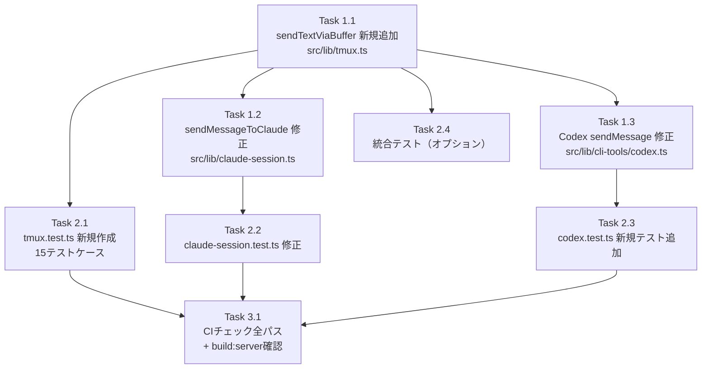

# 作業計画書: Issue #163（設計レビュー反映版）

## Issue: 長いメッセージ（複数行テキスト）の場合、メッセージを送信してもClaude側で処理が開始されない
**Issue番号**: #163
**サイズ**: M
**優先度**: High
**依存Issue**: なし（#152のwaitForPrompt()との連携あり）
**設計方針書**: `dev-reports/design/issue-163-multiline-message-buffer-design-policy.md`
**設計レビュー**: 4段階レビュー完了（全Stage 4/5、Must Fix 4件・Should Fix 9件 全対応済み）

---

## 問題概要

複数行テキストを`tmux send-keys`で送信すると、Claude CLIが「ペースト操作」として認識し`[Pasted text #1 +XX lines]`と表示されるだけで処理が開始されない。

## 解決方針

**方式1: tmux load-buffer/paste-buffer** を採用。`printf '%s' | tmux load-buffer`と`paste-buffer -dp`を使い、ペースト検出を回避する。

---

## 詳細タスク分解

### Phase 1: コア実装

#### Task 1.1: `sendTextViaBuffer()` 関数の新規追加
- **成果物**: `src/lib/tmux.ts`
- **依存**: なし
- **設計書参照**: 3.2項（関数シグネチャ）、4.1項（処理フロー）、6項（セキュリティ設計）
- **内容**:
  - `sendTextViaBuffer(sessionName, text, sendEnter)` 関数を追加
  - バッファ名サニタイズ: `[^a-zA-Z0-9_-]` → `_`、プレフィックス `cm-` [SEC-002]
  - NULバイト除去: `text.replace(/\0/g, '')` [SEC-004]
  - エスケープ処理（順序重要 - 二重エスケープ防止）[SEC-001]:
    a. `\` → `\\\\`（最初に処理）
    b. `$` → `\\$`
    c. `"` → `\\"`
    d. `` ` `` → `` \\` ``
  - `printf '%s' "${escapedText}" | tmux load-buffer -b "${bufferName}" -`
  - `tmux paste-buffer -t "${sessionName}" -b "${bufferName}" -dp`
  - Enterキー送信（sendEnter=trueの場合）: `tmux send-keys -t "${sessionName}" C-m`
  - try-catchでエラー時のバッファクリーンアップ [SEC-003]
  - **注意**: `%`文字のエスケープは不要（`printf '%s'`の引数のため）[SEC-MF-001]
  - **注意**: NUL以外の制御文字（`\r`, `\x08`等）はパススルー [SEC-005/SEC-SF-001]

#### Task 1.2: `sendMessageToClaude()` の修正
- **成果物**: `src/lib/claude-session.ts`
- **依存**: Task 1.1
- **設計書参照**: 4.2.2項
- **内容**:
  - import文に `sendTextViaBuffer` を追加（`from './tmux'`）
  - 390-391行目の `sendKeys()` 2回呼び出しを `sendTextViaBuffer()` 1回に置換
  - 変更前: `sendKeys(sessionName, message, false)` + `sendKeys(sessionName, '', true)`
  - 変更後: `sendTextViaBuffer(sessionName, message, true)`

#### Task 1.3: Codex CLI `sendMessage()` の修正
- **成果物**: `src/lib/cli-tools/codex.ts`
- **依存**: Task 1.1
- **設計書参照**: 4.2.3項
- **内容**:
  - import文に `sendTextViaBuffer` を追加（`from '../tmux'`）
  - 110-116行目の `sendKeys()` + `execAsync(C-m)` を `sendTextViaBuffer()` に置換
  - 変更前: `sendKeys` + 100ms待機 + `execAsync(`tmux send-keys ... C-m`)`
  - 変更後: `sendTextViaBuffer(sessionName, message, true)`
  - **[SF-002]**: sendMessage()内の`execAsync`tmux直接呼び出しが除去されることを確認
  - **[IMP-001]**: killSession()(141行目)の`execAsync(C-d)`は本Issue対象外（将来課題11.4項）

### Phase 2: テスト

#### Task 2.1: `sendTextViaBuffer()` ユニットテスト（新規作成）
- **成果物**: `tests/unit/lib/tmux.test.ts`
- **依存**: Task 1.1
- **設計書参照**: 8.1項
- **テストケース数**: 15件
- **内容**:
  - 正常系（3件）: 単一行、複数行50+行、sendEnter=false
  - エスケープ処理（4件）: `$`, `"`, `` ` ``, `\`
  - バッファ名サニタイズ（1件）: 特殊文字を含むセッション名
  - エラーハンドリング（2件）: load-buffer失敗時・paste-buffer失敗時のクリーンアップ
  - エッジケース（3件）: 空文字列、超長文10000+文字、特殊文字のみ
  - NULバイト（1件）: 先頭/中間/末尾/連続/NULのみ
  - prompt未検出時（1件）: catchブロック経由後の正常動作 [IMP-003]

#### Task 2.2: `claude-session.test.ts` 既存テスト修正
- **成果物**: `tests/unit/lib/claude-session.test.ts`
- **依存**: Task 1.2
- **設計書参照**: 8.3.1項
- **内容**:
  - モックに `sendTextViaBuffer: vi.fn()` を追加
  - 318行目テスト修正: `sendKeys` 2回呼び出し検証 → `sendTextViaBuffer` 1回呼び出し検証
  - テスト名を `'should use sendTextViaBuffer for message sending'` に変更
  - **[CONS-002]**: アサーションにリテラル値 `'mcbd-claude-test-worktree'`, `'Hello Claude'` を使用

#### Task 2.3: `codex.test.ts` 新規テスト追加
- **成果物**: `tests/unit/cli-tools/codex.test.ts`
- **依存**: Task 1.3
- **設計書参照**: 8.3.2項
- **[CONS-001]**: codex.test.tsにはsendMessage()テストが現状存在しないため、**新規追加**として実装
- **内容**:
  - `sendMessage()` テストdescribeブロックを新規追加
  - `sendTextViaBuffer` 1回呼び出し検証
  - `execAsync` のtmux直接呼び出しが存在しないことの検証
  - モックに `sendTextViaBuffer: vi.fn()`, `hasSession: vi.fn()` を追加

#### Task 2.4: 統合テスト（オプション）
- **成果物**: `tests/integration/tmux-buffer.test.ts`（新規作成）
- **依存**: Task 1.1
- **設計書参照**: 8.2項
- **内容**:
  - `process.env.TMUX` チェックで非tmux環境では自動スキップ
  - CI/CD環境（GitHub Actions）では自動スキップ
  - 実tmuxセッションでのバッファ送信検証

### Phase 3: 品質確認

#### Task 3.1: CIチェック全パス確認
- **依存**: Task 2.1, Task 2.2, Task 2.3
- **内容**:
  - `npm run lint` - エラー0件
  - `npx tsc --noEmit` - 型エラー0件
  - `npm run test:unit` - 全テストパス
  - `npm run build` - ビルド成功
  - `npm run build:server` - サーバービルド成功 [IMP-002]

---

## タスク依存関係

---

## 変更対象ファイル一覧

| ファイル | 変更種別 | リスク | レビュー指摘 |
|----------|----------|--------|-------------|
| `src/lib/tmux.ts` | 追加（新規関数） | 低 | SEC-001〜005 |
| `src/lib/claude-session.ts` | 修正（390-391行目） | 中 | - |
| `src/lib/cli-tools/codex.ts` | 修正（110-116行目） | 中 | SF-002, IMP-001 |
| `tests/unit/lib/tmux.test.ts` | 新規作成 | 低 | IMP-003 |
| `tests/unit/lib/claude-session.test.ts` | 修正（318行目） | 低 | SF-003, CONS-002 |
| `tests/unit/cli-tools/codex.test.ts` | 新規テスト追加 | 低 | CONS-001 |
| `tests/integration/tmux-buffer.test.ts` | 新規作成（オプション） | 低 | - |

## 変更対象外ファイル（影響なし確認済み）

| ファイル | 理由 | 確認Stage |
|----------|------|-----------|
| `src/lib/cli-tools/gemini.ts` | 非インタラクティブモード（パイプ経由） | Stage 3 |
| `src/lib/auto-yes-manager.ts` | 単純yes/no応答のみ | Stage 3 |
| `src/app/api/worktrees/[id]/respond/route.ts` | 単純応答のみ（将来課題11.3項） | Stage 3 |
| `src/app/api/worktrees/[id]/prompt-response/route.ts` | 単純応答のみ（将来課題11.3項） | Stage 3 |
| `src/app/api/worktrees/[id]/terminal/route.ts` | 単一行コマンドが主 | Stage 3 |
| `src/lib/terminal-websocket.ts` | 独自spawn方式、tmux.ts非使用 | Stage 3 |
| `src/lib/session-cleanup.ts` | tmux.tsからの直接import無し | Stage 3 |

---

## 品質チェック項目

| チェック項目 | コマンド | 基準 |
|-------------|----------|------|
| ESLint | `npm run lint` | エラー0件 |
| TypeScript | `npx tsc --noEmit` | 型エラー0件 |
| Unit Test | `npm run test:unit` | 全テストパス |
| Build | `npm run build` | 成功 |
| Server Build | `npm run build:server` | 成功 [IMP-002] |

---

## 成果物チェックリスト

### コード
- [ ] `sendTextViaBuffer()` 関数（src/lib/tmux.ts）
- [ ] `sendMessageToClaude()` 修正（src/lib/claude-session.ts）
- [ ] Codex `sendMessage()` 修正（src/lib/cli-tools/codex.ts）
- [ ] codex.ts sendMessage()内のexecAsync tmux直接呼び出し除去確認 [SF-002]

### テスト
- [ ] tmux ユニットテスト 15件（tests/unit/lib/tmux.test.ts）
- [ ] claude-session テスト修正（sendTextViaBuffer検証）
- [ ] codex テスト**新規追加**（sendMessage() sendTextViaBuffer検証）[CONS-001]
- [ ] 統合テスト（tests/integration/tmux-buffer.test.ts）- オプション

### セキュリティ
- [ ] エスケープ処理: `\`, `$`, `"`, `` ` `` の4種 [SEC-001]
- [ ] バッファ名サニタイズ [SEC-002]
- [ ] バッファリーク防止（paste-buffer -d + エラー時cleanup）[SEC-003]
- [ ] NULバイト除去 [SEC-004]

### ビルド確認
- [ ] `npm run build` 成功
- [ ] `npm run build:server` 成功（tsconfig.server.json暗黙的依存解決確認）[IMP-002]

---

## Definition of Done

- [ ] すべてのPhase 1タスク（Task 1.1〜1.3）が完了
- [ ] すべてのPhase 2タスク（Task 2.1〜2.3）が完了
- [ ] ユニットテストカバレッジ80%以上
- [ ] CIチェック全パス（lint, type-check, test, build, build:server）
- [ ] 複数行メッセージ（50行以上）がClaude CLIで正常処理される
- [ ] 特殊文字（`$`, `"`, `\`, `` ` ``）のエスケープが正しく動作
- [ ] エラー時のバッファクリーンアップが正常動作
- [ ] 設計レビュー指摘対応: Must Fix 4件、Should Fix 9件の受け入れ条件（設計書9項）を全て満たす

---

## 次のアクション

作業計画承認後：
1. **TDD実装**: `/tdd-impl` で Task 1.1 → 2.1（テストファースト） → 1.2 → 2.2 → 1.3 → 2.3 の順に実装
2. **品質確認**: Task 3.1 で全CIチェック + build:server確認
3. **進捗報告**: `/progress-report` で定期報告
4. **PR作成**: `/create-pr` で自動作成
