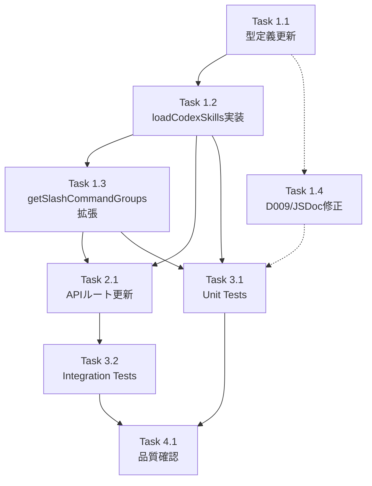

# 作業計画: Issue #166 - Codexカスタムスキル読込対応

## Issue概要
**Issue番号**: #166
**タイトル**: feat: Codexカスタムスキル読込対応（.codex/skills/, ~/.codex/skills/）
**サイズ**: M
**優先度**: Medium
**依存Issue**: #4（Codex CLI対応）、#343（.claude/skills/対応 - 設計参考）

## 詳細タスク分解

### Phase 1: 型定義・コアロジック

#### Task 1.1: 型定義の更新
- **成果物**: `src/types/slash-commands.ts`
- **依存**: なし
- **内容**:
  - `SlashCommandSource`型に`'codex-skill'`を追加
  - `cliTools`フィールドのJSDocコメント修正（「undefined: available for ALL tools」→「undefined: Claude Code only」）[D2-002]

#### Task 1.2: `loadCodexSkills()` 関数実装
- **成果物**: `src/lib/slash-commands.ts`
- **依存**: Task 1.1
- **内容**:
  - `import * as os from 'os'` 追加
  - `CODEX_SKILLS_SUBDIR` 定数定義（`.codex/skills`）
  - `loadCodexSkills(basePath?)` 関数実装
    - basePath未指定時: `os.homedir()` ベースでグローバルスキル読込
    - basePath指定時: ローカル（`.codex/skills/`）読込
    - `parseSkillFile()` 共用（DRY）
    - スプレッドで `source: 'codex-skill'`, `cliTools: ['codex']` 上書き
    - セキュリティ: パストラバーサル防御、symlink防御、MAX_SKILLS_COUNT/MAX_SKILL_FILE_SIZE_BYTES共用
  - `loadCodexSkills` をnamed exportに追加

#### Task 1.3: `getSlashCommandGroups()` 拡張
- **成果物**: `src/lib/slash-commands.ts`
- **依存**: Task 1.2
- **内容**:
  - basePath指定時: `loadCodexSkills(basePath)` でローカルCodexスキルも読み込み、`deduplicateByName([...claudeSkills, ...codexLocalSkills], commands)` でマージ
  - basePath未指定時（MCBDパス）: 変更なし（決定6: Codexスキル含めない）

#### Task 1.4: D009コメント・JSDoc修正
- **成果物**: `src/lib/slash-commands.ts`
- **依存**: なし（Task 1.2と同時に可）
- **内容**:
  - D009コメント修正（:126-130）: 「Skills available for all CLI tools」→「.claude/skills/ are claude-only, .codex/skills/ set cliTools: ['codex']」[D2-003]

### Phase 2: APIルート更新

#### Task 2.1: worktree APIルート更新
- **成果物**: `src/app/api/worktrees/[id]/slash-commands/route.ts`
- **依存**: Task 1.2, Task 1.3
- **内容**:
  - `loadCodexSkills` のimport追加
  - グローバルCodexスキル読み込み: `const globalCodexSkills = await loadCodexSkills().catch(() => [])` [D3-001]
  - グローバルCodexスキルをworktreeGroupsにマージ（ローカル優先）[D3-002]
  - `SlashCommandsResponse.sources` に `codexSkill: number` 追加
  - `source === 'codex-skill'` の集計ロジック追加

### Phase 3: テスト実装

#### Task 3.1: Unit Tests
- **成果物**: `tests/unit/slash-commands.test.ts`
- **依存**: Task 1.2, Task 1.3, Task 1.4
- **テストケース**:
  - `loadCodexSkills()` - 存在しないディレクトリ → 空配列
  - `loadCodexSkills(basePath)` - 正常読込 → cliTools: ['codex'], source: 'codex-skill'
  - `loadCodexSkills()` - os.homedir()使用確認
  - `loadCodexSkills()` - パストラバーサル防御（`..`含むディレクトリスキップ）
  - `loadCodexSkills()` - symlink防御（resolvedPath外のスキップ）
  - `loadCodexSkills()` - ファイルサイズ超過スキップ
  - `loadCodexSkills()` - MAX_SKILLS_COUNT超スキップ
  - `filterCommandsByCliTool(groups, 'codex')` - Codexスキルのみ表示
  - `filterCommandsByCliTool(groups, 'claude')` - Codexスキル非表示

#### Task 3.2: Integration Tests
- **成果物**: `tests/integration/api-worktree-slash-commands.test.ts`
- **依存**: Task 2.1
- **テストケース**:
  - `cliTool=codex` でCodexスキルのみ返却
  - `sources.codexSkill` カウント
  - グローバル+ローカル統合読み込み
  - 同名スキルのローカル優先

### Phase 4: 品質確認

#### Task 4.1: 静的解析・ビルド確認
- **依存**: Task 3.1, Task 3.2
- **内容**:
  - `npx tsc --noEmit` → 型エラー0件
  - `npm run lint` → ESLintエラー0件
  - `npm run test:unit` → 全パス
  - `npm run build` → 成功

## タスク依存関係

## 品質チェック項目

| チェック項目 | コマンド | 基準 |
|-------------|----------|------|
| TypeScript | `npx tsc --noEmit` | 型エラー0件 |
| ESLint | `npm run lint` | エラー0件 |
| Unit Test | `npm run test:unit` | 全テストパス |
| Build | `npm run build` | 成功 |

## 成果物チェックリスト

### コード
- [ ] `src/types/slash-commands.ts` - SlashCommandSource追加、JSDoc修正
- [ ] `src/lib/slash-commands.ts` - loadCodexSkills()追加、getSlashCommandGroups()拡張、D009コメント修正
- [ ] `src/app/api/worktrees/[id]/slash-commands/route.ts` - sources.codexSkill追加、グローバルスキルマージ

### テスト
- [ ] `tests/unit/slash-commands.test.ts` - loadCodexSkills Unit Tests
- [ ] `tests/integration/api-worktree-slash-commands.test.ts` - Integration Tests

### ドキュメント修正（コード内）
- [ ] D009コメント修正
- [ ] cliToolsフィールドJSDoc修正

## Definition of Done

- [ ] すべてのタスクが完了
- [ ] `npx tsc --noEmit` パス
- [ ] `npm run lint` パス
- [ ] `npm run test:unit` 全パス
- [ ] `npm run build` 成功
- [ ] 新規テストのカバレッジが適切
- [ ] 設計方針書のレビュー指摘事項が全て反映済み

---
*Generated by work-plan command*
