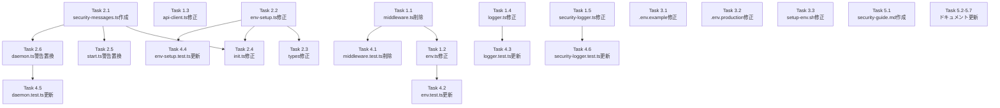

# 作業計画: Issue #179

## Issue: CM_AUTH_TOKEN認証機能を削除し、リバースプロキシ認証を推奨
**Issue番号**: #179
**サイズ**: L
**優先度**: High
**依存Issue**: #174（関連）
**設計方針書**: `dev-reports/design/issue-179-remove-auth-token-design-policy.md`

---

## 詳細タスク分解

### Phase 1: サーバー側認証ロジック削除

- [ ] **Task 1.1**: `src/middleware.ts` ファイル削除
  - 成果物: ファイル削除（89行）
  - 依存: なし

- [ ] **Task 1.2**: `src/lib/env.ts` からCM_AUTH_TOKEN関連削除
  - 成果物: ENV_MAPPINGエントリ、Env interface、getEnv()内authToken、throw文（行228-229）、isAuthRequired()関数の削除
  - 依存: Task 1.1

- [ ] **Task 1.3**: `src/lib/api-client.ts` からAuthorization送信削除
  - 成果物: clientAuthTokenWarned、authToken取得、deprecation警告、Authorizationヘッダー設定の削除
  - 依存: なし

- [ ] **Task 1.4**: `src/lib/logger.ts` からAUTH_TOKENマスキングパターン削除
  - 成果物: CM_AUTH_TOKEN/MCBD_AUTH_TOKEN固有パターン（行82-85）の削除。汎用token/Bearerパターンは残す
  - 依存: なし

- [ ] **Task 1.5**: `src/cli/utils/security-logger.ts` からAUTH_TOKENマスキング削除
  - 成果物: CM_AUTH_TOKEN=固有パターン（行62）の削除。汎用tokenパターンは残す
  - 依存: なし

### Phase 2: CLI修正

- [ ] **Task 2.1**: `src/cli/config/security-messages.ts` 新規作成
  - 成果物: REVERSE_PROXY_WARNING定数（ANSIエスケープシーケンス付き）
  - 依存: なし

- [ ] **Task 2.2**: `src/cli/utils/env-setup.ts` 修正
  - 成果物: generateAuthToken()削除、validateConfig()のAUTH_TOKENチェック削除、createEnvFile()のAUTH_TOKEN書き込み削除
  - 依存: なし

- [ ] **Task 2.3**: `src/cli/types/index.ts` 修正
  - 成果物: EnvConfig interfaceからCM_AUTH_TOKENフィールド削除
  - 依存: Task 2.2

- [ ] **Task 2.4**: `src/cli/commands/init.ts` 修正
  - 成果物: authToken生成・表示ロジック削除、displayConfigSummary()のAUTH_TOKEN表示削除、REVERSE_PROXY_WARNING表示追加
  - 依存: Task 2.1, Task 2.2

- [ ] **Task 2.5**: `src/cli/commands/start.ts` 警告置換
  - 成果物: authToken変数・条件分岐削除、REVERSE_PROXY_WARNING表示に置換
  - 依存: Task 2.1

- [ ] **Task 2.6**: `src/cli/utils/daemon.ts` 警告置換
  - 成果物: authToken変数・条件分岐削除、REVERSE_PROXY_WARNING表示に置換
  - 依存: Task 2.1

### Phase 3: 設定ファイル修正

- [ ] **Task 3.1**: `.env.example` 修正
  - 成果物: CM_AUTH_TOKEN行削除、CM_BIND説明更新、AUTH_TOKEN関連コメント削除、MCBD_AUTH_TOKEN行削除
  - 依存: なし

- [ ] **Task 3.2**: `.env.production.example` 修正
  - 成果物: AUTH_TOKEN削除、セキュリティセクション書き換え、Legacy SupportからMCBD_AUTH_TOKEN行削除
  - 依存: なし

- [ ] **Task 3.3**: `scripts/setup-env.sh` 修正
  - 成果物: AUTH_TOKEN関連の全削除（ヘルプ、generate_token、変数・条件分岐、書き込み、サマリー、警告）
  - 依存: なし

### Phase 4: テスト更新

- [ ] **Task 4.1**: `tests/unit/middleware.test.ts` ファイル削除
  - 成果物: ファイル削除（182行）
  - 依存: Task 1.1

- [ ] **Task 4.2**: `tests/unit/env.test.ts` 更新
  - 成果物: ENV_MAPPINGテスト更新（8→7）、CM_AUTH_TOKEN関連テスト削除
  - 依存: Task 1.2

- [ ] **Task 4.3**: `tests/unit/logger.test.ts` 更新
  - 成果物: AUTH_TOKENマスキングテスト削除
  - 依存: Task 1.4

- [ ] **Task 4.4**: `tests/unit/cli/utils/env-setup.test.ts` 更新
  - 成果物: generateAuthToken関連テスト削除、validateConfigテスト（行510-523）更新
  - 依存: Task 2.2

- [ ] **Task 4.5**: `tests/unit/cli/utils/daemon.test.ts` 更新
  - 成果物: セキュリティ警告テストをリバースプロキシ推奨警告テストに更新
  - 依存: Task 2.6

- [ ] **Task 4.6**: `tests/unit/cli/utils/security-logger.test.ts` 更新
  - 成果物: AUTH_TOKENマスキングテスト削除
  - 依存: Task 1.5

### Phase 5: ドキュメント更新

- [ ] **Task 5.1**: `docs/security-guide.md` 新規作成
  - 成果物: 脅威モデル、移行手順（順序警告付き）、Nginx設定例（レート制限含む）、Cloudflare/Tailscale概要、チェックリスト
  - 依存: なし

- [ ] **Task 5.2**: `docs/DEPLOYMENT.md` 更新
  - 成果物: セキュリティセクション書き換え、必須環境変数からCM_AUTH_TOKEN削除、commandmate init説明更新
  - 依存: なし

- [ ] **Task 5.3**: `docs/TRUST_AND_SAFETY.md` 更新
  - 成果物: MCBD_*→CM_*更新、非推奨設定リストをリバースプロキシ方式に更新
  - 依存: なし

- [ ] **Task 5.4**: `docs/migration-to-commandmate.md` 更新
  - 成果物: マッピング表からAUTH_TOKEN行削除、systemdセクション書き換え、トラブルシューティング更新
  - 依存: なし

- [ ] **Task 5.5**: `README.md` 更新
  - 成果物: モバイルアクセスセクションからAUTH_TOKEN言及削除
  - 依存: なし

- [ ] **Task 5.6**: その他ドキュメント更新（6件一括）
  - 対象: `docs/concept.md`, `docs/architecture.md`, `docs/user-guide/webapp-guide.md`, `docs/internal/PRODUCTION_CHECKLIST.md`, `docs/internal/TESTING_GUIDE.md`, `docs/internal/swe-agents.md`, `docs/internal/requirements-design.md`
  - 成果物: 各ファイルのAUTH_TOKEN参照をリバースプロキシ方式に更新
  - 依存: なし

- [ ] **Task 5.7**: `CHANGELOG.md` 更新
  - 成果物: [Unreleased]セクションにBREAKING CHANGE記載（移行順序警告付き）
  - 依存: なし

---

## タスク依存関係

---

## 品質チェック項目

| チェック項目 | コマンド | 基準 |
|-------------|----------|------|
| TypeScript | `npx tsc --noEmit` | 型エラー0件 |
| ESLint | `npm run lint` | エラー0件 |
| Unit Test | `npm run test:unit` | 全テストパス |
| Build | `npm run build` | 成功 |

---

## 成果物チェックリスト

### コード
- [ ] `src/middleware.ts` 削除
- [ ] `src/lib/env.ts` AUTH_TOKEN関連削除
- [ ] `src/lib/api-client.ts` Authorization送信削除
- [ ] `src/lib/logger.ts` マスキングパターン削除
- [ ] `src/cli/utils/security-logger.ts` マスキング削除
- [ ] `src/cli/config/security-messages.ts` 新規作成
- [ ] `src/cli/utils/env-setup.ts` AUTH_TOKEN関連削除
- [ ] `src/cli/types/index.ts` EnvConfig修正
- [ ] `src/cli/commands/init.ts` トークン生成削除+警告追加
- [ ] `src/cli/commands/start.ts` 警告置換
- [ ] `src/cli/utils/daemon.ts` 警告置換

### 設定ファイル
- [ ] `.env.example` AUTH_TOKEN削除
- [ ] `.env.production.example` AUTH_TOKEN削除
- [ ] `scripts/setup-env.sh` AUTH_TOKEN削除

### テスト
- [ ] `tests/unit/middleware.test.ts` 削除
- [ ] `tests/unit/env.test.ts` 更新
- [ ] `tests/unit/logger.test.ts` 更新
- [ ] `tests/unit/cli/utils/env-setup.test.ts` 更新
- [ ] `tests/unit/cli/utils/daemon.test.ts` 更新
- [ ] `tests/unit/cli/utils/security-logger.test.ts` 更新

### ドキュメント
- [ ] `docs/security-guide.md` 新規作成
- [ ] `docs/DEPLOYMENT.md` 更新
- [ ] `docs/TRUST_AND_SAFETY.md` 更新
- [ ] `docs/migration-to-commandmate.md` 更新
- [ ] `README.md` 更新
- [ ] 残り7件のドキュメント更新
- [ ] `CHANGELOG.md` 更新

---

## Definition of Done

- [ ] すべてのタスク（5 Phase, 24タスク）が完了
- [ ] `npx tsc --noEmit` パス
- [ ] `npm run lint` パス
- [ ] `npm run test:unit` 全テストパス
- [ ] `npm run build` 成功
- [ ] `docs/security-guide.md` が存在し脅威モデル・移行手順を含む
- [ ] CHANGELOGにBREAKING CHANGE記載
- [ ] CM_BIND=0.0.0.0設定時にリバースプロキシ推奨警告が表示される

---

## 次のアクション

1. `/pm-auto-dev 179` で TDD自動開発を実行
2. `/create-pr` でPR作成
