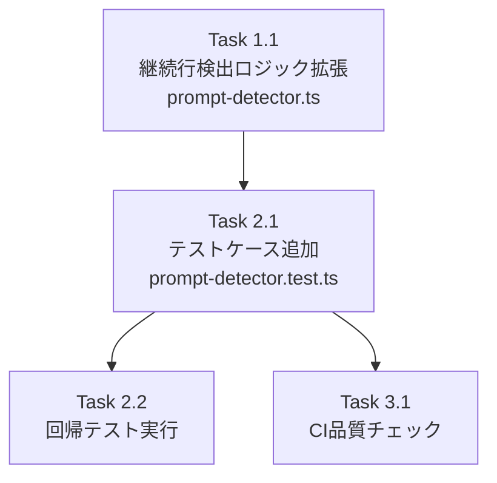

# 作業計画: Issue #181

## Issue: fix: 複数行オプションを含むmultiple choiceプロンプトが検出されない
**Issue番号**: #181
**サイズ**: S（ソースコード変更1ファイル+テスト1ファイル）
**優先度**: High（Auto-Yes機能およびUI表示に直接影響）
**依存Issue**: なし
**関連Issue**: #180（ステータス表示の不整合 - 本修正で部分的に改善される可能性）

---

## 詳細タスク分解

### Phase 1: 実装タスク

#### Task 1.1: 継続行検出ロジックの拡張
- **成果物**: `src/lib/prompt-detector.ts`
- **依存**: なし
- **変更内容**:
  - 226-228行目に `isPathContinuation` 条件を追加
    ```typescript
    const isPathContinuation = /^[\/~]/.test(line) || /^[a-zA-Z0-9_-]+$/.test(line);
    const isContinuationLine = hasLeadingSpaces || isShortFragment || isPathContinuation;
    ```
  - 223-225行目のコメントを更新（新しい継続行条件の説明を追記）
- **変更行数**: 約5行（1行追加、1行修正、コメント3行更新）

### Phase 2: テストタスク

#### Task 2.1: multiple choiceプロンプト テストケース追加
- **成果物**: `tests/unit/prompt-detector.test.ts`
- **依存**: Task 1.1
- **テストケース一覧**:

| # | テスト名 | カテゴリ | 設計書セクション |
|---|---------|---------|----------------|
| 1 | 複数行折り返しオプションの検出 | 正常系 | 7.1.1 |
| 2 | 標準multiple choiceプロンプトの検出 | 正常系 | 7.1.1 |
| 3 | `~`で始まるパス継続行の検出 | 正常系 | 7.1.2 |
| 4 | 番号付きリストがmultiple choiceとして誤検出されない | 偽陽性 | 7.1.3 |
| 5 | numbered list上部でもyes/noプロンプト正常検出 | 交差影響 | 7.1.3 |
| 6 | 既存yes/noプロンプト検出の回帰 | 回帰 | 7.1.4 |
| 7 | 通常出力のプロンプト非検出の回帰 | 回帰 | 7.1.4 |
| 8 | 折り返しなし（広いターミナル）での検出 | ターミナル幅 | 7.1.5 |
| 9 | パス継続行による折り返しパターン（Issue再現） | ターミナル幅 | 7.1.5 |
| 10 | 複数パス継続行の検出 | ターミナル幅 | 7.1.5 |

#### Task 2.2: 回帰テスト実行
- **成果物**: テスト実行結果
- **依存**: Task 2.1
- **実行対象**:
  ```bash
  npm run test:unit                                           # 全テスト
  npm run test:unit -- tests/unit/lib/auto-yes-resolver.test.ts  # Auto-Yes回帰
  npm run test:unit -- tests/unit/components/PromptPanel.test.tsx # UI回帰
  npm run test:unit -- tests/unit/components/mobile/MobilePromptSheet.test.tsx
  npm run test:unit -- tests/unit/components/worktree/MessageListOptimistic.test.tsx
  ```

### Phase 3: 品質チェック

#### Task 3.1: CI品質チェック実行
- **成果物**: チェック結果
- **依存**: Task 2.1
- **チェック項目**:

| チェック項目 | コマンド | 基準 |
|-------------|----------|------|
| ESLint | `npm run lint` | エラー0件 |
| TypeScript | `npx tsc --noEmit` | 型エラー0件 |
| Unit Test | `npm run test:unit` | 全テストパス |
| Build | `npm run build` | 成功 |

---

## タスク依存関係



---

## 成果物チェックリスト

### コード変更
- [ ] `src/lib/prompt-detector.ts` - `isPathContinuation` 条件追加（226-228行目）
- [ ] `src/lib/prompt-detector.ts` - コメント更新（223-225行目）

### テスト
- [ ] `tests/unit/prompt-detector.test.ts` - multiple choiceプロンプト テストケース10件追加

### 変更不要の確認
- [ ] 型構造（`PromptDetectionResult`, `PromptData`, `MultipleChoiceOption`）に変更がないこと
- [ ] 関数シグネチャ（`detectPrompt()`, `detectMultipleChoicePrompt()`）に変更がないこと

---

## Definition of Done

Issue完了条件:
- [ ] Task 1.1: `isPathContinuation` 条件が `prompt-detector.ts` に追加されている
- [ ] Task 2.1: 設計方針書セクション7記載の全テストケースが追加されパスする
- [ ] Task 2.2: 関連テスト4ファイルの回帰テストがパスする
- [ ] Task 3.1: `npm run lint` がエラー0件
- [ ] Task 3.1: `npx tsc --noEmit` が型エラー0件
- [ ] Task 3.1: `npm run test:unit` が全テストパス
- [ ] Task 3.1: `npm run build` が成功

---

## 注意事項・制約

1. **スコープ限定**: 修正はパス系折り返し行の検出に限定。一般英文テキストの折り返し（例: `"don't ask again"`）は対象外（設計書 制約事項4,5）
2. **ラベル不完全性**: 継続行はスキップのみでラベルに連結されない。UIに不完全なラベルが表示される可能性がある（設計書 制約事項1）
3. **テスト除外**: 一般テキスト折り返しのテストケースは含めない（DR1-F001, DR1-F002）
4. **設計方針書**: `dev-reports/design/issue-181-multiline-option-detection-design-policy.md` を参照（4段階レビュー済み、32件の指摘対応済み）

---

## 次のアクション

作業計画承認後:
1. **TDD実装**: `/tdd-impl` で Red-Green-Refactor サイクルを実行
2. **進捗報告**: `/progress-report` で報告
3. **PR作成**: `/create-pr` で自動作成

---

*Generated by work-plan command*
