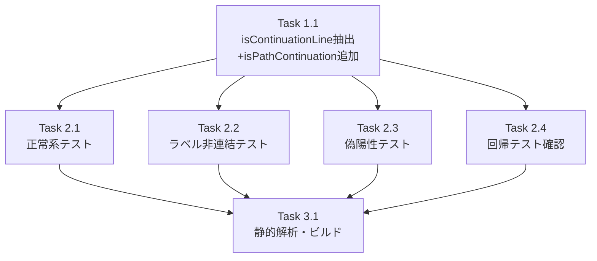

# 作業計画書: Issue #181

## Issue: fix: 複数行オプションを含むmultiple choiceプロンプトが検出されない
**Issue番号**: #181
**サイズ**: S
**優先度**: High
**依存Issue**: なし

---

## 詳細タスク分解

### Phase 1: 実装タスク

- [ ] **Task 1.1**: `isContinuationLine()` 関数の抽出と `isPathContinuation` 条件追加
  - 成果物: `src/lib/prompt-detector.ts`
  - 依存: なし
  - 内容:
    1. 既存の継続行判定条件（`hasLeadingSpaces`, `isShortFragment`）を独立関数 `isContinuationLine(rawLine, line)` として抽出（SF-002）
    2. `isPathContinuation` 条件を追加: `/^[\/~]/.test(line)` と `line.length >= 2 && /^[a-zA-Z0-9_-]+$/.test(line)`（SF-001）
    3. `detectMultipleChoicePrompt()` 内の元のコードを `isContinuationLine()` 呼び出しに置換
    4. JSDocコメントを付与（呼び出しコンテキスト、パラメータ定義含む）（S2-002, S2-005）

### Phase 2: テストタスク

- [ ] **Task 2.1**: 正常系テスト追加（複数行折り返しオプション検出）
  - 成果物: `tests/unit/prompt-detector.test.ts`
  - 依存: Task 1.1（TDDのためテストを先に書くが、実装後にGreenを確認）
  - 内容:
    1. パスを含むオプションの折り返し検出テスト（設計書6-3-1）
    2. 3オプション検出、ラベル正確性、isDefault確認

- [ ] **Task 2.2**: ラベル非連結検証テスト追加
  - 成果物: `tests/unit/prompt-detector.test.ts`
  - 依存: Task 1.1
  - 内容:
    1. 継続行テキストがオプションラベルに連結されないことの検証（設計書6-3-3）

- [ ] **Task 2.3**: 偽陽性テスト追加
  - 成果物: `tests/unit/prompt-detector.test.ts`
  - 依存: Task 1.1
  - 内容:
    1. パス行を含むyes/noプロンプトが正しくyes/noとして検出されること（設計書6-3-2）
    2. 英単語のみの行がmultiple choiceとして誤検出されないこと（設計書6-3-4: C-003）
    3. 1文字行のisShortFragment保護確認
    4. SF-001効果検証テスト（5文字以上の英数字行が継続行としてスキップされること）（S2-003）

- [ ] **Task 2.4**: 回帰テスト確認
  - 成果物: なし（既存テスト実行のみ）
  - 依存: Task 1.1
  - 内容:
    1. 既存の全テスト（`npm run test:unit`）が引き続きパスすること
    2. 既存のyes/noプロンプト検出が退行しないこと
    3. 既存のmultiple choiceプロンプト検出が退行しないこと

### Phase 3: 品質チェック

- [ ] **Task 3.1**: 静的解析・ビルド確認
  - 成果物: なし（コマンド実行のみ）
  - 依存: Task 1.1, Task 2.1-2.4
  - 内容:
    1. `npx tsc --noEmit` パス
    2. `npm run lint` パス
    3. `npm run build` パス

---

## タスク依存関係



> **Note**: TDDアプローチに従い、テスト（Task 2.x）を先に書き、実装（Task 1.1）でGreenにする。ただし依存関係は実装→テストの順で表記（テストのGreen確認が実装に依存するため）。

---

## TDD実装順序

```
1. テスト追加（Red）
   - Task 2.1: 正常系テスト → FAIL確認
   - Task 2.2: ラベル非連結検証テスト → FAIL確認
   - Task 2.3: 偽陽性テスト → 一部PASSの可能性あり

2. 実装修正（Green）
   - Task 1.1: isContinuationLine()抽出 + isPathContinuation追加

3. 全テスト実行
   - Task 2.4: 回帰テスト確認（全テストPASS）

4. 品質チェック
   - Task 3.1: 静的解析・ビルド確認
```

---

## 品質チェック項目

| チェック項目 | コマンド | 基準 |
|-------------|----------|------|
| ESLint | `npm run lint` | エラー0件 |
| TypeScript | `npx tsc --noEmit` | 型エラー0件 |
| Unit Test | `npm run test:unit` | 全テストパス |
| Build | `npm run build` | 成功 |

---

## 成果物チェックリスト

### コード
- [ ] `src/lib/prompt-detector.ts` - `isContinuationLine()` 関数抽出 + `isPathContinuation` 条件追加

### テスト
- [ ] `tests/unit/prompt-detector.test.ts` - 正常系テスト（複数行折り返し検出）
- [ ] `tests/unit/prompt-detector.test.ts` - ラベル非連結検証テスト
- [ ] `tests/unit/prompt-detector.test.ts` - 偽陽性テスト（yes/no交差影響、英単語境界値、SF-001効果検証）

### ドキュメント
- 不要（設計方針書は更新済み）

---

## Definition of Done

Issue完了条件：

- [ ] すべてのタスク（Task 1.1 ~ 3.1）が完了
- [ ] 複数行折り返しオプションを含むmultiple choiceプロンプトが正しく検出される
- [ ] 既存のプロンプト検出（yes/no、標準multiple choice）が退行しない
- [ ] `isContinuationLine()` が独立関数として抽出されている（SF-002）
- [ ] `isPathContinuation` に `line.length >= 2` の最小長チェックが含まれている（SF-001）
- [ ] 継続行テキストがオプションラベルに連結されないことがテストで検証されている
- [ ] 英単語行の境界値テストが追加されている（C-003）
- [ ] CIチェック全パス（lint, type-check, test, build）

---

## 次のアクション

作業計画承認後：
1. **TDD自動開発**: `/pm-auto-dev` でTDDサイクルに従い実装
2. **進捗報告**: `/progress-report` で完了報告
3. **PR作成**: `/create-pr` で自動作成

---

*Generated by /work-plan command (2026-02-07)*
