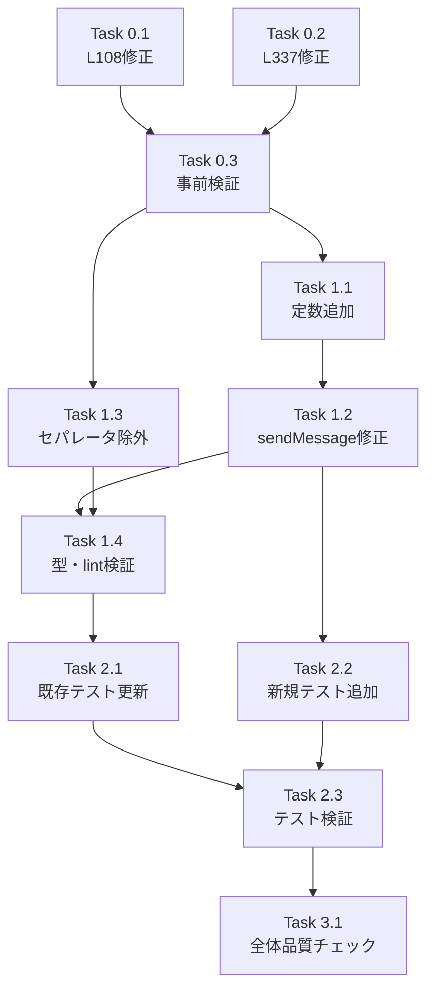

# Issue #187: 作業計画

## Issue: fix: セッション初回メッセージが送信されないケースが多発する
**Issue番号**: #187
**サイズ**: M
**優先度**: High
**依存Issue**: なし（#152は完了済み）
**ブランチ**: `feature/187-worktree`（既存）

---

## 詳細タスク分解

### Phase 0: 事前対応（既存テスト不整合修正）

- [ ] **Task 0.1**: waitForPrompt() capturePane引数修正
  - 成果物: `tests/unit/lib/claude-session.test.ts` L108修正
  - 内容: `{ startLine: -10 }` → `{ startLine: -50 }` に修正
  - 依存: なし

- [ ] **Task 0.2**: sendMessageToClaude タイムアウトテスト修正
  - 成果物: `tests/unit/lib/claude-session.test.ts` L337-346修正
  - 内容: テストを一時的にコメントアウトまたは修正（P1-2/P1-3で本格対応されるため、仮修正として進める）
  - 依存: なし

- [ ] **Task 0.3**: 事前対応の検証
  - コマンド: `npm run test:unit -- tests/unit/lib/claude-session.test.ts`
  - 基準: 全テストパス
  - 依存: Task 0.1, 0.2

### Phase 1: P0実装（安定化待機追加）

- [ ] **Task 1.1**: CLAUDE_SEND_PROMPT_WAIT_TIMEOUT定数追加
  - 成果物: `src/lib/claude-session.ts`
  - 内容: `export const CLAUDE_SEND_PROMPT_WAIT_TIMEOUT = 10000;` をCLAUDE_PROMPT_WAIT_TIMEOUT直後に追加。JSDocにsendMessageToClaude専用であることを明記
  - 依存: なし

- [ ] **Task 1.2**: sendMessageToClaude() 修正
  - 成果物: `src/lib/claude-session.ts`
  - 内容:
    - try-catch削除 → waitForPromptのエラーをそのまま伝播（P1-2）
    - ハードコード10000ms → CLAUDE_SEND_PROMPT_WAIT_TIMEOUT使用（P1-3）
    - if文の外側にCLAUDE_POST_PROMPT_DELAY安定化待機追加（P0）
  - 依存: Task 1.1

- [ ] **Task 1.3**: startClaudeSession() セパレータパターン除外
  - 成果物: `src/lib/claude-session.ts`
  - 内容:
    - L325: `|| CLAUDE_SEPARATOR_PATTERN.test(cleanOutput)` を削除（P1-1）
    - `CLAUDE_SEPARATOR_PATTERN`のインポートを削除
  - 依存: なし

- [ ] **Task 1.4**: Phase 1の検証
  - コマンド: `npx tsc --noEmit && npm run lint`
  - 基準: 型エラー0件、ESLintエラー0件
  - 依存: Task 1.1, 1.2, 1.3

### Phase 2: テスト更新・追加

- [ ] **Task 2.1**: 既存テスト更新
  - 成果物: `tests/unit/lib/claude-session.test.ts`
  - 内容:
    - L232-246: セパレータのみではタイムアウトするテストに変更（`toThrow('Claude initialization timeout')` 部分一致）
    - L337-346: CLAUDE_SEND_PROMPT_WAIT_TIMEOUTを使用、rejects.toThrow、sendKeys未呼び出し検証
    - CLAUDE_SEND_PROMPT_WAIT_TIMEOUTのインポート追加
  - 依存: Task 1.2, 1.3

- [ ] **Task 2.2**: P0新規テスト追加
  - 成果物: `tests/unit/lib/claude-session.test.ts`
  - 内容:
    - Path A（即検出）: 安定化待機中にsendKeysが呼ばれないことを検証
    - Path B（waitForPrompt経由）: ポーリング後の安定化待機を検証
    - CLAUDE_SEND_PROMPT_WAIT_TIMEOUT定数エクスポートテスト
  - 依存: Task 1.2

- [ ] **Task 2.3**: テスト実行・検証
  - コマンド: `npm run test:unit -- tests/unit/lib/claude-session.test.ts`
  - 基準: 全テストパス
  - 依存: Task 2.1, 2.2

### Phase 3: 品質チェック

- [ ] **Task 3.1**: 全体品質チェック
  - コマンド: `npx tsc --noEmit && npm run lint && npm run test:unit`
  - 基準: 全パス
  - 依存: Task 2.3

---

## タスク依存関係

---

## 品質チェック項目

| チェック項目 | コマンド | 基準 |
|-------------|----------|------|
| TypeScript | `npx tsc --noEmit` | 型エラー0件 |
| ESLint | `npm run lint` | エラー0件 |
| Unit Test | `npm run test:unit` | 全テストパス |
| Build | `npm run build` | 成功 |

---

## 成果物チェックリスト

### コード変更
- [ ] `src/lib/claude-session.ts` - CLAUDE_SEND_PROMPT_WAIT_TIMEOUT定数追加
- [ ] `src/lib/claude-session.ts` - sendMessageToClaude()安定化待機・エラースロー・定数使用
- [ ] `src/lib/claude-session.ts` - startClaudeSession()セパレータパターン除外
- [ ] `src/lib/claude-session.ts` - CLAUDE_SEPARATOR_PATTERNインポート削除

### テスト変更
- [ ] `tests/unit/lib/claude-session.test.ts` - L108 capturePane引数修正
- [ ] `tests/unit/lib/claude-session.test.ts` - L232-246 セパレータテスト更新
- [ ] `tests/unit/lib/claude-session.test.ts` - L337-346 タイムアウトテスト更新
- [ ] `tests/unit/lib/claude-session.test.ts` - P0安定化待機テスト追加（Path A, Path B）
- [ ] `tests/unit/lib/claude-session.test.ts` - CLAUDE_SEND_PROMPT_WAIT_TIMEOUTエクスポートテスト

---

## スコープ外（P2は本計画から除外）

以下のP2項目は本作業計画のスコープ外とし、必要に応じて別Issueで対応:

- P2-1: Ctrl+U入力クリア + SpecialKey型拡張
- P2-2: stripAnsi DEC Private Mode対応
- S4-F-1: getSessionName()バリデーション追加
- S4-F-7: stopClaudeSession() sendSpecialKey統一

---

## Definition of Done

Issue完了条件:
- [x] 設計方針書が4段階レビュー済み
- [ ] P0（安定化待機追加）実装完了
- [ ] P1-1（セパレータ除外）実装完了
- [ ] P1-2（エラースロー）実装完了
- [ ] P1-3（定数統一）実装完了
- [ ] 既存テスト不整合修正完了
- [ ] 新規テスト追加完了
- [ ] TypeScript型チェックパス
- [ ] ESLintパス
- [ ] 全ユニットテストパス

---

## 次のアクション

作業計画承認後:
1. `/pm-auto-dev 187` でTDD自動開発を開始
2. 完了後 `/create-pr` でPR作成
