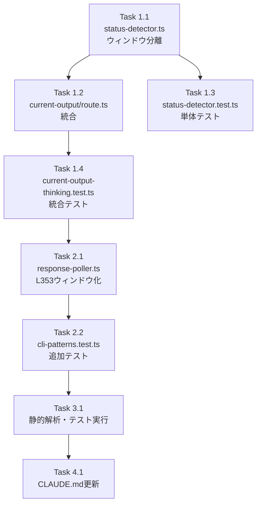

# Issue #188 作業計画

## Issue概要

**Issue番号**: #188
**タイトル**: fix: 応答完了後もスピナーが表示され続ける（thinkingインジケータの誤検出）
**サイズ**: M
**優先度**: High
**ラベル**: bug
**依存Issue**: なし

### 問題の概要
Claude CLIの応答が完了し `>` プロンプトが表示されているにもかかわらず、サイドバーのステータスがスピナー（`running`）のまま更新されない。

### 根本原因
1. **P0**: `current-output/route.ts`がthinking検出を非空行15行ウィンドウで実行し、完了済みのthinkingサマリー行を誤検出。さらにthinking=trueでプロンプト検出を無条件スキップ
2. **P1**: thinking検出のウィンドウサイズ・方式が6箇所で不統一

### 修正方針
`current-output/route.ts`のthinking/prompt優先順位を`status-detector.ts`と統一し、thinking検出ウィンドウを5行に縮小する。

---

## 詳細タスク分解

### Phase 1: P0修正（必須）

#### Task 1.1: status-detector.ts のthinking検出ウィンドウ分離
**成果物**: `src/lib/status-detector.ts`
**依存**: なし
**作業内容**:
- [ ] `STATUS_THINKING_LINE_COUNT = 5` 定数を追加（SF-002: `auto-yes-manager.ts`の`THINKING_CHECK_LINE_COUNT`との名前衝突回避）
- [ ] `detectSessionStatus()`内でthinking検出用のウィンドウを分離
  - `thinkingLines = lines.slice(-STATUS_THINKING_LINE_COUNT)`を追加
  - `detectThinking(cliToolId, thinkingLines)`に変更
- [ ] JSDocコメントにSF-002の設計根拠を記載

**設計方針書参照**: Section 3.1 DR-003, Section 4.1.2

#### Task 1.2: current-output/route.ts のdetectSessionStatus()統合
**成果物**: `src/app/api/worktrees/[id]/current-output/route.ts`
**依存**: Task 1.1
**作業内容**:
- [ ] インラインのthinking/prompt判定ロジックを削除
- [ ] `detectSessionStatus(output, cliToolId)`呼び出しに変更
- [ ] `thinking`を`statusResult.status === 'running' && statusResult.reason === 'thinking_indicator'`から導出
- [ ] `promptData`取得のために`detectPrompt()`を個別実行（SF-001: 制御されたDRY違反）
- [ ] `isPromptWaiting`を`statusResult.hasActivePrompt`から取得（SF-004: ソースオブトゥルース）
- [ ] importを更新（`detectThinkingState`削除、`detectSessionStatus`追加）
- [ ] SF-001トレードオフコメントを追加

**設計方針書参照**: Section 3.1 DR-001/DR-002, Section 4.1.1

#### Task 1.3: 単体テスト作成（status-detector.ts）
**成果物**: `tests/unit/lib/status-detector.test.ts`
**依存**: Task 1.1
**作業内容**:
- [ ] thinking+prompt共存時にプロンプト優先を検証
- [ ] thinking+prompt共存時（waiting）を検証
- [ ] アクティブthinking（末尾5行内）を検証
- [ ] thinkingサマリーが5行外（誤検出防止）を検証
- [ ] `STATUS_THINKING_LINE_COUNT`境界テストを実装
- [ ] 空行を多く含む出力でのthinking/prompt検出テスト（C-002対応）

**設計方針書参照**: Section 6.1

#### Task 1.4: 統合テスト作成（current-output API）
**成果物**: `tests/integration/current-output-thinking.test.ts`
**依存**: Task 1.2
**作業内容**:
- [ ] 応答完了後のスピナー解除を検証
- [ ] thinking中のスピナー表示を検証
- [ ] Issue #161回帰テスト（thinking中にnumbered listが誤検出されない）
- [ ] thinking遷移のJSON応答フィールド検証（SF-001 S3対応）
- [ ] `isPromptWaiting`ソースオブトゥルース検証（SF-004 S3対応）

**設計方針書参照**: Section 6.1

---

### Phase 2: P1修正

#### Task 2.1: response-poller.ts L353のウィンドウ化
**成果物**: `src/lib/response-poller.ts`
**依存**: Phase 1完了
**作業内容**:
- [ ] L353の全文thinkingチェックを末尾5行チェックに変更
- [ ] `responseTailLines = response.split('\\n').slice(-5).join('\\n')`を使用
- [ ] `STATUS_THINKING_LINE_COUNT`との相互参照コメント追加（SF-003対応）

**設計方針書参照**: Section 3.1 DR-004, Section 4.2.1

#### Task 2.2: cli-patterns.test.ts への追加テスト
**成果物**: `src/lib/__tests__/cli-patterns.test.ts`
**依存**: なし
**作業内容**:
- [ ] 完了済みthinkingサマリーのマッチテスト
- [ ] `(esc to interrupt)`のマッチテスト
- [ ] アクティブthinkingのマッチテスト

**設計方針書参照**: Section 6.1

---

### Phase 3: コード品質チェック

#### Task 3.1: 静的解析とテスト実行
**成果物**: なし（検証のみ）
**依存**: Phase 1, 2完了
**作業内容**:
- [ ] `npm run lint` → エラー0件
- [ ] `npx tsc --noEmit` → 型エラー0件
- [ ] `npm run test:unit` → 全テストパス
- [ ] `npm run test:integration` → 全テストパス
- [ ] `npm run build` → ビルド成功

**設計方針書参照**: Section 15.10

---

### Phase 4: ドキュメント更新

#### Task 4.1: CLAUDE.md 更新
**成果物**: `CLAUDE.md`
**依存**: Phase 1-3完了
**作業内容**:
- [ ] Issue #188セクションを追加
- [ ] Issue #180, #191セクションとの関連を記載
- [ ] 主要な変更内容（thinking検出ウィンドウ分離、current-output統合）を記載

**設計方針書参照**: Section 15.4

---

## タスク依存関係

---

## 品質チェック項目

| チェック項目 | コマンド | 基準 |
|-------------|----------|------|
| ESLint | `npm run lint` | エラー0件 |
| TypeScript | `npx tsc --noEmit` | 型エラー0件 |
| Unit Test | `npm run test:unit` | 全テストパス |
| Integration Test | `npm run test:integration` | 全テストパス |
| Build | `npm run build` | 成功 |

---

## 成果物チェックリスト

### コード修正
- [ ] `src/lib/status-detector.ts` - thinking検出ウィンドウ分離
- [ ] `src/app/api/worktrees/[id]/current-output/route.ts` - detectSessionStatus()統合
- [ ] `src/lib/response-poller.ts` - L353ウィンドウ化

### テスト
- [ ] `tests/unit/lib/status-detector.test.ts` - 新規作成
- [ ] `tests/integration/current-output-thinking.test.ts` - 新規作成
- [ ] `src/lib/__tests__/cli-patterns.test.ts` - 追加テスト

### ドキュメント
- [ ] `CLAUDE.md` - Issue #188セクション追加

---

## Definition of Done

### 必須条件
- [ ] すべてのP0タスクが完了
- [ ] すべてのP1タスクが完了
- [ ] 単体テストカバレッジ80%以上
- [ ] CIチェック全パス（lint, type-check, test, build）
- [ ] 受け入れ条件5項目すべて満たす:
  - [ ] 応答完了時に5秒以内にステータスが`ready`に変わる
  - [ ] thinking中は`running`（スピナー）表示
  - [ ] 完了済みthinkingサマリーがあってもプロンプト検出で`ready`に遷移
  - [ ] Issue #161のAuto-Yes誤検出防止が維持される
  - [ ] Issue #191のウィンドウイング修正との整合性が保たれる

### 推奨（Phase 4完了後）
- [ ] CLAUDE.md更新完了
- [ ] コードレビュー承認（PR作成後）

---

## 実装時の注意事項

### セキュリティ対策維持
以下の既存防御機構を維持すること（設計方針書 Section 5.4参照）:
1. Issue #161 Layer 1: thinking中のprompt検出スキップ
2. Issue #161 Layer 2: 2パス❯検出方式
3. Issue #161 Layer 3: 連番検証
4. Issue #193 Layer 5 SEC-001: `questionEndIndex`ガード
5. Issue #193 SEC-002: `stripAnsi()`適用
6. Issue #193 SEC-003: 固定エラーメッセージ
7. Issue #191 SF-001: THINKING_CHECK_LINE_COUNT=50整合性
8. Issue #138: DoS防止（MAX_CONCURRENT_POLLERS、worktreeId検証）

### トレードオフの明示
以下のトレードオフを実装時にコメントで明示すること:
- **SF-001**: `detectPrompt()`の二重実行（SRP/ISP維持のため許容）
- **SF-002**: `STATUS_THINKING_LINE_COUNT`と`THINKING_CHECK_LINE_COUNT`の名前区別（目的別）

---

## フォローアップIssue推奨事項

実装完了後、以下のIssueを作成することを推奨（設計方針書 Section 4.3.2, Section 14.16参照）:

1. **`response-poller.ts` L547-554のウィンドウ化**
   - `checkForResponse()`のthinkingパターンチェックも同じ誤検出脆弱性あり
   - 優先度: P2（pending promptsマーク用途であり直接的な影響は小）

2. **`validateSessionName()`エラーメッセージの情報漏洩**
   - エラーメッセージにユーザー入力を含む（Issue #193 SEC-003パターン適用推奨）
   - 優先度: P3（既存問題、本Issue範囲外）

3. **API route 404エラーメッセージの情報漏洩**
   - `params.id`を404エラーに含む（複数箇所で共通パターン）
   - 優先度: P3（既存問題、本Issue範囲外）

---

## ロールバック戦略

修正後に問題が発生した場合の手順（設計方針書 Section 11参照）:

1. **即座のロールバック**: PRをrevert
2. **原因特定**: どの変更が問題を引き起こしたか特定
3. **段階的ロールバック**:
   - P1修正（response-poller.ts）のみロールバック → P0修正は維持
   - P0の特定タスク（1.1 or 1.2）のみロールバック
4. **リリースノート記載**: ロールバック理由と影響範囲を明記

---

## 次のアクション

作業計画承認後：

1. **ブランチ作成**: `feature/188-thinking-indicator-false-detection`
2. **Phase 1実装**: Task 1.1 → 1.2 → 1.3 → 1.4 の順で実装
3. **Phase 2実装**: Task 2.1 → 2.2 の順で実装
4. **Phase 3検証**: 静的解析・テスト実行
5. **Phase 4ドキュメント**: CLAUDE.md更新
6. **コミット作成**: フェーズごとにコミット
7. **PR作成**: `/create-pr`で自動作成

---

## 参照ドキュメント

- **設計方針書**: `dev-reports/design/issue-188-thinking-indicator-false-detection-design-policy.md`
- **Issueレビューサマリー**: `dev-reports/issue/188/issue-review/summary-report.md`
- **設計レビューサマリー**: `dev-reports/issue/188/multi-stage-design-review/summary-report.md`
- **関連Issue**:
  - Issue #180: ステータス表示の不整合修正（`detectSessionStatus()`統合の前例）
  - Issue #161: Auto-Yes誤検出修正（thinking優先ロジックの経緯）
  - Issue #191: Auto-Yes detectThinking()ウィンドウイング修正
  - Issue #193: Claude Code複数選択肢プロンプト検出

---

*Generated by work-plan skill for Issue #188 (2026-02-09)*
