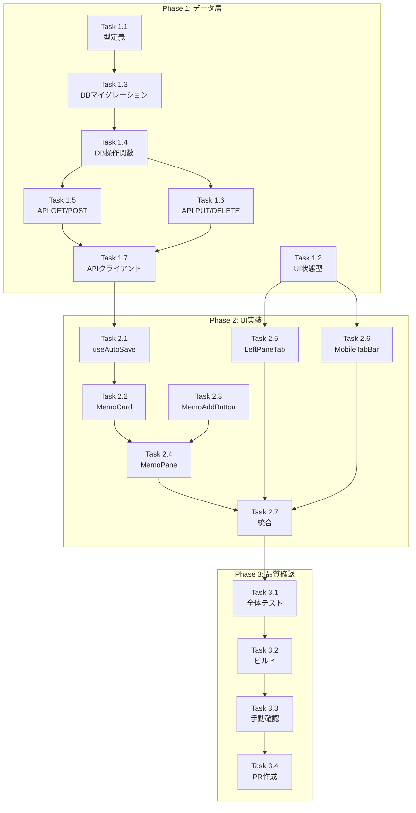

# 作業計画書: Issue #19 メモ機能改善

**作成日**: 2026-01-10
**更新日**: 2026-01-10
**ステータス**: Ready for Implementation

---

## Issue概要

| 項目 | 内容 |
|------|------|
| **Issue番号** | #19 |
| **タイトル** | メモ機能改善 |
| **サイズ** | M (Medium) |
| **優先度** | Medium |
| **依存Issue** | なし |
| **ブランチ** | `feature/19-memo-improvement` |
| **設計承認** | Approved（2026-01-10） |

### 要件サマリ
1. **タブからのアクセス性向上**: Infoモーダル内でなく、タブから直接メモを編集可能にする
2. **複数メモ対応**: 最大5つのメモをサポート

### 関連ドキュメント
- 設計方針書: `dev-reports/design/issue-19-memo-improvement-design-policy.md`
- アーキテクチャレビュー: `dev-reports/review/2026-01-10-issue19-architecture-review.md`

---

## 事前対応完了項目

以下はレビュー指摘への対応として既に完了済み:

| 項目 | 対応内容 | 完了日 |
|------|---------|--------|
| Logsタブ削除 | MobileTabBarからLogsタブを削除（6タブ→4タブ） | 2026-01-10 |
| 型定義更新 | MobileActivePaneから'logs'削除 | 2026-01-10 |
| コンポーネント修正 | WorktreeDetailRefactoredからlogsケース削除 | 2026-01-10 |
| テスト更新 | MobileTabBar.test.tsx更新 | 2026-01-10 |

---

## 詳細タスク分解

### Phase 1: データ層実装（TDD）

#### Task 1.1: WorktreeMemo 型定義
| 項目 | 内容 |
|------|------|
| **成果物** | `src/types/models.ts` |
| **依存** | なし |
| **TDD** | 型定義のため不要 |

```typescript
export interface WorktreeMemo {
  id: string;
  worktreeId: string;
  title: string;
  content: string;
  position: number;  // 0-4
  createdAt: Date;
  updatedAt: Date;
}
```

#### Task 1.2: UI状態型の拡張
| 項目 | 内容 |
|------|------|
| **成果物** | `src/types/ui-state.ts` |
| **依存** | なし |
| **TDD** | 型定義のため不要 |

```typescript
export type MobileActivePane = 'history' | 'terminal' | 'files' | 'memo' | 'info';
export type LeftPaneTab = 'history' | 'files' | 'memo';
```

#### Task 1.3: DBマイグレーション Version 10
| 項目 | 内容 |
|------|------|
| **成果物** | `src/lib/db-migrations.ts` |
| **テスト** | `src/lib/__tests__/db-migrations-v10.test.ts` |
| **依存** | Task 1.1 |
| **TDD** | Red → Green → Refactor |

**テストケース**:
- worktree_memos テーブルが作成される
- 既存memoデータがマイグレーションされる
- インデックスが作成される
- UNIQUE制約が機能する

#### Task 1.4: DB操作関数
| 項目 | 内容 |
|------|------|
| **成果物** | `src/lib/db.ts` |
| **テスト** | `src/lib/__tests__/db-memo.test.ts` |
| **依存** | Task 1.3 |
| **TDD** | Red → Green → Refactor |

**実装する関数**:
- `getMemosByWorktreeId(worktreeId: string): WorktreeMemo[]`
- `createMemo(worktreeId: string, data: CreateMemoInput): WorktreeMemo`
- `updateMemo(memoId: string, data: UpdateMemoInput): WorktreeMemo`
- `deleteMemo(memoId: string): void`
- `reorderMemos(worktreeId: string, memoIds: string[]): void`

#### Task 1.5: API エンドポイント - GET/POST
| 項目 | 内容 |
|------|------|
| **成果物** | `src/app/api/worktrees/[id]/memos/route.ts` |
| **テスト** | `tests/integration/api/memos.test.ts` |
| **依存** | Task 1.4 |
| **TDD** | Red → Green → Refactor |

**エンドポイント**:
- `GET /api/worktrees/:id/memos` - メモ一覧取得
- `POST /api/worktrees/:id/memos` - メモ新規作成

**テストケース**:
- 正常系: メモ一覧取得成功
- 正常系: メモ作成成功
- 異常系: 存在しないworktreeId
- 異常系: メモ数上限（5つ）超過
- 異常系: バリデーションエラー

#### Task 1.6: API エンドポイント - PUT/DELETE
| 項目 | 内容 |
|------|------|
| **成果物** | `src/app/api/worktrees/[id]/memos/[memoId]/route.ts` |
| **テスト** | `tests/integration/api/memos.test.ts` (追加) |
| **依存** | Task 1.4 |
| **TDD** | Red → Green → Refactor |

**エンドポイント**:
- `PUT /api/worktrees/:id/memos/:memoId` - メモ更新
- `DELETE /api/worktrees/:id/memos/:memoId` - メモ削除

#### Task 1.7: API クライアント拡張
| 項目 | 内容 |
|------|------|
| **成果物** | `src/lib/api-client.ts` |
| **依存** | Task 1.5, 1.6 |
| **TDD** | 統合テストでカバー |

```typescript
export const memoApi = {
  getAll(worktreeId: string): Promise<WorktreeMemo[]>,
  create(worktreeId: string, data: CreateMemoInput): Promise<WorktreeMemo>,
  update(memoId: string, data: UpdateMemoInput): Promise<WorktreeMemo>,
  delete(memoId: string): Promise<void>,
};
```

---

### Phase 2: UI実装（TDD）

#### Task 2.1: useAutoSave フック
| 項目 | 内容 |
|------|------|
| **成果物** | `src/hooks/useAutoSave.ts` |
| **テスト** | `tests/unit/hooks/useAutoSave.test.ts` |
| **依存** | Task 1.7 |
| **TDD** | Red → Green → Refactor |

**機能**:
- 300ms debounce での自動保存
- onBlur 時の即時保存
- 保存中状態の管理
- エラーハンドリング

**テストケース**:
- 入力後300msでAPIが呼ばれる
- 300ms以内の連続入力はdebounceされる
- onBlurで即時保存される
- エラー時はリトライされる

#### Task 2.2: MemoCard コンポーネント
| 項目 | 内容 |
|------|------|
| **成果物** | `src/components/worktree/MemoCard.tsx` |
| **テスト** | `tests/unit/components/worktree/MemoCard.test.tsx` |
| **依存** | Task 2.1 |
| **TDD** | Red → Green → Refactor |

**機能**:
- タイトル表示・編集
- コンテンツ表示・編集（textarea）
- 削除ボタン
- 保存中インジケーター

**テストケース**:
- メモ内容が表示される
- 編集するとonChangeが呼ばれる
- 削除ボタンでonDeleteが呼ばれる
- 保存中は視覚的フィードバックがある

#### Task 2.3: MemoAddButton コンポーネント
| 項目 | 内容 |
|------|------|
| **成果物** | `src/components/worktree/MemoAddButton.tsx` |
| **テスト** | `tests/unit/components/worktree/MemoAddButton.test.tsx` |
| **依存** | なし |
| **TDD** | Red → Green → Refactor |

**機能**:
- 追加ボタン表示
- 残りメモ数表示（「残り3つ」など）
- 上限時は非活性

**テストケース**:
- ボタンが表示される
- クリックでonAddが呼ばれる
- 残り数が正しく表示される
- 5つの場合は非活性になる

#### Task 2.4: MemoPane コンポーネント
| 項目 | 内容 |
|------|------|
| **成果物** | `src/components/worktree/MemoPane.tsx` |
| **テスト** | `tests/unit/components/worktree/MemoPane.test.tsx` |
| **依存** | Task 2.2, 2.3 |
| **TDD** | Red → Green → Refactor |

**機能**:
- メモ一覧のfetch・表示
- メモの追加・編集・削除
- ローディング状態
- エラーハンドリング

**テストケース**:
- 初期ロード時にAPIが呼ばれる
- メモ一覧が表示される
- 追加ボタンで新規メモが作成される
- 編集内容が保存される
- 削除でメモが消える
- エラー時はエラーメッセージが表示される

#### Task 2.5: LeftPaneTabSwitcher 拡張
| 項目 | 内容 |
|------|------|
| **成果物** | `src/components/worktree/LeftPaneTabSwitcher.tsx` |
| **テスト** | `tests/unit/components/worktree/LeftPaneTabSwitcher.test.tsx` (更新) |
| **依存** | Task 1.2 |
| **TDD** | テスト更新 → 実装 |

**変更内容**:
- TABS配列にMemoタブ追加
- アイコン追加

#### Task 2.6: MobileTabBar 拡張
| 項目 | 内容 |
|------|------|
| **成果物** | `src/components/mobile/MobileTabBar.tsx` |
| **テスト** | `tests/unit/components/mobile/MobileTabBar.test.tsx` (更新) |
| **依存** | Task 1.2 |
| **TDD** | テスト更新 → 実装 |

**変更内容**:
- TABSにMemoタブ追加（Logsは削除済み）
- MobileTab型にmemo追加
- 現在: Terminal, History, Files, Info
- 変更後: Terminal, History, Files, Memo, Info

#### Task 2.7: WorktreeDetailRefactored 統合
| 項目 | 内容 |
|------|------|
| **成果物** | `src/components/worktree/WorktreeDetailRefactored.tsx` |
| **テスト** | `tests/unit/components/WorktreeDetailRefactored.test.tsx` (更新) |
| **依存** | Task 2.4, 2.5, 2.6 |
| **TDD** | テスト更新 → 実装 |

**変更内容**:
- Desktop: LeftPaneContent にMemoケース追加
- Mobile: MobileContent にMemoケース追加

---

### Phase 3: 品質確認・PR

#### Task 3.1: 全体テスト実行
| 項目 | 内容 |
|------|------|
| **コマンド** | `npm run lint && npx tsc --noEmit && npm run test:unit` |
| **依存** | Phase 1-2 全タスク |

#### Task 3.2: ビルド確認
| 項目 | 内容 |
|------|------|
| **コマンド** | `npm run build` |
| **依存** | Task 3.1 |

#### Task 3.3: 手動動作確認
| 項目 | 内容 |
|------|------|
| **確認項目** | 下記チェックリスト参照 |
| **依存** | Task 3.2 |

#### Task 3.4: PR作成
| 項目 | 内容 |
|------|------|
| **コマンド** | `/create-pr` |
| **依存** | Task 3.3 |

---

## タスク依存関係



---

## 品質チェック項目

| チェック項目 | コマンド | 基準 |
|-------------|----------|------|
| ESLint | `npm run lint` | エラー0件 |
| TypeScript | `npx tsc --noEmit` | 型エラー0件 |
| Unit Test | `npm run test:unit` | 全テストパス |
| Build | `npm run build` | 成功 |

---

## 成果物チェックリスト

### 新規ファイル
- [ ] `src/app/api/worktrees/[id]/memos/route.ts`
- [ ] `src/app/api/worktrees/[id]/memos/[memoId]/route.ts`
- [ ] `src/components/worktree/MemoPane.tsx`
- [ ] `src/components/worktree/MemoCard.tsx`
- [ ] `src/components/worktree/MemoAddButton.tsx`
- [ ] `src/hooks/useAutoSave.ts`
- [ ] `tests/unit/hooks/useAutoSave.test.ts`
- [ ] `tests/unit/components/worktree/MemoCard.test.tsx`
- [ ] `tests/unit/components/worktree/MemoAddButton.test.tsx`
- [ ] `tests/unit/components/worktree/MemoPane.test.tsx`
- [ ] `tests/integration/api/memos.test.ts`

### 変更ファイル
- [ ] `src/types/models.ts` - WorktreeMemo型追加
- [ ] `src/types/ui-state.ts` - LeftPaneTab, MobileActivePane に 'memo' 追加
- [ ] `src/lib/db-migrations.ts` - Version 10追加
- [ ] `src/lib/db.ts` - メモ操作関数追加
- [ ] `src/lib/api-client.ts` - memoApi追加
- [ ] `src/components/worktree/LeftPaneTabSwitcher.tsx` - Memoタブ追加
- [ ] `src/components/mobile/MobileTabBar.tsx` - Memoタブ追加
- [ ] `src/components/worktree/WorktreeDetailRefactored.tsx` - MemoPane統合

### 事前対応済み
- [x] `src/components/mobile/MobileTabBar.tsx` - Logsタブ削除
- [x] `src/types/ui-state.ts` - MobileActivePaneからlogs削除
- [x] `src/components/worktree/WorktreeDetailRefactored.tsx` - logsケース削除
- [x] `tests/unit/components/mobile/MobileTabBar.test.tsx` - テスト更新

---

## Definition of Done

Issue完了条件：
- [ ] すべてのタスクが完了
- [ ] 新規コンポーネントの単体テストカバレッジ80%以上
- [ ] CIチェック全パス（lint, type-check, test, build）
- [ ] 動作確認完了（下記チェックリスト）
- [ ] PR作成・レビュー承認

### 動作確認チェックリスト

#### Desktop
- [ ] History/Files/Memo タブが表示される
- [ ] Memoタブをクリックするとメモ一覧が表示される
- [ ] 「+ Add Memo」でメモを追加できる
- [ ] メモの内容を編集できる
- [ ] 編集内容が自動保存される（300ms debounce）
- [ ] メモを削除できる
- [ ] 最大5つまでメモを追加できる
- [ ] 5つの場合は追加ボタンが非活性になる

#### Mobile
- [ ] Terminal/History/Files/Memo/Info タブが表示される
- [ ] Memoタブをタップするとメモ一覧が表示される
- [ ] メモの追加・編集・削除ができる
- [ ] タッチ操作でスムーズに動作する

#### データマイグレーション
- [ ] 既存のmemoデータが新テーブルに移行されている
- [ ] 移行後もメモ内容が正しく表示される

---

## 実装順序（推奨）

### Day 1: データ層
1. Task 1.1: 型定義
2. Task 1.2: UI状態型
3. Task 1.3: DBマイグレーション + テスト
4. Task 1.4: DB操作関数 + テスト

### Day 2: API層
5. Task 1.5: API GET/POST + テスト
6. Task 1.6: API PUT/DELETE + テスト
7. Task 1.7: APIクライアント

### Day 3: UI層（前半）
8. Task 2.1: useAutoSave + テスト
9. Task 2.2: MemoCard + テスト
10. Task 2.3: MemoAddButton + テスト

### Day 4: UI層（後半）・統合
11. Task 2.4: MemoPane + テスト
12. Task 2.5: LeftPaneTabSwitcher
13. Task 2.6: MobileTabBar
14. Task 2.7: WorktreeDetailRefactored統合
15. Task 3.1〜3.4: 品質確認・PR

---

## 次のアクション

作業計画承認後：

1. **ブランチ作成**
   ```bash
   git checkout -b feature/19-memo-improvement
   ```

2. **TDD実装開始**
   ```bash
   /tdd-impl #19
   ```

3. **進捗報告**（必要に応じて）
   ```bash
   /progress-report #19
   ```

4. **PR作成**
   ```bash
   /create-pr
   ```

---

## レビュー指摘対応状況

| 指摘項目 | 対応状況 | 備考 |
|---------|---------|------|
| MobileTabBar タブ数 | 対応済み | Logsタブ削除 |
| MemoCardList 不要 | 設計書更新済み | MemoPane内で直接map |
| reorder API 詳細 | 設計書更新済み | 負値position方式 |
| オートセーブ詳細 | 設計書更新済み | 300ms debounce + onBlur |

---

**承認者**: _______________
**承認日**: _______________
