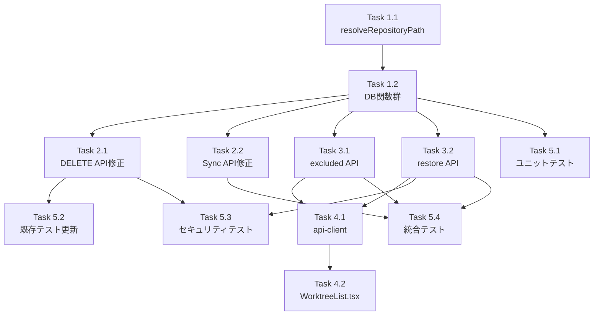

# Issue #190: 作業計画書

## Issue: トップ画面にて登録済みのリポジトリを削除してもsyncallで復活する
**Issue番号**: #190
**ラベル**: bug
**サイズ**: M
**優先度**: High
**依存Issue**: なし
**設計方針書**: `dev-reports/design/issue-190-repository-exclusion-on-sync-design-policy.md`

---

## 詳細タスク分解

### Phase 1: データアクセス層（db-repository.ts）

#### Task 1.1: パス正規化ヘルパー関数
- **成果物**: `src/lib/db-repository.ts` に `resolveRepositoryPath()` 追加
- **依存**: なし
- **詳細**: `path.resolve()` を集約するヘルパー関数。SF-001対応
- **テスト**: 相対パス→絶対パス変換、末尾スラッシュ正規化

#### Task 1.2: 除外関連DB関数群
- **成果物**: `src/lib/db-repository.ts` に以下を追加
  - `getExcludedRepositoryPaths()` - enabled=0のパスリスト取得
  - `getExcludedRepositories()` - enabled=0のリポジトリ詳細取得
  - `disableRepository()` - リポジトリ除外登録（既存レコード更新 or 新規登録）。MAX_DISABLED_REPOSITORIES=1000 上限チェック含む（SEC-SF-004）
  - `restoreRepository()` - リポジトリ復活（enabled=1更新）
  - `ensureEnvRepositoriesRegistered()` - 環境変数リポジトリ自動登録（冪等）
  - `filterExcludedPaths()` - 除外パスフィルタリング
- **依存**: Task 1.1
- **テスト**: 各関数のユニットテスト（冪等性、エッジケース含む）

### Phase 2: 既存API変更

#### Task 2.1: DELETE /api/repositories 修正
- **成果物**: `src/app/api/repositories/route.ts` 修正
- **依存**: Task 1.2
- **詳細**:
  - パストラバーサルバリデーション追加（null byte + isSystemDirectory()）（SEC-MF-001）
  - `disableRepository()` 呼び出しを `worktreeIds` チェック前に配置（SF-C01）
  - `db-repository.ts` と `system-directories.ts` からの import 追加
- **テスト**: 既存統合テスト更新（MF-I01）、セキュリティテスト追加

#### Task 2.2: POST /api/repositories/sync 修正
- **成果物**: `src/app/api/repositories/sync/route.ts` 修正
- **依存**: Task 1.2
- **詳細**:
  - `ensureEnvRepositoriesRegistered()` 呼び出し追加
  - `filterExcludedPaths()` による除外フィルタリング追加
  - `db-repository.ts` からの import 追加
- **テスト**: 除外→Sync Allシナリオの統合テスト

### Phase 3: 新規API

#### Task 3.1: GET /api/repositories/excluded
- **成果物**: `src/app/api/repositories/excluded/route.ts` 新規作成
- **依存**: Task 1.2
- **詳細**: 除外リポジトリ一覧取得。固定エラーメッセージ（SEC-SF-003）
- **テスト**: 統合テスト

#### Task 3.2: PUT /api/repositories/restore
- **成果物**: `src/app/api/repositories/restore/route.ts` 新規作成
- **依存**: Task 1.2
- **詳細**:
  - パストラバーサルバリデーション（SEC-MF-001）
  - `restoreRepository()` + `scanWorktrees()` + `syncWorktreesToDB()` 自動実行
  - 固定エラーメッセージ（SEC-SF-003）
  - エラーケース: 404（未登録）、200+warning（パス不存在）、500
- **テスト**: 正常系、エラー3ケースのテスト

### Phase 4: UIとAPIクライアント

#### Task 4.1: api-client.ts 拡張
- **成果物**: `src/lib/api-client.ts` 修正
- **依存**: Task 3.1, Task 3.2
- **詳細**: `repositoryApi` に `getExcluded()`, `restore()` メソッド追加

#### Task 4.2: WorktreeList.tsx 修正
- **成果物**: `src/components/worktree/WorktreeList.tsx` 修正
- **依存**: Task 4.1
- **詳細**:
  - 削除確認ダイアログの警告メッセージ更新（除外リスト方式のメッセージに変更）
  - `isInEnvVar()` 関数の廃止（C-C03）
  - 除外リポジトリ一覧セクション追加（折りたたみ形式、「再登録」ボタン）

### Phase 5: テスト

#### Task 5.1: ユニットテスト
- **成果物**: `tests/unit/lib/db-repository-exclusion.test.ts` 新規作成
- **依存**: Task 1.2
- **テストケース**:
  - `resolveRepositoryPath()` - 相対パス、末尾スラッシュ
  - `ensureEnvRepositoriesRegistered()` - 登録、冪等性
  - `filterExcludedPaths()` - enabled=0除外、enabled=1残存
  - `disableRepository()` - 既存更新、未登録新規、上限チェック
  - `getExcludedRepositoryPaths()` - パスリスト取得
  - `getExcludedRepositories()` - 詳細取得
  - `restoreRepository()` - 復活成功、存在しないパスでnull
  - enabled デフォルト値テスト（MF-C01）
  - パス整合性テスト（SF-I04）

#### Task 5.2: 既存テスト更新
- **成果物**: `tests/integration/api-repository-delete.test.ts` 修正
- **依存**: Task 2.1
- **テストケース**:
  - 404テストケースで `repositories` テーブルの `enabled=0` レコード残存を検証
  - `disableRepository()` 追加による副作用の検証

#### Task 5.3: セキュリティテスト
- **成果物**: テストファイルに追加
- **依存**: Task 2.1, Task 3.2
- **テストケース**:
  - null byte含むパスで400エラー（DELETE, restore）
  - システムディレクトリパスで400エラー（DELETE, restore）
  - 500エラーに内部情報が含まれないこと（restore, excluded）
  - MAX_DISABLED_REPOSITORIES上限超過テスト
  - resolveRepositoryPath()正規化の両側適用テスト

#### Task 5.4: 統合テスト
- **成果物**: `tests/integration/repository-exclusion.test.ts` 新規作成
- **依存**: Phase 2, Phase 3
- **テストケース**:
  - 除外→Sync All→復活しないフルフロー
  - 未Syncリポジトリの削除→Sync All→復活しない（SF-C01）
  - 除外リポジトリ一覧API
  - 復活API
  - CM_ROOT_DIR設定時の除外

---

## タスク依存関係

---

## 品質チェック項目

| チェック項目 | コマンド | 基準 |
|-------------|----------|------|
| ESLint | `npm run lint` | エラー0件 |
| TypeScript | `npx tsc --noEmit` | 型エラー0件 |
| Unit Test | `npm run test:unit` | 全テストパス |
| Build | `npm run build` | 成功 |

---

## 成果物チェックリスト

### コード
- [ ] `src/lib/db-repository.ts` - 7関数追加
- [ ] `src/app/api/repositories/route.ts` - DELETE修正
- [ ] `src/app/api/repositories/sync/route.ts` - Sync修正
- [ ] `src/app/api/repositories/excluded/route.ts` - 新規
- [ ] `src/app/api/repositories/restore/route.ts` - 新規
- [ ] `src/lib/api-client.ts` - 2メソッド追加
- [ ] `src/components/worktree/WorktreeList.tsx` - UI修正

### テスト
- [ ] `tests/unit/lib/db-repository-exclusion.test.ts` - 新規
- [ ] `tests/integration/api-repository-delete.test.ts` - 更新
- [ ] `tests/integration/repository-exclusion.test.ts` - 新規

---

## Definition of Done

- [ ] すべてのタスク（Phase 1-5）が完了
- [ ] CIチェック全パス（lint, type-check, test, build）
- [ ] UIで削除したリポジトリがSync Allで復活しないこと
- [ ] 除外リポジトリの復活機能が正常動作すること
- [ ] セキュリティ対策（パストラバーサル防御、固定エラーメッセージ）が実装されていること
- [ ] 既存テストが全てパスすること

---

## 実装順序（推奨）

TDD実装時の推奨順序:

1. **Task 1.1** → **Task 1.2**: データアクセス層を先に完成（Red-Green-Refactor）
2. **Task 2.1** → **Task 5.2**: DELETE API修正と既存テスト更新を同時に
3. **Task 2.2**: Sync API修正
4. **Task 3.1** → **Task 3.2**: 新規API作成
5. **Task 5.1** → **Task 5.3**: ユニットテスト・セキュリティテスト完成
6. **Task 4.1** → **Task 4.2**: UI最後
7. **Task 5.4**: 統合テストで全体を検証

---

## 次のアクション

1. `/pm-auto-dev 190` で自動開発フロー実行
2. `/create-pr` でPR作成
