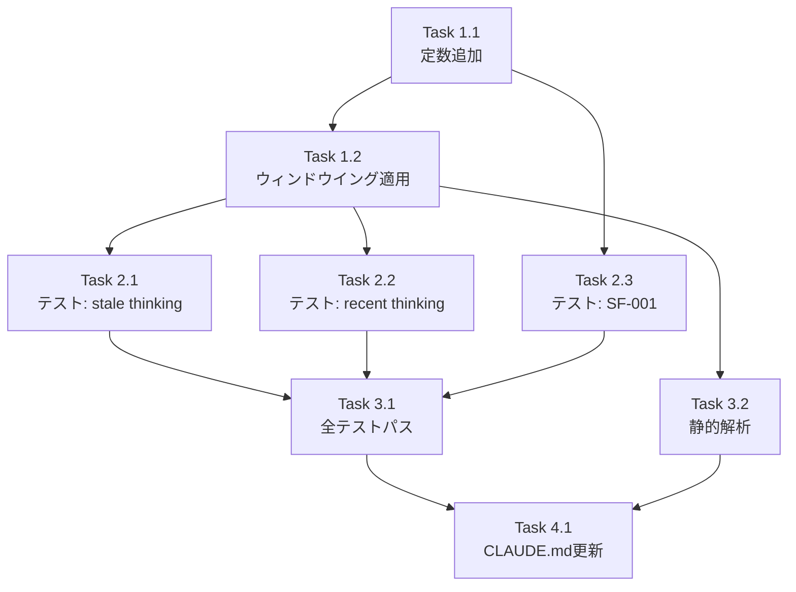

# Issue #191 作業計画

## Issue: fix: Auto-Yes が古いthinkingサマリー行によりプロンプト検出をスキップする
**Issue番号**: #191
**サイズ**: S
**優先度**: High
**ラベル**: bug
**依存Issue**: なし（Issue #161の防御を維持する必要あり）

## 詳細タスク分解

### Phase 1: コア実装

#### Task 1.1: THINKING_CHECK_LINE_COUNT 定数追加
- **成果物**: `src/lib/auto-yes-manager.ts`
- **依存**: なし
- **内容**:
  - `export const THINKING_CHECK_LINE_COUNT = 50;` を定数セクション（L53-68付近）に追加
  - SF-001対応のコメント（prompt-detector.ts L268への相互参照）を含める
  - SEC-C02対応の安全性根拠コメントを含める

#### Task 1.2: pollAutoYes() ウィンドウイング適用
- **成果物**: `src/lib/auto-yes-manager.ts`
- **依存**: Task 1.1
- **内容**:
  - L284の`detectThinking(cliToolId, cleanOutput)`を以下に変更:
    ```typescript
    const recentLines = cleanOutput.split('\n').slice(-THINKING_CHECK_LINE_COUNT).join('\n');
    if (detectThinking(cliToolId, recentLines)) {
    ```
  - 処理順序・境界ケースのコメント追加（IA-001, IA-002）

### Phase 2: テスト

#### Task 2.1: テスト1 - 5000行バッファ + stale thinking + prompt
- **成果物**: `tests/unit/lib/auto-yes-manager.test.ts`
- **依存**: Task 1.2
- **内容**:
  - 先頭100行にthinkingサマリー行、末尾にyes/noプロンプトを配置した5000行バッファで、プロンプトが検出されること（sendKeysが呼ばれること）を検証
  - 既存のdynamic importパターン（`await import()`）に準拠（C-C02）

#### Task 2.2: テスト2 - 末尾50行以内にthinkingパターン
- **成果物**: `tests/unit/lib/auto-yes-manager.test.ts`
- **依存**: Task 1.2
- **内容**:
  - 末尾30行目にthinkingパターンを配置した5000行バッファで、プロンプト検出がスキップされること（sendKeysが呼ばれないこと）を検証

#### Task 2.3: テスト3 - ウィンドウサイズ一致検証（SF-001）
- **成果物**: `tests/unit/lib/auto-yes-manager.test.ts`
- **依存**: Task 1.1
- **内容**:
  - `THINKING_CHECK_LINE_COUNT`とprompt-detector.tsのmultiple_choiceウィンドウサイズが一致することを検証
  - 間接的検証: 50行目にのみ選択肢を配置し、detectPromptで検出されることを確認

### Phase 3: 検証

#### Task 3.1: 既存テスト全パス確認
- **成果物**: テスト結果ログ
- **依存**: Task 2.1, 2.2, 2.3
- **内容**:
  - `npm run test:unit` 全パス
  - 既存のIssue #161テスト2件が影響なくパスすること

#### Task 3.2: 静的解析
- **成果物**: 解析結果ログ
- **依存**: Task 1.2
- **内容**:
  - `npx tsc --noEmit` エラー0件
  - `npm run lint` エラー0件

### Phase 4: ドキュメント

#### Task 4.1: CLAUDE.md 更新
- **成果物**: `CLAUDE.md`
- **依存**: Task 3.1, 3.2
- **内容**:
  - Issue #191セクション追加（概要、修正内容、主要コンポーネント）
  - Issue #161セクションのLayer 1記述にウィンドウイング適用について追記

## タスク依存関係



## 品質チェック項目

| チェック項目 | コマンド | 基準 |
|-------------|----------|------|
| ESLint | `npm run lint` | エラー0件 |
| TypeScript | `npx tsc --noEmit` | 型エラー0件 |
| Unit Test | `npm run test:unit` | 全テストパス |

## 成果物チェックリスト

### コード
- [ ] `src/lib/auto-yes-manager.ts` - THINKING_CHECK_LINE_COUNT定数 + ウィンドウイング適用

### テスト
- [ ] `tests/unit/lib/auto-yes-manager.test.ts` - 新規テスト3件

### ドキュメント
- [ ] `CLAUDE.md` - Issue #191セクション追加

## 変更ファイル一覧

| ファイル | 変更種別 | 変更内容 |
|---------|---------|---------|
| `src/lib/auto-yes-manager.ts` | 修正 | 定数追加 + pollAutoYes()ウィンドウイング |
| `tests/unit/lib/auto-yes-manager.test.ts` | 修正 | テスト3件追加 |
| `CLAUDE.md` | 修正 | Issue #191セクション追加 |

## Definition of Done

- [ ] `src/lib/auto-yes-manager.ts` の修正完了
- [ ] 新規テスト3件がすべてパス
- [ ] 既存テスト全パス（Issue #161テスト含む）
- [ ] `npm run test:unit` 全パス
- [ ] `npx tsc --noEmit` エラー0件
- [ ] `npm run lint` エラー0件
- [ ] CLAUDE.md 更新完了

## 次のアクション

1. `/tdd-impl` または `/pm-auto-dev` で実装開始
2. 完了後 `/create-pr` でPR作成

---

*Generated by work-plan command for Issue #191*
