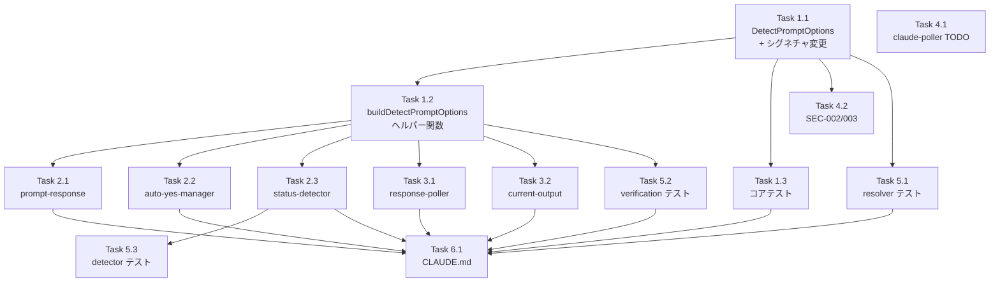

# Issue #193 作業計画書

## Issue: Claude Codeからの複数選択肢に対し、回答を送信出来ない
**Issue番号**: #193
**サイズ**: M
**優先度**: High
**依存Issue**: なし（関連: #161, #138, #180）

---

## 詳細タスク分解

### Phase 1: コア実装（TDD: Red-Green-Refactor）

#### Task 1.1: DetectPromptOptions interface + detectPrompt()シグネチャ変更
- **成果物**: `src/lib/prompt-detector.ts`
- **依存**: なし
- **内容**:
  1. `DetectPromptOptions` interfaceをexport定義（将来拡張メモJSDoc付き — SF-001）
  2. `detectPrompt(output, options?)` シグネチャ変更
  3. `detectMultipleChoicePrompt(output, options?)` シグネチャ変更
  4. `const requireDefault = options?.requireDefaultIndicator ?? true;` 変数代入（C-003）
  5. Pass 1に`requireDefault`条件分岐追加
  6. Layer 4に`requireDefault`条件分岐追加
  7. Layer 5追加（SEC-001）: `!requireDefault && questionEndIndex === -1` → `isPrompt: false`

#### Task 1.2: buildDetectPromptOptions() ヘルパー関数
- **成果物**: `src/lib/cli-patterns.ts`
- **依存**: Task 1.1（DetectPromptOptions interfaceのexport）
- **内容**:
  1. `DetectPromptOptions`をtype-only importで追加
  2. `buildDetectPromptOptions(cliToolId: CLIToolType): DetectPromptOptions | undefined` 関数追加

#### Task 1.3: コアテスト（prompt-detector.test.ts）
- **成果物**: `tests/unit/prompt-detector.test.ts`
- **依存**: Task 1.1
- **内容**:
  1. `requireDefaultIndicator: false`での❯なし形式検出テスト
  2. `requireDefaultIndicator: true`（デフォルト）での既存動作リグレッションテスト
  3. `requireDefaultIndicator: false`で連番検証が維持されることのテスト
  4. `requireDefaultIndicator: false`で`options.length < 2`がブロックされることのテスト
  5. SEC-001テスト: `requireDefaultIndicator: false` + 質問行なし → `isPrompt: false`
  6. SEC-001テスト: `requireDefaultIndicator: false` + 質問行あり → `isPrompt: true`
  7. undefinedオプションで既存動作維持のテスト

### Phase 2: 呼び出し元修正（P0）

#### Task 2.1: prompt-response/route.ts 修正
- **成果物**: `src/app/api/worktrees/[id]/prompt-response/route.ts`
- **依存**: Task 1.1, Task 1.2
- **内容**:
  1. `buildDetectPromptOptions`をimport
  2. L75: `const promptOptions = buildDetectPromptOptions(cliToolId);`
  3. L75: `detectPrompt(cleanOutput, promptOptions)`

#### Task 2.2: auto-yes-manager.ts 修正
- **成果物**: `src/lib/auto-yes-manager.ts`
- **依存**: Task 1.1, Task 1.2
- **内容**:
  1. `buildDetectPromptOptions`をimport
  2. L290: `const promptOptions = buildDetectPromptOptions(cliToolId);`
  3. L290: `detectPrompt(cleanOutput, promptOptions)`

#### Task 2.3: status-detector.ts 修正
- **成果物**: `src/lib/status-detector.ts`
- **依存**: Task 1.1, Task 1.2
- **内容**:
  1. `buildDetectPromptOptions`をimport
  2. L87: `const promptOptions = buildDetectPromptOptions(cliToolId);`（既存引数cliToolIdを活用 — IC-003）
  3. L87: `detectPrompt(lastLines, promptOptions)`

### Phase 3: ANSI修正 + 呼び出し元修正（P1）

#### Task 3.1: response-poller.ts 修正
- **成果物**: `src/lib/response-poller.ts`
- **依存**: Task 1.1, Task 1.2
- **内容**:
  1. `detectPromptWithOptions()` 内部ヘルパー追加（SF-003）
  2. ヘルパー内で`stripAnsi()`を一律適用（IA-001）
  3. L248/L442/L556をヘルパー経由に統一

#### Task 3.2: current-output/route.ts 修正
- **成果物**: `src/app/api/worktrees/[id]/current-output/route.ts`
- **依存**: Task 1.1, Task 1.2
- **内容**:
  1. `buildDetectPromptOptions`をimport
  2. L88: `detectPrompt(cleanOutput, promptOptions)`（thinking条件分岐は維持 — IC-004）

### Phase 4: 到達不能コード + セキュリティ対応

#### Task 4.1: claude-poller.ts TODOコメント追加
- **成果物**: `src/lib/claude-poller.ts`
- **依存**: なし
- **内容**:
  1. L164にTODOコメント追加（到達不能コードの明記）
  2. L232に同様のTODOコメント追加
  3. オプショナル: `stripAnsi()` + `buildDetectPromptOptions()` + options追加

#### Task 4.2: セキュリティ対応（SEC-002/SEC-003）
- **成果物**: `src/lib/cli-patterns.ts`, `src/lib/prompt-detector.ts`
- **依存**: Task 1.1
- **内容**:
  1. SEC-002: `stripAnsi()`のJSDocにカバー範囲と既知制限事項を記載
  2. SEC-003: `getAnswerInput()`のエラーメッセージを固定メッセージに変更

### Phase 5: 追加テスト

#### Task 5.1: auto-yes-resolver.test.ts
- **成果物**: `tests/unit/lib/auto-yes-resolver.test.ts`
- **依存**: Task 1.1
- **内容**: `isDefault: false`フォールバック動作テスト確認・追加

#### Task 5.2: prompt-response-verification.test.ts
- **成果物**: `tests/unit/api/prompt-response-verification.test.ts`
- **依存**: Task 1.2
- **内容**: cli-patternsモックに`buildDetectPromptOptions`を追加（IA-004）

#### Task 5.3: status-detector.test.ts
- **成果物**: `src/lib/__tests__/status-detector.test.ts`
- **依存**: Task 2.3
- **内容**: Claude用❯なし形式テスト追加検討（IA-003）

### Phase 6: ドキュメント

#### Task 6.1: CLAUDE.md 更新
- **成果物**: `CLAUDE.md`
- **依存**: 全実装タスク完了後
- **内容**: Issue #193セクション追加

---

## タスク依存関係

---

## 品質チェック項目

| チェック項目 | コマンド | 基準 |
|-------------|----------|------|
| TypeScript | `npx tsc --noEmit` | 型エラー0件 |
| ESLint | `npm run lint` | エラー0件 |
| Unit Test | `npm run test:unit` | 全テストパス |
| Build | `npm run build` | 成功 |

---

## 成果物チェックリスト

### コード
- [ ] `src/lib/prompt-detector.ts` — DetectPromptOptions interface + detectPrompt optionalパラメータ + Layer 5
- [ ] `src/lib/cli-patterns.ts` — buildDetectPromptOptions() ヘルパー関数
- [ ] `src/app/api/worktrees/[id]/prompt-response/route.ts` — detectPrompt呼び出し修正
- [ ] `src/lib/auto-yes-manager.ts` — detectPrompt呼び出し修正
- [ ] `src/lib/status-detector.ts` — detectPrompt呼び出し修正
- [ ] `src/lib/response-poller.ts` — detectPromptWithOptions内部ヘルパー + stripAnsi一律適用
- [ ] `src/app/api/worktrees/[id]/current-output/route.ts` — detectPrompt呼び出し修正
- [ ] `src/lib/claude-poller.ts` — TODOコメント追加

### テスト
- [ ] `tests/unit/prompt-detector.test.ts` — 新規テスト追加（7件以上）
- [ ] `tests/unit/lib/auto-yes-resolver.test.ts` — isDefault: false テスト
- [ ] `tests/unit/api/prompt-response-verification.test.ts` — モック更新
- [ ] `src/lib/__tests__/status-detector.test.ts` — Claude用テスト追加

### ドキュメント
- [ ] `CLAUDE.md` — Issue #193セクション追加

---

## Definition of Done

- [ ] すべてのタスクが完了
- [ ] `npx tsc --noEmit` パス
- [ ] `npm run lint` エラー0件
- [ ] `npm run test:unit` 全テストパス
- [ ] `npm run build` 成功
- [ ] 設計方針書の受入条件（セクション10）を全て満たす
- [ ] 設計方針書の実装チェックリスト（セクション11）を全て確認

---

## 次のアクション

1. `/pm-auto-dev 193` でTDD自動開発を開始
2. 完了後 `/create-pr` でPR作成
