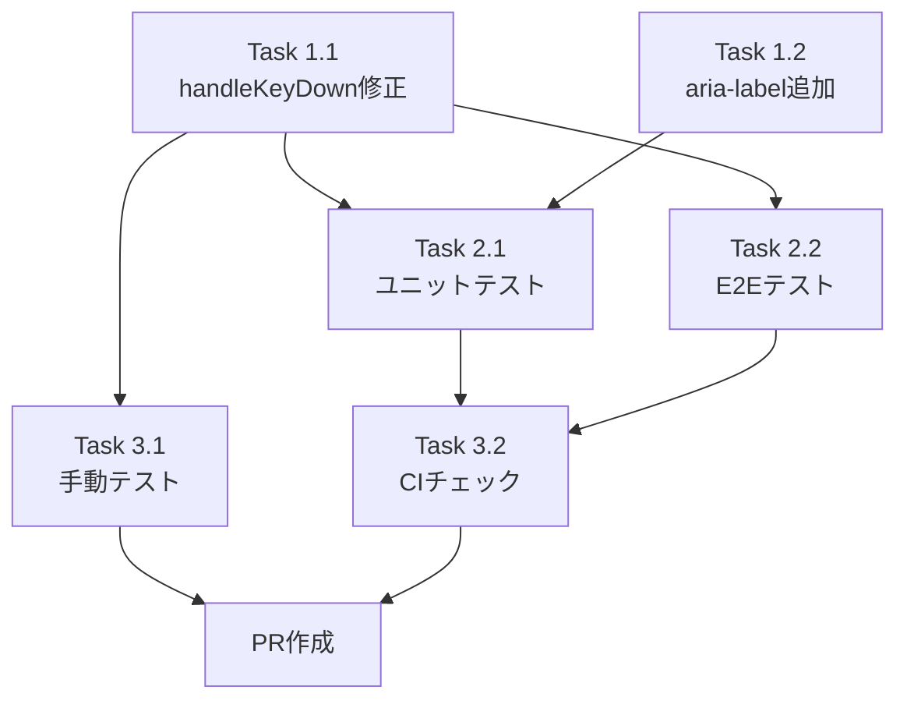

# 作業計画書: Issue #20

## Issue概要

| 項目 | 内容 |
|------|------|
| **Issue番号** | #20 |
| **タイトル** | スマホ利用時決定キーでチャット送信ではなく改行したい |
| **サイズ** | S（Small） |
| **優先度** | Medium |
| **依存Issue** | なし |
| **ブランチ名** | `feature/20-mobile-enter-newline` |

### 要件サマリ

スマートフォンの仮想キーボードでEnter（決定）キーを押した際に、メッセージが送信されてしまう現状を改善し、**改行が入力される**ようにする。

### 変更後の動作

| デバイス | Enter キー | 送信方法 |
|---------|-----------|---------|
| デスクトップ | 送信（現状維持） | Enter または送信ボタン |
| モバイル | **改行（変更）** | 送信ボタンのみ |

---

## 関連ドキュメント

| ドキュメント | パス |
|-------------|------|
| 設計方針書 | `dev-reports/design/issue-20-mobile-enter-key-design-policy.md` |
| アーキテクチャレビュー | `dev-reports/review/2026-01-10-issue-20-architecture-review.md` |

---

## 詳細タスク分解

### Phase 1: 実装（必須）

#### Task 1.1: handleKeyDown関数の修正

**成果物**: `src/components/worktree/MessageInput.tsx`

**変更内容**:
```typescript
// 変更前（行172-175）
if (e.key === 'Enter' && !e.shiftKey && !isComposing && !showCommandSelector) {
  e.preventDefault();
  void submitMessage();
}

// 変更後
if (e.key === 'Enter' && !isComposing && !showCommandSelector) {
  if (isMobile) {
    // Mobile: Enter inserts newline (default behavior)
    return;
  }
  // Desktop: Enter submits, Shift+Enter inserts newline
  if (!e.shiftKey) {
    e.preventDefault();
    void submitMessage();
  }
}
```

**依存**: なし

**作業手順**:
1. `src/components/worktree/MessageInput.tsx` を開く
2. `handleKeyDown` 関数（行148-176）を特定
3. 行172-175のEnterキー処理を修正
4. `isMobile` による条件分岐を追加

---

#### Task 1.2: 送信ボタンのaria-label追加

**成果物**: `src/components/worktree/MessageInput.tsx`

**変更内容**:
```tsx
// 変更前（行215-230）
<button
  type="submit"
  disabled={!message.trim() || sending}
  className="..."
>

// 変更後
<button
  type="submit"
  disabled={!message.trim() || sending}
  aria-label="Send message"
  className="..."
>
```

**依存**: なし（Task 1.1と並行可能）

**作業手順**:
1. 送信ボタン要素（行215）を特定
2. `aria-label="Send message"` を追加

---

### Phase 2: テスト（必須）

#### Task 2.1: MessageInputユニットテスト作成

**成果物**: `src/components/worktree/__tests__/MessageInput.test.tsx`

**テストケース**:

```typescript
describe('MessageInput - Enter key behavior', () => {
  describe('Desktop (isMobile = false)', () => {
    it('should submit message on Enter key');
    it('should insert newline on Shift+Enter');
    it('should not submit during IME composition');
  });

  describe('Mobile (isMobile = true)', () => {
    it('should insert newline on Enter key');
    it('should submit message on send button click');
    it('should not submit during IME composition');
  });

  describe('Command selector interaction', () => {
    it('should not submit when command selector is open');
  });

  describe('Accessibility', () => {
    it('should have aria-label on send button');
  });
});
```

**依存**: Task 1.1, Task 1.2

**作業手順**:
1. テストファイル `src/components/worktree/__tests__/MessageInput.test.tsx` を作成
2. `useIsMobile` フックをモック
3. 各テストケースを実装
4. `npm run test:unit` で実行確認

---

#### Task 2.2: E2Eテスト作成（推奨）

**成果物**: `e2e/mobile-enter-key.spec.ts`

**テストケース**:

```typescript
test.describe('Mobile Enter Key Behavior', () => {
  test.use({ ...devices['iPhone 13'] });

  test('Enter key should insert newline on mobile');
  test('Send button should submit message on mobile');
});

test.describe('Desktop Enter Key Behavior', () => {
  test('Enter key should submit message on desktop');
  test('Shift+Enter should insert newline on desktop');
});
```

**依存**: Task 1.1

**作業手順**:
1. テストファイル `e2e/mobile-enter-key.spec.ts` を作成
2. Playwrightのデバイスエミュレーションを設定
3. テストケースを実装
4. `npm run test:e2e` で実行確認

---

### Phase 3: 検証（必須）

#### Task 3.1: 手動テスト実施

**チェックリスト**:

| デバイス | テスト項目 | 期待動作 | 確認 |
|---------|-----------|---------|------|
| PC (Chrome) | Enter押下 | 送信される | [ ] |
| PC (Chrome) | Shift+Enter | 改行される | [ ] |
| PC (Chrome) | IME入力中Enter | 送信されない | [ ] |
| iPhone Safari | Enter押下 | 改行される | [ ] |
| iPhone Safari | 送信ボタン | 送信される | [ ] |
| iPhone Safari | IME入力中Enter | 送信されない | [ ] |
| Android Chrome | Enter押下 | 改行される | [ ] |
| Android Chrome | 送信ボタン | 送信される | [ ] |
| Chrome DevTools Mobile | Enter押下 | 改行される | [ ] |

**依存**: Task 1.1

---

#### Task 3.2: CIチェック実行

**コマンド**:

```bash
# Lint
npm run lint

# 型チェック
npx tsc --noEmit

# ユニットテスト
npm run test:unit

# ビルド
npm run build
```

**依存**: Task 2.1

---

## タスク依存関係



---

## 実装順序

| 順序 | タスク | 推定作業量 | 累積 |
|------|--------|-----------|------|
| 1 | Task 1.1: handleKeyDown修正 | 10分 | 10分 |
| 2 | Task 1.2: aria-label追加 | 5分 | 15分 |
| 3 | Task 2.1: ユニットテスト作成 | 30分 | 45分 |
| 4 | Task 2.2: E2Eテスト作成（推奨） | 20分 | 65分 |
| 5 | Task 3.1: 手動テスト | 15分 | 80分 |
| 6 | Task 3.2: CIチェック | 5分 | 85分 |

**総推定作業量**: 約1.5時間

---

## 品質チェック項目

| チェック項目 | コマンド | 基準 |
|-------------|----------|------|
| ESLint | `npm run lint` | エラー0件 |
| TypeScript | `npx tsc --noEmit` | 型エラー0件 |
| Unit Test | `npm run test:unit` | 全テストパス |
| Build | `npm run build` | 成功 |

---

## 成果物チェックリスト

### コード変更

- [ ] `src/components/worktree/MessageInput.tsx`
  - [ ] handleKeyDown関数にisMobile条件分岐追加
  - [ ] 送信ボタンにaria-label追加

### テスト

- [ ] `src/components/worktree/__tests__/MessageInput.test.tsx`（新規作成）
  - [ ] デスクトップ動作テスト
  - [ ] モバイル動作テスト
  - [ ] IME対応テスト
  - [ ] アクセシビリティテスト

- [ ] `e2e/mobile-enter-key.spec.ts`（新規作成・推奨）
  - [ ] モバイルエミュレーションテスト
  - [ ] デスクトップテスト

### 手動確認

- [ ] PC (Chrome) での動作確認
- [ ] Chrome DevTools モバイルエミュレーション
- [ ] 実機（iOS/Android）での確認（推奨）

---

## Definition of Done

Issue #20 完了条件：

### 必須条件

- [ ] Task 1.1 完了: handleKeyDown関数のisMobile条件分岐追加
- [ ] Task 1.2 完了: aria-label追加
- [ ] Task 2.1 完了: ユニットテスト作成・パス
- [ ] Task 3.2 完了: CIチェック全パス（lint, type-check, test, build）

### 推奨条件

- [ ] Task 2.2 完了: E2Eテスト作成・パス
- [ ] Task 3.1 完了: 手動テスト実施・合格

### レビュー条件

- [ ] コードレビュー承認
- [ ] 動作確認完了

---

## リスクと対策

| リスク | 影響度 | 対策 |
|-------|--------|------|
| IME対応の破損 | 高 | IME用テストケースを必須化 |
| テストの不足 | 中 | テストケースを詳細に定義済み |
| 手動テスト漏れ | 低 | チェックリストで網羅 |

---

## 次のアクション

### 作業開始前

1. **ブランチ作成**:
   ```bash
   git checkout -b feature/20-mobile-enter-newline
   ```

### 作業中

2. **タスク実行**: 上記Phase 1〜3を順次実行
3. **進捗報告**: 必要に応じて `/progress-report` を使用

### 作業完了後

4. **PR作成**: `/create-pr` で自動作成
   ```bash
   /create-pr
   ```

---

## コード変更の詳細

### MessageInput.tsx 変更箇所

#### 変更1: handleKeyDown関数（行172-175）

```diff
- // Submit on Enter (but not when Shift is pressed or composing with IME)
- // Shift+Enter allows line breaks
- // Don't submit when command selector is open
- if (e.key === 'Enter' && !e.shiftKey && !isComposing && !showCommandSelector) {
-   e.preventDefault();
-   void submitMessage();
- }
+ // Enter key handling with device-specific behavior
+ if (e.key === 'Enter' && !isComposing && !showCommandSelector) {
+   if (isMobile) {
+     // Mobile: Enter inserts newline (default behavior)
+     // Submit only via send button
+     return;
+   }
+
+   // Desktop: Enter submits, Shift+Enter inserts newline
+   if (!e.shiftKey) {
+     e.preventDefault();
+     void submitMessage();
+   }
+ }
```

#### 変更2: 送信ボタン（行215-218）

```diff
  <button
    type="submit"
    disabled={!message.trim() || sending}
+   aria-label="Send message"
    className="flex-shrink-0 p-2 text-blue-600 hover:bg-blue-50 rounded-full transition-colors disabled:text-gray-300 disabled:hover:bg-transparent"
  >
```

---

## 承認

- [ ] 作業計画承認
- [ ] 作業着手許可

**承認者**: _______________
**承認日**: _______________
