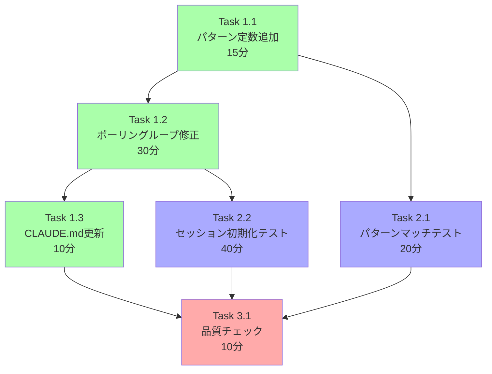

# Issue #201 作業計画書

## Issue概要

**Issue番号**: #201
**タイトル**: fix: 新規ワークスペースの信頼性確認ダイアログを自動応答する
**サイズ**: S（小）
**優先度**: Medium
**ラベル**: bug
**依存Issue**: Issue #187, #198（関連）

### 概要
Claude CLI v2.xが初回アクセスのワークスペースで表示する「Quick safety check」ダイアログに、`startClaudeSession()`が自動でEnterを送信して応答する機能を追加する。

### 目的
- 新規ワークスペースでのセッション開始時の「Prompt detection timeout」エラーを解消
- ユーザーが明示的にworktreeを選択している時点で信頼意図があるため、ダイアログの自動応答は安全

---

## タスク分解

### Phase 1: 実装タスク

#### Task 1.1: パターン定数追加
- **目的**: 信頼性ダイアログ検出用のパターン定数を定義
- **成果物**: `src/lib/cli-patterns.ts`
- **作業内容**:
  1. `CLAUDE_TRUST_DIALOG_PATTERN`定数を追加（`/Yes, I trust this folder/m`）
  2. 定数の直上にインラインコメントで「意図的にアンカーなし（部分一致）」の理由を記載
     - JSDoc または行コメントで以下を明記:
       ```typescript
       // 意図的に行頭アンカー(^)なしの部分一致:
       // tmux出力バッファではダイアログテキストが行頭以外の位置に出現する可能性がある。
       // CLAUDE_PROMPT_PATTERN等は行頭アンカー付きだが、ダイアログ検出は部分一致が必要。
       ```
- **依存**: なし
- **所要時間**: 15分

#### Task 1.2: ポーリングループ修正
- **目的**: `startClaudeSession()`にダイアログ検出・自動応答ロジックを追加
- **成果物**: `src/lib/claude-session.ts`
- **作業内容**:
  1. `startClaudeSession()`関数内のポーリングループ前に`let trustDialogHandled = false;`を宣言
  2. ポーリングループ内に以下の条件分岐を追加:
     - `CLAUDE_PROMPT_PATTERN`チェック（既存、優先）
     - `CLAUDE_TRUST_DIALOG_PATTERN`チェック（新規）
       - 未送信時: `sendKeys(sessionName, '', true)`でEnter送信
       - `trustDialogHandled = true`でフラグ設定
       - `console.log('Trust dialog detected, sending Enter to confirm')`でログ出力
       - ポーリング継続
     - 送信済み時: ポーリング継続（二重送信防止）
  3. ダイアログ検出ログ出力箇所の近くにTODOコメント追加:
     ```typescript
     // TODO: ログ出力方式の統一（console.log vs createLogger）は別Issueで対応検討
     ```
  4. `CLAUDE_INIT_TIMEOUT`定数（L39-49）のJSDocに以下を追加:
     ```typescript
     /**
      * Claude CLI initialization max wait time (milliseconds)
      *
      * This timeout also covers trust dialog auto-response time (typically <1s).
      * When reducing this value, consider dialog response overhead.
      *
      * ...（既存の説明）
      */
     ```
- **依存**: Task 1.1
- **所要時間**: 30分

#### Task 1.3: CLAUDE.md更新
- **目的**: 最近の実装機能セクションにIssue #201の概要を追記
- **成果物**: `CLAUDE.md`
- **作業内容**:
  1. 「最近の実装機能」セクションの先頭に以下を追加:
     ```markdown
     ### Issue #201: 信頼性確認ダイアログ自動応答
     - **機能追加**: Claude CLI v2.xの初回ワークスペースアクセス時に表示される「Quick safety check」ダイアログに自動で応答
     - **根本原因**: tmux経由起動でダイアログの❯がCLAUDE_PROMPT_PATTERNにマッチせず15秒タイムアウト
     - **修正内容**: startClaudeSession()のポーリングループにCLAUDE_TRUST_DIALOG_PATTERN検出とEnter自動送信を追加
     - **主要な変更点**:
       - CLAUDE_TRUST_DIALOG_PATTERN定数追加（/Yes, I trust this folder/m）
       - trustDialogHandledフラグによる二重送信防止
       - console.logでダイアログ検出ログ出力
     - **主要コンポーネント**:
       - src/lib/cli-patterns.ts - パターン定数追加
       - src/lib/claude-session.ts - ポーリングループ修正
     - 詳細: [設計書](./dev-reports/design/issue-201-trust-dialog-auto-response-design-policy.md)
     ```
- **依存**: Task 1.2
- **所要時間**: 10分

---

### Phase 2: テストタスク

#### Task 2.1: パターンマッチテスト
- **目的**: `CLAUDE_TRUST_DIALOG_PATTERN`の正規表現マッチを検証
- **成果物**: `src/lib/__tests__/cli-patterns.test.ts`
- **作業内容**:
  1. 新規テストケース追加:
     - `should match trust dialog full text`: 全文テキストマッチ
     - `should match trust dialog with tmux padding`: 前後にtmux出力が付加された部分一致
     - `should NOT match "No, exit" option`: 類似文字列の非マッチ
     - `should NOT match regular CLI output`: 通常出力の非マッチ
  2. テスト戦略:
     ```typescript
     describe('CLAUDE_TRUST_DIALOG_PATTERN', () => {
       it('should match trust dialog full text', () => {
         const output = `Quick safety check: Is this a project you created or one you trust?\n\n ❯ 1. Yes, I trust this folder\n   2. No, exit`;
         expect(CLAUDE_TRUST_DIALOG_PATTERN.test(output)).toBe(true);
       });
       // ... 他のテスト
     });
     ```
- **依存**: Task 1.1
- **カバレッジ目標**: 100%（パターン定数4ケース）
- **所要時間**: 20分

#### Task 2.2: セッション初期化テスト
- **目的**: `startClaudeSession()`のダイアログ検出・自動応答を検証
- **成果物**: `tests/unit/lib/claude-session.test.ts`
- **作業内容**:
  1. 新規テストケース追加:
     - `should send Enter when trust dialog is detected`: ダイアログ検出時のEnter送信
     - `should complete initialization after Enter send`: Enter送信後のプロンプト検出で初期化完了
     - `should send Enter only once (duplicate prevention)`: 二重送信防止
     - `should not affect existing dialog-less flow`: 既存フロー回帰テスト
  2. テスト戦略:
     ```typescript
     describe('startClaudeSession() - trust dialog', () => {
       it('should send Enter when trust dialog is detected', async () => {
         let callCount = 0;
         vi.mocked(capturePane).mockImplementation(async () => {
           callCount++;
           if (callCount === 1) return 'Yes, I trust this folder';
           return '> ';
         });
         // ... テスト実行
         expect(sendKeys).toHaveBeenCalledWith(sessionName, '', true);
       });
       // ... 他のテスト
     });
     ```
- **依存**: Task 1.2
- **カバレッジ目標**: 新規コード行80%以上
- **所要時間**: 40分

---

### Phase 3: 品質チェックタスク

#### Task 3.1: 静的解析・テスト実行
- **目的**: コード品質の最終検証
- **作業内容**:
  1. `npm run lint` - ESLintエラー0件
  2. `npx tsc --noEmit` - TypeScript型エラー0件
  3. `npm run test:unit` - 全テストパス
  4. `npm run build` - ビルド成功
- **依存**: Task 2.2
- **所要時間**: 10分

---

## タスク依存関係



緑: 実装、青: テスト、赤: 検証

---

## 実装チェックリスト

### 必須実装項目

- [ ] `src/lib/cli-patterns.ts`: `CLAUDE_TRUST_DIALOG_PATTERN`定数を追加
- [ ] `src/lib/cli-patterns.ts`: パターン定数の直上に「意図的にアンカーなし（部分一致）」のインラインコメントを記載（SF-001）
- [ ] `src/lib/claude-session.ts`: `startClaudeSession()`ポーリングループにダイアログ検出・Enter自動送信ロジックを追加
- [ ] `src/lib/claude-session.ts`: `trustDialogHandled`フラグによる二重送信防止
- [ ] `src/lib/claude-session.ts`: ログ出力は`console.log`で固定文字列のみ
- [ ] `src/lib/claude-session.ts`: 条件分岐の順序はCLAUDE_PROMPT_PATTERN（先）→ CLAUDE_TRUST_DIALOG_PATTERN（後）
- [ ] `tests/unit/lib/claude-session.test.ts`: ダイアログ検出時Enter送信テスト
- [ ] `tests/unit/lib/claude-session.test.ts`: 二重送信防止テスト
- [ ] `tests/unit/lib/claude-session.test.ts`: ダイアログなし既存フロー回帰テスト
- [ ] `src/lib/__tests__/cli-patterns.test.ts`: パターンマッチテスト（正常系・部分一致・非マッチ）

### レビュー指摘対応項目

- [ ] SF-001: `CLAUDE_TRUST_DIALOG_PATTERN`のインラインコメントに「他のパターン定数（CLAUDE_PROMPT_PATTERN等）は行頭アンカー付きだが、本パターンはtmux出力バッファ内の任意位置でマッチする必要があるため意図的に部分一致」を明記
- [ ] SF-002: ダイアログ検出ログ出力箇所の近くに`// TODO: ログ出力方式の統一（console.log vs createLogger）は別Issueで対応検討`コメントを追加
- [ ] C-002 / Stage2-SF-001: `CLAUDE_INIT_TIMEOUT`定数のJSDocに「ダイアログ応答分（通常1秒未満）を含む。タイムアウト値を短縮する場合は考慮が必要」を注記

### 品質チェック

- [ ] `npm run lint` パス
- [ ] `npx tsc --noEmit` パス
- [ ] `npm run test:unit` パス
- [ ] `npm run build` パス

---

## 受入条件

- [ ] 新規ワークスペースで信頼性確認ダイアログが表示された場合、自動でEnterが送信されること
- [ ] Enterの送信は1回のみ行われること（二重送信防止ガードが機能すること）
- [ ] 自動応答後にClaude CLIが正常にプロンプト状態になること
- [ ] 自動応答時に `info` レベルのコンソールログが出力されること
- [ ] Enter送信後、`CLAUDE_INIT_TIMEOUT`（15秒）の残り時間内にプロンプトが検出されない場合はタイムアウトエラーが発生すること
- [ ] 既存のセッション初期化フロー（ダイアログなし）に回帰がないこと
- [ ] `claude-session.test.ts` の全テストがパスすること
- [ ] `cli-patterns.test.ts` に `CLAUDE_TRUST_DIALOG_PATTERN` のマッチ/非マッチテストが追加されていること

---

## Definition of Done

- [ ] すべてのタスクが完了
- [ ] 実装チェックリスト全項目✅
- [ ] 受入条件全項目✅
- [ ] 単体テストカバレッジ80%以上（新規コード）
- [ ] CIチェック全パス（lint, type-check, test, build）
- [ ] コードレビュー承認（PRマージ前）
- [ ] CLAUDE.md更新完了

---

## 見積もり

| カテゴリ | タスク数 | 所要時間 |
|---------|---------|---------|
| 実装 | 3 | 55分 |
| テスト | 2 | 60分 |
| 品質チェック | 1 | 10分 |
| **合計** | **6** | **2時間5分** |

---

## リスクと対策

| リスク | 影響 | 対策 |
|--------|------|------|
| E2E環境でのダイアログ再現が困難 | 中 | 単体テストでモック応答を使用し、実装後に手動E2E確認 |
| C-m vs C-j の挙動差異（TUIフレームワーク依存） | 低 | 既存sendMessageToClaude()と同じC-m方式を使用、実績あり |
| Claude CLI v2.x未満でのパターン非マッチ | 低 | 後方互換性設計（パターン非マッチ時は既存フロー維持） |

---

## 次のアクション

### 1. ブランチ作成
```bash
git checkout -b feature/201-trust-dialog-auto-response
```

### 2. タスク実行
作業計画に従って実装（Phase 1 → Phase 2 → Phase 3）

### 3. コミット・PR作成
```bash
git add .
git commit -m "fix: add trust dialog auto-response for new workspace

- Add CLAUDE_TRUST_DIALOG_PATTERN for dialog detection
- Add auto Enter send logic in startClaudeSession() polling loop
- Add trustDialogHandled flag for duplicate prevention
- Add unit tests for pattern match and session initialization

Fixes #201

Co-Authored-By: Claude Opus 4.6 <noreply@anthropic.com>"

git push origin feature/201-trust-dialog-auto-response
```

### 4. PR作成
```bash
/create-pr
```

---

## 関連ドキュメント

- Issue #201: https://github.com/Kewton/CommandMate/issues/201
- 設計方針書: `dev-reports/design/issue-201-trust-dialog-auto-response-design-policy.md`
- Issueレビュー完了報告: `dev-reports/issue/201/issue-review/summary-report.md`
- 設計レビュー完了報告: `dev-reports/issue/201/multi-stage-design-review/summary-report.md`

---

*Generated by work-plan command*
