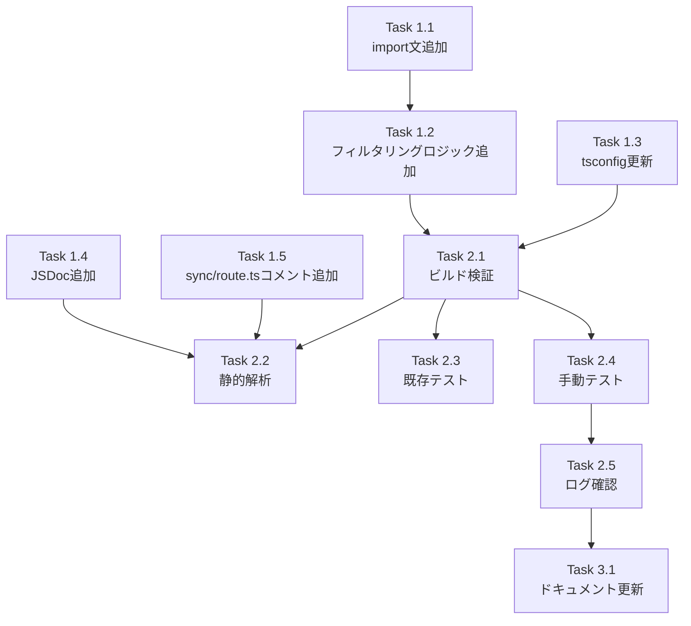

# Issue #202 作業計画書

## Issue概要

**Issue番号**: #202
**タイトル**: fix: サーバー再起動時に削除済みリポジトリが復活する
**サイズ**: S（Small）
**優先度**: High
**ラベル**: bug
**依存Issue**: #190（Sync All復活防止は対策済み）

### 問題概要

UIでリポジトリを削除後、サーバーを再起動すると削除済みリポジトリが復活する。

### 根本原因

`server.ts` の `initializeWorktrees()` が、Issue #190 で `sync/route.ts` に適用された除外フィルタリング（`ensureEnvRepositoriesRegistered()` + `filterExcludedPaths()`）を持たないため、サーバー起動時に削除済みリポジトリが再スキャン・再登録される。

### 修正方針

`server.ts` の `initializeWorktrees()` に `sync/route.ts` と同じ除外フィルタリングロジックを追加する。

---

## 詳細タスク分解

### Phase 1: 実装タスク

#### Task 1.1: server.ts へのimport文追加
- **成果物**: `server.ts` (L43付近)
- **依存**: なし
- **作業内容**:
  ```typescript
  import { ensureEnvRepositoriesRegistered, filterExcludedPaths } from './src/lib/db-repository';
  ```
- **注意点**: 相対パス形式 `./src/lib/...` を使用（`@/` エイリアスは使用不可）

#### Task 1.2: server.ts の initializeWorktrees() にフィルタリングロジック追加
- **成果物**: `server.ts` (L77-100付近)
- **依存**: Task 1.1
- **作業内容**:
  1. `ensureEnvRepositoriesRegistered(db, repositoryPaths)` を追加（L94の前）
  2. `filterExcludedPaths(db, repositoryPaths)` を追加
  3. 除外リポジトリパスの詳細ログを追加（SF-SEC-003対応）
  4. 順序制約のインラインコメントを追加（SF-001対応）
  5. `scanMultipleRepositories()` の引数を `repositoryPaths` から `filteredPaths` に変更

**修正後のコード**（L77-100）:
```typescript
// Get repository paths from environment variables
const repositoryPaths = getRepositoryPaths();

if (repositoryPaths.length === 0) {
  console.warn('Warning: No repository paths configured');
  console.warn('Set WORKTREE_REPOS (comma-separated) or MCBD_ROOT_DIR');
  return;
}

console.log(`Configured repositories: ${repositoryPaths.length}`);
repositoryPaths.forEach((path, i) => {
  console.log(`  ${i + 1}. ${path}`);
});

// Issue #202: Register environment variable repositories to repositories table (idempotent)
// NOTE: Must be called BEFORE filterExcludedPaths() - see Section 4 of design policy
ensureEnvRepositoriesRegistered(db, repositoryPaths);

// Issue #202: Filter out excluded (enabled=0) repositories
// NOTE: Requires ensureEnvRepositoriesRegistered() to have been called first
const filteredPaths = filterExcludedPaths(db, repositoryPaths);
const excludedCount = repositoryPaths.length - filteredPaths.length;

// Log excluded repository details (SF-SEC-003)
if (excludedCount > 0) {
  console.log(`Excluded repositories: ${excludedCount}, Active repositories: ${filteredPaths.length}`);
  // Optionally log excluded paths for debugging (can be verbose if many excluded)
  // const excludedPaths = repositoryPaths.filter(p => !filteredPaths.includes(resolveRepositoryPath(p)));
  // console.log(`  Excluded paths: ${excludedPaths.join(', ')}`);
}

// Scan filtered repositories (excluded repos are skipped)
const worktrees = await scanMultipleRepositories(filteredPaths);

// Sync to database
syncWorktreesToDB(db, worktrees);
```

#### Task 1.3: tsconfig.server.json の include 配列更新
- **成果物**: `tsconfig.server.json`
- **依存**: なし
- **作業内容**: include 配列に以下を追加
  - `"src/lib/db-repository.ts"`（L15付近に追加）
  - `"src/config/system-directories.ts"`（L22付近に追加）

**修正後の include**:
```json
"include": [
  "server.ts",
  "src/lib/env.ts",
  "src/lib/ws-server.ts",
  "src/lib/worktrees.ts",
  "src/lib/db.ts",
  "src/lib/db-instance.ts",
  "src/lib/db-migrations.ts",
  "src/lib/db-repository.ts",           // 追加
  "src/lib/response-poller.ts",
  "src/lib/cli-session.ts",
  "src/lib/prompt-detector.ts",
  "src/lib/conversation-logger.ts",
  "src/lib/claude-output.ts",
  "src/lib/cli-patterns.ts",
  "src/lib/cli-tools/**/*.ts",
  "src/config/system-directories.ts",   // 追加
  "src/types/**/*.ts"
]
```

#### Task 1.4: db-repository.ts の JSDoc 追加（SF-CS-001対応）
- **成果物**: `src/lib/db-repository.ts` (L400付近)
- **依存**: なし
- **作業内容**: `filterExcludedPaths()` の JSDoc に `@requires` を追記

**修正前**:
```typescript
/**
 * Filter out excluded repository paths.
 */
export function filterExcludedPaths(
  db: Database.Database,
  repositoryPaths: string[]
): string[] {
```

**修正後**:
```typescript
/**
 * Filter out excluded repository paths (enabled=0).
 *
 * @requires ensureEnvRepositoriesRegistered() must be called before this function
 *           to ensure all paths exist in the repositories table.
 *           Without prior registration, unregistered paths will not be filtered correctly.
 * @param db - Database instance
 * @param repositoryPaths - Array of repository paths to filter
 * @returns Filtered array excluding disabled repositories
 */
export function filterExcludedPaths(
  db: Database.Database,
  repositoryPaths: string[]
): string[] {
```

#### Task 1.5: sync/route.ts の順序制約コメント追加（SF-CS-002対応）
- **成果物**: `src/app/api/repositories/sync/route.ts` (L26-30付近)
- **依存**: なし
- **作業内容**: 既存のコメントに順序制約を明記

**修正前**:
```typescript
// Issue #190: Register environment variable repositories to repositories table (idempotent)
ensureEnvRepositoriesRegistered(db, repositoryPaths);

// Issue #190: Filter out excluded (enabled=0) repositories
const filteredPaths = filterExcludedPaths(db, repositoryPaths);
```

**修正後**:
```typescript
// Issue #190: Register environment variable repositories to repositories table (idempotent)
// NOTE: Must be called BEFORE filterExcludedPaths() - order dependency
ensureEnvRepositoriesRegistered(db, repositoryPaths);

// Issue #190: Filter out excluded (enabled=0) repositories
// NOTE: Requires ensureEnvRepositoriesRegistered() to have been called first
const filteredPaths = filterExcludedPaths(db, repositoryPaths);
```

---

### Phase 2: テストタスク

#### Task 2.1: ビルド検証
- **成果物**: ビルド成功確認
- **依存**: Task 1.1, 1.2, 1.3
- **作業内容**:
  ```bash
  npm run build:server  # server.ts 専用ビルド
  npm run build         # Next.js ビルド
  npm run build:all     # 全ビルド
  ```
- **成功基準**: すべてのビルドがエラーなく完了

#### Task 2.2: 静的解析チェック
- **成果物**: ESLint/TypeScript エラー0件
- **依存**: Task 1.1-1.5
- **作業内容**:
  ```bash
  npx tsc --noEmit
  npm run lint
  ```
- **成功基準**: エラー0件

#### Task 2.3: 既存テスト実行
- **成果物**: テスト全パス確認
- **依存**: Task 2.1
- **作業内容**:
  ```bash
  npm run test:unit           # 単体テスト
  npm run test:integration    # 結合テスト
  ```
- **成功基準**:
  - 単体テスト（db-repository-exclusion.test.ts）: 全パス
  - 結合テスト（repository-exclusion.test.ts）: 全パス

#### Task 2.4: 手動テストシナリオ実施（SF-002対応）
- **成果物**: 手動テスト結果記録
- **依存**: Task 2.1
- **作業内容**: 以下の5シナリオを検証

| # | テストシナリオ | 期待結果 | 確認方法 |
|---|--------------|---------|---------|
| 1 | 初回起動（DBなし） | 全リポジトリが登録・表示される | トップ画面で全リポジトリ確認 |
| 2 | リポジトリ削除後に再起動 | 削除済みリポジトリが復活しない | 削除 → `npm run build && npm start` → 削除済みリポジトリが非表示 |
| 3 | 全リポジトリ削除後に再起動 | サイドバーが空の状態で表示される | 全削除 → 再起動 → 空のサイドバー |
| 4 | 削除後にSync All実行 | 削除済みリポジトリが復活しない（Issue #190 で対策済み） | 削除 → Sync All → 削除済みリポジトリが非表示 |
| 5 | 削除 -> 再起動 -> Sync All | 削除済みリポジトリが復活しない（両経路で除外が機能） | 削除 → 再起動 → Sync All → 削除済みリポジトリが非表示 |

#### Task 2.5: ログ出力確認（SF-SEC-003対応）
- **成果物**: ログ出力確認
- **依存**: Task 2.4
- **作業内容**: 除外リポジトリがある場合、以下のログが出力されることを確認
  ```
  Excluded repositories: N, Active repositories: M
  ```

---

### Phase 3: ドキュメントタスク

#### Task 3.1: CLAUDE.md 更新（オプション）
- **成果物**: `CLAUDE.md`（オプション）
- **依存**: Task 2.4完了後
- **作業内容**: server.ts の initializeWorktrees() が sync/route.ts と同一パターンになった旨を記載（スコープ外だがフォローアップ推奨）

---

## タスク依存関係



---

## 品質チェック項目

| チェック項目 | コマンド | 基準 |
|-------------|----------|------|
| ESLint | `npm run lint` | エラー0件 |
| TypeScript | `npx tsc --noEmit` | 型エラー0件 |
| Unit Test | `npm run test:unit` | 全テストパス |
| Integration Test | `npm run test:integration` | 全テストパス |
| Server Build | `npm run build:server` | 成功 |
| Next.js Build | `npm run build` | 成功 |
| All Build | `npm run build:all` | 成功 |

---

## 成果物チェックリスト

### コード（必須）
- [x] `server.ts` - import文追加、フィルタリングロジック追加、コメント追加
- [x] `tsconfig.server.json` - include配列更新
- [x] `src/lib/db-repository.ts` - JSDoc追加
- [x] `src/app/api/repositories/sync/route.ts` - コメント追加

### テスト（必須）
- [ ] ビルド検証（build:server, build, build:all）
- [ ] 静的解析チェック（tsc, lint）
- [ ] 既存単体テスト全パス
- [ ] 既存結合テスト全パス
- [ ] 手動テストシナリオ5件実施
- [ ] ログ出力確認

### ドキュメント（オプション）
- [ ] CLAUDE.md 更新（フォローアップ推奨）

---

## Definition of Done

Issue #202 完了条件：
- [ ] すべての必須タスクが完了
- [ ] ビルド検証全パス（build:server, build, build:all）
- [ ] 静的解析エラー0件（tsc, lint）
- [ ] 既存テスト全パス（unit, integration）
- [ ] 手動テストシナリオ5件すべてパス
- [ ] ログ出力が正しく動作
- [ ] コードレビュー承認（PR作成後）

---

## フォローアップ項目（別Issue）

以下の項目は本Issue #202のスコープ外。必要に応じて別Issueで対応：

| ID | タイトル | 優先度 | 説明 |
|----|---------|-------|------|
| SF-001 | 共通関数 `initializeFilteredRepositories()` への抽出 | Medium | server.ts と sync/route.ts の重複解消（DRY原則） |
| SF-002 | 共通関数抽出後の統合テスト追加 | Medium | 関数抽出後のテスト強化 |
| SF-IA-001<br/>SF-SEC-001 | scan/route.ts の除外チェック追加 | Medium | 手動パス入力による復活経路の対策 |
| SF-SEC-002 | リポジトリパス数の上限チェック追加 | Low | WORKTREE_REPOS の上限チェック |
| C-IA-002 | worktree サーバー間での除外状態同期 | Low | --issue オプション使用時の考慮事項 |

---

## 見積もり

| フェーズ | 見積もり時間 | 備考 |
|---------|------------|------|
| Phase 1: 実装 | 1時間 | 既存パターンの転写のため短時間 |
| Phase 2: テスト | 1.5時間 | 手動テスト5シナリオを含む |
| Phase 3: ドキュメント | 0.5時間 | オプション |
| **合計** | **3時間** | 最小2.5時間（ドキュメント除く） |

---

## 次のアクション

作業計画承認後：
1. **実装開始**: `/tdd-impl 202` または `/pm-auto-dev 202` で自動実装
2. **進捗報告**: `/progress-report 202` で定期報告
3. **PR作成**: `/create-pr` で自動作成

---

## 関連ドキュメント

- **Issue**: https://github.com/Kewton/CommandMate/issues/202
- **設計方針書**: `dev-reports/design/issue-202-server-startup-exclusion-filter-design-policy.md`
- **Issueレビューレポート**: `dev-reports/issue/202/issue-review/summary-report.md`
- **設計レビューレポート**: `dev-reports/issue/202/multi-stage-design-review/summary-report.md`

---

*Generated by work-plan command*
*Date: 2026-02-09*
