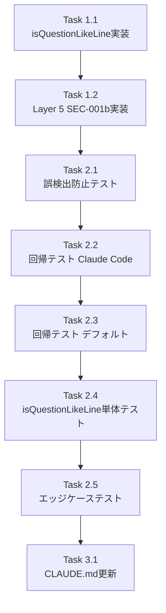

# Issue #208: Auto-Yes 番号付きリスト誤検出防止 - 作業計画書

## Issue概要

**Issue番号**: #208
**タイトル**: Auto-Yes: Claude CLIで番号付きリストがmultiple_choiceプロンプトとして誤検出され「1」が自動送信される
**サイズ**: M（中規模）
**優先度**: P1 - High
**依存Issue**: なし（関連Issue: #161, #193）
**ラベル**: bug

### 問題の本質

Issue #193で導入された `requireDefaultIndicator: false` により、Issue #161の主要防御ポイントである Pass 1ゲート（❯インジケーター存在チェック）が無効化され、通常の番号付きリストと実際の選択肢プロンプトの区別ができなくなった。

### 選択した解決方針

**Layer 5（SEC-001）の厳格化**: `isQuestionLikeLine()` 関数を追加し、質問行が実際に質問/選択を求める文であるかを検証する。

---

## 詳細タスク分解

### Phase 1: 実装タスク

#### Task 1.1: isQuestionLikeLine() 関数の実装

**成果物**: `src/lib/prompt-detector.ts` の変更

**実装内容**:
1. `QUESTION_KEYWORD_PATTERN` 定数の追加
   - 観測済みキーワード: `select`, `choose`, `pick`, `which`, `what`, `enter`, `confirm`
   - 防御的追加キーワード: `how`, `where`, `type`, `specify`, `approve`, `accept`, `reject`, `decide`, `preference`, `option`
   - ReDoS安全性のコメント追加（SEC-S4-002）

2. `isQuestionLikeLine()` 関数の実装
   - Pattern 1: `?` または `？`（全角）で終わる行 → true
   - Pattern 2: `:`で終わり、QUESTION_KEYWORD_PATTERNにマッチ → true
   - それ以外 → false
   - 制御文字耐性のコメント追加（SEC-S4-004）

**依存**: なし

**所要時間**: 30分

---

#### Task 1.2: Layer 5 SEC-001b ガードの実装

**成果物**: `src/lib/prompt-detector.ts` の変更

**実装内容**:
1. 既存の SEC-001 ガード（L402-411）をリファクタリング
   - `if (!requireDefault && questionEndIndex === -1)` を `if (!requireDefault)` ブロックでラップ
   - SEC-001a: 既存の `questionEndIndex === -1` チェック
   - SEC-001b: `isQuestionLikeLine()` 呼び出しを追加

2. 実装差分（設計書セクション3.1参照）:
```typescript
// 既存コード（L406）:
if (!requireDefault && questionEndIndex === -1) {
  return { isPrompt: false, cleanContent: output.trim() };
}

// 修正後:
if (!requireDefault) {
  // SEC-001a: 質問行が存在しない場合は拒否（既存ガード）
  if (questionEndIndex === -1) {
    return { isPrompt: false, cleanContent: output.trim() };
  }

  // SEC-001b: 質問行が実際に質問/選択を求める文であることを検証（新規ガード）
  const questionLine = lines[questionEndIndex]?.trim() ?? '';
  if (!isQuestionLikeLine(questionLine)) {
    return { isPrompt: false, cleanContent: output.trim() };
  }
}
```

**依存**: Task 1.1

**所要時間**: 20分

---

### Phase 2: テストタスク

#### Task 2.1: 誤検出防止テスト（T1-T4）

**成果物**: `tests/unit/prompt-detector.test.ts` の変更

**実装内容**:
- T1: 通常の番号付きリスト（見出し + リスト）→ isPrompt: false
- T2: タスク完了リスト → isPrompt: false
- T3: ステップ説明リスト → isPrompt: false
- T4: マークダウン見出し + 番号リスト → isPrompt: false

**依存**: Task 1.2

**所要時間**: 30分

---

#### Task 2.2: Claude Code実プロンプト回帰テスト（T5-T8）

**成果物**: `tests/unit/prompt-detector.test.ts` の変更

**実装内容**:
- T5: 疑問符終端の質問行 + 番号選択肢 → isPrompt: true
- T6: コロン + 選択キーワードの質問行 + 番号選択肢 → isPrompt: true
- T7: choose キーワード + コロン → isPrompt: true
- T8: 質問行なし（既存SEC-001a）→ isPrompt: false

**依存**: Task 2.1

**所要時間**: 30分

---

#### Task 2.3: requireDefaultIndicator=true 回帰テスト（T9-T10）

**成果物**: `tests/unit/prompt-detector.test.ts` の変更

**実装内容**:
- T9: ❯付き正常プロンプト（デフォルト設定）→ isPrompt: true
- T10: ❯なし番号リスト（デフォルト設定）→ isPrompt: false

**依存**: Task 2.2

**所要時間**: 20分

---

#### Task 2.4: isQuestionLikeLine() 単体テスト（T11）

**成果物**: `tests/unit/prompt-detector.test.ts` の変更

**実装内容**:
- T11: 13パターンの検証（間接テスト経由）
  - `detectMultipleChoicePrompt()` を経由した間接テスト
  - または `isQuestionLikeLine()` をexportして直接テスト

**実装方法**（設計書セクション6.4参照）:
- 推奨: `detectMultipleChoicePrompt()` 経由の間接テスト
- 代替: `isQuestionLikeLine()` をexportして直接テスト

**依存**: Task 2.3

**所要時間**: 40分

---

#### Task 2.5: エッジケーステスト（T12-T14）

**成果物**: `tests/unit/prompt-detector.test.ts` の変更

**実装内容**:
- T12: 全角疑問符 → isPrompt: true
- T13: 長い出力の末尾に番号付きリスト → isPrompt: false
- T14: Bashツール形式（インデント付き選択肢）→ isPrompt: true
  - `isContinuationLine()` の `?`終端除外ロジックとの連携を確認

**依存**: Task 2.4

**所要時間**: 30分

---

### Phase 3: ドキュメントタスク（オプション）

#### Task 3.1: CLAUDE.md更新（必要な場合）

**成果物**: `CLAUDE.md`

**実装内容**:
- prompt-detector.ts の説明に SEC-001b（質問行妥当性検証）追加
- 必要に応じて Issue #193 / #161 の説明を更新

**依存**: Task 2.5

**所要時間**: 15分

---

## タスク依存関係



---

## 品質チェック項目

| チェック項目 | コマンド | 基準 | タイミング |
|-------------|----------|------|-----------|
| ESLint | `npm run lint` | エラー0件 | 各Phase完了時 |
| TypeScript | `npx tsc --noEmit` | 型エラー0件 | 各Phase完了時 |
| Unit Test | `npm run test:unit` | 全テストパス | Phase 2完了時 |
| Build | `npm run build` | 成功 | Phase 2完了時 |

### 追加の品質チェック

**テストカバレッジ**:
- `prompt-detector.ts` の `detectMultipleChoicePrompt()`: 100%
- `isQuestionLikeLine()`: 100%

**回帰テスト**:
- Issue #193関連の既存テスト（L842-1047）: 全パス
- Issue #161関連の既存テスト（L456-835）: 全パス

---

## 成果物チェックリスト

### コード
- [ ] `QUESTION_KEYWORD_PATTERN` 定数追加
  - [ ] キーワード分類コメント（観測済み/防御的追加）
  - [ ] ReDoS安全性コメント（SEC-S4-002）
- [ ] `isQuestionLikeLine()` 関数実装
  - [ ] Pattern 1: `?` / `？` 終端判定
  - [ ] Pattern 2: `:` 終端 + キーワード判定
  - [ ] 制御文字耐性コメント（SEC-S4-004）
- [ ] Layer 5 SEC-001b ガード実装
  - [ ] `if (!requireDefault)` ブロック構造
  - [ ] SEC-001a: 既存ガード維持
  - [ ] SEC-001b: `isQuestionLikeLine()` 呼び出し

### テスト
- [ ] T1-T4: 誤検出防止テスト
- [ ] T5-T8: Claude Code回帰テスト
- [ ] T9-T10: デフォルト設定回帰テスト
- [ ] T11: isQuestionLikeLine()単体テスト
- [ ] T12-T14: エッジケーステスト

### ドキュメント
- [ ] CLAUDE.md更新（必要な場合）
- [ ] 設計方針書のレビューチェックリスト確認（セクション12）
- [ ] 実装チェックリスト確認（セクション15）

---

## Definition of Done

Issue完了条件：

### 必須条件
- [ ] すべてのタスクが完了（Task 1.1, 1.2, 2.1-2.5）
- [ ] 新規テスト（T1-T14）全パス
- [ ] 既存テスト全パス（特にIssue #193/#161関連）
- [ ] 単体テストカバレッジ 80%以上（target: 100%）
- [ ] CIチェック全パス
  - [ ] ESLint: エラー0件
  - [ ] TypeScript: 型エラー0件
  - [ ] Unit Test: 全パス
  - [ ] Build: 成功
- [ ] 設計方針書のレビューチェックリスト全項目完了（セクション12）
- [ ] 実装チェックリスト全項目完了（セクション15）

### オプション条件
- [ ] Task 3.1: CLAUDE.md更新
- [ ] response-poller.ts統合テスト（設計書セクション6.6）

---

## 実装時の重要ポイント

### 1. キーワードパターンの実装

```typescript
/**
 * 選択・入力を求めるキーワードパターン。
 *
 * キーワード分類:
 *   [観測済み] select, choose, pick, which, what, enter, confirm
 *   [防御的追加] how, where, type, specify, approve, accept, reject, decide, preference, option
 *
 * // Alternation-only, no nested quantifiers -- ReDoS safe (SEC-S4-002).
 */
const QUESTION_KEYWORD_PATTERN = /(?:select|choose|pick|which|what|how|where|enter|type|specify|confirm|approve|accept|reject|decide|preference|option)/i;
```

### 2. isQuestionLikeLine() の実装

```typescript
/**
 * question行が実際に質問や選択を求める文であるかを検証する。
 *
 * 制御文字耐性: tmux capture-pane出力に制御文字が残留していても、
 * endsWith()およびQUESTION_KEYWORD_PATTERN.test()は安全に評価される
 * （制御文字はパターンにマッチしないため false を返す）。(SEC-S4-004)
 */
function isQuestionLikeLine(line: string): boolean {
  if (line.length === 0) return false;

  // Pattern 1: 疑問符で終わる行（全角対応は防御的措置）
  if (line.endsWith('?') || line.endsWith('\uff1f')) return true;

  // Pattern 2: 選択/入力を求めるキーワード + コロン
  if (line.endsWith(':')) {
    if (QUESTION_KEYWORD_PATTERN.test(line)) return true;
  }

  return false;
}
```

### 3. Layer 5リファクタリング

既存の1行 `if` 文を `if (!requireDefault)` ブロックでラップする構造的リファクタリングです。Pass 1-4のロジックには一切変更を加えません。

---

## リスクと軽減策

| リスク | 影響 | 確率 | 軽減策 |
|--------|------|------|--------|
| Issue #193回帰（Claude Codeプロンプト検出失敗） | 高 | 低 | T5-T8の回帰テストで検証 |
| Issue #161回帰（❯付きプロンプト検出失敗） | 中 | 極低 | T9-T10の回帰テストで検証 |
| 全角コロン対応の見落とし | 低 | 低 | 設計書で意図的に非対応と明記済み |
| isQuestionLikeLine()のexport有無の判断ミス | 低 | 中 | T11の実装方針を事前確認 |

---

## 参照ドキュメント

### 設計方針書

**パス**: `dev-reports/design/issue-208-auto-yes-numbered-list-false-positive-design-policy.md`

**重要セクション**:
- セクション3.1-3.3: 実装詳細設計
- セクション6: テスト計画（T1-T14）
- セクション7: セキュリティ設計
- セクション9: 実装手順
- セクション12: レビューチェックリスト
- セクション15: 実装チェックリスト

### マルチステージレビューサマリー

**パス**: `dev-reports/issue/208/multi-stage-design-review/summary-report.md`

**スコア**: 平均 4.5/5
- Stage 1（設計原則）: 5/5
- Stage 2（整合性）: 4/5
- Stage 3（影響分析）: 5/5
- Stage 4（セキュリティ）: 4/5

---

## 次のアクション

### 1. ブランチ作成

```bash
git checkout -b feature/208-auto-yes-numbered-list-false-positive
```

### 2. 作業開始

```bash
# Phase 1: 実装
# Task 1.1, 1.2を実行

# Phase 2: テスト
# Task 2.1-2.5を実行

# Phase 3: ドキュメント（オプション）
# Task 3.1を実行
```

### 3. 品質チェック

```bash
npm run lint
npx tsc --noEmit
npm run test:unit
npm run build
```

### 4. 進捗報告（オプション）

```bash
/progress-report
```

### 5. PR作成

```bash
/create-pr
```

---

## 所要時間見積もり

| Phase | タスク数 | 所要時間 |
|-------|---------|---------|
| Phase 1: 実装 | 2 | 50分 |
| Phase 2: テスト | 5 | 150分 |
| Phase 3: ドキュメント | 1 | 15分 |
| **合計** | **8** | **215分（約3.5時間）** |

### 実作業時間の内訳

- コーディング: 50分
- テスト作成: 150分
- ドキュメント: 15分
- 品質チェック: 15分（見積もり外）
- PR作成: 10分（見積もり外）

**総所要時間（品質チェック含む）**: 約4時間

---

## 作業計画承認者

- [ ] テックリード確認
- [ ] 設計レビュアー確認

**作業計画書作成日**: 2026-02-09
**作業開始予定日**: TBD
