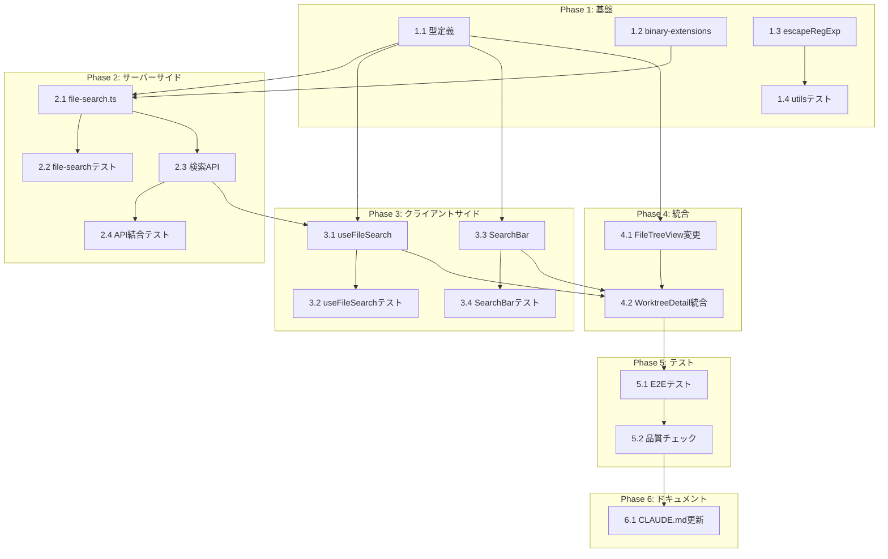

# Issue #21 作業計画

## Issue概要

| 項目 | 内容 |
|------|------|
| **Issue番号** | #21 |
| **タイトル** | PCでの利用時とスマホでの利用時ともにファイルツリーにてファイル検索したい |
| **サイズ** | L（大規模：新規コンポーネント・API・フック追加） |
| **優先度** | Medium |
| **依存Issue** | なし |
| **設計方針書** | `dev-reports/design/issue-21-file-search-design-policy.md` |

---

## タスク一覧

### Phase 1: 基盤（型定義・設定・ユーティリティ）

| タスク | 成果物 | 依存 | 見積 |
|--------|--------|------|------|
| **1.1** 検索関連型定義追加 | `src/types/models.ts` | なし | S |
| **1.2** バイナリ拡張子設定ファイル作成 | `src/config/binary-extensions.ts` | なし | S |
| **1.3** escapeRegExp関数追加 | `src/lib/utils.ts` | なし | S |
| **1.4** 既存utils.test.tsにテスト追加 | `tests/unit/lib/utils.test.ts` | 1.3 | S |

### Phase 2: サーバーサイド（検索ロジック・API）

| タスク | 成果物 | 依存 | 見積 |
|--------|--------|------|------|
| **2.1** ファイル内容検索ロジック | `src/lib/file-search.ts` | 1.1, 1.2 | M |
| **2.2** file-searchユニットテスト | `tests/unit/lib/file-search.test.ts` | 2.1 | M |
| **2.3** 検索APIエンドポイント | `src/app/api/worktrees/[id]/search/route.ts` | 2.1 | M |
| **2.4** 検索API結合テスト | `tests/integration/api-search.test.ts` | 2.3 | M |

### Phase 3: クライアントサイド（フック・コンポーネント）

| タスク | 成果物 | 依存 | 見積 |
|--------|--------|------|------|
| **3.1** useFileSearchフック | `src/hooks/useFileSearch.ts` | 1.1, 2.3 | M |
| **3.2** useFileSearchテスト | `tests/unit/hooks/useFileSearch.test.ts` | 3.1 | M |
| **3.3** SearchBarコンポーネント | `src/components/worktree/SearchBar.tsx` | 1.1 | M |
| **3.4** SearchBarテスト | `tests/unit/components/worktree/SearchBar.test.tsx` | 3.3 | S |

### Phase 4: 統合（既存コンポーネント変更）

| タスク | 成果物 | 依存 | 見積 |
|--------|--------|------|------|
| **4.1** FileTreeViewにフィルタリング追加 | `src/components/worktree/FileTreeView.tsx` | 1.1 | M |
| **4.2** WorktreeDetailRefactoredに統合 | `src/components/worktree/WorktreeDetailRefactored.tsx` | 3.1, 3.3, 4.1 | M |

### Phase 5: テスト・品質保証

| タスク | 成果物 | 依存 | 見積 |
|--------|--------|------|------|
| **5.1** E2Eテスト作成 | `tests/e2e/file-search.spec.ts` | 4.2 | M |
| **5.2** 全テスト実行・品質チェック | - | 5.1 | S |

### Phase 6: ドキュメント

| タスク | 成果物 | 依存 | 見積 |
|--------|--------|------|------|
| **6.1** CLAUDE.md更新 | `CLAUDE.md` | 5.2 | S |

---

## タスク依存関係



---

## 詳細タスク

### Phase 1: 基盤

#### Task 1.1: 検索関連型定義追加

**ファイル**: `src/types/models.ts`

```typescript
// 追加する型定義
export type SearchMode = 'name' | 'content';

export interface SearchQuery {
  query: string;
  mode: SearchMode;
}

export interface SearchResult {
  mode: SearchMode;
  query: string;
  results: SearchResultItem[];
  totalMatches: number;
  truncated: boolean;
  executionTimeMs: number;
}

export interface SearchResultItem {
  filePath: string;  // 相対パスのみ（セキュリティ）
  fileName: string;
  matches?: Array<{
    line: number;
    content: string;  // 500文字制限（セキュリティ）
  }>;
}
```

#### Task 1.2: バイナリ拡張子設定ファイル作成

**ファイル**: `src/config/binary-extensions.ts`

```typescript
import { IMAGE_EXTENSIONS } from './image-extensions';

export const BINARY_EXTENSIONS = [
  ...IMAGE_EXTENSIONS,
  '.exe', '.dll', '.so', '.dylib',
  '.zip', '.tar', '.gz', '.rar', '.7z',
  '.pdf', '.woff', '.woff2', '.ttf', '.otf', '.eot',
] as const;

export type BinaryExtension = typeof BINARY_EXTENSIONS[number];

export function isBinaryExtension(ext: string): boolean {
  return BINARY_EXTENSIONS.includes(ext.toLowerCase() as BinaryExtension);
}
```

#### Task 1.3: escapeRegExp関数追加

**ファイル**: `src/lib/utils.ts`

```typescript
/**
 * 正規表現の特殊文字をエスケープする
 * 注意: クライアントサイドのハイライト表示のみで使用
 * サーバーサイド検索では正規表現を使用しない（ReDoS対策）
 */
export function escapeRegExp(string: string): string {
  return string.replace(/[.*+?^${}()|[\]\\]/g, '\\$&');
}
```

#### Task 1.4: 既存utils.test.tsにテスト追加

**ファイル**: `tests/unit/lib/utils.test.ts`

```typescript
describe('escapeRegExp', () => {
  it('正規表現の特殊文字をエスケープする', () => {
    expect(escapeRegExp('hello.world')).toBe('hello\\.world');
    expect(escapeRegExp('a*b+c?')).toBe('a\\*b\\+c\\?');
    expect(escapeRegExp('[test]')).toBe('\\[test\\]');
  });

  it('通常の文字列はそのまま返す', () => {
    expect(escapeRegExp('hello')).toBe('hello');
  });
});
```

---

### Phase 2: サーバーサイド

#### Task 2.1: ファイル内容検索ロジック

**ファイル**: `src/lib/file-search.ts`

**実装ポイント**:
- `EXCLUDED_PATTERNS`を使用した機密ファイル除外
- `isPathSafe(filePath, basePath)`によるパストラバーサル対策
- `AbortController`によるタイムアウト（5秒）
- 正規表現使用禁止（ReDoS対策）→ `indexOf`/`includes`で検索
- 結果100件制限
- コンテンツ行500文字トランケート
- バイナリファイル除外（`isBinaryExtension` + NULLバイト検出）

#### Task 2.3: 検索APIエンドポイント

**ファイル**: `src/app/api/worktrees/[id]/search/route.ts`

**実装ポイント**:
- 既存の`/api/worktrees/[id]/tree/route.ts`パターンを踏襲
- レスポンス形式: `{ success: true, results, totalMatches, truncated, executionTimeMs }`
- エラーレスポンス: `{ success: false, error: { code, message } }`
- アクセスログ記録

---

### Phase 3: クライアントサイド

#### Task 3.1: useFileSearchフック

**ファイル**: `src/hooks/useFileSearch.ts`

**実装ポイント**:
- 既存`debounce`関数を使用（300ms）
- `mode='name'`: クライアントサイドフィルタリング
- `mode='content'`: API呼び出し
- エラーハンドリング

#### Task 3.3: SearchBarコンポーネント

**ファイル**: `src/components/worktree/SearchBar.tsx`

**実装ポイント**:
- 検索入力欄
- モード切替トグル（名前/内容）
- ローディング表示
- クリアボタン
- デスクトップ: 常時表示
- モバイル: 初期実装ではデスクトップ優先（後続対応）

---

### Phase 4: 統合

#### Task 4.1: FileTreeViewにフィルタリング追加

**ファイル**: `src/components/worktree/FileTreeView.tsx`

**変更ポイント**:
- 新規props（全てオプショナル、後方互換性維持）:
  - `searchQuery?: string`
  - `searchMode?: SearchMode`
  - `onSearchResultSelect?: (filePath: string) => void`
- フィルタリングロジック追加
- マッチしたファイルの親ディレクトリ自動展開

#### Task 4.2: WorktreeDetailRefactoredに統合

**ファイル**: `src/components/worktree/WorktreeDetailRefactored.tsx`

**変更ポイント**:
- `useFileSearch`フック統合
- `SearchBar`コンポーネント配置
- 検索状態をFileTreeViewに渡す

---

## 品質チェック項目

| チェック項目 | コマンド | 基準 |
|-------------|----------|------|
| ESLint | `npm run lint` | エラー0件 |
| TypeScript | `npx tsc --noEmit` | 型エラー0件 |
| Unit Test | `npm run test:unit` | 全テストパス |
| Integration Test | `npm run test:integration` | 全テストパス |
| E2E Test | `npm run test:e2e` | 全テストパス |
| Build | `npm run build` | 成功 |
| カバレッジ | `npm run test:coverage` | 80%以上 |

---

## 成果物チェックリスト

### 新規作成ファイル
- [ ] `src/config/binary-extensions.ts`
- [ ] `src/lib/file-search.ts`
- [ ] `src/app/api/worktrees/[id]/search/route.ts`
- [ ] `src/hooks/useFileSearch.ts`
- [ ] `src/components/worktree/SearchBar.tsx`
- [ ] `tests/unit/lib/file-search.test.ts`
- [ ] `tests/unit/hooks/useFileSearch.test.ts`
- [ ] `tests/unit/components/worktree/SearchBar.test.tsx`
- [ ] `tests/integration/api-search.test.ts`
- [ ] `tests/e2e/file-search.spec.ts`

### 変更ファイル
- [ ] `src/types/models.ts` - 検索関連型追加
- [ ] `src/lib/utils.ts` - escapeRegExp関数追加
- [ ] `tests/unit/lib/utils.test.ts` - escapeRegExpテスト追加
- [ ] `src/components/worktree/FileTreeView.tsx` - フィルタリング追加
- [ ] `src/components/worktree/WorktreeDetailRefactored.tsx` - 検索統合
- [ ] `CLAUDE.md` - 新規モジュール追記

---

## Definition of Done

Issue完了条件：
- [ ] 全タスク（Phase 1-6）完了
- [ ] 単体テストカバレッジ80%以上
- [ ] CIチェック全パス（lint, type-check, test, build）
- [ ] 設計方針書のレビュー指摘事項反映済み
- [ ] CLAUDE.md更新完了
- [ ] PC版で検索機能が動作する
- [ ] 機密ファイル（.env等）が検索結果に含まれない

---

## セキュリティチェックリスト

設計レビュー（Stage 4）で特定されたセキュリティ要件：

- [ ] **SEC-MF-001**: サーバーサイド検索で正規表現不使用（ReDoS対策）
- [ ] **SEC-SF-001**: ファイルパスは相対パスのみ返却
- [ ] **SEC-SF-002**: コンテンツ行500文字トランケート
- [ ] **SEC-SF-003**: 検索APIアクセスログ記録
- [ ] パストラバーサル対策（`isPathSafe`使用）
- [ ] XSS対策（React自動エスケープ、dangerouslySetInnerHTML不使用）
- [ ] 機密ファイル除外（EXCLUDED_PATTERNS適用）

---

## 次のアクション

作業計画承認後：
1. **ブランチ作成**: `feature/21-file-search`
2. **タスク実行**: Phase 1から順に実装（`/tdd-impl`または`/pm-auto-dev`推奨）
3. **進捗報告**: `/progress-report`で定期報告
4. **PR作成**: `/create-pr`で自動作成

---

## 関連ドキュメント

- [Issue #21](https://github.com/Kewton/CommandMate/issues/21)
- [設計方針書](./dev-reports/design/issue-21-file-search-design-policy.md)
- [Issueレビュー結果](./dev-reports/issue/21/issue-review/)
- [設計レビュー結果](./dev-reports/issue/21/multi-stage-design-review/)

---

*Generated by /work-plan command*
