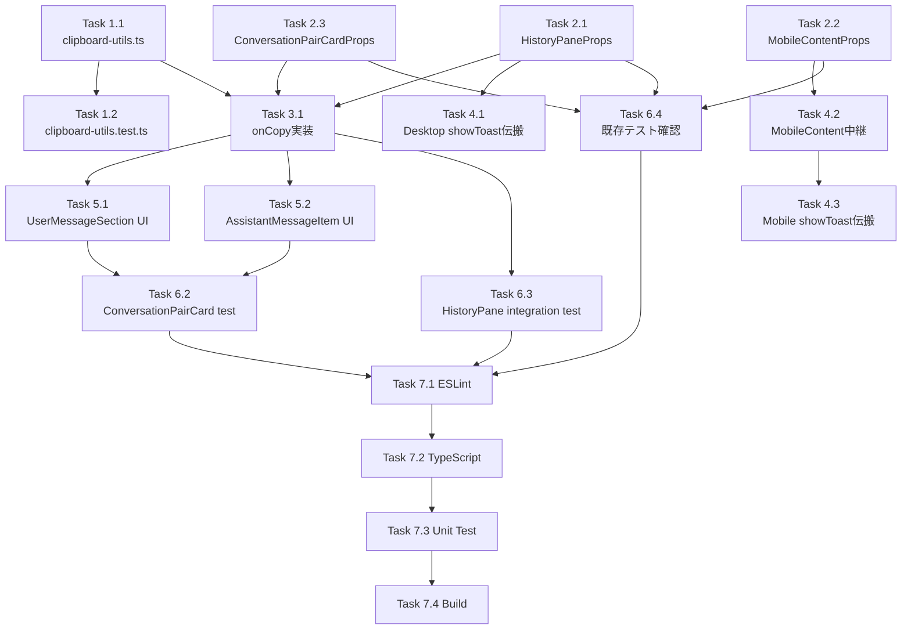

# 作業計画: Issue #211 - 履歴メッセージコピーボタン機能

## Issue概要

**Issue番号**: #211
**タイトル**: 履歴から過去の入力やレスポンスをコピー可能にしたい
**サイズ**: M (Medium)
**優先度**: Medium
**ラベル**: feature
**依存Issue**: なし

### 概要
HistoryPane（履歴タブ）に表示される各メッセージ（ユーザー入力・Assistant応答）にコピーボタンを追加し、メッセージ内容をクリップボードにコピーできるようにする。

### スコープ
- **Phase 1（本Issue）**: ConversationPairCard（現行コンポーネント）へのコピーボタン追加
- **Phase 2（別Issue）**: MessageList（レガシーコンポーネント）は別Issueとして設計・実装

---

## 詳細タスク分解

### Phase 1: ユーティリティ実装

#### Task 1.1: clipboard-utils.ts 新規作成
- **成果物**: `src/lib/clipboard-utils.ts`
- **依存**: なし
- **詳細**:
  - `copyToClipboard(text: string): Promise<void>` 関数を実装
  - 既存の `stripAnsi()` 関数（`src/lib/cli-patterns.ts`）をインポートして利用
  - 空文字/空白文字バリデーションガード追加（SF-S4-1）
  - SEC-002 JSDocドキュメント追加（SF-S4-2）
  - エラーは呼び出し元で処理（throw）
- **設計方針書参照**: Section 5.1
- **チェック項目**:
  - [ ] `import { stripAnsi } from '@/lib/cli-patterns'` でインポート
  - [ ] 空文字チェック: `if (!text || text.trim().length === 0) return;`
  - [ ] JSDocコメントにSEC-002既知制限を記載

#### Task 1.2: clipboard-utils.test.ts 作成
- **成果物**: `src/lib/__tests__/clipboard-utils.test.ts`
- **依存**: Task 1.1
- **詳細**:
  - Clipboard API呼出確認（`navigator.clipboard.writeText` のモック）
  - stripAnsi適用確認（ANSIコード含むテキストが除去される）
  - 空文字入力時のテスト
  - 空白文字のみ入力時のテスト
  - エラーハンドリングテスト（Clipboard API失敗時）
- **設計方針書参照**: Section 7.1, 14
- **カバレッジ目標**: 100%（小規模ユーティリティ）

---

### Phase 2: Props型定義変更

#### Task 2.1: HistoryPaneProps 型更新
- **成果物**: `src/components/worktree/HistoryPane.tsx` (Props型定義)
- **依存**: なし
- **詳細**:
  - `showToast?: (message: string, type?: ToastType, duration?: number) => string` をPropsに追加
  - オプショナル（`?:`）として定義（SF-S2-1, SF-S2-2対応）
- **設計方針書参照**: Section 4.3, 8
- **チェック項目**:
  - [ ] オプショナルpropsとして追加
  - [ ] ToastType型を `@/types/markdown-editor` からインポート

#### Task 2.2: MobileContentProps 型更新
- **成果物**: `src/components/worktree/WorktreeDetailRefactored.tsx` (MobileContentProps型定義)
- **依存**: なし
- **詳細**:
  - `showToast?: (message: string, type?: ToastType, duration?: number) => string` を追加
  - モバイルレイアウトでの3層伝搬を実現（SF-S2-2対応）
- **設計方針書参照**: Section 4.1, 4.3
- **チェック項目**:
  - [ ] MobileContentProps（L750-769付近）に追加
  - [ ] オプショナルpropsとして定義

#### Task 2.3: ConversationPairCardProps 型更新
- **成果物**: `src/components/worktree/ConversationPairCard.tsx` (Props型定義)
- **依存**: なし
- **詳細**:
  - `onCopy?: (content: string) => void` をPropsに追加
  - オプショナル（`?:`）として定義
- **設計方針書参照**: Section 4.3, 8
- **チェック項目**:
  - [ ] オプショナルpropsとして追加

---

### Phase 3: HistoryPane onCopy実装

#### Task 3.1: HistoryPane onCopyコールバック作成
- **成果物**: `src/components/worktree/HistoryPane.tsx`
- **依存**: Task 1.1, 2.1
- **詳細**:
  - `copyToClipboard` を `@/lib/clipboard-utils` からインポート
  - `useCallback` で `onCopy` コールバック作成（依存: `[showToast]`）
  - try-catchでエラーハンドリング
    - 成功時: `showToast?.('コピーしました', 'success')`
    - 失敗時: `showToast?.('コピーに失敗しました', 'error')` または `console.warn`（SF-S4-3対応）
  - `ConversationPairCard` に `onCopy` をprops経由で渡す
- **設計方針書参照**: Section 4.2
- **チェック項目**:
  - [ ] `import { copyToClipboard } from '@/lib/clipboard-utils'` でインポート
  - [ ] `useCallback([showToast])` で参照安定化
  - [ ] catch句でcontent含めずエラーログ出力（SF-S4-3）

---

### Phase 4: showToast Props伝搬

#### Task 4.1: WorktreeDetailRefactored (デスクトップ) showToast伝搬
- **成果物**: `src/components/worktree/WorktreeDetailRefactored.tsx` (デスクトップレイアウト)
- **依存**: Task 2.1
- **詳細**:
  - デスクトップレイアウトのHistoryPane呼び出し箇所（`WorktreeDesktopLayout` コンポーネント内、L1573付近）に `showToast` propsを追加
  - `<HistoryPane showToast={showToast} ... />`
- **設計方針書参照**: Section 4.1, 12
- **チェック項目**:
  - [ ] デスクトップレイアウトのHistoryPane呼び出しに追加

#### Task 4.2: MobileContent showToast中継実装
- **成果物**: `src/components/worktree/WorktreeDetailRefactored.tsx` (MobileContent)
- **依存**: Task 2.2
- **詳細**:
  - MobileContentコンポーネントで `showToast` をpropsで受け取る
  - MobileContent内のHistoryPane呼び出し（L809付近）に `showToast` を中継
  - `<HistoryPane showToast={showToast} ... />`
- **設計方針書参照**: Section 4.1, 12
- **チェック項目**:
  - [ ] MobileContentで `showToast` をprops受取
  - [ ] HistoryPane呼び出しに中継

#### Task 4.3: WorktreeDetailRefactored (モバイル) showToast伝搬
- **成果物**: `src/components/worktree/WorktreeDetailRefactored.tsx` (モバイルレイアウト)
- **依存**: Task 4.2
- **詳細**:
  - モバイルレイアウトのMobileContent呼び出し（`renderMobileLeftPaneContent` 内）に `showToast` propsを追加
  - `<MobileContent showToast={showToast} ... />`
- **設計方針書参照**: Section 4.1, 12
- **チェック項目**:
  - [ ] モバイルレイアウトのMobileContent呼び出しに追加

---

### Phase 5: ConversationPairCard UI実装

#### Task 5.1: UserMessageSection コピーボタン追加
- **成果物**: `src/components/worktree/ConversationPairCard.tsx` (UserMessageSection)
- **依存**: Task 2.3, 3.1
- **詳細**:
  - lucide-reactの `Copy` アイコンインポート
  - UserMessageSectionにコピーボタン追加（`absolute top-2 right-2`）
  - `onClick={() => onCopy?.(message.content)}`（直接呼出、useCallbackラップ不要 SF-1対応）
  - `data-testid="copy-user-message"` 追加（SF-S3-1対応）
  - aria-label: `"Copy message"` (英語、C-3対応)
  - title: `"Copy"` (英語、C-3対応)
- **設計方針書参照**: Section 5.2, 5.3
- **チェック項目**:
  - [ ] `Copy` アイコンインポート: `import { Copy } from 'lucide-react'`
  - [ ] `absolute top-2 right-2` 配置
  - [ ] `data-testid="copy-user-message"` 追加
  - [ ] aria-label/title英語で統一

#### Task 5.2: AssistantMessageItem コピーボタン追加
- **成果物**: `src/components/worktree/ConversationPairCard.tsx` (AssistantMessageItem)
- **依存**: Task 2.3, 3.1
- **詳細**:
  - AssistantMessageItemにコピーボタン追加（`right-10 top-2`、展開ボタンの左隣）
  - `onClick={() => onCopy?.(message.content)}`（直接呼出）
  - `data-testid="copy-assistant-message"` 追加（SF-S3-1対応）
  - aria-label: `"Copy message"`
  - title: `"Copy"`
- **設計方針書参照**: Section 5.2, 5.3
- **チェック項目**:
  - [ ] `right-10 top-2` 配置（展開ボタンとの共存）
  - [ ] `data-testid="copy-assistant-message"` 追加
  - [ ] aria-label/title英語で統一
  - [ ] 展開ボタン（`absolute top-2 right-2`）と重ならないことを確認

---

### Phase 6: テスト実装

#### Task 6.1: clipboard-utils.test.ts 実装（再掲）
- **完了条件**: Task 1.2参照

#### Task 6.2: ConversationPairCard コピーボタンテスト追加
- **成果物**: `src/components/worktree/__tests__/ConversationPairCard.test.tsx` (新規テスト追加)
- **依存**: Task 5.1, 5.2
- **詳細**:
  - コピーボタン表示テスト（`data-testid` でボタン取得）
  - コピーボタンクリックテスト（`onCopy` モック関数呼出確認）
  - `onCopy` 未提供時の動作テスト（ボタン非表示またはクリック無効）
- **設計方針書参照**: Section 7.1, 14
- **チェック項目**:
  - [ ] `getByTestId('copy-user-message')` で要素取得
  - [ ] `getByTestId('copy-assistant-message')` で要素取得
  - [ ] `onCopy` モック呼出確認
  - [ ] `onCopy` 未提供時の挙動テスト

#### Task 6.3: HistoryPane統合テスト追加
- **成果物**: `src/components/worktree/__tests__/HistoryPane.integration.test.tsx` (新規テスト追加)
- **依存**: Task 3.1, 5.1, 5.2
- **詳細**:
  - `showToast` 提供時: コピーボタンクリック後に `showToast` が成功メッセージで呼ばれることを確認
  - `showToast` 未提供時: コピーボタンが表示され、クリック可能であることを確認
- **設計方針書参照**: Section 7.3, 14
- **チェック項目**:
  - [ ] `showToast` モック関数を用意
  - [ ] コピー成功時のToast呼出確認
  - [ ] `showToast` 未提供でもボタン動作確認

#### Task 6.4: 既存テスト確認・修正
- **成果物**: 既存テストファイルの確認・必要に応じた修正
- **依存**: Task 2.1, 2.2, 2.3
- **対象ファイル**:
  - `src/components/worktree/__tests__/ConversationPairCard.test.tsx`
  - `src/components/worktree/__tests__/HistoryPane.integration.test.tsx`
  - `tests/unit/components/HistoryPane.test.tsx`
  - `tests/unit/components/worktree/MessageListOptimistic.test.tsx`
  - `tests/integration/conversation-pair-card.test.tsx`
- **詳細**:
  - Propsをオプショナルで追加したため既存テスト破損はない見込み
  - 各テストファイルを実行して全パスすることを確認
  - 必要に応じてテストケース修正（通常は不要）
- **設計方針書参照**: Section 7.2, 14
- **チェック項目**:
  - [ ] 全テストファイルが破損なくパス

---

### Phase 7: 品質チェック

#### Task 7.1: ESLint実行
- **コマンド**: `npm run lint`
- **完了条件**: エラー0件、警告0件

#### Task 7.2: TypeScript型チェック
- **コマンド**: `npx tsc --noEmit`
- **完了条件**: 型エラー0件

#### Task 7.3: 単体テスト実行
- **コマンド**: `npm run test:unit`
- **完了条件**: 全テストパス、カバレッジ80%以上

#### Task 7.4: ビルド確認
- **コマンド**: `npm run build`
- **完了条件**: ビルド成功

---

## タスク依存関係

---

## 実装順序

### ステップ1: ユーティリティ準備
1. Task 1.1: clipboard-utils.ts 新規作成
2. Task 1.2: clipboard-utils.test.ts 作成

### ステップ2: Props型定義
3. Task 2.1: HistoryPaneProps 型更新
4. Task 2.2: MobileContentProps 型更新
5. Task 2.3: ConversationPairCardProps 型更新

### ステップ3: ロジック実装
6. Task 3.1: HistoryPane onCopyコールバック作成

### ステップ4: Props伝搬（並行可能）
7. Task 4.1: WorktreeDetailRefactored (デスクトップ) showToast伝搬
8. Task 4.2: MobileContent showToast中継実装
9. Task 4.3: WorktreeDetailRefactored (モバイル) showToast伝搬

### ステップ5: UI実装（並行可能）
10. Task 5.1: UserMessageSection コピーボタン追加
11. Task 5.2: AssistantMessageItem コピーボタン追加

### ステップ6: テスト
12. Task 6.2: ConversationPairCard コピーボタンテスト追加
13. Task 6.3: HistoryPane統合テスト追加
14. Task 6.4: 既存テスト確認・修正

### ステップ7: 品質チェック
15. Task 7.1 ~ 7.4: ESLint, TypeScript, Test, Build

---

## 品質チェック項目

| チェック項目 | コマンド | 基準 |
|-------------|----------|------|
| ESLint | `npm run lint` | エラー0件 |
| TypeScript | `npx tsc --noEmit` | 型エラー0件 |
| Unit Test | `npm run test:unit` | 全テストパス、カバレッジ80%以上 |
| Integration Test | `npm run test:integration` | 全テストパス |
| Build | `npm run build` | 成功 |

---

## 成果物チェックリスト

### コード
- [ ] `src/lib/clipboard-utils.ts` - クリップボードユーティリティ
- [ ] `src/components/worktree/HistoryPane.tsx` - onCopyコールバック追加
- [ ] `src/components/worktree/ConversationPairCard.tsx` - コピーボタンUI追加
- [ ] `src/components/worktree/WorktreeDetailRefactored.tsx` - showToast伝搬（デスクトップ・モバイル2箇所 + MobileContent）

### テスト
- [ ] `src/lib/__tests__/clipboard-utils.test.ts` - ユーティリティテスト
- [ ] `src/components/worktree/__tests__/ConversationPairCard.test.tsx` - コピーボタンテスト追加
- [ ] `src/components/worktree/__tests__/HistoryPane.integration.test.tsx` - 統合テスト追加
- [ ] 既存テスト全パス確認

### ドキュメント
- [ ] 本作業計画書（このファイル）
- [ ] 設計方針書: `dev-reports/design/issue-211-history-copy-button-design-policy.md` （既存）

---

## Definition of Done

Issue #211完了条件：

### 機能要件
- [ ] HistoryPaneの各メッセージにコピーボタンが表示される
- [ ] コピーボタンクリックでメッセージ内容がクリップボードにコピーされる
- [ ] ANSIエスケープコードが除去される
- [ ] コピー成功時にToast通知が表示される
- [ ] コピー失敗時にエラーToastが表示される
- [ ] モバイル・デスクトップ両レイアウトで動作する

### 技術要件
- [ ] 全タスク完了（Task 1.1 ~ 7.4）
- [ ] ESLint: エラー0件
- [ ] TypeScript: 型エラー0件
- [ ] Unit Test: 全テストパス、カバレッジ80%以上
- [ ] Integration Test: 全テストパス
- [ ] Build: 成功

### コードレビュー
- [ ] 設計方針書との整合性確認
- [ ] SOLID/KISS/YAGNI/DRY原則準拠
- [ ] セキュリティチェック（OWASP Top 10）

---

## 実装時の注意事項

### 設計方針書からの重要ポイント

1. **DRY原則の徹底（MF-1）**
   - clipboard-utils.tsがクリップボードコピーの唯一のエントリポイント
   - HistoryPaneで直接 `stripAnsi` + `writeText` を記述しない

2. **KISS原則（SF-1）**
   - ConversationPairCard内で不要な `useCallback` ラップは不要
   - `onClick={() => onCopy?.(message.content)}` で直接呼出

3. **モバイル3層伝搬（SF-S2-2）**
   - デスクトップ: WDR → HP
   - モバイル: WDR → MC → HP
   - MobileContentPropsに `showToast` 追加必須

4. **テスト識別性（SF-S3-1）**
   - `data-testid="copy-user-message"` / `"copy-assistant-message"` 必須
   - `getByRole` よりも `getByTestId` を優先

5. **セキュリティ（SF-S4-1, SF-S4-3）**
   - clipboard-utils.tsに空文字バリデーション
   - エラーログにメッセージ内容を含めない

6. **アクセシビリティ（C-3）**
   - aria-label/title は英語で統一
   - Toast通知の日本語は維持

---

## 次のアクション

作業計画承認後：

1. **ブランチ作成**: `git checkout -b feature/211-history-copy-button`
2. **タスク実行**: 本計画に従って実装（ステップ1から順次）
3. **進捗確認**: 各Phaseごとに品質チェック実行
4. **PR作成**: `/create-pr` で自動作成

---

## 関連ドキュメント

- **Issue**: https://github.com/Kewton/CommandMate/issues/211
- **設計方針書**: `dev-reports/design/issue-211-history-copy-button-design-policy.md`
- **Issueレビュー**: `dev-reports/issue/211/issue-review/summary-report.md`
- **設計レビュー**: `dev-reports/issue/211/multi-stage-design-review/summary-report.md`

---

*Generated by work-plan command for Issue #211*
