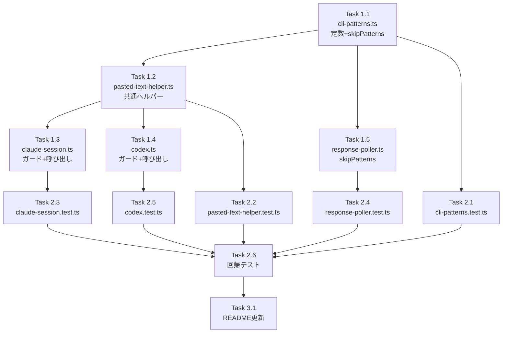

# Issue #212 作業計画書

## Issue概要

**Issue番号**: #212
**タイトル**: fix: 複数行メッセージ送信時の[Pasted text]表示を検知してEnter自動送信
**サイズ**: M
**優先度**: High
**依存Issue**: Issue #163（親Issue）

### 概要

複数行メッセージ送信後、Claude CLIが `[Pasted text #1 +XX lines]` と表示して処理を開始しない場合に、自動的にEnterキーを追加送信して処理を開始させる。

### 設計方針

- **Pasted text検知 + Enter自動送信**: Claude CLIの挙動に追従するアプローチ
- **単一行メッセージ最適化**: `message.includes('\n')` ガードで不要な遅延を排除（+0ms）
- **共通ヘルパー化**: `detectAndResendIfPastedText()` を新規作成し、code duplicationを排除
- **定数一元管理**: `PASTED_TEXT_PATTERN` を `cli-patterns.ts` に集約
- **パフォーマンス**: 単一行+0ms、複数行最大+1500ms（通常+500ms）

---

## タスク分解

### Phase 1: 実装タスク

#### Task 1.1: cli-patterns.ts - 定数・skipPatterns追加

**成果物**: `src/lib/cli-patterns.ts`
**依存**: なし
**変更規模**: 小（~15行）

- PASTED_TEXT_PATTERN定数追加（`/\[Pasted text #\d+/`）
- `getCliToolPatterns('claude')` の `skipPatterns` に PASTED_TEXT_PATTERN 追加

**実装ポイント**:
```typescript
export const PASTED_TEXT_PATTERN = /\[Pasted text #\d+/;

// getCliToolPatterns('claude') 内の skipPatterns に追加
skipPatterns: [
  // ... 既存パターン ...
  PASTED_TEXT_PATTERN,
]
```

---

#### Task 1.2: pasted-text-helper.ts - 共通ヘルパー新規作成（NEW）

**成果物**: `src/lib/pasted-text-helper.ts`
**依存**: Task 1.1
**変更規模**: 小（~40行）

- `detectAndResendIfPastedText()` 関数実装
- 内部logger生成（`createLogger('pasted-text')`）
- リトライロジック（最大3回）
- 定数: PASTED_TEXT_DETECT_DELAY (500ms), MAX_PASTED_TEXT_RETRIES (3)

**実装ポイント**:
```typescript
import { capturePane, sendKeys } from './tmux';
import { stripAnsi } from './cli-patterns';
import { PASTED_TEXT_PATTERN } from './cli-patterns';
import { createLogger } from './logger';

const logger = createLogger('pasted-text');

export const PASTED_TEXT_DETECT_DELAY = 500;
export const MAX_PASTED_TEXT_RETRIES = 3;

export async function detectAndResendIfPastedText(
  sessionName: string
): Promise<void> {
  // リトライループ実装
  // PASTED_TEXT_DETECT_DELAY ms 待機
  // capturePane -> stripAnsi -> パターン検知
  // 検知時: sendKeys(sessionName, '', true)
  // リトライ上限時: logger.warn()
}
```

---

#### Task 1.3: claude-session.ts - ガード条件 + ヘルパー呼び出し

**成果物**: `src/lib/claude-session.ts`
**依存**: Task 1.2
**変更規模**: 小（~15行）

- `sendMessageToClaude()` にガード条件追加（`message.includes('\n')`）
- ヘルパー呼び出し追加（`await detectAndResendIfPastedText(sessionName)`）

**実装ポイント**:
```typescript
// L424-425 既存のメッセージ送信後に追加
await sendKeys(sessionName, message, false);
await sendKeys(sessionName, '', true);  // Enter

// ▼ 追加: 複数行メッセージのみPasted text検知
if (message.includes('\n')) {
  await detectAndResendIfPastedText(sessionName);
}
```

---

#### Task 1.4: codex.ts - import + ガード条件 + ヘルパー呼び出し

**成果物**: `src/lib/cli-tools/codex.ts`
**依存**: Task 1.2
**変更規模**: 小（~10行）

- `detectAndResendIfPastedText` import追加
- `sendMessage()` にガード条件 + ヘルパー呼び出し追加（L130 execAsync(C-m)後）

**実装ポイント**:
```typescript
import { detectAndResendIfPastedText } from '@/lib/pasted-text-helper';

// L130 execAsync(tmux send-keys -t "${sessionName}" C-m); の後に追加
if (message.includes('\n')) {
  await detectAndResendIfPastedText(sessionName);
}
```

---

#### Task 1.5: response-poller.ts - skipPatterns追加

**成果物**: `src/lib/response-poller.ts`
**依存**: Task 1.1
**変更規模**: 小（~2行）

- `cleanClaudeResponse()` のローカル `skipPatterns` に PASTED_TEXT_PATTERN 追加

**実装ポイント**:
```typescript
// L135-159 skipPatterns 配列に追加
const skipPatterns = [
  // ... 既存パターン ...
  PASTED_TEXT_PATTERN,
];
```

---

### Phase 2: テストタスク

#### Task 2.1: cli-patterns.test.ts - パターン + 定数テスト

**成果物**: `tests/unit/lib/cli-patterns.test.ts`
**依存**: Task 1.1
**変更規模**: 小（~30行）

- PASTED_TEXT_PATTERN の正規表現テスト
- `getCliToolPatterns('claude')` の skipPatterns に PASTED_TEXT_PATTERN が含まれることの検証

**テストケース**:
```typescript
describe('PASTED_TEXT_PATTERN', () => {
  it('should match [Pasted text #1 +46 lines]', () => {
    expect(PASTED_TEXT_PATTERN.test('[Pasted text #1 +46 lines]')).toBe(true);
  });

  it('should match [Pasted text #2 +10 lines]', () => {
    expect(PASTED_TEXT_PATTERN.test('[Pasted text #2 +10 lines]')).toBe(true);
  });

  it('should not match normal text', () => {
    expect(PASTED_TEXT_PATTERN.test('This is normal text')).toBe(false);
  });
});

describe('getCliToolPatterns - skipPatterns', () => {
  it('should include PASTED_TEXT_PATTERN for claude', () => {
    const patterns = getCliToolPatterns('claude');
    expect(patterns.skipPatterns).toContain(PASTED_TEXT_PATTERN);
  });
});
```

---

#### Task 2.2: pasted-text-helper.test.ts - ヘルパーテスト（NEW）

**成果物**: `tests/unit/lib/pasted-text-helper.test.ts`
**依存**: Task 1.2
**変更規模**: 中（~70行）

- Pasted text未検知時の正常フロー
- Pasted text検知時のEnter再送
- リトライ上限到達時の警告ログ
- リトライ上限到達時にエラーをスローしないことの確認
- capturePane失敗時のエラー伝播

**テストケース**:
```typescript
vi.mock('./tmux');
vi.mock('./cli-patterns');
vi.mock('./logger');

describe('detectAndResendIfPastedText()', () => {
  it('should not send extra Enter when no Pasted text detected', async () => {
    // capturePane -> Pasted text なし
    // sendKeys 呼ばれない
  });

  it('should send extra Enter when Pasted text detected', async () => {
    // capturePane -> 1回目: [Pasted text] あり, 2回目: なし
    // sendKeys 1回呼ばれる
  });

  it('should log warning after max retries', async () => {
    // capturePane -> 常に [Pasted text] あり
    // createLogger('pasted-text').warn が呼ばれる
  });

  it('should not throw error after max retries', async () => {
    // 例外がスローされず正常にreturn
  });

  it('should propagate error when capturePane fails', async () => {
    // capturePane -> エラーをスロー
    // エラーが伝播する
  });
});
```

---

#### Task 2.3: claude-session.test.ts - ガード + ヘルパーテスト

**成果物**: `tests/unit/lib/claude-session.test.ts`
**依存**: Task 1.3
**変更規模**: 小（~35行）

- 単一行メッセージ時は検知スキップ（ガード条件テスト）
- 複数行メッセージ時はヘルパー呼び出し確認

**テストケース**:
```typescript
vi.mock('./pasted-text-helper');

describe('sendMessageToClaude() - Pasted text detection', () => {
  it('should skip Pasted text detection for single-line messages', async () => {
    // message = 'Hello' (改行なし)
    // detectAndResendIfPastedText 呼ばれない
  });

  it('should call detectAndResendIfPastedText for multi-line messages', async () => {
    // message = 'Line1\nLine2'
    // detectAndResendIfPastedText 1回呼ばれる
  });
});
```

---

#### Task 2.4: response-poller.test.ts - skipPatternsフィルタテスト（NEW）

**成果物**: `tests/unit/lib/response-poller.test.ts`
**依存**: Task 1.5
**変更規模**: 小（~20行）

- `cleanClaudeResponse()` が `[Pasted text]` を除外することを確認

**テストケース**:
```typescript
describe('cleanClaudeResponse() - skipPatterns', () => {
  it('should remove [Pasted text #1 +46 lines] from response', () => {
    const input = 'Response text\n[Pasted text #1 +46 lines]\nMore text';
    const output = cleanClaudeResponse(input);
    expect(output).not.toContain('[Pasted text');
  });
});
```

---

#### Task 2.5: codex.test.ts - モック基盤 + テスト追加

**成果物**: `tests/unit/lib/cli-tools/codex.test.ts`
**依存**: Task 1.4
**変更規模**: 大（~110行）

- **新規**: sendMessage()のモックテスト基盤構築（tmux, execAsync, pasted-text-helper）
- Pasted text検知テスト（sendKeys + execAsync 両パス）
- **検知タイミング順序検証**: execAsync(C-m)後にcapturePaneが呼ばれることの検証

**テストケース**:
```typescript
vi.mock('@/lib/tmux');
vi.mock('@/lib/pasted-text-helper');
vi.mock('util', () => ({
  promisify: vi.fn((fn) => fn),
}));

describe('Codex sendMessage() - Pasted text detection', () => {
  it('should call detectAndResendIfPastedText after execAsync(C-m) for multi-line', async () => {
    // message = 'Line1\nLine2'
    // execAsync(C-m) -> detectAndResendIfPastedText の順序検証
    const execAsyncOrder: number[] = [];
    const detectOrder: number[] = [];
    // 順序アサーション: execAsyncOrder[0] < detectOrder[0]
  });

  it('should skip detection for single-line messages', async () => {
    // message = 'Hello'
    // detectAndResendIfPastedText 呼ばれない
  });
});
```

---

#### Task 2.6: 回帰テスト - 既存テストの整合性確認

**成果物**: 全テストスイート
**依存**: Task 2.1-2.5
**変更規模**: 小

- `npm run test:unit` 全テストパス確認
- 既存の統合テスト（api-send-cli-tool.test.ts）の正常動作確認

---

### Phase 3: ドキュメントタスク

#### Task 3.1: README更新（必要な場合）

**成果物**: `README.md`
**依存**: Phase 1, Phase 2
**変更規模**: 極小（~10行）

- Pasted text自動検知機能の追記（必要な場合のみ）

---

## タスク依存関係



---

## 品質チェック項目

| チェック項目 | コマンド | 基準 |
|-------------|----------|------|
| ESLint | `npm run lint` | エラー0件 |
| TypeScript | `npx tsc --noEmit` | 型エラー0件 |
| Unit Test | `npm run test:unit` | 全テストパス |
| Build | `npm run build` | 成功 |

---

## 成果物チェックリスト

### コード

- [ ] `src/lib/cli-patterns.ts` - 定数+skipPatterns追加
- [ ] `src/lib/pasted-text-helper.ts` - **新規作成**
- [ ] `src/lib/claude-session.ts` - ガード+ヘルパー呼び出し
- [ ] `src/lib/cli-tools/codex.ts` - import+ガード+ヘルパー呼び出し
- [ ] `src/lib/response-poller.ts` - skipPatterns追加

### テスト

- [ ] `tests/unit/lib/cli-patterns.test.ts` - パターン+定数テスト
- [ ] `tests/unit/lib/pasted-text-helper.test.ts` - **新規作成**
- [ ] `tests/unit/lib/claude-session.test.ts` - ガード+ヘルパーテスト
- [ ] `tests/unit/lib/response-poller.test.ts` - **新規作成**
- [ ] `tests/unit/lib/cli-tools/codex.test.ts` - モック基盤+テスト追加
- [ ] 回帰テスト全パス

### ドキュメント

- [ ] README更新（必要な場合）

---

## Definition of Done

Issue完了条件（受け入れ条件13項目）:

- [ ] 3-10行の複数行メッセージが正常に送信・処理されること
- [ ] 50行以上の複数行メッセージが正常に送信・処理されること
- [ ] 単一行メッセージの既存動作に影響がないこと（+0ms）
- [ ] `[Pasted text]` 検知時にEnterが自動送信されること
- [ ] 特殊文字を含むメッセージが正しく処理されること
- [ ] `PASTED_TEXT_PATTERN` のユニットテストが存在し、既知フォーマットに対して正しく検知すること
- [ ] Pasted text検知後のEnter再送がリトライ上限（3回）に達しても解消しない場合、警告ログが出力されること
- [ ] codex.ts の `sendMessage()` に対してもPasted text検知ロジックが適用されていること
- [ ] codex.ts の `sendMessage()` において、検知の `capturePane()` 呼び出しが `execAsync(C-m)` によるEnter送信**後**に行われることがテストで検証されていること
- [ ] `[Pasted text #N +XX lines]` の表示がレスポンスメッセージに含まれないこと（cleanClaudeResponse + extractResponse 両方で除外）
- [ ] codex.test.ts に `sendMessage()` のモックベースのユニットテスト基盤が構築されていること
- [ ] 既存の統合テスト（api-send-cli-tool.test.ts）がPasted text検知ロジック追加後も正常にパスすること
- [ ] 単体テストカバレッジ80%以上
- [ ] CIチェック全パス（lint, type-check, test, build）

---

## 次のアクション

作業計画承認後：

1. **ブランチ作成**: `feature/212-pasted-text-detection`
2. **TDD実装**: `/tdd-impl 212` または `/pm-auto-dev 212` で実装開始
3. **進捗報告**: `/progress-report` で定期報告
4. **PR作成**: `/create-pr` で自動作成

---

## レビュー結果反映履歴

| レビュー種別 | 実施日 | 指摘数 | 対応数 | ステータス |
|------------|--------|-------|-------|----------|
| Issue Stage 1（通常レビュー） | 2026-02-10 | 10 | 10 | ✅ |
| Issue Stage 3（影響範囲レビュー） | 2026-02-10 | 9 | 9 | ✅ |
| Issue Stage 5（通常レビュー2回目） | 2026-02-10 | 3 | 3 | ✅ |
| Issue Stage 7（影響範囲レビュー2回目） | 2026-02-10 | 3 | 3 | ✅ |
| Design Stage 1（設計原則） | 2026-02-10 | 9 | 9 | ✅ |
| Design Stage 2（整合性） | 2026-02-10 | 11 | 11 | ✅ |
| Design Stage 3（影響分析） | 2026-02-10 | 10 | 10 | ✅ |
| Design Stage 4（セキュリティ） | 2026-02-10 | 9 | 9 | ✅ |

**総指摘数**: 64件（Issue: 25件、Design: 39件）
**対応完了**: 64件
**全レビュー完了**: ✅

---

## 関連ドキュメント

- **Issue**: #212
- **親Issue**: #163
- **設計方針書**: `dev-reports/design/issue-212-pasted-text-detection-design-policy.md`
- **Issueレビュー**: `dev-reports/issue/212/issue-review/summary-report.md`
- **設計レビュー**: `dev-reports/issue/212/multi-stage-design-review/summary-report.md`

---

*Generated by work-plan command*
*作成日: 2026-02-10*
