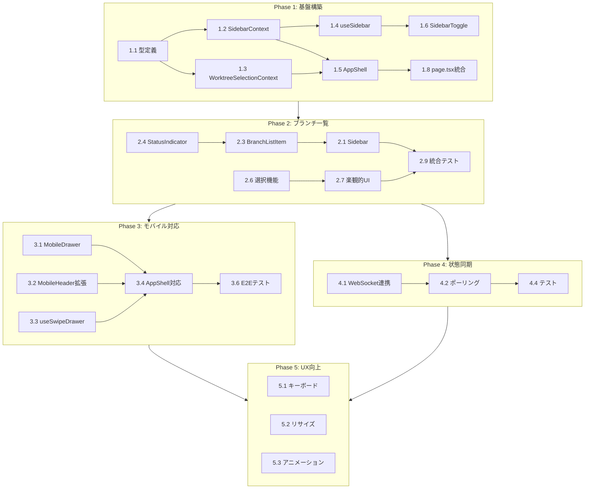

# 作業計画書: Issue #22 マルチタスク強化

## Issue概要

| 項目 | 内容 |
|------|------|
| **Issue番号** | #22 |
| **タイトル** | マルチタスク強化 |
| **サイズ** | L（Large） |
| **優先度** | High |
| **依存Issue** | なし |
| **設計書** | `dev-reports/design/issue-22-multitask-sidebar-design-policy.md` |
| **レビュー** | `dev-reports/review/2026-01-10-issue-22-architecture-review.md` |

### 要件サマリ

| 要件ID | 要件 |
|--------|------|
| R1 | サイドバーからブランチを選択可能にする |
| R2 | サイドバーの表示・非表示を切り替え可能にする |
| R3 | ブランチの状況（応答待ち、応答済み）をサイドバーから確認可能にする |
| R4 | モバイルでもサイドバーを表示可能にする（デフォルト非表示） |

---

## 推奨: サブIssueへの分割

Issue #22 は大規模な機能のため、以下の5つのサブIssueに分割することを推奨します。

| サブIssue | タイトル | サイズ | 依存 |
|-----------|---------|-------|------|
| #22-1 | サイドバー基盤構築（Context + AppShell） | M | なし |
| #22-2 | ブランチ一覧コンポーネント | M | #22-1 |
| #22-3 | モバイルドロワー対応 | M | #22-1, #22-2 |
| #22-4 | リアルタイム状態同期 | S | #22-2 |
| #22-5 | UX向上（キーボード、リサイズ） | S | #22-1〜4 |

---

## Phase 1: 基盤構築（サブIssue #22-1 相当）

### タスク一覧

| タスクID | タスク | 成果物 | 依存 |
|---------|--------|--------|------|
| 1.1 | 型定義作成 | `src/types/sidebar.ts` | なし |
| 1.2 | SidebarContext 実装 | `src/contexts/SidebarContext.tsx` | 1.1 |
| 1.3 | WorktreeSelectionContext 実装 | `src/contexts/WorktreeSelectionContext.tsx` | 1.1 |
| 1.4 | useSidebar hook 実装 | `src/hooks/useSidebar.ts` | 1.2 |
| 1.5 | AppShell コンポーネント実装 | `src/components/layout/AppShell.tsx` | 1.2, 1.3 |
| 1.6 | SidebarToggle コンポーネント実装 | `src/components/layout/SidebarToggle.tsx` | 1.4 |
| 1.7 | 単体テスト | `tests/unit/contexts/*.test.ts` | 1.2, 1.3 |
| 1.8 | page.tsx 統合 | `src/app/page.tsx` | 1.5 |

### タスク詳細

#### Task 1.1: 型定義作成

```typescript
// src/types/sidebar.ts
export type BranchStatus = 'idle' | 'running' | 'waiting' | 'generating';

export interface SidebarBranchItem {
  id: string;
  name: string;
  repositoryName: string;
  status: BranchStatus;
  hasUnread: boolean;
  lastActivity?: Date;
}

export function toBranchItem(worktree: Worktree): SidebarBranchItem;
```

#### Task 1.2: SidebarContext 実装

```typescript
// src/contexts/SidebarContext.tsx
interface SidebarState {
  isOpen: boolean;
  width: number;
  isMobileDrawerOpen: boolean;
}

interface SidebarContextValue {
  state: SidebarState;
  toggle: () => void;
  openMobileDrawer: () => void;
  closeMobileDrawer: () => void;
}
```

#### Task 1.3: WorktreeSelectionContext 実装

```typescript
// src/contexts/WorktreeSelectionContext.tsx
interface WorktreeSelectionState {
  selectedWorktreeId: string | null;
  worktrees: Worktree[];
  selectedWorktreeDetail: Worktree | null;
  isLoadingDetail: boolean;
  error: string | null;
}
```

### Definition of Done (Phase 1)

- [ ] 型定義ファイル作成完了
- [ ] SidebarContext 実装・テスト完了
- [ ] WorktreeSelectionContext 実装・テスト完了
- [ ] AppShell でサイドバー開閉動作確認
- [ ] localStorage でサイドバー状態永続化
- [ ] lint / type-check パス

---

## Phase 2: ブランチ一覧（サブIssue #22-2 相当）

### タスク一覧

| タスクID | タスク | 成果物 | 依存 |
|---------|--------|--------|------|
| 2.1 | Sidebar コンポーネント実装 | `src/components/layout/Sidebar.tsx` | Phase 1 |
| 2.2 | SidebarHeader 実装 | `src/components/sidebar/SidebarHeader.tsx` | なし |
| 2.3 | BranchListItem 実装 | `src/components/sidebar/BranchListItem.tsx` | 1.1 |
| 2.4 | BranchStatusIndicator 実装 | `src/components/sidebar/BranchStatusIndicator.tsx` | 1.1 |
| 2.5 | SearchInput 実装 | `src/components/sidebar/SearchInput.tsx` | なし |
| 2.6 | ブランチ選択機能実装 | `src/contexts/WorktreeSelectionContext.tsx` | 1.3 |
| 2.7 | 楽観的UI更新実装 | 同上 | 2.6 |
| 2.8 | 単体テスト | `tests/unit/components/sidebar/*.test.tsx` | 2.3, 2.4 |
| 2.9 | 統合テスト | `tests/integration/sidebar.test.tsx` | 2.1〜2.7 |

### タスク詳細

#### Task 2.3: BranchListItem 実装

```typescript
// src/components/sidebar/BranchListItem.tsx
interface BranchListItemProps {
  branch: SidebarBranchItem;
  isSelected: boolean;
  onClick: () => void;
}
```

#### Task 2.4: BranchStatusIndicator 実装

```typescript
// src/components/sidebar/BranchStatusIndicator.tsx
const statusConfig: Record<BranchStatus, { color: string; label: string; animate?: boolean }> = {
  idle: { color: 'bg-gray-500', label: 'Idle' },
  running: { color: 'bg-green-500', label: 'Running', animate: true },
  waiting: { color: 'bg-yellow-500', label: 'Waiting', animate: true },
  generating: { color: 'bg-blue-500', label: 'Generating', animate: true },
};
```

### Definition of Done (Phase 2)

- [ ] Sidebar コンポーネント表示確認
- [ ] ブランチ一覧表示・検索動作確認
- [ ] ブランチ選択でメインコンテンツ切り替え確認
- [ ] 楽観的UI更新（ローディング表示）確認
- [ ] ステータスインジケーター表示確認
- [ ] 単体テスト・統合テストパス

---

## Phase 3: モバイル対応（サブIssue #22-3 相当）

### タスク一覧

| タスクID | タスク | 成果物 | 依存 |
|---------|--------|--------|------|
| 3.1 | MobileDrawer 実装 | `src/components/mobile/MobileDrawer.tsx` | Phase 1 |
| 3.2 | MobileHeader 拡張 | `src/components/mobile/MobileHeader.tsx` | なし |
| 3.3 | useSwipeDrawer hook 実装 | `src/hooks/useSwipeDrawer.ts` | 既存 useSwipeGesture |
| 3.4 | AppShell モバイル対応 | `src/components/layout/AppShell.tsx` | 3.1, 3.2 |
| 3.5 | 単体テスト | `tests/unit/components/mobile/*.test.tsx` | 3.1, 3.2 |
| 3.6 | E2Eテスト（モバイル） | `tests/e2e/mobile-drawer.test.ts` | 3.1〜3.4 |

### タスク詳細

#### Task 3.1: MobileDrawer 実装

```typescript
// src/components/mobile/MobileDrawer.tsx
interface MobileDrawerProps {
  isOpen: boolean;
  onClose: () => void;
  children: React.ReactNode;
}
```

#### Task 3.2: MobileHeader 拡張（後方互換性対応）

```typescript
// onMenuClick をオプショナルに
interface MobileHeaderProps {
  worktreeName: string;
  status: WorktreeStatus;
  onBackClick?: () => void;
  onMenuClick?: () => void;  // オプショナル
}
```

### Definition of Done (Phase 3)

- [ ] モバイルでドロワー開閉動作確認
- [ ] ハンバーガーメニュータップでドロワー表示
- [ ] オーバーレイタップでドロワー閉じる
- [ ] ブランチ選択でドロワー閉じる
- [ ] スワイプジェスチャー動作確認
- [ ] 既存MobileHeader使用箇所に影響なし
- [ ] E2Eテストパス

---

## Phase 4: 状態同期（サブIssue #22-4 相当）

### タスク一覧

| タスクID | タスク | 成果物 | 依存 |
|---------|--------|--------|------|
| 4.1 | WebSocket連携 | `src/contexts/WorktreeSelectionContext.tsx` | Phase 2 |
| 4.2 | ポーリング更新実装 | 同上 | 4.1 |
| 4.3 | ステータス変換ロジック | `src/types/sidebar.ts` | なし |
| 4.4 | リアルタイム更新テスト | `tests/integration/realtime-status.test.tsx` | 4.1, 4.2 |

### タスク詳細

#### Task 4.1: WebSocket連携

```typescript
// 既存useWebSocketを活用
const handleWebSocketMessage = useCallback((message: WebSocketMessage) => {
  if (message.data?.type === 'session_status_changed') {
    dispatch({ type: 'UPDATE_WORKTREE_STATUS', payload: message.data });
  }
}, []);
```

### Definition of Done (Phase 4)

- [ ] ブランチステータスがリアルタイム更新される
- [ ] WebSocketメッセージで即時反映
- [ ] ポーリングでバックグラウンド更新
- [ ] 統合テストパス

---

## Phase 5: UX向上（サブIssue #22-5 相当）

### タスク一覧

| タスクID | タスク | 成果物 | 依存 |
|---------|--------|--------|------|
| 5.1 | キーボードショートカット | `src/hooks/useSidebarKeyboard.ts` | Phase 1 |
| 5.2 | サイドバーリサイズ | `src/components/layout/SidebarResizer.tsx` | Phase 1 |
| 5.3 | アニメーション調整 | 各コンポーネント | Phase 1〜4 |
| 5.4 | アクセシビリティ対応 | 各コンポーネント | Phase 1〜4 |

### タスク詳細

#### Task 5.1: キーボードショートカット

| キー | 操作 |
|------|------|
| `Cmd/Ctrl + B` | サイドバー表示/非表示トグル |
| `Cmd/Ctrl + ↑/↓` | ブランチ選択移動 |
| `Enter` | 選択ブランチを開く |
| `Escape` | 検索クリア |

### Definition of Done (Phase 5)

- [ ] キーボードショートカット動作確認
- [ ] サイドバーリサイズ動作確認
- [ ] アニメーションがスムーズ
- [ ] ARIA属性適切に設定

---

## 依存関係図



---

## 品質チェック項目

| チェック項目 | コマンド | 基準 |
|-------------|----------|------|
| ESLint | `npm run lint` | エラー0件 |
| TypeScript | `npx tsc --noEmit` | 型エラー0件 |
| Unit Test | `npm run test:unit` | 全テストパス |
| Integration Test | `npm run test:integration` | 全テストパス |
| E2E Test | `npm run test:e2e` | 全テストパス |
| Build | `npm run build` | 成功 |

---

## 成果物チェックリスト

### コード

#### Phase 1
- [ ] `src/types/sidebar.ts`
- [ ] `src/contexts/SidebarContext.tsx`
- [ ] `src/contexts/WorktreeSelectionContext.tsx`
- [ ] `src/hooks/useSidebar.ts`
- [ ] `src/components/layout/AppShell.tsx`
- [ ] `src/components/layout/SidebarToggle.tsx`

#### Phase 2
- [ ] `src/components/layout/Sidebar.tsx`
- [ ] `src/components/sidebar/SidebarHeader.tsx`
- [ ] `src/components/sidebar/BranchListItem.tsx`
- [ ] `src/components/sidebar/BranchStatusIndicator.tsx`
- [ ] `src/components/sidebar/SearchInput.tsx`

#### Phase 3
- [ ] `src/components/mobile/MobileDrawer.tsx`
- [ ] `src/components/mobile/MobileHeader.tsx`（拡張）
- [ ] `src/hooks/useSwipeDrawer.ts`

#### Phase 4
- [ ] WebSocket連携コード
- [ ] ポーリング更新コード

#### Phase 5
- [ ] `src/hooks/useSidebarKeyboard.ts`
- [ ] `src/components/layout/SidebarResizer.tsx`

### テスト
- [ ] `tests/unit/contexts/SidebarContext.test.tsx`
- [ ] `tests/unit/contexts/WorktreeSelectionContext.test.tsx`
- [ ] `tests/unit/components/sidebar/*.test.tsx`
- [ ] `tests/integration/sidebar.test.tsx`
- [ ] `tests/e2e/mobile-drawer.test.ts`
- [ ] `tests/e2e/sidebar-desktop.test.ts`

---

## Definition of Done (Issue #22 全体)

- [ ] すべてのPhase完了
- [ ] 単体テストカバレッジ80%以上
- [ ] CIチェック全パス（lint, type-check, test, build）
- [ ] デスクトップ・モバイル両対応確認
- [ ] コードレビュー承認
- [ ] 設計書との整合性確認

---

## 次のアクション

1. **サブIssue作成**: `/issue-create` でサブIssueを一括作成
2. **ブランチ作成**: `feature/22-multitask-sidebar`
3. **Phase 1 開始**: `/tdd-impl` でTDD実装開始
4. **進捗報告**: 各Phase完了時に `/progress-report` 実行

---

## 参照ドキュメント

- 設計書: `dev-reports/design/issue-22-multitask-sidebar-design-policy.md`
- レビュー: `dev-reports/review/2026-01-10-issue-22-architecture-review.md`
