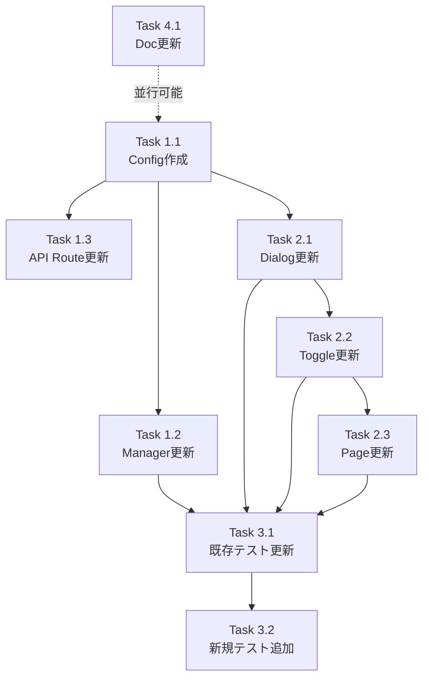

# 作業計画: Issue #225 Auto-Yes有効時間選択機能

## Issue概要

**Issue番号**: #225
**タイトル**: auto yesオンに設定時、1時間、3時間、8時間から選択可能にしたい
**サイズ**: M（中規模）
**優先度**: Medium
**ラベル**: feature

### 概要

Auto-Yesモード有効化時に、有効時間を「1時間」「3時間」「8時間」から選択できるようにする機能追加。現在の1時間固定（ハードコード）から、用途に応じた時間選択を可能にする。

### 依存Issue

- #61 Auto-Yesモード追加（完了済み）
- #138 バックグラウンドポーリング（完了済み）
- #153 ホットリロード状態不整合（完了済み）

### 設計文書

- `dev-reports/design/issue-225-auto-yes-duration-selection-design-policy.md` （Stage 1/2/3/4レビュー完了、スコア平均3.5/5）

---

## 実装タスク分解

### Phase 1: コア実装（ボトムアップアプローチ）

#### Task 1.1: 共有Config作成 【基盤】

- **成果物**: `src/config/auto-yes-config.ts`（新規作成）
- **依存**: なし
- **工数**: 0.5h
- **内容**:
  - `ALLOWED_DURATIONS` 定数配列（1h/3h/8h）
  - `AutoYesDuration` リテラルユニオン型
  - `DEFAULT_AUTO_YES_DURATION` 定数（1時間）
  - `DURATION_LABELS` レコード型（日本語ラベル）
- **検証**:
  - TypeScript型チェック通過
  - ALLOWED_DURATIONS.length === 3
  - DEFAULT_AUTO_YES_DURATION === 3600000

#### Task 1.2: サーバーロジック更新 【コア】

- **成果物**: `src/lib/auto-yes-manager.ts`
- **依存**: Task 1.1
- **工数**: 1.5h
- **内容**:
  - `AUTO_YES_TIMEOUT_MS` 定数を削除（L68） [MF-001]
  - `DEFAULT_AUTO_YES_DURATION` をimport
  - `setAutoYesEnabled(worktreeId, enabled, duration?: AutoYesDuration)` シグネチャ変更
  - `AutoYesState` interface JSDocコメント更新（L26）
  - `expiresAt` 計算を `duration ?? DEFAULT_AUTO_YES_DURATION` に変更
- **検証**:
  - `AUTO_YES_TIMEOUT_MS` が grep で検出されないこと
  - setAutoYesEnabled(id, true) → デフォルト1時間
  - setAutoYesEnabled(id, true, 10800000) → 3時間
  - TypeScript型チェック通過

#### Task 1.3: API Route更新 【コア】

- **成果物**: `src/app/api/worktrees/[id]/auto-yes/route.ts`
- **依存**: Task 1.1
- **工数**: 2h
- **内容**:
  - **[SEC-MF-001]** route先頭に `isValidWorktreeId(params.id)` 追加（format validation）
  - **[SEC-SF-001]** JSON parse エラーハンドリング（400レスポンス）
  - **[SEC-SF-002]** `typeof body.duration === 'number'` チェック追加
  - `ALLOWED_DURATIONS.includes(body.duration)` バリデーション追加
  - 不正duration値で400エラーレスポンス返却
  - `setAutoYesEnabled(params.id, body.enabled, body.duration)` 呼び出し更新
- **検証**:
  - POSTリクエスト `{enabled: true, duration: 10800000}` → 200 OK
  - POSTリクエスト `{enabled: true, duration: 999999}` → 400 Bad Request
  - duration省略時 → デフォルト3600000適用
  - 不正JSON → 400 Bad Request

### Phase 2: UIコンポーネント実装

#### Task 2.1: 確認ダイアログ更新 【UI-Core】

- **成果物**: `src/components/worktree/AutoYesConfirmDialog.tsx`
- **依存**: Task 1.1
- **工数**: 2h
- **内容**:
  - `ALLOWED_DURATIONS`, `DURATION_LABELS` をimport
  - `onConfirm: (duration: AutoYesDuration) => void` に型変更 [SF-003]
  - `useState<AutoYesDuration>(DEFAULT_AUTO_YES_DURATION)` 追加
  - ラジオボタンUI実装（3択: 1h/3h/8h）
  - 固定テキスト「1時間後に...」を動的テキストに変更（L46）
  - タッチターゲット44px確保（モバイル対応）
- **検証**:
  - ラジオボタンが3つ表示される
  - デフォルト選択が1時間
  - 選択変更で説明テキストが動的に変わる
  - `onConfirm(selectedDuration)` が選択値で呼ばれる

#### Task 2.2: トグルコンポーネント更新 【UI-Core】

- **成果物**: `src/components/worktree/AutoYesToggle.tsx`
- **依存**: Task 1.1, Task 2.1
- **工数**: 2.5h
- **内容**:
  - `onToggle: (enabled: boolean, duration?: AutoYesDuration) => Promise<void>` 型変更 [SF-003]
  - `handleConfirm(duration: AutoYesDuration)` シグネチャ変更
  - `onConfirm={handleConfirm}` で duration を受け取り `onToggle(true, duration)` に伝搬
  - `formatTimeRemaining()` 関数を HH:MM:SS 対応に変更（L32-37）
    - 1時間未満: MM:SS（既存）
    - 1時間以上: H:MM:SS（新規）
- **検証**:
  - `formatTimeRemaining(Date.now() + 3600000)` → "59:59" 形式
  - `formatTimeRemaining(Date.now() + 3600001)` → "1:00:00" 形式
  - `formatTimeRemaining(Date.now() + 28800000)` → "8:00:00" 形式
  - duration伝搬が正しく動作する

#### Task 2.3: ページコンポーネント更新 【UI-Integration】

- **成果物**: `src/components/worktree/WorktreeDetailRefactored.tsx`
- **依存**: Task 2.2
- **工数**: 1h
- **内容**:
  - `handleAutoYesToggle(enabled: boolean, duration?: AutoYesDuration)` シグネチャ変更 [SF-003]
  - API呼び出し body に `duration` フィールド追加（L1154）
- **検証**:
  - fetch body に duration が含まれる
  - duration省略時の動作確認

### Phase 3: テスト実装・更新

#### Task 3.1: 既存テスト更新 【Test-Fix】

- **成果物**:
  - `tests/unit/lib/auto-yes-manager.test.ts`
  - `tests/unit/components/worktree/AutoYesConfirmDialog.test.tsx`
  - `tests/unit/components/worktree/AutoYesToggle.test.tsx`
  - `tests/unit/components/WorktreeDetailRefactored.test.tsx`
- **依存**: Task 1.2, 2.1, 2.2, 2.3
- **工数**: 2.5h
- **内容**:

**auto-yes-manager.test.ts**:
- L64: `expect(state.expiresAt).toBe(now + 3600000)` → `DEFAULT_AUTO_YES_DURATION` 参照に変更
- 新規テストケース:
  - `setAutoYesEnabled(id, true, 10800000)` → 3時間
  - `setAutoYesEnabled(id, true, 28800000)` → 8時間
  - `setAutoYesEnabled(id, true)` → デフォルト1時間（後方互換）
  - `AUTO_YES_TIMEOUT_MS` が export されていないことを確認

**AutoYesConfirmDialog.test.tsx** [Stage 3 MF-002]:
- L66: `expect(onConfirm).toHaveBeenCalledWith(3600000)` に変更
- ラジオボタンUI選択テスト追加
- 動的テキスト変化テスト追加

**AutoYesToggle.test.tsx** [Stage 3 MF-002]:
- L43: `expect(onToggle).toHaveBeenCalledWith(true, 3600000)` に変更
- duration伝搬テスト追加
- formatTimeRemaining HH:MM:SS形式テスト追加

**WorktreeDetailRefactored.test.tsx** [Stage 3 SF-001]:
- AutoYesToggleモックの新シグネチャ互換性確認・更新

- **検証**:
  - 全既存テストがパス
  - TypeScript型エラー0件

#### Task 3.2: 新規テスト追加 【Test-New】

- **成果物**:
  - `tests/integration/auto-yes-persistence.test.ts`（カスタムduration永続性テスト追加）
- **依存**: Task 3.1
- **工数**: 1h
- **内容**:
  - カスタムduration（3時間）のモジュールリロード後永続性テスト [Stage 3 SF-004]
  - デフォルトduration適用の既存テスト動作維持確認
- **検証**:
  - 統合テスト全パス
  - カスタムduration永続性が保証される

### Phase 4: ドキュメント更新

#### Task 4.1: ユーザーガイド更新 【Doc】

- **成果物**:
  - `docs/user-guide/webapp-guide.md`
  - `docs/TRUST_AND_SAFETY.md`
- **依存**: なし（並行作業可能）
- **工数**: 1h
- **内容**:

**webapp-guide.md**:
- Auto Yesモードセクションに有効時間選択UIの説明追加
- 1時間/3時間/8時間の選択肢とデフォルト値の記載

**TRUST_AND_SAFETY.md** [SEC-SF-003]:
- 最大有効時間8時間拡大の注記
- リスクシナリオ:
  - 離席中の広範なファイル操作自動承認
  - 予期しないワークツリー外操作
  - 長時間自動応答の蓄積
- ベストプラクティス:
  - 最小権限の時間選択
  - CM_ROOT_DIRの限定設定
  - 離席時のOFF推奨
  - 8時間使用の想定ユースケース

- **検証**:
  - マークダウン形式チェック
  - リンク切れ確認

---

## タスク依存関係図



---

## 工数見積もり

| Phase | Task | 工数 | 累計 |
|-------|------|------|------|
| **Phase 1** | Task 1.1 | 0.5h | 0.5h |
| | Task 1.2 | 1.5h | 2h |
| | Task 1.3 | 2h | 4h |
| **Phase 2** | Task 2.1 | 2h | 6h |
| | Task 2.2 | 2.5h | 8.5h |
| | Task 2.3 | 1h | 9.5h |
| **Phase 3** | Task 3.1 | 2.5h | 12h |
| | Task 3.2 | 1h | 13h |
| **Phase 4** | Task 4.1 | 1h | 14h |
| **合計** | | **14時間** | |

**想定期間**: 2日間（実質作業時間14時間）

---

## 品質チェック項目

| チェック項目 | コマンド | 基準 | Phase |
|-------------|----------|------|-------|
| **TypeScript** | `npx tsc --noEmit` | 型エラー0件 | 全Phase |
| **ESLint** | `npm run lint` | エラー0件 | 全Phase |
| **Unit Tests** | `npm run test:unit` | 全テストパス、カバレッジ80%以上 | Phase 3 |
| **Integration Tests** | `npm run test:integration` | 全テストパス | Phase 3 |
| **Build** | `npm run build` | 成功 | 最終 |

---

## 成果物チェックリスト

### コード

- [ ] `src/config/auto-yes-config.ts` （新規）
- [ ] `src/lib/auto-yes-manager.ts` （AUTO_YES_TIMEOUT_MS削除、duration追加）
- [ ] `src/app/api/worktrees/[id]/auto-yes/route.ts` （バリデーション追加）
- [ ] `src/components/worktree/AutoYesConfirmDialog.tsx` （ラジオボタンUI）
- [ ] `src/components/worktree/AutoYesToggle.tsx` （duration伝搬、HH:MM:SS対応）
- [ ] `src/components/worktree/WorktreeDetailRefactored.tsx` （API呼び出し更新）

### テスト

- [ ] `tests/unit/lib/auto-yes-manager.test.ts` （更新・追加）
- [ ] `tests/unit/components/worktree/AutoYesConfirmDialog.test.tsx` （更新・追加）
- [ ] `tests/unit/components/worktree/AutoYesToggle.test.tsx` （更新・追加）
- [ ] `tests/unit/components/WorktreeDetailRefactored.test.tsx` （mock更新）
- [ ] `tests/integration/auto-yes-persistence.test.ts` （カスタムduration永続性テスト追加）

### ドキュメント

- [ ] `docs/user-guide/webapp-guide.md` （有効時間選択UI説明追加）
- [ ] `docs/TRUST_AND_SAFETY.md` （8時間リスク評価・ベストプラクティス追加）

---

## Definition of Done

### 機能要件

- [ ] Auto-Yes有効化ダイアログに1時間/3時間/8時間のラジオボタンが表示される
- [ ] デフォルト選択が1時間である
- [ ] 選択した時間に応じてexpiresAtが正しく設定される
- [ ] カウントダウンタイマーが選択時間に基づいて動作する（HH:MM:SS形式対応）
- [ ] AutoYesConfirmDialogの説明テキストが選択時間に応じて動的に変わる

### セキュリティ要件

- [ ] 許可されていないduration値がAPIで400エラーで拒否される
- [ ] worktreeId format validation（alphanumeric）がroute先頭で実行される
- [ ] JSON parse エラーが400レスポンスを返す
- [ ] duration型チェックがALLOWED_DURATIONS検証前に実行される

### 互換性要件

- [ ] duration未指定時にデフォルト値（3600000）が適用される（後方互換性）
- [ ] 既存のAuto-Yes動作（自動応答、ポーリング、重複防止）に影響がない

### 品質要件

- [ ] TypeScript型エラー0件（`npx tsc --noEmit`）
- [ ] ESLint エラー0件（`npm run lint`）
- [ ] Unit Tests全パス、カバレッジ80%以上（`npm run test:unit`）
- [ ] Integration Tests全パス（`npm run test:integration`）
- [ ] ビルド成功（`npm run build`）
- [ ] `AUTO_YES_TIMEOUT_MS` が grep で検出されない（削除確認）

### レビュー要件

- [ ] コードレビュー承認
- [ ] セキュリティレビュー承認（Stage 4指摘事項実装確認）
- [ ] モバイル表示確認（ラジオボタンUI）

### ドキュメント要件

- [ ] ユーザーガイド更新完了
- [ ] TRUST_AND_SAFETY.md更新完了（リスク評価・ベストプラクティス記載）

---

## セキュリティチェックリスト（Stage 4対応）

### 入力バリデーション（Defense-in-Depth）

- [ ] **[SEC-MF-001]** route.ts先頭でworktreeId format validation（`isValidWorktreeId(params.id)`）
- [ ] **[SEC-SF-001]** JSON parse エラーハンドリング（400レスポンス）
- [ ] **[SEC-SF-002]** `typeof body.duration === 'number'` チェック
- [ ] `ALLOWED_DURATIONS.includes(body.duration)` ホワイトリストチェック

### エラーメッセージ

- [ ] **[SEC-MF-002]** user-input reflection（`Worktree '${worktreeId}' not found`）が format validation でブロックされる

### UI安全性

- [ ] **[SEC-SF-004]** `lastAutoResponse` 表示がReact JSXエスケープされている
- [ ] `resolveAutoAnswer()` 出力が制約されている（"y"/"n"/"数字"のみ）

---

## リスク管理

| リスク | 影響 | 対策 |
|-------|------|------|
| AUTO_YES_TIMEOUT_MS削除漏れ | 高 | grep検証・回帰テスト実施 |
| 既存テストassertion更新漏れ | 中 | Stage 3 MF-002チェックリスト確認 |
| formatTimeRemaining HH:MM:SS対応不足 | 低 | 専用ユニットテスト実施 |
| モバイルUI崩れ | 中 | 実機確認・タッチターゲット44px確保 |
| duration型安全性 | 低 | AutoYesDuration型を全コールバックで使用 |

---

## 次のアクション

### 1. ブランチ作成

```bash
git checkout main
git pull origin main
git checkout -b feature/225-auto-yes-duration-selection
```

### 2. Task実行順序

```
Task 1.1 → Task 1.2 → Task 1.3
  ↓
Task 2.1 → Task 2.2 → Task 2.3
  ↓
Task 3.1 → Task 3.2
  ↓
Task 4.1
```

並行可能: Task 4.1 は Phase 1開始時から並行作業可能

### 3. 定期的な品質チェック

各Task完了時:
```bash
npx tsc --noEmit
npm run lint
npm run test:unit
```

### 4. 進捗報告

Phase 1/2/3完了時に `/progress-report` で進捗報告推奨

### 5. PR作成

全Task完了・DoD確認後:
```bash
/create-pr
```

---

## 参考資料

- **設計方針書**: `dev-reports/design/issue-225-auto-yes-duration-selection-design-policy.md`
- **Issue URL**: https://github.com/Kewton/CommandMate/issues/225
- **レビューレポート**:
  - Stage 1: `dev-reports/review/2026-02-10-issue225-architecture-review.md`
  - Stage 2: `dev-reports/review/2026-02-10-issue225-consistency-review-stage2.md`
  - Stage 3: `dev-reports/review/2026-02-10-issue225-impact-analysis-review-stage3.md`
  - Stage 4: `dev-reports/review/2026-02-10-issue225-security-review-stage4.md`

---

*Generated by work-plan skill for Issue #225*
*Date: 2026-02-10*
*Estimated Duration: 14 hours (2 days)*
