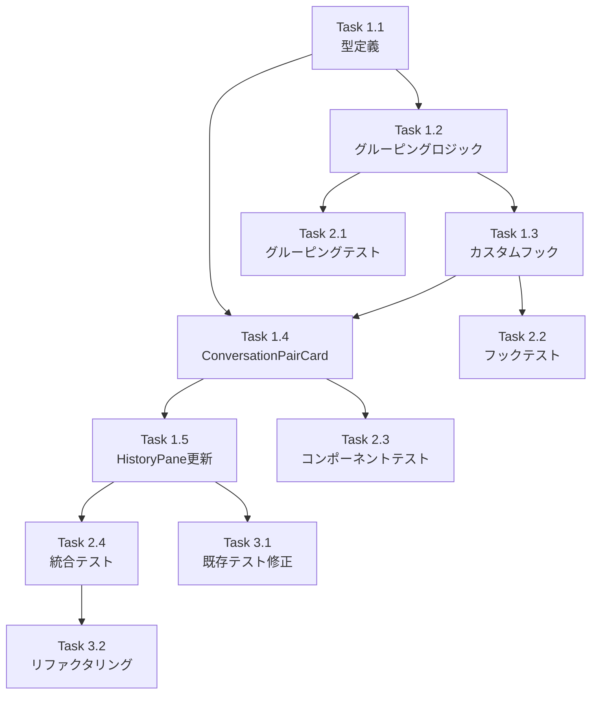

# Issue #23: History表示改善 - 作業計画書

## Issue概要

| 項目 | 内容 |
|------|------|
| **Issue番号** | #23 |
| **タイトル** | History表示改善 |
| **サイズ** | M（Medium） |
| **優先度** | Medium |
| **依存Issue** | なし |

### 要件
ユーザーインプットとAssistantからの回答を1:1の対応関係となるように表示する。現状はメッセージがバラバラに表示されている。

### 設計方針
- **アプローチ**: UI層での動的グルーピング
- **DB変更**: なし
- **設計書**: `dev-reports/design/issue-23-history-display-improvement-design-policy.md`
- **レビュー**: `dev-reports/review/2026-01-09-issue-23-architecture-review.md`

---

## 詳細タスク分解

### Phase 1: コア機能実装

#### Task 1.1: 型定義の追加
- **成果物**: `src/types/conversation.ts`
- **依存**: なし
- **内容**:
  - `ConversationPair` インターフェース
  - `ConversationStatus` 型
  - `ConversationHistory` 型
  - ヘルパー関数の型定義

```typescript
// 主要な型定義
interface ConversationPair {
  id: string;
  userMessage: ChatMessage | null;
  assistantMessages: ChatMessage[];
  status: 'pending' | 'completed' | 'orphan';
}
```

#### Task 1.2: グルーピングロジック実装
- **成果物**: `src/lib/conversation-grouper.ts`
- **依存**: Task 1.1
- **内容**:
  - `groupMessagesIntoPairs()` 関数
  - ヘルパー関数群
    - `isCompletedPair()`
    - `isPendingPair()`
    - `isOrphanPair()`
    - `getCombinedAssistantContent()`

#### Task 1.3: カスタムフック作成
- **成果物**: `src/hooks/useConversationHistory.ts`
- **依存**: Task 1.2
- **内容**:
  - `useConversationHistory` フック
  - メモ化されたグルーピング処理
  - 展開/折り畳み状態管理

#### Task 1.4: ConversationPairCardコンポーネント作成
- **成果物**: `src/components/worktree/ConversationPairCard.tsx`
- **依存**: Task 1.1, Task 1.3
- **内容**:
  - 会話ペア表示カード
  - ユーザーメッセージセクション
  - Assistantメッセージセクション（複数対応）
  - 孤立メッセージ表示
  - 展開/折り畳み機能

#### Task 1.5: HistoryPane更新
- **成果物**: `src/components/worktree/HistoryPane.tsx`（既存ファイル変更）
- **依存**: Task 1.4
- **内容**:
  - ConversationPairCardを使用するように変更
  - 既存のMessageItem表示からの移行

---

### Phase 2: テスト実装

#### Task 2.1: グルーピングロジックの単体テスト
- **成果物**: `src/lib/__tests__/conversation-grouper.test.ts`
- **依存**: Task 1.2
- **カバレッジ目標**: 90%以上
- **テストケース**:
  - 基本的なUser-Assistantペアリング
  - 回答待ち状態（pending）
  - 連続Assistantメッセージ
  - 孤立Assistantメッセージ
  - タイムスタンプ順序異常
  - 空配列処理
  - 単一メッセージ処理

#### Task 2.2: カスタムフックのテスト
- **成果物**: `src/hooks/__tests__/useConversationHistory.test.ts`
- **依存**: Task 1.3
- **内容**:
  - メモ化の動作確認
  - 展開/折り畳み状態管理

#### Task 2.3: コンポーネントテスト
- **成果物**: `src/components/worktree/__tests__/ConversationPairCard.test.tsx`
- **依存**: Task 1.4
- **テストケース**:
  - 通常の会話ペア表示
  - 回答待ち状態表示
  - 複数Assistantメッセージ表示
  - 孤立メッセージ表示
  - 展開/折り畳み動作
  - ファイルパスクリック

#### Task 2.4: 統合テスト
- **成果物**: `src/components/worktree/__tests__/HistoryPane.integration.test.tsx`
- **依存**: Task 1.5
- **内容**:
  - HistoryPane全体の動作確認
  - メッセージグルーピングの表示確認

---

### Phase 3: 仕上げ

#### Task 3.1: 既存テストの修正
- **成果物**: 既存テストファイルの修正
- **依存**: Task 1.5
- **内容**:
  - HistoryPaneの既存テストを新構造に対応

#### Task 3.2: リファクタリング（オプション）
- **成果物**: コード品質改善
- **依存**: Phase 2完了
- **内容**:
  - 不要なコードの削除
  - パフォーマンス最適化確認

---

## タスク依存関係



---

## 実装順序（推奨）

### Day 1: コア実装
1. Task 1.1: 型定義
2. Task 1.2: グルーピングロジック
3. Task 2.1: グルーピングテスト（TDD）

### Day 2: UI実装
4. Task 1.3: カスタムフック
5. Task 1.4: ConversationPairCard
6. Task 2.3: コンポーネントテスト

### Day 3: 統合・仕上げ
7. Task 1.5: HistoryPane更新
8. Task 2.4: 統合テスト
9. Task 3.1: 既存テスト修正
10. Task 3.2: リファクタリング

---

## 品質チェック項目

| チェック項目 | コマンド | 基準 |
|-------------|----------|------|
| ESLint | `npm run lint` | エラー0件 |
| TypeScript | `npx tsc --noEmit` | 型エラー0件 |
| Unit Test | `npm run test:unit` | 全テストパス |
| Build | `npm run build` | 成功 |

### 追加チェック
- [ ] 連続Assistantメッセージが正しくグループ化される
- [ ] 孤立Assistantメッセージが適切に表示される
- [ ] 回答待ち状態が視覚的に分かる
- [ ] 展開/折り畳み機能が動作する
- [ ] ファイルパスクリックが機能する

---

## 成果物チェックリスト

### コード
- [ ] `src/types/conversation.ts` - 型定義
- [ ] `src/lib/conversation-grouper.ts` - グルーピングロジック
- [ ] `src/hooks/useConversationHistory.ts` - カスタムフック
- [ ] `src/components/worktree/ConversationPairCard.tsx` - 会話カード
- [ ] `src/components/worktree/HistoryPane.tsx` - 更新

### テスト
- [ ] `src/lib/__tests__/conversation-grouper.test.ts`
- [ ] `src/hooks/__tests__/useConversationHistory.test.ts`
- [ ] `src/components/worktree/__tests__/ConversationPairCard.test.tsx`
- [ ] `src/components/worktree/__tests__/HistoryPane.integration.test.tsx`

### ドキュメント
- [x] 設計方針書（作成済み）
- [x] アーキテクチャレビュー（完了済み）
- [ ] 作業計画書（本ドキュメント）

---

## Definition of Done

Issue #23 完了条件：

### 機能要件
- [ ] ユーザー入力とAssistant回答が1:1でグループ表示される
- [ ] 連続するAssistantメッセージが同じグループに表示される
- [ ] 孤立Assistantメッセージが適切に表示される
- [ ] 回答待ち状態が視覚的に分かる

### 品質要件
- [ ] 単体テストカバレッジ80%以上
- [ ] CIチェック全パス（lint, type-check, test, build）
- [ ] 既存機能の破壊なし（リグレッションなし）

### プロセス要件
- [ ] コードレビュー承認
- [ ] PR作成・マージ

---

## リスクと対策

| リスク | 影響度 | 対策 |
|--------|--------|------|
| 既存テストの破壊 | 中 | Task 3.1で修正対応 |
| パフォーマンス劣化 | 低 | useMemoによるメモ化 |
| 既存UIとの整合性 | 低 | 段階的な移行 |

---

## 次のアクション

作業計画承認後：

1. **ブランチ作成**
   ```bash
   git checkout -b feature/23-history-display-improvement
   ```

2. **TDD実装開始**
   - `/tdd-impl` コマンドで実装

3. **進捗報告**
   - `/progress-report` で定期報告

4. **PR作成**
   - `/create-pr` で自動作成

---

## 関連ドキュメント

- [設計方針書](../../design/issue-23-history-display-improvement-design-policy.md)
- [アーキテクチャレビュー](../../review/2026-01-09-issue-23-architecture-review.md)

---

*作成日: 2026-01-09*
*ステータス: 承認待ち*
