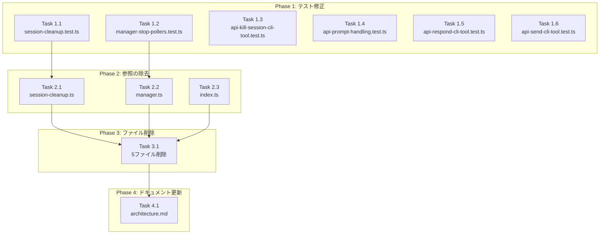

# Issue #237 作業計画書

## Issue概要

**Issue番号**: #237
**タイトル**: 未使用コードの削除・リファクタリング
**サイズ**: M（中規模）
**優先度**: Medium
**リスク**: 低（未使用コードの削除、後継実装は稼働中）

**概要**: 過去の実装で不要になったモジュール5件（約1,900行）を安全に削除し、コードベースの健全性を維持する。

---

## 詳細タスク分解

### Phase 1: テスト修正（安全性確保）

テストファイルのmock/テストケースを修正し、後続の削除作業でテストが失敗しないようにする。

- [ ] **Task 1.1**: `tests/unit/session-cleanup.test.ts` 修正
  - 成果物: `tests/unit/session-cleanup.test.ts`
  - 作業内容:
    - L15-17: `vi.mock('@/lib/claude-poller')` 削除
    - L26: `stopClaudePolling` のimport削除
    - L58-66: `'should stop claude-poller'` テストケース削除
  - 依存: なし
  - 検証: `npm run test:unit -- session-cleanup.test.ts`

- [ ] **Task 1.2**: `tests/unit/cli-tools/manager-stop-pollers.test.ts` 修正
  - 成果物: `tests/unit/cli-tools/manager-stop-pollers.test.ts`
  - 作業内容:
    - L14-17: `vi.mock('@/lib/claude-poller')` 削除
    - L43-71: claude-poller関連テストケース3件削除
      - `'should stop claude-poller only for claude tool'`
      - `'should NOT stop claude-poller for codex tool'`
      - `'should NOT stop claude-poller for gemini tool'`
  - 依存: なし
  - 検証: `npm run test:unit -- manager-stop-pollers.test.ts`

- [ ] **Task 1.3**: `tests/integration/api-kill-session-cli-tool.test.ts` 修正
  - 成果物: `tests/integration/api-kill-session-cli-tool.test.ts`
  - 作業内容: L19-22: `vi.mock('@/lib/claude-poller')` 削除
  - 依存: なし
  - 検証: `npm run test:integration -- api-kill-session-cli-tool.test.ts`

- [ ] **Task 1.4**: `tests/integration/api-prompt-handling.test.ts` 修正
  - 成果物: `tests/integration/api-prompt-handling.test.ts`
  - 作業内容:
    - L53-57: `vi.mock('@/lib/claude-poller')` 削除
    - L239-268: `'should resume polling after responding'` テストケース削除
      - L240: `await import('@/lib/claude-poller')` 動的import
      - L267: `expect(startPolling)` アサーション
  - 依存: なし
  - 検証: `npm run test:integration -- api-prompt-handling.test.ts`

- [ ] **Task 1.5**: `tests/integration/api-respond-cli-tool.test.ts` 修正
  - 成果物: `tests/integration/api-respond-cli-tool.test.ts`
  - 作業内容: L18-21: `vi.mock('@/lib/claude-poller')` 削除
  - 依存: なし
  - 検証: `npm run test:integration -- api-respond-cli-tool.test.ts`

- [ ] **Task 1.6**: `tests/integration/api-send-cli-tool.test.ts` 修正
  - 成果物: `tests/integration/api-send-cli-tool.test.ts`
  - 作業内容: L49-51: `vi.mock('@/lib/claude-poller')` 削除
  - 依存: なし
  - 検証: `npm run test:integration -- api-send-cli-tool.test.ts`

**Phase 1 完了検証**:
```bash
npm run test:unit && npm run test:integration
```

---

### Phase 2: 参照の除去

claude-pollerへの参照を削除し、ソースコードを修正する。

- [ ] **Task 2.1**: `src/lib/session-cleanup.ts` 修正
  - 成果物: `src/lib/session-cleanup.ts`
  - 作業内容:
    - L11: `import { stopPolling as stopClaudePolling } from './claude-poller';` 削除
    - L7: JSDocコメント更新
      - 修正前: `Abstracts the differences between response-poller and claude-poller.`
      - 修正後: `Uses response-poller for CLI tool sessions.`
    - L54: JSDocコメント「3. Stops claude-poller for the worktree」行を削除
    - L100-108: `stopClaudePolling(worktreeId)` 呼び出しとtry/catchブロック全体を削除
    - L110: コメント番号を `// 3. Stop auto-yes-poller` → `// 2. Stop auto-yes-poller` に更新
  - 依存: Task 1.1完了
  - 検証: `npx tsc --noEmit && npm run test:unit -- session-cleanup.test.ts`

- [ ] **Task 2.2**: `src/lib/cli-tools/manager.ts` 修正
  - 成果物: `src/lib/cli-tools/manager.ts`
  - 作業内容:
    - L11: `import { stopPolling as stopClaudePolling } from '../claude-poller';` 削除
    - L175-179: 条件分岐ブロック全体を削除（SF-001対応: L179のFutureコメント含む）
      ```typescript
      // claude-poller is Claude-specific
      if (cliToolId === 'claude') {
        stopClaudePolling(worktreeId);
      }
      // Future: Add other tool-specific pollers here if needed
      ```
  - 依存: Task 1.2完了
  - 検証: `npx tsc --noEmit && npm run test:unit -- manager-stop-pollers.test.ts`

- [ ] **Task 2.3**: `src/components/worktree/index.ts` 修正
  - 成果物: `src/components/worktree/index.ts`
  - 作業内容:
    - L12-13: WorktreeDetailのexport削除
      ```typescript
      export { WorktreeDetail } from './WorktreeDetail';
      export type { WorktreeDetailProps } from './WorktreeDetail';
      ```
  - 依存: なし
  - 検証: `npx tsc --noEmit`

**Phase 2 完了検証**:
```bash
npx tsc --noEmit && npm run test:unit && npm run test:integration
```

---

### Phase 3: ファイル削除

参照がなくなった状態でファイルを削除する。

- [ ] **Task 3.1**: 削除対象ファイル5件の削除
  - 成果物: 以下5ファイルの削除
    - `src/lib/claude-poller.ts` (~400行)
    - `src/lib/terminal-websocket.ts` (~222行)
    - `src/components/worktree/WorktreeDetail.tsx` (~937行)
    - `src/app/worktrees/[id]/simple-terminal/page.tsx` (~91行)
    - `src/components/SimpleTerminal.tsx` (~253行)
  - コマンド:
    ```bash
    rm src/lib/claude-poller.ts
    rm src/lib/terminal-websocket.ts
    rm src/components/worktree/WorktreeDetail.tsx
    rm -r src/app/worktrees/\[id\]/simple-terminal
    rm src/components/SimpleTerminal.tsx
    ```
  - 依存: Task 2.1, 2.2, 2.3完了
  - 検証: `npm run build && npm run test:unit && npm run test:integration`

**Phase 3 完了検証**:
```bash
npm run build && npm run test:unit && npm run test:integration && npm run lint
```

---

### Phase 4: ドキュメント更新

- [ ] **Task 4.1**: `docs/architecture.md` 更新
  - 成果物: `docs/architecture.md`
  - 作業内容:
    - L569: 「response-poller / claude-pollerを停止」→「response-pollerを停止」に更新
  - 依存: Task 3.1完了
  - 検証: 目視確認

**Phase 4 完了検証**:
```bash
git diff docs/architecture.md
```

---

## タスク依存関係



---

## 品質チェック項目

| フェーズ | チェック項目 | コマンド | 基準 |
|---------|-------------|----------|------|
| Phase 1 | Unit Test | `npm run test:unit` | 全テストパス |
| Phase 1 | Integration Test | `npm run test:integration` | 全テストパス |
| Phase 2 | TypeScript | `npx tsc --noEmit` | 型エラー0件 |
| Phase 2 | Unit Test | `npm run test:unit` | 全テストパス |
| Phase 2 | Integration Test | `npm run test:integration` | 全テストパス |
| Phase 3 | Build | `npm run build` | ビルド成功 |
| Phase 3 | TypeScript | `npx tsc --noEmit` | 型エラー0件 |
| Phase 3 | Unit Test | `npm run test:unit` | 全テストパス |
| Phase 3 | Integration Test | `npm run test:integration` | 全テストパス |
| Phase 3 | ESLint | `npm run lint` | エラー0件 |

---

## 成果物チェックリスト

### コード
- [ ] テストファイル6件修正（mock削除、テストケース削除）
- [ ] ソースファイル3件修正（import削除、呼び出しブロック削除、JSDocコメント更新）
- [ ] ファイル5件削除（約1,900行削減）

### ドキュメント
- [ ] `docs/architecture.md` 更新

### 検証
- [ ] TypeScript型チェックパス
- [ ] ESLintエラーなし
- [ ] 全テストパス（unit + integration）
- [ ] ビルド成功
- [ ] 既存機能に影響なし

---

## Definition of Done

Issue完了条件：

- [ ] Phase 1-4のすべてのタスクが完了
- [ ] 削除対象ファイル5件がすべて削除されている
- [ ] 参照ファイルのimport/export/呼び出しが正しく更新されている
- [ ] JSDocコメント更新完了（session-cleanup.ts L7, L54）
- [ ] コメント番号整合性確保（session-cleanup.ts L110）
- [ ] manager.ts Future コメント削除完了（SF-001対応）
- [ ] `npx tsc --noEmit` が成功
- [ ] `npm run lint` がエラーなし
- [ ] `npm run test:unit` が全テストパス
- [ ] `npm run test:integration` が全テストパス
- [ ] `npm run build` が成功
- [ ] 既存機能に影響がない（削除対象は未使用コードのみ）

---

## 次のアクション

作業計画承認後：

1. **ブランチ作成（すでに作成済み）**: `feature/237-worktree`
   ```bash
   git checkout feature/237-worktree
   ```

2. **タスク実行**: Phase 1 → Phase 2 → Phase 3 → Phase 4の順序で実装
   - 各フェーズ後に品質チェックを実施
   - テストが失敗した場合は原因調査し修正

3. **進捗報告**: `/progress-report`で定期報告

4. **PR作成**: `/create-pr`で自動作成
   - PRタイトル: `refactor: 未使用コード削除（claude-poller、terminal-websocket、WorktreeDetail、simple-terminal）`
   - PRラベル: `refactor`

---

## 実装時の注意事項

### MF-001対応（Stage 1設計レビュー）
- ✅ simple-terminal/page.tsx の参照元に WorktreeDetail.tsx (L652, L678) を追記済み
- ✅ WorktreeDetail.tsx と simple-terminal/page.tsx がPhase 3で同時削除されることを確認

### SF-001対応（Stage 1設計レビュー）
- ✅ manager.ts L175-179（L179のFutureコメントを含む）の削除範囲を確認
- **重要**: 実装時にL179 `// Future: Add other tool-specific pollers here if needed` を確実に削除すること

### SF-002対応（Stage 1設計レビュー）
- ✅ 内部ドキュメント（`docs/internal/PROMPT_HANDLING_IMPLEMENTATION_PLAN.md`）のclaude-poller参照更新は本Issueの対象外
- 別途Issueで対応する

### 削除順序の重要性
- **Phase 1（テスト修正）を最初に実施**: テストが失敗しないようにmock/テストケースを先に削除
- **Phase 2（参照除去）を次に実施**: ソースコードからclaude-pollerへの参照を削除
- **Phase 3（ファイル削除）を最後に実施**: 参照がなくなってから実ファイルを削除
- この順序を守ることで、各段階でテストが通る状態を維持できる

---

*Generated by work-plan command for Issue #237*
*Date: 2026-02-11*
*Referenced documents:*
- Issue #237: https://github.com/Kewton/CommandMate/issues/237
- Design Policy: dev-reports/design/issue-237-dead-code-removal-design-policy.md
- Multi-Stage Review: dev-reports/issue/237/multi-stage-design-review/summary-report.md
