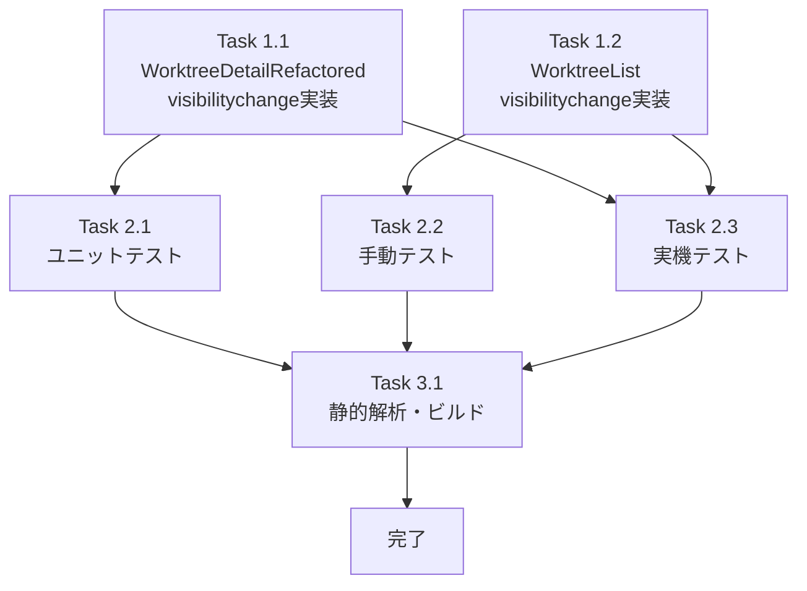

# 作業計画書: Issue #246

## Issue概要

**Issue番号**: #246
**タイトル**: スマホにて再開時Error loading worktreeとなる
**種別**: バグ修正
**サイズ**: M（中規模）
**優先度**: Medium（UXに直接影響）
**ラベル**: bug

### 問題の概要
スマートフォンでブラウザをバックグラウンドにした後、フォアグラウンドに復帰すると「Error loading worktree」エラーが表示される。ブラウザをリロードすると即座に正常に戻る。

### 根本原因
1. `visibilitychange`イベントリスナーの欠如
2. バックグラウンド時のポーリングタイマー停止
3. エラー状態からの自動復帰メカニズムの不在
4. 初期化ガードによる再初期化の防止

### 解決策
`visibilitychange`イベントリスナーを追加し、ページ復帰時に既存の`handleRetry()`関数を呼び出してデータ再取得をトリガーする。

---

## 詳細タスク分解

### Phase 1: 実装タスク

#### Task 1.1: WorktreeDetailRefactored.tsx - visibilitychangeイベントリスナー追加
**担当**: メインタスク
**成果物**: `src/components/worktree/WorktreeDetailRefactored.tsx`
**依存**: なし
**見積**: 2時間

**実装内容**:
- [ ] `RECOVERY_THROTTLE_MS`定数を追加（値: 5000）
  - コメントで`IDLE_POLLING_INTERVAL_MS`との関係性を明記
- [ ] `lastRecoveryTimestampRef`を`useRef<number>(0)`で追加
- [ ] `handleVisibilityChange`関数を実装
  - `document.visibilityState !== 'visible'`の場合は早期リターン
  - timestampガードチェック（5秒以内は再実行をスキップ）
  - `handleRetry()`を直接呼び出し
- [ ] `useEffect`でvisibilitychangeイベントリスナーを登録
  - cleanup関数で`removeEventListener`
  - 依存配列: `[handleRetry]`
- [ ] コメント追加
  - setLoading(true)によるsetInterval再生成の副作用を説明
  - RECOVERY_THROTTLE_MSとIDLE_POLLING_INTERVAL_MSの関係性

**設計方針書参照**: Section 4-1, 4-2, 11, 16

---

#### Task 1.2: WorktreeList.tsx - visibilitychangeイベントリスナー追加
**担当**: サブタスク
**成果物**: `src/components/worktree/WorktreeList.tsx`
**依存**: なし
**見積**: 1時間

**実装内容**:
- [ ] `handleVisibilityChange`関数を実装
  - `document.visibilityState === 'visible'`の場合のみ実行
  - `fetchWorktrees(true)`をサイレント呼び出し
- [ ] `useEffect`でvisibilitychangeイベントリスナーを登録
  - cleanup関数で`removeEventListener`
  - 依存配列: `[fetchWorktrees]`
- [ ] コメント追加
  - WorktreeDetailRefactored.tsxとの実装差異の理由を説明
  - WebSocket再接続との相互作用を注記

**設計方針書参照**: Section 4-3, 4-4, 11, 16

---

### Phase 2: テストタスク

#### Task 2.1: WorktreeDetailRefactored.test.tsx - ユニットテスト追加
**担当**: テストタスク
**成果物**: `tests/unit/components/WorktreeDetailRefactored.test.tsx`
**依存**: Task 1.1
**見積**: 3時間

**テストケース**:
- [ ] **TC-1**: visibilitychange(visible)発火時にhandleRetryフロー（fetchWorktree等）が実行される
  - `Object.defineProperty`で`document.visibilityState`を'visible'に設定
  - `document.dispatchEvent(new Event('visibilitychange'))`で発火
  - `fetchWorktree`のモックが呼ばれることを検証

- [ ] **TC-2**: error状態からvisibilitychange復帰でエラーがリセットされる
  - 初期状態でerror='Failed to fetch...'をセット
  - visibilitychangeを発火
  - error=nullになることを検証

- [ ] **TC-3**: visibilityState='hidden'時にはfetch呼び出しが行われない
  - `document.visibilityState`を'hidden'に設定
  - visibilitychangeを発火
  - `fetchWorktree`のモックが呼ばれないことを検証

- [ ] **TC-4**: 5秒以内の連続visibilitychange発火でthrottleガードが機能する
  - 1回目のvisibilitychangeを発火→fetchWorktreeが呼ばれる
  - 即座に2回目のvisibilitychangeを発火→fetchWorktreeが呼ばれない
  - 5秒経過後に3回目のvisibilitychangeを発火→fetchWorktreeが呼ばれる

**カバレッジ目標**: 新規追加コードのカバレッジ100%

**設計方針書参照**: Section 12-1, 16

---

#### Task 2.2: WorktreeList.tsx - 手動テスト
**担当**: テストタスク
**成果物**: テスト結果記録
**依存**: Task 1.2
**見積**: 1時間

**テスト内容**:
- [ ] バックグラウンド復帰時にWorktree一覧が更新される
- [ ] WebSocket再接続とsetIntervalタイマーの両方が正常に動作する
- [ ] 既存のポーリング動作に影響がない

**備考**: WorktreeList.tsxのテストファイルが存在しないため、手動テストで代替

**設計方針書参照**: Section 12-2

---

#### Task 2.3: スマートフォン実機テスト
**担当**: E2Eテスト
**成果物**: テスト結果記録
**依存**: Task 1.1, Task 1.2
**見積**: 2時間

**テストシナリオ**:
- [ ] **TS-1**: Worktree詳細画面→バックグラウンド→復帰
  - エラーが表示されず、データが再取得される

- [ ] **TS-2**: エラー表示中→バックグラウンド→復帰
  - エラーがクリアされ、データが再取得される

- [ ] **TS-3**: 短時間の連続バックグラウンド/復帰
  - API呼び出しが過剰に発生しない

- [ ] **TS-4**: Worktree一覧画面→バックグラウンド→復帰
  - 一覧が更新される

**設計方針書参照**: Section 12-3

---

### Phase 3: 品質チェックタスク

#### Task 3.1: 静的解析・ビルド確認
**担当**: 品質保証
**成果物**: CIパス確認
**依存**: Task 1.1, Task 1.2, Task 2.1
**見積**: 30分

**チェック項目**:
- [ ] `npx tsc --noEmit` - 型エラー0件
- [ ] `npm run lint` - ESLintエラー0件
- [ ] `npm run test:unit` - 全テストパス
- [ ] `npm run build` - ビルド成功

**設計方針書参照**: Section 12-1

---

## タスク依存関係



---

## 実装の詳細設計

### WorktreeDetailRefactored.tsx 実装仕様

```typescript
// 定数追加（ファイル上部）
// RECOVERY_THROTTLE_MS: IDLE_POLLING_INTERVAL_MS と同値だが、意味的に独立した定数として管理
const RECOVERY_THROTTLE_MS = 5000;

// useRef追加（コンポーネント内）
const lastRecoveryTimestampRef = useRef<number>(0);

// handleVisibilityChange実装
const handleVisibilityChange = useCallback(() => {
  if (document.visibilityState !== 'visible') return;

  const now = Date.now();
  if (now - lastRecoveryTimestampRef.current < RECOVERY_THROTTLE_MS) {
    console.log('[WorktreeDetailRefactored] visibilitychange throttled');
    return;
  }
  lastRecoveryTimestampRef.current = now;

  console.log('[WorktreeDetailRefactored] visibilitychange recovery triggered');
  // handleRetry()を直接呼び出す（DRY原則）
  // 注意: setLoading(true)によりpolling useEffectのcleanupが実行され、
  // setIntervalが再生成される。次のポーリングまで最大5秒の遅延が発生する。
  handleRetry();
}, [handleRetry]);

// useEffect追加（イベントリスナー登録）
useEffect(() => {
  document.addEventListener('visibilitychange', handleVisibilityChange);
  return () => {
    document.removeEventListener('visibilitychange', handleVisibilityChange);
  };
}, [handleVisibilityChange]);
```

### WorktreeList.tsx 実装仕様

```typescript
// handleVisibilityChange実装
useEffect(() => {
  const handleVisibilityChange = () => {
    if (document.visibilityState === 'visible') {
      console.log('[WorktreeList] visibilitychange recovery triggered');
      // WorktreeDetailRefactored.tsxとは異なり、エラー復帰は不要。
      // バックグラウンド復帰時のデータ鮮度確保のみが目的。
      // WebSocket再接続とは独立して動作（broadcast経由でもデータ更新される）。
      fetchWorktrees(true); // サイレント更新
    }
  };

  document.addEventListener('visibilitychange', handleVisibilityChange);
  return () => {
    document.removeEventListener('visibilitychange', handleVisibilityChange);
  };
}, [fetchWorktrees]);
```

---

## 品質チェック項目

| チェック項目 | コマンド | 基準 | 担当タスク |
|-------------|----------|------|-----------|
| TypeScript型チェック | `npx tsc --noEmit` | エラー0件 | Task 3.1 |
| ESLint | `npm run lint` | エラー0件 | Task 3.1 |
| 単体テスト | `npm run test:unit` | 全テストパス | Task 3.1 |
| ビルド | `npm run build` | 成功 | Task 3.1 |
| 単体テストカバレッジ | `npm run test:unit -- --coverage` | 新規コード100% | Task 2.1 |

---

## 成果物チェックリスト

### コード
- [ ] `src/components/worktree/WorktreeDetailRefactored.tsx` - visibilitychange実装
- [ ] `src/components/worktree/WorktreeList.tsx` - visibilitychange実装

### テスト
- [ ] `tests/unit/components/WorktreeDetailRefactored.test.tsx` - 4つのテストケース追加
- [ ] WorktreeList.tsx - 手動テスト結果記録
- [ ] スマートフォン実機テスト結果記録

### ドキュメント
- [ ] コード内コメント（RECOVERY_THROTTLE_MS、setInterval再生成、パターン差異）

---

## Definition of Done

Issue完了条件：
- [ ] すべてのタスク（Task 1.1 ~ Task 3.1）が完了
- [ ] 単体テスト4ケースがすべてパス
- [ ] 新規追加コードのカバレッジ100%
- [ ] CIチェック全パス（lint, type-check, test, build）
- [ ] スマートフォン実機テスト4シナリオがすべてパス
- [ ] 受入条件7項目がすべて満たされる
- [ ] コードレビュー承認

### 受入条件（再掲）
1. スマートフォンでバックグラウンド復帰時にエラーが表示されず、自動的にデータが再取得される
2. `visibilitychange`イベントで適切にデータ再取得がトリガーされる
3. visibilitychangeによる再取得と既存のsetIntervalポーリングが同時発火しても、データの整合性が保たれる
4. visibilitychange復帰時にAPI呼び出しが不必要に重複しないこと（timestampガードが機能していること）
5. visibilitychange復帰時のfetchCurrentOutputによるprompt状態更新がauto-yes hookの誤動作を引き起こさないこと
6. setIntervalのタイミングやインターバル値が変更されていない
7. 既存テストがすべてパスする

---

## リスクと対策

| リスク | 影響度 | 対策 |
|--------|--------|------|
| handleRetry()呼び出しによるsetInterval再生成の遅延 | 中 | 設計方針書Section 9-2に詳細記載。冪等性により安全であることを確認済み |
| WebSocket再接続との3方向オーバーラップ | 低 | 設計方針書Section 9-3に詳細記載。すべてGETで冪等のため安全 |
| auto-yes hookの誤発火 | 低 | 既存の保護機構（DUPLICATE_PREVENTION_WINDOW_MS）で十分。テストで確認 |
| setLoading(true)による一瞬のLoadingIndicator表示 | 低 | トレードオフとして許容。将来的にerror状態に応じた分岐を検討可能 |

---

## 見積と工数

| Phase | タスク | 見積 |
|-------|--------|------|
| Phase 1 | Task 1.1 - WorktreeDetailRefactored実装 | 2時間 |
| Phase 1 | Task 1.2 - WorktreeList実装 | 1時間 |
| Phase 2 | Task 2.1 - ユニットテスト | 3時間 |
| Phase 2 | Task 2.2 - 手動テスト | 1時間 |
| Phase 2 | Task 2.3 - 実機テスト | 2時間 |
| Phase 3 | Task 3.1 - 静的解析・ビルド | 0.5時間 |
| **合計** | | **9.5時間** |

**実装期間**: 1.5日（稼働時間6時間/日と想定）

---

## 次のアクション

作業計画承認後：
1. **実装開始**: `/pm-auto-dev 246` で自動TDD実装
2. **進捗報告**: 実装完了後に自動生成
3. **PR作成**: `/create-pr` で自動作成

---

## 関連ドキュメント

- **設計方針書**: `dev-reports/design/issue-246-visibility-recovery-design-policy.md`
- **設計レビューサマリー**: `dev-reports/issue/246/multi-stage-design-review/summary-report.md`
- **Issueレビューサマリー**: `dev-reports/issue/246/issue-review/summary-report.md`
- **Issue**: https://github.com/Kewton/CommandMate/issues/246

---

*作業計画作成日: 2026-02-13*
*対象Issue: #246 スマホにて再開時Error loading worktreeとなる*
