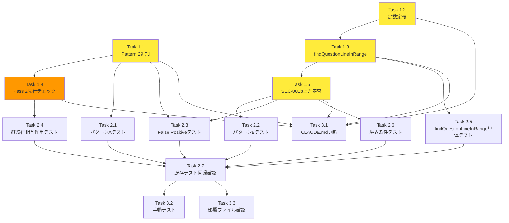

# 作業計画書 - Issue #256

## Issue概要

**Issue番号**: #256
**タイトル**: 選択メッセージが表示されない
**サイズ**: M（中規模）
**優先度**: High（バグ修正、プロンプト検出の重要機能）
**依存Issue**: なし
**関連Issue**: #208, #193, #161

### 問題概要

Claude CLIのmultiple_choiceプロンプトがアクティブプロンプトパネルに表示されない。
- **パターンA**: 質問文が複数行に折り返され、末尾が「。」で終わる行
- **パターンB**: model選択等の質問形式でないプロンプト（末尾が `.` で終わる行）

### 根本原因

`src/lib/prompt-detector.ts` の `isQuestionLikeLine()` 関数（L315-332）がLayer 5 SEC-001bで検出失敗。

### 修正方針（設計方針書 Section 5より）

1. **パターンA対応**: `isQuestionLikeLine()` に Pattern 2（行内 `?` チェック）を追加
2. **パターンB対応**: SEC-001bガード内で上方走査ロジックを追加（`findQuestionLineInRange()` 関数として抽出）
3. **MF-001対応**: Pass 2ループ内で `isQuestionLikeLine()` を `isContinuationLine()` の手前に追加（SRP維持）

---

## 詳細タスク分解

### Phase 1: 実装タスク

実装整合性マトリクス（設計方針書 Section 12）の推奨順序に従います。

#### Task 1.1: `isQuestionLikeLine()` Pattern 2追加

- **成果物**: `src/lib/prompt-detector.ts` L315-332の更新
- **依存**: なし
- **実装内容**:
  ```typescript
  // Pattern 2 (NEW): Lines containing question mark anywhere
  if (line.includes('?') || line.includes('\uff1f')) return true;
  ```
- **スコープ制約コメント追加**（SF-001対応）
- **作業時間**: 30分

#### Task 1.2: `QUESTION_SCAN_RANGE` 定数定義

- **成果物**: `src/lib/prompt-detector.ts` 定数追加
- **依存**: なし
- **実装内容**:
  ```typescript
  const QUESTION_SCAN_RANGE = 3;
  ```
- **JSDocに変更ガイドライン追記**（SF-002対応）
- **scanRangeバリデーション追加**（SF-S4-001対応）
- **作業時間**: 30分

#### Task 1.3: `findQuestionLineInRange()` 関数実装

- **成果物**: `src/lib/prompt-detector.ts` 新規関数追加
- **依存**: Task 1.2
- **実装内容**: 上方走査ロジック（設計方針書 Section 5.3参照）
- **ReDoS注釈追加**（C-S4-001対応）
- **作業時間**: 1時間

#### Task 1.4: Pass 2ループ内 `isQuestionLikeLine()` 先行チェック追加

- **成果物**: `src/lib/prompt-detector.ts` L482-495の更新
- **依存**: Task 1.1
- **実装内容**: `isContinuationLine()` の**手前**に `isQuestionLikeLine()` チェック追加（MF-001対応）
- **作業時間**: 1時間

#### Task 1.5: SEC-001bガード 上方走査ロジック追加

- **成果物**: `src/lib/prompt-detector.ts` L514-529の更新
- **依存**: Task 1.3
- **実装内容**: `findQuestionLineInRange()` 呼び出し追加
- **作業時間**: 30分

---

### Phase 2: テストタスク

#### Task 2.1: パターンA テストケース追加

- **成果物**: `tests/unit/prompt-detector.test.ts`
- **依存**: Task 1.1
- **テストケース**:
  - T-256-A1: 末尾が「。」の折り返し行
  - T-256-A2: 行内に「？」を含む折り返し行
  - T-256-A3: 1行に収まる質問文（回帰テスト）
- **カバレッジ目標**: 新規コードパス100%
- **作業時間**: 1時間

#### Task 2.2: パターンB テストケース追加

- **成果物**: `tests/unit/prompt-detector.test.ts`
- **依存**: Task 1.5
- **テストケース**:
  - T-256-B1: model選択プロンプト（requireDefaultIndicator: false）
  - T-256-B2: requireDefaultIndicator: true の回帰テスト
- **作業時間**: 1時間

#### Task 2.3: False Positive防止 テストケース追加

- **成果物**: `tests/unit/prompt-detector.test.ts`
- **依存**: Task 1.1, Task 1.5
- **テストケース**:
  - T-256-FP1: 上方走査でもFalse Positive防止が維持
  - T-256-FP2: 上方にキーワード行があっても番号リストは拒否（走査範囲外）
  - T-256-FP3: URLパラメータ行のFalse Positive防止（MF-S4-001対応）
- **作業時間**: 1時間

#### Task 2.4: isContinuationLine() 相互作用 テストケース追加

- **成果物**: `tests/unit/prompt-detector.test.ts`
- **依存**: Task 1.4
- **テストケース**:
  - T-256-CL1: インデントされた質問行がcontinuation lineとして誤分類されない（MF-001対応）
- **作業時間**: 30分

#### Task 2.5: findQuestionLineInRange() 単体テスト追加

- **成果物**: `tests/unit/prompt-detector.test.ts`
- **依存**: Task 1.3
- **テストケース**（SF-003対応）:
  - T-256-FQ1: 質問行が走査範囲内に存在
  - T-256-FQ2: 質問行が走査範囲外
  - T-256-FQ3: 空行とセパレータのスキップ
  - T-256-FQ4: lowerBound境界の遵守
- **アプローチ**: 間接テスト（`detectPrompt()` 経由、C-S3-001対応）
- **作業時間**: 1時間

#### Task 2.6: 境界条件 テストケース追加

- **成果物**: `tests/unit/prompt-detector.test.ts`
- **依存**: Task 1.5
- **テストケース**:
  - T-256-BC1: scanStart境界での上方走査
  - T-256-BC2: questionEndIndex = 0 での上方走査
  - T-256-BC3: 折り返しが6行以上のケース
- **作業時間**: 1時間

#### Task 2.7: 既存テスト回帰確認

- **成果物**: テスト実行結果レポート
- **依存**: Task 2.1~2.6
- **確認対象**:
  - T11h-T11m (False Positive防止): 6件
  - T11a-T11g (True Positive): 7件
  - T1-T4 (番号リスト拒否): 4件
  - Issue #181 (multiline option): テスト群
  - Issue #161 (2パス検出): テスト群
- **作業時間**: 30分

---

### Phase 3: ドキュメント・検証タスク

#### Task 3.1: CLAUDE.md更新

- **成果物**: `CLAUDE.md`
- **依存**: Task 1.1~1.5
- **実装内容**: `src/lib/prompt-detector.ts` 説明行にIssue #256変更概要を追記
  - 追記内容: `Issue #256: isQuestionLikeLine()の複数行質問対応（行内?チェック）、SEC-001b上方走査（findQuestionLineInRange()関数）、Pass 2ループ内isQuestionLikeLine()先行チェック（MF-001: isContinuationLine SRP維持）、QUESTION_SCAN_RANGE=3`
- **作業時間**: 15分

#### Task 3.2: 手動テスト（UIレベル）

- **成果物**: 手動テスト結果レポート
- **依存**: Task 1.1~1.5
- **テスト内容**:
  - デスクトップ: PromptPanelでの表示確認
  - モバイル: MobilePromptSheetでの表示確認
  - パターンA: 複数行折り返し質問での表示
  - パターンB: model選択プロンプトでの表示
- **作業時間**: 30分

#### Task 3.3: 影響ファイル動作確認

- **成果物**: 影響確認レポート
- **依存**: Task 1.1~1.5
- **確認対象**（設計方針書 Section 11参照）:
  - auto-yes-manager.ts: False Positive時の自動応答誤送信がないこと
  - auto-yes-resolver.ts: resolveAutoAnswer()への影響なし
  - response-poller.ts: DBゴーストメッセージ保存がないこと
  - status-detector.ts: ステータス誤判定がないこと
  - current-output/route.ts: API応答の正確性
  - prompt-response/route.ts: レースコンディション防止の維持
  - respond/route.ts: getAnswerInput()への影響なし（MF-S3-001対応）
- **作業時間**: 1時間

---

## タスク依存関係



**凡例**:
- 黄色（#ffeb3b）: 基本実装タスク
- オレンジ（#ff9800）: MF-001対応タスク（SRP維持のための重要変更）

---

## 実装順序の推奨

設計方針書 Section 12「実装整合性マトリクス」の推奨順序:

1. **Step 1**: Task 1.1（Pattern 2追加）
2. **Step 2**: Task 1.2（定数定義）
3. **Step 3**: Task 1.3（findQuestionLineInRange実装）
4. **Step 4**: Task 1.4（Pass 2先行チェック - MF-001）← **SRP維持の最重要タスク**
5. **Step 5**: Task 1.5（SEC-001b上方走査）
6. **Step 6**: Task 2.1~2.6（新規テストケース追加 - 18件）
7. **Step 7**: Task 2.7（既存テスト回帰確認）

---

## 品質チェック項目

| チェック項目 | コマンド | 基準 |
|-------------|----------|------|
| TypeScript | `npx tsc --noEmit` | 型エラー0件 |
| ESLint | `npm run lint` | エラー0件 |
| Unit Test | `npm run test:unit` | 全テストパス（既存3087件+新規18件） |
| Build | `npm run build` | 成功 |

---

## 成果物チェックリスト

### コード

- [ ] `src/lib/prompt-detector.ts`
  - [ ] `isQuestionLikeLine()` Pattern 2追加（L315-332）
  - [ ] `QUESTION_SCAN_RANGE` 定数定義
  - [ ] `findQuestionLineInRange()` 関数追加
  - [ ] Pass 2ループ内 `isQuestionLikeLine()` 先行チェック（L482-495）
  - [ ] SEC-001bガード 上方走査ロジック（L514-529）

### テスト

- [ ] `tests/unit/prompt-detector.test.ts`
  - [ ] パターンA: 3件（T-256-A1~A3）
  - [ ] パターンB: 2件（T-256-B1~B2）
  - [ ] False Positive防止: 3件（T-256-FP1~FP3）
  - [ ] isContinuationLine相互作用: 1件（T-256-CL1）
  - [ ] findQuestionLineInRange単体: 4件（T-256-FQ1~FQ4）
  - [ ] 境界条件: 3件（T-256-BC1~BC3）
  - [ ] 既存テスト回帰確認: 全パス

### ドキュメント

- [ ] `CLAUDE.md`更新
- [ ] 手動テスト結果レポート
- [ ] 影響ファイル確認レポート

---

## Definition of Done

Issue完了条件：

- [ ] すべてのタスク（1.1~3.3）が完了
- [ ] 新規テストケース18件がすべてパス
- [ ] 既存テスト3087件がすべてパス（回帰なし）
- [ ] 単体テストカバレッジ: 新規コードパス100%
- [ ] CIチェック全パス（TypeScript, ESLint, Unit Test, Build）
- [ ] 手動テスト完了（デスクトップ・モバイル両方）
- [ ] 影響ファイル動作確認完了（7ファイル）
- [ ] CLAUDE.md更新完了
- [ ] 設計方針書の実装チェックリスト（Section 13）完了
- [ ] コードレビュー承認（PR作成後）

---

## 設計レビュー指摘事項の実装対応

### Stage 1: 設計原則レビュー

- [ ] **[MF-001]** isContinuationLine()にキーワード除外を追加**しない**（SRP違反）→ Pass 2先行チェックで対応（Task 1.4）
- [ ] **[SF-001]** Pattern 2のスコープ制約コメント追加（Task 1.1）
- [ ] **[SF-002]** QUESTION_SCAN_RANGE変更ガイドライン追記（Task 1.2）
- [ ] **[SF-003]** findQuestionLineInRange()関数抽出（Task 1.3）

### Stage 2: 整合性レビュー

- [ ] **[MF-S2-001~006]** 実装整合性マトリクス12項目の完了確認

### Stage 3: 影響分析レビュー

- [ ] **[MF-S3-001]** respond/route.ts の影響確認（Task 3.3）
- [ ] **[SF-S3-001]** cli-patterns.ts の型依存確認（影響なし）
- [ ] **[SF-S3-002]** PromptPanel/MobilePromptSheetのpromptData表示確認（Task 3.2）
- [ ] **[SF-S3-003]** Issue #181回帰テスト（Task 2.7）

### Stage 4: セキュリティレビュー

- [ ] **[MF-S4-001]** T-256-FP3テストケース追加（URLパラメータFalse Positive、Task 2.3）
- [ ] **[SF-S4-001]** findQuestionLineInRange()のscanRangeバリデーション（Task 1.3）
- [ ] **[SF-S4-002]** Pattern 2とQUESTION_KEYWORD_PATTERNの相互作用分析（設計方針書に記載済み）
- [ ] **[SF-S4-003]** 共有isQuestionLikeLine()の設計意図（設計方針書に記載済み）

---

## 見積もり時間

| Phase | タスク数 | 合計時間 |
|-------|---------|---------|
| Phase 1: 実装 | 5タスク | 3.5時間 |
| Phase 2: テスト | 7タスク | 6.5時間 |
| Phase 3: ドキュメント・検証 | 3タスク | 1.75時間 |
| **合計** | **15タスク** | **11.75時間** |

**推定工数**: 2日（1日あたり6時間作業）

---

## 次のアクション

作業計画承認後：

1. **ブランチ作成**: `feature/256-multiple-choice-prompt-detection`
   ```bash
   git checkout -b feature/256-multiple-choice-prompt-detection
   ```

2. **タスク実行**: 本作業計画に従って実装
   - 推奨順序: Step 1 → Step 2 → ... → Step 7

3. **進捗報告**: `/progress-report` で定期報告（実装完了時）

4. **PR作成**: `/create-pr` で自動作成

---

## 参考ドキュメント

- **Issue**: https://github.com/Kewton/CommandMate/issues/256
- **設計方針書**: `dev-reports/design/issue-256-multiple-choice-prompt-detection-design-policy.md`
- **Issueレビュー**: `dev-reports/issue/256/issue-review/summary-report.md`
- **設計レビュー**: `dev-reports/issue/256/multi-stage-design-review/summary-report.md`

---

*Generated by work-plan skill for Issue #256*
*Date: 2026-02-13*
