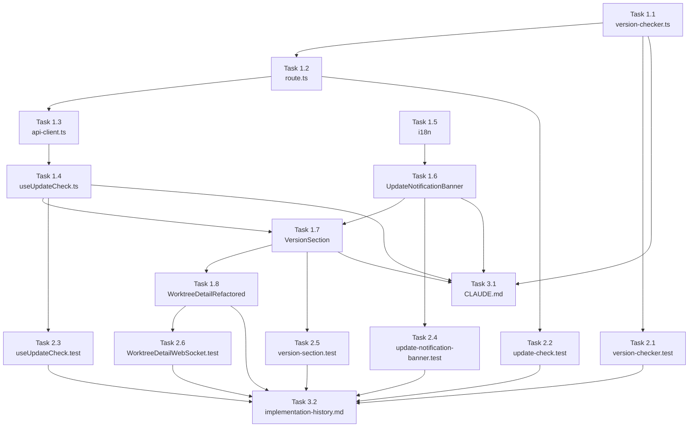

# 作業計画書: Issue #257

## Issue概要

**Issue番号**: #257
**タイトル**: バージョンアップを知らせる機能
**サイズ**: M
**優先度**: Medium
**ステータス**: OPEN
**ラベル**: feature
**依存Issue**: なし

**概要**:
CommandMateの新バージョンがリリースされた際に、ユーザーに通知する機能を追加します。GitHub Releases APIを使用してバージョン情報を取得し、WorktreeDetailRefactoredのバージョン表示セクションに新バージョンが利用可能である旨のバナーを表示します。

**主な技術要素**:
- GitHub Releases API統合（サーバーサイドのみ）
- Semverバージョン比較（自前実装、依存追加なし）
- globalThisキャッシュパターン（hot-reload耐性）
- Silent Failure設計（外部API障害がUXに影響しない）
- コンポーネント分離（SRP/DRY準拠）
- セキュリティ対策（SSRF防止、OWASP Top 10準拠）
- i18n対応（worktree名前空間拡張）

---

## 詳細タスク分解

### Phase 1: 実装タスク（コア → API → UI）

#### Task 1.1: version-checker.ts - コアロジック実装

**成果物**: `src/lib/version-checker.ts`
**依存**: なし
**所要時間**: 2-3時間

**実装内容**:
- [x] GitHub API URLのハードコード定数化（SSRF防止）
  ```typescript
  const GITHUB_API_URL = 'https://api.github.com/repos/Kewton/CommandMate/releases/latest' as const;
  // [SEC-001] この値は環境変数・設定ファイル・ユーザー入力から導出してはならない
  ```
- [x] semverバージョン比較関数 `isNewerVersion()` の実装
  ```typescript
  const SEMVER_PATTERN = /^v?\d+\.\d+\.\d+$/;
  function isNewerVersion(current: string, latest: string): boolean {
    // [SF-003] バリデーション内蔵
    if (!SEMVER_PATTERN.test(current) || !SEMVER_PATTERN.test(latest)) {
      return false;
    }
    // パース・比較ロジック
  }
  ```
- [x] `getCurrentVersion()` 関数の実装
  ```typescript
  function getCurrentVersion(): string {
    // [CONS-002] process.env.NEXT_PUBLIC_APP_VERSION使用
    return process.env.NEXT_PUBLIC_APP_VERSION ?? '0.0.0';
  }
  ```
- [x] globalThisキャッシュパターンの実装（auto-yes-manager.ts準拠）
  ```typescript
  declare global {
    // eslint-disable-next-line no-var
    var __versionCheckCache: VersionCache | undefined;
  }
  const cache = globalThis.__versionCheckCache ??
    (globalThis.__versionCheckCache = {
      result: null,
      fetchedAt: 0,
      rateLimitResetAt: null,
    });
  ```
- [x] GitHub API呼び出し処理（User-Agentヘッダ、タイムアウト、エラーハンドリング）
- [x] レスポンスバリデーション（`validateReleaseUrl()`, `sanitizeReleaseName()`）
  ```typescript
  // [SEC-SF-001] URLプレフィックス検証
  function validateReleaseUrl(url: string): string | null {
    const prefix = 'https://github.com/Kewton/CommandMate/releases/';
    return url.startsWith(prefix) ? url : null;
  }

  // [SEC-SF-001] リリース名サニタイズ
  function sanitizeReleaseName(name: string, tagName: string): string {
    const pattern = /^[a-zA-Z0-9.\-\s_v]+$/;
    return pattern.test(name) && name.length <= 128 ? name : tagName;
  }
  ```
- [x] レート制限対策（403受信時のキャッシュTTL延長）
- [x] 型定義（UpdateCheckResult）

**品質チェック**:
- [ ] ESLint: `npm run lint` → エラー0件
- [ ] TypeScript: `npx tsc --noEmit` → エラー0件
- [ ] 実装チェックリスト: SEC-001, SF-003, CONS-002, IMP-SF-003, SEC-SF-001, SEC-SF-002

---

#### Task 1.2: route.ts - APIエンドポイント実装

**成果物**: `src/app/api/app/update-check/route.ts`
**依存**: Task 1.1 (version-checker.ts)
**所要時間**: 1-2時間

**実装内容**:
- [x] GET `/api/app/update-check` エンドポイント実装
- [x] `checkForUpdate()` 呼び出し
- [x] `toUpdateCheckResponse()` マッピング関数（DRY原則）
  ```typescript
  // [SF-002] マッピング関数で変換を一元化
  function toUpdateCheckResponse(result: UpdateCheckResult): UpdateCheckResponse {
    return {
      hasUpdate: result.hasUpdate,
      currentVersion: result.currentVersion,
      latestVersion: result.latestVersion,
      releaseUrl: result.releaseUrl ?? null,
      releaseName: result.releaseName ?? null,
      updateCommand: 'npm install -g commandmate@latest', // [SEC-SF-004] 固定文字列
      installType: result.installType,
      status: result.hasUpdate ? 'success' : 'degraded', // [SF-004] 監視性向上
    };
  }
  ```
- [x] `isGlobalInstall()` import（CLI層参照）
  ```typescript
  // [CONS-001] CLI層ユーティリティ。db-path-resolver.ts と同様のクロスレイヤーimport前例あり
  import { isGlobalInstall } from '@/cli/utils/install-context';
  ```
- [x] Cache-Controlヘッダの設定
  ```typescript
  return NextResponse.json(response, {
    headers: {
      'Cache-Control': 'no-store, no-cache, must-revalidate',
      'Pragma': 'no-cache',
    },
  });
  ```
- [x] エラーハンドリング（Silent Failure）

**品質チェック**:
- [ ] 実装チェックリスト: SF-002, SF-004, CONS-001, SEC-SF-003, SEC-SF-004

---

#### Task 1.3: api-client.ts - クライアントAPI追加

**成果物**: `src/lib/api-client.ts`（既存ファイル更新）
**依存**: Task 1.2 (route.ts)
**所要時間**: 30分

**実装内容**:
- [x] `appApi` 名前空間に `checkForUpdate()` メソッド追加
  ```typescript
  /**
   * [IMP-SF-001] Note: fetchApi attaches Content-Type: application/json to all requests including GET (CONS-004, IMP-SF-001)
   * Future developers: be aware of this behavior when adding POST endpoints to /api/app/
   */
  checkForUpdate: () =>
    fetchApi<UpdateCheckResponse>('/api/app/update-check', {
      method: 'GET',
    }),
  ```
- [x] UpdateCheckResponse型のimport追加

**品質チェック**:
- [ ] 実装チェックリスト: IMP-SF-001（JSDoc注記）

---

#### Task 1.4: useUpdateCheck.ts - カスタムフック実装

**成果物**: `src/hooks/useUpdateCheck.ts`
**依存**: Task 1.3 (api-client.ts)
**所要時間**: 1時間

**実装内容**:
- [x] `useUpdateCheck()` フックの実装
- [x] `appApi.checkForUpdate()` 呼び出し
- [x] 状態管理（loading, error, data）
- [x] エラーハンドリング

---

#### Task 1.5: locales/\*/worktree.json - i18n翻訳キー追加

**成果物**: `locales/en/worktree.json`, `locales/ja/worktree.json`
**依存**: なし
**所要時間**: 30分

**実装内容**:
- [x] `update.*` 翻訳キーの追加（英語・日本語）
  ```json
  {
    "update": {
      "available": "New version available",
      "currentVersion": "Current: {version}",
      "latestVersion": "Latest: {version}",
      "viewRelease": "View Release",
      "updateCommand": "Update command",
      "installationNote": "Installation type: {type}"
    }
  }
  ```

---

#### Task 1.6: UpdateNotificationBanner.tsx - 通知バナー実装

**成果物**: `src/components/worktree/UpdateNotificationBanner.tsx`
**依存**: Task 1.5 (i18n)
**所要時間**: 1-2時間

**実装内容**:
- [x] アップデート通知バナーコンポーネント（SRP準拠）
- [x] Props: `UpdateCheckResponse` から必要なフィールドを受け取る
- [x] i18n対応（useTranslations('worktree')）
- [x] レスポンシブデザイン
- [x] WorktreeDetailRefactoredに直接UIを追加しない（MF-001）

**品質チェック**:
- [ ] 実装チェックリスト: MF-001

---

#### Task 1.7: VersionSection.tsx - バージョンセクション統合

**成果物**: `src/components/worktree/VersionSection.tsx`
**依存**: Task 1.4 (useUpdateCheck.ts), Task 1.6 (UpdateNotificationBanner.tsx)
**所要時間**: 1-2時間

**実装内容**:
- [x] バージョン番号表示 + UpdateNotificationBanner を統合（DRY準拠）
- [x] `useUpdateCheck()` フックでアップデート情報取得
- [x] `className` prop でスタイル差異を吸収
  ```typescript
  interface VersionSectionProps {
    version: string;
    className?: string;
  }
  ```
- [x] InfoModalとMobileInfoContentの両方で使用可能な設計

**品質チェック**:
- [ ] 実装チェックリスト: SF-001, CONS-005

---

#### Task 1.8: WorktreeDetailRefactored.tsx - VersionSection組み込み

**成果物**: `src/components/worktree/WorktreeDetailRefactored.tsx`（既存ファイル更新）
**依存**: Task 1.7 (VersionSection.tsx)
**所要時間**: 1時間

**実装内容**:
- [x] InfoModal（507-511行）のバージョン表示を `VersionSection` に置換
  ```tsx
  <VersionSection
    version={worktree.version}
    className="bg-gray-50 rounded-lg p-4"
  />
  ```
- [x] MobileInfoContent（775-779行）のバージョン表示を `VersionSection` に置換
  ```tsx
  <VersionSection
    version={worktree.version}
    className="bg-white rounded-lg border border-gray-200 p-4"
  />
  ```
- [x] 既存の重複コードを削除

---

### Phase 2: テストタスク

#### Task 2.1: version-checker.test.ts - コアロジックテスト

**成果物**: `tests/unit/lib/version-checker.test.ts`
**依存**: Task 1.1 (version-checker.ts)
**所要時間**: 2-3時間
**カバレッジ目標**: 90%以上

**テストケース**:
- [ ] `isNewerVersion()` の正常系テスト
  - [ ] メジャーバージョン差異（1.0.0 vs 2.0.0 → true）
  - [ ] マイナーバージョン差異（1.0.0 vs 1.1.0 → true）
  - [ ] パッチバージョン差異（1.0.0 vs 1.0.1 → true）
  - [ ] 同一バージョン（1.0.0 vs 1.0.0 → false）
  - [ ] 古いバージョン（1.1.0 vs 1.0.0 → false）
  - [ ] v接頭辞の有無混在（v1.0.0 vs 1.1.0 → true）
- [ ] `isNewerVersion()` の異常系テスト（SF-003）
  - [ ] ベータバージョン（v0.3.0-beta → false）
  - [ ] 2セグメント（0.3 → false）
  - [ ] 4セグメント（0.3.0.1 → false）
  - [ ] リリース接頭辞（release-0.3.0 → false）
  - [ ] 空文字（'' → false）
  - [ ] 不正文字列（'latest' → false）
- [ ] `getCurrentVersion()` のテスト
  - [ ] process.env.NEXT_PUBLIC_APP_VERSION が設定されている場合
  - [ ] process.env.NEXT_PUBLIC_APP_VERSION が未設定の場合（'0.0.0' フォールバック）
- [ ] `checkForUpdate()` のテスト
  - [ ] GitHub API成功（新バージョンあり）
  - [ ] GitHub API成功（新バージョンなし）
  - [ ] GitHub APIエラー（ネットワークエラー）
  - [ ] GitHub APIエラー（403レート制限）
  - [ ] キャッシュヒット（再リクエストなし）
  - [ ] キャッシュミス（APIリクエスト）
- [ ] バリデーション関数のテスト（SEC-SF-001）
  - [ ] `validateReleaseUrl()` 正常URL
  - [ ] `validateReleaseUrl()` 不正URL（異なるドメイン、javascript:プロトコル等）
  - [ ] `sanitizeReleaseName()` 正常リリース名
  - [ ] `sanitizeReleaseName()` 不正リリース名（HTMLタグ、スクリプト注入、長さ超過）
- [ ] GITHUB_API_URL定数の検証（SEC-001）
  - [ ] 固定値であることの確認

---

#### Task 2.2: update-check.test.ts - APIテスト

**成果物**: `tests/unit/api/update-check.test.ts`
**依存**: Task 1.2 (route.ts)
**所要時間**: 1-2時間
**カバレッジ目標**: 85%以上

**テストケース**:
- [ ] GET `/api/app/update-check` 成功（hasUpdate: true, status: 'success'）
- [ ] GET `/api/app/update-check` 成功（hasUpdate: false, status: 'degraded'）
- [ ] レスポンス形式の検証（UpdateCheckResponse型）
- [ ] `toUpdateCheckResponse()` マッピング関数のテスト
  - [ ] null/nullable変換の正確性
  - [ ] statusフィールドの正確性（SF-004）
  - [ ] updateCommandが固定文字列であること（SEC-SF-004）
- [ ] Cache-Controlヘッダの検証（SEC-SF-003）
  - [ ] 'Cache-Control': 'no-store, no-cache, must-revalidate'
  - [ ] 'Pragma': 'no-cache'
- [ ] HTTPメソッド制限のテスト（SEC-C-003）
  - [ ] POST → 405 Method Not Allowed
  - [ ] PUT → 405 Method Not Allowed
  - [ ] DELETE → 405 Method Not Allowed

**品質チェック**:
- [ ] 実装チェックリスト: CONS-003（テストパス修正）

---

#### Task 2.3: useUpdateCheck.test.ts - フックテスト

**成果物**: `tests/unit/hooks/useUpdateCheck.test.ts`
**依存**: Task 1.4 (useUpdateCheck.ts)
**所要時間**: 1-2時間
**カバレッジ目標**: 85%以上

**テストケース**:
- [ ] 初期状態（loading: true, error: null, data: null）
- [ ] API呼び出し成功（data取得、loading: false）
- [ ] API呼び出しエラー（error設定、loading: false）
- [ ] 状態遷移の正確性
- [ ] 既存hooksテストパターン（18個のテストファイル）に準拠した構成

**品質チェック**:
- [ ] 実装チェックリスト: IMP-C01

---

#### Task 2.4: update-notification-banner.test.tsx - バナーテスト

**成果物**: `tests/unit/components/worktree/update-notification-banner.test.tsx`
**依存**: Task 1.6 (UpdateNotificationBanner.tsx)
**所要時間**: 1-2時間
**カバレッジ目標**: 85%以上

**テストケース**:
- [ ] アップデートあり時の表示（hasUpdate: true）
- [ ] アップデートなし時の非表示（hasUpdate: false）
- [ ] 各要素の表示内容（バージョン番号、リリースURL、コマンド等）
- [ ] i18n翻訳の適用
- [ ] リンククリックの動作

**品質チェック**:
- [ ] 実装チェックリスト: MF-001

---

#### Task 2.5: version-section.test.tsx - セクションテスト

**成果物**: `tests/unit/components/worktree/version-section.test.tsx`
**依存**: Task 1.7 (VersionSection.tsx)
**所要時間**: 1-2時間
**カバレッジ目標**: 85%以上

**テストケース**:
- [ ] バージョン番号の表示
- [ ] `useUpdateCheck()` フックの呼び出し
- [ ] `UpdateNotificationBanner` の条件付き表示
- [ ] `className` propの適用
- [ ] ローディング状態の表示
- [ ] エラー状態のハンドリング

**品質チェック**:
- [ ] 実装チェックリスト: SF-001, CONS-005

---

#### Task 2.6: WorktreeDetailWebSocket.test.tsx - 既存テスト修正

**成果物**: `tests/unit/components/worktree/WorktreeDetailWebSocket.test.tsx`（既存ファイル更新）
**依存**: Task 1.8 (WorktreeDetailRefactored.tsx)
**所要時間**: 1-2時間

**テストケース**:
- [ ] バージョン表示に関連するアサーションの特定
- [ ] VersionSection コンポーネントへの置換後のテスト修正
- [ ] 新しいDOM構造に合わせたアサーション更新
- [ ] 全テストのパス確認（`npm run test:unit`）

**品質チェック**:
- [ ] 実装チェックリスト: IMP-001

---

### Phase 3: ドキュメントタスク

#### Task 3.1: CLAUDE.md更新 - 主要機能モジュール追記

**成果物**: `CLAUDE.md`（既存ファイル更新）
**依存**: Task 1.1, 1.4, 1.6, 1.7
**所要時間**: 30分

**更新内容**:
- [x] 主要機能モジュール表に4モジュールを追記
  ```markdown
  | `src/lib/version-checker.ts` | GitHub API呼び出し、semver比較、キャッシュ（Issue #257） |
  | `src/hooks/useUpdateCheck.ts` | アップデートチェック用カスタムフック（Issue #257） |
  | `src/components/worktree/VersionSection.tsx` | バージョン表示+通知統合コンポーネント（Issue #257） |
  | `src/components/worktree/UpdateNotificationBanner.tsx` | アップデート通知バナーUI（Issue #257） |
  ```

**品質チェック**:
- [ ] 実装チェックリスト: IMP-C02

---

#### Task 3.2: implementation-history.md更新 - Issue #257エントリ追加

**成果物**: `docs/implementation-history.md`（既存ファイル更新）
**依存**: すべての実装タスク完了
**所要時間**: 30分

**更新内容**:
- [x] Issue #257のエントリ追加
  ```markdown
  ## Issue #257: バージョンアップを知らせる機能

  **実装日**: 2026-02-XX

  ### 概要
  CommandMateの新バージョンがリリースされた際にユーザーに通知する機能を追加。

  ### 主要変更ファイル
  - 新規: `src/lib/version-checker.ts`, `src/hooks/useUpdateCheck.ts`, `src/components/worktree/UpdateNotificationBanner.tsx`, `src/components/worktree/VersionSection.tsx`, `src/app/api/app/update-check/route.ts`
  - 変更: `src/lib/api-client.ts`, `src/components/worktree/WorktreeDetailRefactored.tsx`
  - テスト: 5テストファイル追加
  - ドキュメント: `CLAUDE.md`, `implementation-history.md`

  ### 設計書
  - [設計方針書](../dev-reports/design/issue-257-version-update-notification-design-policy.md)
  ```

**品質チェック**:
- [ ] 実装チェックリスト: IMP-C02

---

## タスク依存関係



---

## 品質チェック項目

| チェック項目 | コマンド | 基準 | タイミング |
|-------------|----------|------|-----------|
| ESLint | `npm run lint` | エラー0件 | 各タスク完了時 |
| TypeScript | `npx tsc --noEmit` | 型エラー0件 | 各タスク完了時 |
| Unit Test | `npm run test:unit` | 全テストパス | Phase 2完了時 |
| Build | `npm run build` | ビルド成功 | 全タスク完了時 |
| カバレッジ | `npm run test:unit -- --coverage` | 80%以上 | Phase 2完了時 |

---

## 成果物チェックリスト

### ソースコード（5ファイル新規）

- [ ] `src/lib/version-checker.ts` - コアロジック
- [ ] `src/hooks/useUpdateCheck.ts` - カスタムフック
- [ ] `src/components/worktree/UpdateNotificationBanner.tsx` - 通知バナー
- [ ] `src/components/worktree/VersionSection.tsx` - バージョンセクション
- [ ] `src/app/api/app/update-check/route.ts` - APIエンドポイント

### ソースコード（2ファイル変更）

- [ ] `src/lib/api-client.ts` - `appApi.checkForUpdate()` 追加
- [ ] `src/components/worktree/WorktreeDetailRefactored.tsx` - VersionSection組み込み

### テスト（5ファイル新規、1ファイル変更）

- [ ] `tests/unit/lib/version-checker.test.ts`
- [ ] `tests/unit/hooks/useUpdateCheck.test.ts`
- [ ] `tests/unit/api/update-check.test.ts`
- [ ] `tests/unit/components/worktree/update-notification-banner.test.tsx`
- [ ] `tests/unit/components/worktree/version-section.test.tsx`
- [ ] `tests/unit/components/worktree/WorktreeDetailWebSocket.test.tsx`（既存テスト修正）

### i18n（2ファイル変更）

- [ ] `locales/en/worktree.json` - `update.*` キー追加
- [ ] `locales/ja/worktree.json` - `update.*` キー追加

### ドキュメント（2ファイル変更）

- [ ] `CLAUDE.md` - 4モジュール追記
- [ ] `docs/implementation-history.md` - Issue #257エントリ追加

---

## Definition of Done

Issue #257完了条件：

- [ ] すべてのタスク（Phase 1-3）が完了
- [ ] 単体テストカバレッジ80%以上
- [ ] CIチェック全パス
  - [ ] ESLint: エラー0件
  - [ ] TypeScript: 型エラー0件
  - [ ] Unit Test: 全テストパス
  - [ ] Build: ビルド成功
- [ ] 実装チェックリスト（Must Fix 4件 + Should Fix 15件）すべて対応
  - [ ] Stage 1: MF-001, SF-001, SF-002, SF-003, SF-004
  - [ ] Stage 2: CONS-001, CONS-002, CONS-003, CONS-004, CONS-005
  - [ ] Stage 3: IMP-001, IMP-SF-001, IMP-SF-002, IMP-SF-003
  - [ ] Stage 4: SEC-001, SEC-SF-001, SEC-SF-002, SEC-SF-003, SEC-SF-004
- [ ] OWASP Top 10:2021準拠
  - [ ] A03 (Injection): ✅ Pass（SEC-SF-001）
  - [ ] A04 (Insecure Design): ✅ Pass（SEC-SF-004）
  - [ ] A05 (Security Misconfiguration): ✅ Pass（SEC-SF-003）
  - [ ] A07 (Identification): ✅ Pass（SEC-SF-002）
  - [ ] A10 (SSRF): ✅ Pass（SEC-001）
- [ ] コードレビュー承認（PR作成後）
- [ ] ドキュメント更新完了（CLAUDE.md、implementation-history.md）

---

## 次のアクション

作業計画承認後の流れ：

### 1. ブランチ作成

```bash
git checkout -b feature/257-version-update-notification
```

### 2. 実装開始

**推奨方法**: `/pm-auto-dev 257` で自動TDD実装

または、手動実装：

```bash
# Phase 1: コア実装（TDD順序）
# Task 1.1 + 2.1: version-checker.ts + テスト
# Task 1.2 + 2.2: route.ts + テスト
# Task 1.3: api-client.ts
# Task 1.4 + 2.3: useUpdateCheck.ts + テスト
# Task 1.5: i18n翻訳
# Task 1.6 + 2.4: UpdateNotificationBanner.tsx + テスト
# Task 1.7 + 2.5: VersionSection.tsx + テスト
# Task 1.8 + 2.6: WorktreeDetailRefactored.tsx + 既存テスト修正

# Phase 2: 全テスト実行
npm run test:unit
npm run lint
npx tsc --noEmit

# Phase 3: ドキュメント更新
# Task 3.1: CLAUDE.md
# Task 3.2: implementation-history.md
```

### 3. PR作成

```bash
# 実装完了後
/create-pr
```

---

## 参考リンク

- **設計方針書**: [dev-reports/design/issue-257-version-update-notification-design-policy.md](../design/issue-257-version-update-notification-design-policy.md)
- **Issueレビュー**: [dev-reports/issue/257/issue-review/summary-report.md](./issue-review/summary-report.md)
- **設計レビュー**: [dev-reports/issue/257/multi-stage-design-review/summary-report.md](./multi-stage-design-review/summary-report.md)
- **GitHub Issue**: https://github.com/Kewton/CommandMate/issues/257

---

*Generated by /work-plan command*
*Date: 2026-02-13*
*Based on: Design Policy (650 lines), Multi-Stage Reviews (31 findings)*
