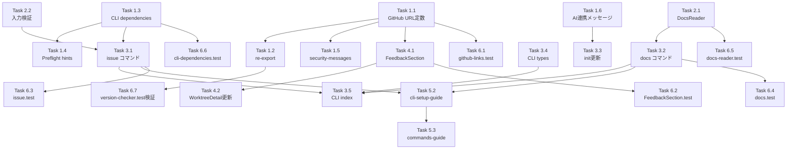

# 作業計画書: Issue #264

## Issue: ユーザーからの問い合わせリンク

**Issue番号**: #264
**サイズ**: L（大規模）
**優先度**: Medium
**依存Issue**: #124（i18n対応、関連）
**関連設計書**: `dev-reports/design/issue-264-feedback-and-docs-design-policy.md`

---

## 1. Issue概要

ユーザーからの要望や質問をIssueとして効率的に登録できる仕組みを追加する。UIにフィードバックリンクを追加し、CLIにissue/docsコマンドを新設して、AIツール（Claude Code / Codex）からの利用を可能にする。

### 主要機能

| 機能 | 種別 | 説明 |
|------|------|------|
| (1) FeedbackSection | UI | InfoModal/MobileInfoContentにフィードバックリンク追加 |
| (2) issue コマンド | CLI | gh CLI連携でIssue操作（create/search/list） |
| (3) AIツール連携ガイド | CLI | init完了後に連携方法表示 |
| (4) docs コマンド | CLI | ドキュメント取得（RAG的活用） |
| (5) ドキュメント整備 | Docs | cli-setup-guide.md, support-and-feedback.md |

---

## 2. 詳細タスク分解

### Phase 1: 設定層実装（共通基盤）

#### Task 1.1: GitHub URL定数一元管理
- **成果物**: `src/config/github-links.ts`
- **依存**: なし
- **内容**:
  - `GITHUB_REPO_BASE_URL` 定数作成
  - Issue/Release/Security Guide URL派生
  - `GITHUB_API_URL` はSEC-001のためversion-checker.ts維持
- **検証**: URL定数が正しく派生されていること

#### Task 1.2: version-checker.ts re-export対応
- **成果物**: `src/lib/version-checker.ts`
- **依存**: Task 1.1
- **内容**:
  - `GITHUB_RELEASE_URL_PREFIX` をgithub-links.tsからre-export
  - 既存import パス維持（破壊的変更回避）
- **検証**: `tests/unit/lib/version-checker.test.ts` が修正なしでパス

#### Task 1.3: CLI dependencies更新
- **成果物**: `src/cli/config/cli-dependencies.ts`
- **依存**: なし
- **内容**:
  - gh CLI エントリ追加（`{ name: 'gh CLI', command: 'gh', versionArg: '--version', required: false }`）
- **検証**: PreflightCheckerでgh CLIが検出されること

#### Task 1.4: Preflight hints更新
- **成果物**: `src/cli/utils/preflight.ts`
- **依存**: Task 1.3
- **内容**:
  - `getInstallHint()` にgh CLI用ヒント追加
  - ヒント文: `'gh': 'Install GitHub CLI: https://cli.github.com/ or brew install gh'`
- **検証**: gh未インストール時にヒントが表示されること

#### Task 1.5: security-messages.ts更新
- **成果物**: `src/cli/config/security-messages.ts`
- **依存**: Task 1.1
- **内容**:
  - `GITHUB_SECURITY_GUIDE_URL` をgithub-links.tsからimport
  - テンプレートリテラルで参照（SF-002）
  - cross-boundary import動作確認
- **検証**: `npm run build:cli` 成功（MF-IMP-001）

#### Task 1.6: AI連携メッセージ定数
- **成果物**: `src/cli/config/ai-integration-messages.ts`
- **依存**: なし
- **内容**:
  - AI連携ガイドメッセージ定数定義
  - Issue management / Documentation (RAG) セクション
- **検証**: メッセージフォーマットが正しいこと

---

### Phase 2: CLIユーティリティ実装

#### Task 2.1: DocsReaderユーティリティ作成
- **成果物**: `src/cli/utils/docs-reader.ts`
- **依存**: なし
- **内容**:
  - SECTION_MAP定義（ホワイトリスト）
  - `resolvePackageRoot()` - package.jsonアンカー方式（SF-004）
  - `getAvailableSections()`, `isValidSection()`, `readSection()`, `searchDocs()`
  - パストラバーサル防止
  - 検索クエリ長制限（SEC-SF-002: MAX_SEARCH_QUERY_LENGTH = 256）
- **検証**: セクション検証・ファイル読取・検索が正常動作

#### Task 2.2: 入力バリデーションヘルパー
- **成果物**: `src/cli/utils/input-validators.ts` (更新)
- **依存**: なし
- **内容**:
  - `validateIssueTitle()` - MAX_TITLE_LENGTH = 256（SEC-MF-001）
  - `validateIssueBody()` - MAX_BODY_LENGTH = 65536（SEC-MF-001）
  - `sanitizeLabel()` - 制御文字除去（SEC-SF-001）
- **検証**: 長さ制限・サニタイズが正常動作

---

### Phase 3: CLIコマンド実装

#### Task 3.1: issue コマンド実装
- **成果物**: `src/cli/commands/issue.ts`
- **依存**: Task 1.3, Task 2.2
- **内容**:
  - `createIssueCommand()` ファクトリー（MF-CONS-001: addCommandパターン）
  - サブコマンド: create, search, list
  - create: `--bug/--feature/--question/--title/--body/--labels`
  - テンプレート名マッピング（"Bug Report", "Feature Request", "Question"）
  - `execFile` / `spawnSync` 配列引数使用（shell: true禁止）
  - gh未インストール時: DEPENDENCY_ERROR(1)
  - 入力長バリデーション・ラベルサニタイズ
  - ログ出力: `console.log` 直接使用（SF-CONS-005）
- **検証**: テンプレート名・入力検証・セキュリティ対策

#### Task 3.2: docs コマンド実装
- **成果物**: `src/cli/commands/docs.ts`
- **依存**: Task 2.1
- **内容**:
  - `createDocsCommand()` ファクトリー（MF-CONS-001: addCommandパターン）
  - オプション: `--section/--search/--all`
  - DocsReaderへの委譲（SF-003: SRP分離）
  - 引数解析・出力フォーマットのみ担当
  - ログ出力: `console.log` 直接使用（SF-CONS-005）
- **検証**: DocsReader委譲・セクション表示・検索動作

#### Task 3.3: init コマンド更新
- **成果物**: `src/cli/commands/init.ts`
- **依存**: Task 1.6
- **内容**:
  - AI連携ガイド表示追加（line 244-253後に配置）
  - ai-integration-messages.tsからimport
- **検証**: init完了後にガイドが表示されること

#### Task 3.4: CLI types更新
- **成果物**: `src/cli/types/index.ts`
- **依存**: なし
- **内容**:
  - `IssueCreateOptions` 型追加
  - `DocsOptions` 型追加
  - `IssueOptions` は追加しない（MF-001: YAGNI）
- **検証**: 型定義が正しいこと

#### Task 3.5: CLI index更新
- **成果物**: `src/cli/index.ts`
- **依存**: Task 3.1, Task 3.2
- **内容**:
  - issue/docsコマンド登録（addCommandパターン）
  - ヘルプにAI連携セクション追加（addHelpText('after', ...)）
  - start/stop/status の `-i/--issue` 説明統一（3箇所: line 44, 62, 75）
- **検証**: ヘルプ出力・コマンド登録

---

### Phase 4: UI実装

#### Task 4.1: FeedbackSection コンポーネント作成
- **成果物**: `src/components/worktree/FeedbackSection.tsx`
- **依存**: Task 1.1
- **内容**:
  - Props: `className?: string`（CONS-005パターン）
  - 4つのリンク（Bug Report, Feature Request, Question, Issues）
  - github-links.tsからURL定数import
  - `rel='noopener noreferrer'` 付与（SEC-SF-003）
  - i18n: `useTranslations('worktree')`
- **検証**: リンク表示・URL不変性・セキュリティ属性

#### Task 4.2: WorktreeDetailRefactored.tsx更新
- **成果物**: `src/components/worktree/WorktreeDetailRefactored.tsx`
- **依存**: Task 4.1
- **内容**:
  - InfoModal（line 509付近）にFeedbackSection追加
  - MobileInfoContent（line 774付近）にFeedbackSection追加
  - VersionSection直下に配置
  - className: InfoModal=`"bg-gray-50 rounded-lg p-4"`, Mobile=`"bg-white rounded-lg border border-gray-200 p-4"`
- **検証**: InfoModal/MobileInfoContentで表示確認

#### Task 4.3: i18n翻訳キー追加
- **成果物**: `locales/en/worktree.json`, `locales/ja/worktree.json`
- **依存**: なし
- **内容**:
  - `feedback` セクション追加
  - en/ja 同一キー構造（パリティ保証）
  - キー: title, bugReport, featureRequest, question, viewIssues
- **検証**: i18n-translation-keys.test.ts パス

---

### Phase 5: ドキュメント整備

#### Task 5.1: support-and-feedback.md作成
- **成果物**: `docs/user-guide/support-and-feedback.md`
- **依存**: なし
- **内容**:
  - サポートガイド作成
  - UIフィードバックリンク説明
  - CLIコマンド説明
- **検証**: ドキュメント内容確認

#### Task 5.2: cli-setup-guide.md更新
- **成果物**: `docs/user-guide/cli-setup-guide.md`
- **依存**: Task 3.1, Task 3.2
- **内容**:
  - Issue Management セクション追加
  - Documentation Access セクション追加
  - Prerequisites, Subcommands, Options Reference, Usage Examples
  - AI Integration Examples
- **検証**: ドキュメント内容確認

#### Task 5.3: commands-guide.md更新
- **成果物**: `docs/user-guide/commands-guide.md`
- **依存**: Task 5.2
- **内容**:
  - cli-setup-guide.md への参照リンク追加
- **検証**: リンク動作確認

#### Task 5.4: CLAUDE.md更新
- **成果物**: `CLAUDE.md`
- **依存**: なし
- **内容**:
  - 主要機能モジュール表更新
  - CLIモジュール表更新
  - issue.ts, docs.ts, docs-reader.ts, github-links.ts, FeedbackSection.tsx
- **検証**: モジュール情報が正確

#### Task 5.5: package.json更新
- **成果物**: `package.json`
- **依存**: なし
- **内容**:
  - `files` フィールドに `docs/` 追加
  - npm配布サイズ確認（SF-IMP-002）
- **検証**: グローバルインストール時にdocs/が含まれること

---

### Phase 6: テスト実装

#### Task 6.1: github-links.test.ts作成
- **成果物**: `tests/unit/config/github-links.test.ts`
- **依存**: Task 1.1
- **内容**:
  - URL定数の正当性検証
  - GITHUB_REPO_BASE_URL からの派生検証
- **検証**: 全テストパス

#### Task 6.2: FeedbackSection.test.tsx作成
- **成果物**: `tests/unit/components/worktree/feedback-section.test.tsx`
- **依存**: Task 4.1
- **内容**:
  - リンク表示確認
  - テンプレートURL検証
  - `rel='noopener noreferrer'` 確認
  - i18nモック（SF-IMP-005: version-section.test.tsxパターン参照）
- **検証**: 全テストパス

#### Task 6.3: issue.test.ts作成
- **成果物**: `tests/unit/cli/commands/issue.test.ts`
- **依存**: Task 3.1
- **内容**:
  - `spawnSync` モック
  - テンプレート名検証（"Bug Report"等）
  - エラーハンドリング
  - gh未インストール時: DEPENDENCY_ERROR(1)
  - 入力長バリデーション検証
  - ラベルサニタイズ検証
- **検証**: 全テストパス

#### Task 6.4: docs.test.ts作成
- **成果物**: `tests/unit/cli/commands/docs.test.ts`
- **依存**: Task 3.2
- **内容**:
  - DocsReaderモック
  - セクション表示検証
  - 検索動作検証
  - コマンドハンドラ→DocsReader委譲確認
- **検証**: 全テストパス

#### Task 6.5: docs-reader.test.ts作成
- **成果物**: `tests/unit/cli/utils/docs-reader.test.ts`
- **依存**: Task 2.1
- **内容**:
  - `fs.readFileSync` モック
  - セクション検証
  - ファイル読取検証
  - 検索ロジック検証
  - 無効セクション拒否（パストラバーサル試行含む）
  - package.jsonアンカー基準パス解決検証
  - 検索クエリ長制限検証（SEC-SF-002）
- **検証**: 全テストパス

#### Task 6.6: cli-dependencies.test.ts更新
- **成果物**: `tests/unit/cli/config/cli-dependencies.test.ts`
- **依存**: Task 1.3
- **内容**:
  - `getOptionalDependencies` テスト更新
  - gh CLIを含む検証追加（SF-IMP-003）
  - 4つのアサーション: 配列長・gh含む・Claude含む・requiredフラグ
- **検証**: 全テストパス

#### Task 6.7: version-checker.test.ts検証
- **成果物**: 既存テスト検証
- **依存**: Task 1.2
- **内容**:
  - re-export後も既存テストが修正なしでパスすることを確認（SF-IMP-001）
  - GITHUB_RELEASE_URL_PREFIX 定数テスト（line 238-243）
  - validateReleaseUrl テスト
- **検証**: 既存テストパス

---

## 3. タスク依存関係

---

## 4. フェーズ別実装順序

### フェーズ1（基盤）: Task 1.1 → 1.2 → 1.3 → 1.4 → 1.5 → 1.6
ビルド検証（MF-IMP-001）: `npm run build:cli` 成功確認

### フェーズ2（ユーティリティ）: Task 2.1 → 2.2

### フェーズ3（CLIコマンド）: Task 3.4 → 3.1 → 3.2 → 3.3 → 3.5

### フェーズ4（UI）: Task 4.1 → 4.2 → 4.3

### フェーズ5（ドキュメント）: Task 5.1 → 5.2 → 5.3 → 5.4 → 5.5

### フェーズ6（テスト）: Task 6.1 → 6.2 → 6.3 → 6.4 → 6.5 → 6.6 → 6.7

---

## 5. 品質チェック項目

| チェック項目 | コマンド | 基準 |
|-------------|----------|------|
| **TypeScript** | `npx tsc --noEmit` | 型エラー0件 |
| **ESLint** | `npm run lint` | エラー0件 |
| **Unit Test** | `npm run test:unit` | 全テストパス |
| **Integration Test** | `npm run test:integration` | i18n-translation-keys.test.ts パス |
| **Build (Next.js)** | `npm run build` | 成功 |
| **Build (CLI)** | `npm run build:cli` | 成功（MF-IMP-001ブロッカー） |
| **Build (All)** | `npm run build:all` | 成功 |

---

## 6. セキュリティチェック項目

| チェック項目 | 対策 | 検証方法 |
|-------------|------|---------|
| **コマンドインジェクション** | execFile/spawnSync配列引数、shell: true禁止 | コードレビュー・テスト |
| **パストラバーサル** | SECTIONMAPホワイトリスト | docs-reader.test.ts |
| **DoS（入力長）** | MAX_TITLE_LENGTH=256, MAX_BODY_LENGTH=65536 | issue.test.ts |
| **ReDoS（検索）** | MAX_SEARCH_QUERY_LENGTH=256, String.includes使用 | docs-reader.test.ts |
| **ラベルサニタイズ** | 制御文字除去（sanitizeLabel） | issue.test.ts |
| **XSS** | rel='noopener noreferrer' | FeedbackSection.test.tsx |
| **SSRF** | GITHUB_API_URLハードコード維持 | version-checker.ts確認 |

---

## 7. 成果物チェックリスト

### 設定層
- [x] `src/config/github-links.ts` (Task 1.1)
- [x] `src/cli/config/cli-dependencies.ts` (Task 1.3)
- [x] `src/cli/config/ai-integration-messages.ts` (Task 1.6)
- [x] `src/lib/version-checker.ts` 更新 (Task 1.2)
- [x] `src/cli/config/security-messages.ts` 更新 (Task 1.5)
- [x] `src/cli/utils/preflight.ts` 更新 (Task 1.4)

### CLIユーティリティ
- [x] `src/cli/utils/docs-reader.ts` (Task 2.1)
- [x] `src/cli/utils/input-validators.ts` 更新 (Task 2.2)

### CLIコマンド
- [x] `src/cli/commands/issue.ts` (Task 3.1)
- [x] `src/cli/commands/docs.ts` (Task 3.2)
- [x] `src/cli/commands/init.ts` 更新 (Task 3.3)
- [x] `src/cli/types/index.ts` 更新 (Task 3.4)
- [x] `src/cli/index.ts` 更新 (Task 3.5)

### UIコンポーネント
- [x] `src/components/worktree/FeedbackSection.tsx` (Task 4.1)
- [x] `src/components/worktree/WorktreeDetailRefactored.tsx` 更新 (Task 4.2)

### i18n
- [x] `locales/en/worktree.json` 更新 (Task 4.3)
- [x] `locales/ja/worktree.json` 更新 (Task 4.3)

### ドキュメント
- [x] `docs/user-guide/support-and-feedback.md` (Task 5.1)
- [x] `docs/user-guide/cli-setup-guide.md` 更新 (Task 5.2)
- [x] `docs/user-guide/commands-guide.md` 更新 (Task 5.3)
- [x] `CLAUDE.md` 更新 (Task 5.4)
- [x] `package.json` 更新 (Task 5.5)

### テスト
- [x] `tests/unit/config/github-links.test.ts` (Task 6.1)
- [x] `tests/unit/components/worktree/feedback-section.test.tsx` (Task 6.2)
- [x] `tests/unit/cli/commands/issue.test.ts` (Task 6.3)
- [x] `tests/unit/cli/commands/docs.test.ts` (Task 6.4)
- [x] `tests/unit/cli/utils/docs-reader.test.ts` (Task 6.5)
- [x] `tests/unit/cli/config/cli-dependencies.test.ts` 更新 (Task 6.6)
- [x] 既存テスト検証 (Task 6.7)

---

## 8. 設計レビュー指摘事項対応チェック

### Must Fix項目（4件）

- [x] **[MF-001]** `IssueOptions` interfaceを追加しない（YAGNI）
- [x] **[MF-CONS-001]** issueコマンドで`addCommand()`パターン使用根拠を明記
- [x] **[MF-IMP-001]** cross-boundary import後の `npm run build:cli` 検証（ブロッカー）
- [x] **[SEC-MF-001]** issue create入力長バリデーション（MAX_TITLE_LENGTH=256, MAX_BODY_LENGTH=65536）

### Should Fix項目（17件）

- [x] **[SF-001]** `compareVersions` 重複を既知DRY違反として記録（Issue #264スコープ外）
- [x] **[SF-002]** `security-messages.ts` でURL定数をimport使用
- [x] **[SF-003]** DocsReaderユーティリティ分離（SRP）
- [x] **[SF-004]** package.jsonアンカーによるパス解決
- [x] **[SF-CONS-001]** i18n翻訳キー構造（en/ja別ファイル）
- [x] **[SF-CONS-002/003]** FeedbackSectionテストファイルパス（tests/unit/components/worktree/feedback-section.test.tsx）
- [x] **[SF-CONS-004]** FeedbackSection Props設計根拠
- [x] **[SF-CONS-005]** CLIコマンドログ出力方針（console.log直接使用）
- [x] **[SF-IMP-001]** re-export後の既存テスト検証
- [x] **[SF-IMP-002]** package.json filesフィールドにdocs/追加時のサイズ影響確認
- [x] **[SF-IMP-003]** gh CLIテストケース追加（4つのアサーション）
- [x] **[SF-IMP-004]** preflight.ts getInstallHint() gh CLI具体的ヒントテキスト
- [x] **[SF-IMP-005]** i18nモックパターン（version-section.test.tsx参照）
- [x] **[SEC-SF-001]** labelsパラメータサニタイズ（制御文字除去）
- [x] **[SEC-SF-002]** docsクエリ長制限（MAX_SEARCH_QUERY_LENGTH=256）
- [x] **[SEC-SF-003]** FeedbackSection URL不変性保証

---

## 9. Definition of Done

Issue完了条件：

### コード品質
- [x] TypeScript型エラー0件（`npx tsc --noEmit`）
- [x] ESLintエラー0件（`npm run lint`）
- [x] 全テストパス（`npm run test:unit`）
- [x] i18n-translation-keys.test.ts パス
- [x] `npm run build:cli` 成功（MF-IMP-001）
- [x] `npm run build` 成功

### テストカバレッジ
- [x] 単体テスト: 新規6ファイル + 更新1ファイル作成
- [x] セキュリティテスト: コマンドインジェクション・パストラバーサル・入力長・サニタイズ

### ドキュメント
- [x] cli-setup-guide.md にissue/docsコマンド追記
- [x] support-and-feedback.md 作成
- [x] CLAUDE.md更新

### セキュリティ
- [x] OWASP Top 10準拠確認
- [x] セキュリティチェックリスト全項目クリア

### 受入条件
- [x] 全受入条件を満たすこと（Issue #264記載の全項目）

---

## 10. 次のアクション

作業計画承認後：

1. **実装開始**: `/pm-auto-dev 264` または `/tdd-impl 264`
2. **ブランチ**: feature/264-worktree（既存）
3. **進捗報告**: `/progress-report` で定期報告
4. **PR作成**: `/create-pr` で自動作成

---

## 11. 推定工数

| フェーズ | タスク数 | 推定時間 |
|---------|---------|---------|
| Phase 1: 設定層 | 6 | 2-3時間 |
| Phase 2: ユーティリティ | 2 | 1-2時間 |
| Phase 3: CLIコマンド | 5 | 3-4時間 |
| Phase 4: UI | 3 | 1-2時間 |
| Phase 5: ドキュメント | 5 | 1-2時間 |
| Phase 6: テスト | 7 | 3-4時間 |
| **合計** | **28** | **11-17時間** |

---

*Generated by work-plan command for Issue #264 at 2026-02-14*
