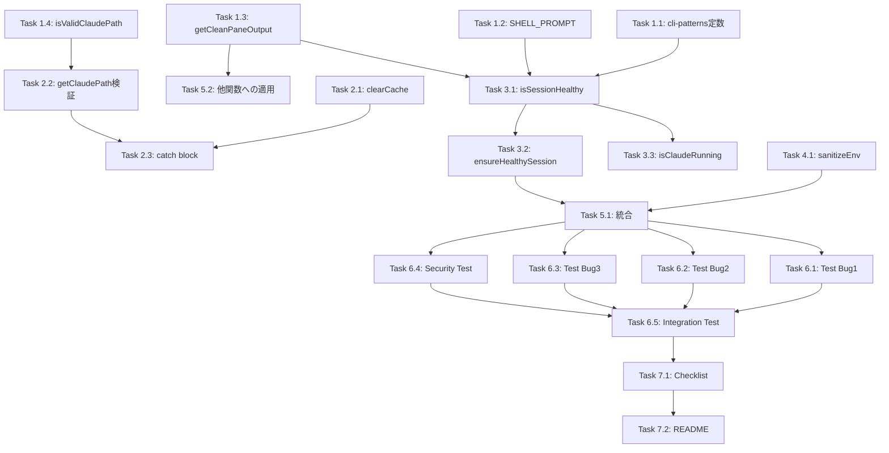

# 作業計画: Issue #265

## Issue概要

**Issue番号**: #265
**タイトル**: fix: Claude CLIパスキャッシュの無効化と壊れたtmuxセッションの自動回復
**サイズ**: L（大規模）
**優先度**: High
**ラベル**: bug

### 問題概要

3つの独立したバグによりClaude CLIセッション開始が永続的に失敗する：

- **Bug 1**: `cachedClaudePath` が無効化されず、CLI更新後も古いパスを使い続ける
- **Bug 2**: 壊れたtmuxセッションが自動回復されず、手動削除が必要
- **Bug 3**: `CLAUDECODE` 環境変数がtmuxセッションに継承され、ネストセッション検出で起動拒否

### 設計方針書

`dev-reports/design/issue-265-claude-session-recovery-design-policy.md` を参照

### マルチステージレビュー結果

4段階のレビューで37件の指摘事項をすべて設計方針書に反映済み（スコア4/5）

---

## タスク分解

### Phase 1: 基盤実装（共通機能・定数）

#### Task 1.1: cli-patterns.ts へのエラーパターン定数追加
**優先度**: P0（Must Fix: MF-001）
**推定工数**: 0.5h
**依存**: なし

**実装内容**:
- `CLAUDE_SESSION_ERROR_PATTERNS: readonly string[]` を追加
- `CLAUDE_SESSION_ERROR_REGEX_PATTERNS: readonly RegExp[]` を追加
- 型宣言スタイル: `readonly + as const`（SF-S2-001）
- JSDoc に SEC-SF-004 パターンメンテナンスプロセスを記載

**成果物**:
```typescript
// src/lib/cli-patterns.ts
export const CLAUDE_SESSION_ERROR_PATTERNS: readonly string[] = [
  'Claude Code cannot be launched inside another Claude Code session',
] as const;

export const CLAUDE_SESSION_ERROR_REGEX_PATTERNS: readonly RegExp[] = [
  /Error:.*Claude/,
] as const;
```

**テスト**: パターンのエクスポート確認（import可能であること）

---

#### Task 1.2: SHELL_PROMPT_ENDINGS 定数追加
**優先度**: P0（Must Fix: MF-002）
**推定工数**: 0.25h
**依存**: なし

**実装内容**:
- `claude-session.ts` 内にプライベート定数として追加（SF-S2-002）
- `['$', '%', '#']` の3種類のシェルプロンプトをサポート

**成果物**:
```typescript
// src/lib/claude-session.ts（ファイル上部、import文の後）
const SHELL_PROMPT_ENDINGS: readonly string[] = ['$', '%', '#'] as const;
```

**テスト**: 定数が正しく定義されていること

---

#### Task 1.3: getCleanPaneOutput() 共通ヘルパー追加
**優先度**: P0（Should Fix: SF-001）
**推定工数**: 0.5h
**依存**: なし

**実装内容**:
- `capturePane()` + `stripAnsi()` パターンを共通化
- 4箇所への適用対象: `waitForPrompt()`, `startClaudeSession()`, `sendMessageToClaude()`, `isSessionHealthy()`

**成果物**:
```typescript
// src/lib/claude-session.ts
async function getCleanPaneOutput(sessionName: string, lines: number = 50): Promise<string> {
  const output = await capturePane(sessionName, { startLine: -lines });
  return stripAnsi(output);
}
```

**テスト**: ヘルパー関数が正しく動作すること

---

#### Task 1.4: isValidClaudePath() 検証関数追加
**優先度**: P0（Must Fix: SEC-MF-001）
**推定工数**: 1h
**依存**: なし

**実装内容**:
- CLAUDE_PATH 環境変数のバリデーション（コマンドインジェクション防止）
- ホワイトリスト正規表現: `/^[/a-zA-Z0-9._-]+$/`
- パストラバーサル防止
- 実行可能ファイルチェック（`fs.access(path, fs.constants.X_OK)`）

**成果物**:
```typescript
// src/lib/claude-session.ts
async function isValidClaudePath(path: string): Promise<boolean> {
  // バリデーションロジック
}
```

**テスト**: セキュリティテストケース追加（悪意のあるパス、存在しないパス等）

---

### Phase 2: Bug 1 対策（キャッシュ再検証）

#### Task 2.1: clearCachedClaudePath() 関数追加
**優先度**: P0
**推定工数**: 0.25h
**依存**: なし

**実装内容**:
- `cachedClaudePath = null` を実行する関数
- `@internal` JSDoc タグ付き（C-002）

**成果物**:
```typescript
// src/lib/claude-session.ts
/**
 * Clear cached Claude CLI path
 * Called when session start fails to allow path re-resolution
 * on next attempt (e.g., after CLI update or path change)
 * @internal Exported for testing purposes
 */
export function clearCachedClaudePath(): void {
  cachedClaudePath = null;
}
```

**テスト**: キャッシュクリア後の再検索を確認

---

#### Task 2.2: getClaudePath() にバリデーション追加
**優先度**: P0（Must Fix: SEC-MF-001）
**推定工数**: 0.5h
**依存**: Task 1.4

**実装内容**:
- `process.env.CLAUDE_PATH` を `isValidClaudePath()` で検証
- 検証失敗時は fallback パスへ

**成果物**:
```typescript
// src/lib/claude-session.ts - getClaudePath() 更新
if (process.env.CLAUDE_PATH) {
  if (await isValidClaudePath(process.env.CLAUDE_PATH)) {
    cachedClaudePath = process.env.CLAUDE_PATH;
    return cachedClaudePath;
  }
  // 検証失敗時はfallbackへ進む
}
```

**テスト**: 無効なCLAUDE_PATHが拒否されること

---

#### Task 2.3: startClaudeSession() catch ブロックでキャッシュクリア
**優先度**: P0
**推定工数**: 0.25h
**依存**: Task 2.1

**実装内容**:
- catch ブロック内で `clearCachedClaudePath()` 呼び出し
- エラーメッセージのサニタイズ（SEC-SF-002）

**成果物**:
```typescript
// src/lib/claude-session.ts - startClaudeSession() 更新
} catch (error: unknown) {
  clearCachedClaudePath(); // キャッシュクリア
  console.error('Failed to start Claude session:', getErrorMessage(error)); // サーバー側ログ
  throw new Error('Failed to start Claude session'); // クライアントへは汎用エラー
}
```

**テスト**: セッション失敗時のキャッシュクリアを確認

---

### Phase 3: Bug 2 対策（壊れたセッション検出・再作成）

#### Task 3.1: isSessionHealthy() 関数追加
**優先度**: P0
**推定工数**: 1h
**依存**: Task 1.1, Task 1.2, Task 1.3

**実装内容**:
- エラーパターン検出（CLAUDE_SESSION_ERROR_PATTERNS使用）
- 正規表現パターン検出（CLAUDE_SESSION_ERROR_REGEX_PATTERNS使用）
- シェルプロンプト検出（SHELL_PROMPT_ENDINGS使用）
- 空出力判定
- `getCleanPaneOutput()` ヘルパー使用

**成果物**:
```typescript
// src/lib/claude-session.ts
async function isSessionHealthy(sessionName: string): Promise<boolean> {
  // 実装（設計方針書参照）
}
```

**テスト**: 各エラーパターンで false を返すこと

---

#### Task 3.2: ensureHealthySession() ヘルパー追加
**優先度**: P0（Should Fix: SF-002）
**推定工数**: 0.5h
**依存**: Task 3.1

**実装内容**:
- セッション健全性チェック
- 異常時は `killSession()` を呼び出し

**成果物**:
```typescript
// src/lib/claude-session.ts
async function ensureHealthySession(sessionName: string): Promise<boolean> {
  const healthy = await isSessionHealthy(sessionName);
  if (!healthy) {
    await killSession(sessionName);
    return false;
  }
  return true;
}
```

**テスト**: 異常セッションが自動削除されること

---

#### Task 3.3: isClaudeRunning() にヘルスチェック追加
**優先度**: P0（Must Fix: MF-S3-001）
**推定工数**: 0.5h
**依存**: Task 3.1

**実装内容**:
- `hasSession()` に加えて `isSessionHealthy()` を呼び出し
- 壊れたセッションでは false を返す

**成果物**:
```typescript
// src/lib/claude-session.ts - isClaudeRunning() 更新
export async function isClaudeRunning(worktreeId: string): Promise<boolean> {
  const sessionName = getSessionName(worktreeId);
  const exists = await hasSession(sessionName);
  if (!exists) {
    return false;
  }
  return await isSessionHealthy(sessionName);
}
```

**テスト**: 壊れたセッションで false を返すこと

---

### Phase 4: Bug 3 対策（CLAUDECODE環境変数除去）

#### Task 4.1: sanitizeSessionEnvironment() ヘルパー追加
**優先度**: P0（Should Fix: SF-002）
**推定工数**: 0.75h
**依存**: なし

**実装内容**:
- tmux グローバル環境から CLAUDECODE 除去
- セッション内で `unset CLAUDECODE` 送信
- 100ms 待機理由をコメントに明記（SF-004, SF-S3-004）
- SEC-SF-003 移行トリガーをJSDocに記載

**成果物**:
```typescript
// src/lib/claude-session.ts
async function sanitizeSessionEnvironment(sessionName: string): Promise<void> {
  // 対策 3-1: tmux グローバル環境から除去
  await execAsync('tmux set-environment -g -u CLAUDECODE 2>/dev/null || true');

  // 対策 3-2: セッション内で unset
  // SEC-SF-001: sessionName は BaseCLITool.getSessionName() 経由で既にバリデーション済み
  await sendKeys(sessionName, 'unset CLAUDECODE', true);
  // 100ms 待機: sendKeys の非同期実行完了を確認するための経験的値（SF-004, SF-S3-004）
  await new Promise(resolve => setTimeout(resolve, 100));
}
```

**テスト**: CLAUDECODE が除去されること（SF-004検証テスト）

---

#### Task 4.2: daemon.ts での env オブジェクト経由 CLAUDECODE 除去
**優先度**: P2（Should Fix: SF-003）
**推定工数**: 0.25h
**依存**: なし

**実装内容**:
- spawn 用 env オブジェクトから `delete env.CLAUDECODE`
- `process.env` への直接操作を回避

**成果物**:
```typescript
// src/cli/utils/daemon.ts - start() メソッド内
const env: NodeJS.ProcessEnv = {
  ...process.env,
  ...(envResult.parsed || {}),
};

// SF-003: env オブジェクトから除去（process.env は変更しない）
delete env.CLAUDECODE;

if (options.port) {
  env.CM_PORT = String(options.port);
}
// ...
```

**テスト**: spawn 用 env に CLAUDECODE が含まれないこと

---

### Phase 5: startClaudeSession() 統合

#### Task 5.1: startClaudeSession() へのヘルパー統合
**優先度**: P0
**推定工数**: 1.5h
**依存**: Task 3.2, Task 4.1

**実装内容**:
- 既存セッションのヘルスチェック（`ensureHealthySession()`）
- 環境変数サニタイズ（`sanitizeSessionEnvironment()`）
- `getCleanPaneOutput()` による重複コード削減
- フロー: `hasSession()` → `ensureHealthySession()` → `createSession()` → `sanitizeSessionEnvironment()` → claude起動

**成果物**:
```typescript
// src/lib/claude-session.ts - startClaudeSession() 更新
export async function startClaudeSession(options: ClaudeSessionOptions): Promise<void> {
  // ...
  const sessionName = getSessionName(worktreeId);

  const exists = await hasSession(sessionName);
  if (exists) {
    // SF-S2-004: 既存セッションのヘルスチェック
    const healthy = await ensureHealthySession(sessionName);
    if (healthy) {
      console.log(`Claude session ${sessionName} already exists and is healthy`);
      return;
    }
    // 異常セッションは ensureHealthySession() 内で削除済み
    // 新規作成フローへ進む
  }

  try {
    await createSession({ sessionName, workingDirectory: worktreePath, historyLimit: 50000 });

    // SF-S2-003: createSession() 直後、claude起動前に環境サニタイズ
    await sanitizeSessionEnvironment(sessionName);

    const claudePath = await getClaudePath();
    await sendKeys(sessionName, claudePath, true);

    // 初期化ポーリング（getCleanPaneOutput() 使用）
    // ...
  } catch (error: unknown) {
    clearCachedClaudePath();
    console.error('Failed to start Claude session:', getErrorMessage(error));
    throw new Error('Failed to start Claude session');
  }
}
```

**テスト**: 統合フローの動作確認

---

#### Task 5.2: waitForPrompt() / sendMessageToClaude() での getCleanPaneOutput() 適用
**優先度**: P1（Should Fix: SF-001）
**推定工数**: 0.5h
**依存**: Task 1.3

**実装内容**:
- `waitForPrompt()` L271-274 の置換
- `sendMessageToClaude()` L410-411 の置換

**成果物**:
```typescript
// src/lib/claude-session.ts - 各関数内で capturePane + stripAnsi を置換
const cleanOutput = await getCleanPaneOutput(sessionName);
if (CLAUDE_PROMPT_PATTERN.test(cleanOutput)) {
  // ...
}
```

**テスト**: 既存テストが全パスすること

---

### Phase 6: テスト実装

#### Task 6.1: 単体テスト - Bug 1（キャッシュクリア）
**優先度**: P0
**推定工数**: 1h
**依存**: Task 2.1, Task 2.3

**テストケース**:
- キャッシュクリア後の再検索
- セッション失敗時のキャッシュクリア
- CLAUDE_PATH バリデーション（正常値、異常値、コマンドインジェクション）

**成果物**: `tests/unit/lib/claude-session.test.ts` への追加

---

#### Task 6.2: 単体テスト - Bug 2（ヘルスチェック）
**優先度**: P0
**推定工数**: 2h
**依存**: Task 3.1, Task 3.2, Task 3.3

**テストケース**:
- 正常セッションのヘルスチェック
- エラーパターン検出（CLAUDE_SESSION_ERROR_PATTERNS各パターン）
- 正規表現パターン検出（CLAUDE_SESSION_ERROR_REGEX_PATTERNS各パターン）
- シェルプロンプト検出（`$`, `%`, `#` 各パターン）
- 壊れたセッションの自動再作成
- `isClaudeRunning()` のヘルスチェック統合
- `getCleanPaneOutput()` の動作確認

**成果物**: `tests/unit/lib/claude-session.test.ts` への追加

---

#### Task 6.3: 単体テスト - Bug 3（CLAUDECODE除去）
**優先度**: P0
**推定工数**: 1.5h
**依存**: Task 4.1, Task 4.2

**テストケース**:
- CLAUDECODE除去コマンド送信
- tmux未起動時のエラーフォールバック
- 対策 3-1 のみでの除去検証（SF-004）
- daemon.ts env オブジェクトからの除去

**成果物**:
- `tests/unit/lib/claude-session.test.ts` への追加
- `tests/unit/cli/utils/daemon.test.ts` への追加（必要に応じて）

---

#### Task 6.4: セキュリティテスト
**優先度**: P0
**推定工数**: 1h
**依存**: Task 1.4, Task 2.2

**テストケース**:
- CLAUDE_PATH コマンドインジェクション防止
- パストラバーサル防止
- 実行可能ファイルチェック
- sessionName バリデーションチェーン確認

**成果物**: `tests/unit/lib/claude-session.test.ts` への追加

---

#### Task 6.5: 統合テスト - 既存テストの修正
**優先度**: P1
**推定工数**: 2h
**依存**: Phase 5完了

**実装内容**:
- `trust-dialog-auto-response.test.ts` への影響確認
- sendKeys モック呼び出し回数の調整（SF-S3-002）
- ANSI コードを含むテストケースの追加（SF-S3-002）

**成果物**: `tests/integration/` 内の既存テスト更新

---

### Phase 7: ドキュメント更新

#### Task 7.1: 実装チェックリストの確認
**優先度**: P2
**推定工数**: 0.5h
**依存**: Phase 6完了

**実装内容**:
- 設計方針書 Section 14 のチェックリスト全項目を確認
- 未実装項目の洗い出し

**成果物**: チェックリスト完了確認

---

#### Task 7.2: README 更新（必要に応じて）
**優先度**: P3
**推定工数**: 0.5h
**依存**: Phase 6完了

**実装内容**:
- 新しい環境変数（CLAUDE_PATH）の説明追加
- トラブルシューティングセクション更新

**成果物**: `README.md` 更新（必要な場合のみ）

---

## タスク依存関係



---

## 品質チェック項目

| チェック項目 | コマンド | 基準 |
|-------------|----------|------|
| ESLint | `npm run lint` | エラー0件 |
| TypeScript | `npx tsc --noEmit` | 型エラー0件 |
| Unit Test | `npm run test:unit` | 全テストパス、カバレッジ80%以上 |
| Integration Test | `npm run test:integration` | 全テストパス |
| Build | `npm run build:all` | 成功 |

---

## 成果物チェックリスト

### コード
- [ ] cli-patterns.ts にエラーパターン定数追加
- [ ] claude-session.ts に SHELL_PROMPT_ENDINGS 追加
- [ ] getCleanPaneOutput() ヘルパー追加
- [ ] isValidClaudePath() 検証関数追加
- [ ] clearCachedClaudePath() 関数追加
- [ ] isSessionHealthy() 関数追加
- [ ] ensureHealthySession() ヘルパー追加
- [ ] sanitizeSessionEnvironment() ヘルパー追加
- [ ] startClaudeSession() 統合更新
- [ ] isClaudeRunning() ヘルスチェック追加
- [ ] getClaudePath() バリデーション追加
- [ ] daemon.ts env オブジェクト経由除去

### テスト
- [ ] 単体テスト: Bug 1（キャッシュクリア）
- [ ] 単体テスト: Bug 2（ヘルスチェック）
- [ ] 単体テスト: Bug 3（CLAUDECODE除去）
- [ ] セキュリティテスト
- [ ] 統合テスト: 既存テスト修正

### ドキュメント
- [ ] 実装チェックリスト確認
- [ ] README 更新（必要に応じて）

---

## Definition of Done

Issue完了条件：

- [ ] すべてのタスクが完了
- [ ] 単体テストカバレッジ80%以上
- [ ] CIチェック全パス（lint, type-check, test, build）
- [ ] マルチステージレビューの全指摘事項（37件）が実装に反映
- [ ] 設計方針書の実装チェックリスト（Section 14）全項目完了
- [ ] 受け入れ基準を満たす:
  - [ ] CLIパスが変更されてもセッション開始が自動回復する
  - [ ] 壊れたtmuxセッションが検出され自動的に再作成される
  - [ ] Claude Codeセッション内からサーバーを起動しても、tmux内のclaudeが正常に起動する
  - [ ] 既存のセッション開始フローに大きな遅延を加えない（250ms以下）

---

## 推定工数サマリー

| Phase | タスク数 | 推定工数 |
|-------|---------|---------|
| Phase 1: 基盤実装 | 4 | 2.25h |
| Phase 2: Bug 1 対策 | 3 | 1h |
| Phase 3: Bug 2 対策 | 3 | 2h |
| Phase 4: Bug 3 対策 | 2 | 1h |
| Phase 5: 統合 | 2 | 2h |
| Phase 6: テスト | 5 | 7.5h |
| Phase 7: ドキュメント | 2 | 1h |
| **合計** | **21** | **16.75h** |

**推奨スケジュール**: 2日間（実装1.5日 + テスト・調整0.5日）

---

## 次のアクション

作業計画承認後：

1. **ブランチ作成**: `feature/265-claude-session-recovery`
2. **Phase 1から順次実装**: タスク依存関係に従って実装
3. **進捗報告**: 各Phase完了時に `/progress-report` で報告
4. **PR作成**: 全Phase完了後に `/create-pr` で自動作成

---

## 備考

- 本作業計画は設計方針書とマルチステージレビュー結果に基づいています
- レビューで検出された37件の指摘事項がすべて設計に反映されています
- セキュリティ観点（OWASP Top 10準拠）が考慮されています
- 既存コードとの整合性が確保されています
