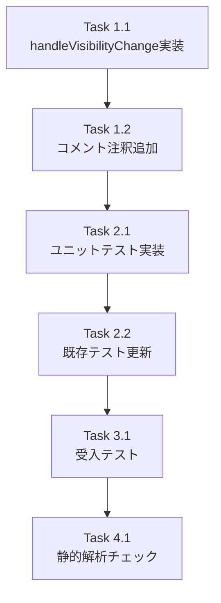

# 作業計画書: Issue #266

## Issue概要

**Issue番号**: #266
**タイトル**: ブラウザのタブを切り替えると入力途中の内容がクリアされる
**種別**: バグ修正（bug）
**サイズ**: S（Small）
**優先度**: Medium
**依存Issue**: なし
**関連Issue**: #246（visibilitychangeリカバリ機能の追加）

---

## 問題の概要

デスクトップブラウザでメッセージ入力欄（MessageInput）にテキストを入力中にブラウザのタブを切り替え、元のタブに戻ると入力途中の内容がクリアされる。

### 根本原因

Issue #246で追加された`visibilitychange`イベントハンドラが`handleRetry()`を呼び出し、`setLoading(true/false)`によりコンポーネントツリーがアンマウント/再マウントされ、`MessageInput`の`useState('')`で入力内容が初期化される。

### 解決方針

**軽量リカバリパターン**を導入：
- `visibilitychange`時には`setLoading`を使わず、バックグラウンドでデータ再取得のみを行う
- エラー状態の場合のみ従来の`handleRetry()`を呼び出す
- `fetchWorktree()`失敗時の`setError()`呼び出しによる副作用を`setError(null)`で打ち消す（**SF-IMP-001**）

---

## 詳細タスク分解

### Phase 1: 実装タスク

#### Task 1.1: handleVisibilityChangeの軽量リカバリ実装

**成果物**: `src/components/worktree/WorktreeDetailRefactored.tsx`（L1494-1505の修正）

**実装内容**:
1. `handleVisibilityChange`を`async`関数に変更
2. エラー状態チェックのガード追加（`if (error)`）
   - エラー時: 従来通り`handleRetry()`を呼び出す
   - 正常時: 軽量リカバリ（次のステップ）
3. 軽量リカバリ実装:
   ```typescript
   try {
     await Promise.all([
       fetchWorktree(),
       fetchMessages(),
       fetchCurrentOutput(),
     ]);
   } catch {
     setError(null); // SF-IMP-001: fetchWorktree内部のsetError呼び出しを打ち消す
   }
   ```
4. useCallback依存配列に`error`, `setError`, `fetchWorktree`, `fetchMessages`, `fetchCurrentOutput`を追加

**依存**: なし

**完了条件**:
- [ ] エラーガードが追加されている
- [ ] 軽量リカバリのPromise.allが実装されている
- [ ] catch内で`setError(null)`が呼ばれている
- [ ] 依存配列が正しく設定されている

---

#### Task 1.2: コメント注釈の追加

**成果物**: `src/components/worktree/WorktreeDetailRefactored.tsx`

**実装内容**:
1. **[SF-DRY-001]** 軽量リカバリのfetch呼び出し箇所にコメント追加:
   ```typescript
   // [SF-DRY-001] 注意: このfetch群はhandleRetry()内のfetch呼び出しと同じデータ取得を行う。
   // handleRetryはsetLoading(true/false)を伴うフルリカバリであり、ここではloading変更なしの
   // 軽量リカバリが必要なため、意図的にfetch呼び出しを分離している。
   // fetch関数の追加・変更時は handleRetry() 側も合わせて確認すること。
   ```

2. **[SF-CONS-001]** Promise.all並行実行の選択理由をコメント:
   ```typescript
   // [SF-CONS-001] handleRetryの条件付き逐次パターンと異なり、並行実行を採用。
   // 理由: 失敗時はサイレント無視のためworktree存在確認不要、GETリクエストのため
   // データ破損リスクなし、並行実行により応答速度優先。
   ```

3. **[SF-IMP-001]** setError(null)の意図をコメント:
   ```typescript
   // [SF-IMP-001] fetchWorktree()内部のsetError()呼び出しによるエラー状態への
   // 遷移を打ち消す。これがないとコンポーネントツリーがErrorDisplay表示に切り替わり、
   // MessageInputがアンマウントされて本修正の意図が失われる。
   ```

4. **[SF-IMP-002]** error依存配列についてのコメント:
   ```typescript
   // [SF-IMP-002] error依存によりuseCallbackが再生成されuseEffectリスナーが
   // 再登録されるが、パフォーマンス影響は軽微。
   ```

**依存**: Task 1.1

**完了条件**:
- [ ] SF-DRY-001コメントが追加されている
- [ ] SF-CONS-001コメントが追加されている
- [ ] SF-IMP-001コメントが追加されている
- [ ] SF-IMP-002コメントが追加されている

---

### Phase 2: テストタスク

#### Task 2.1: ユニットテスト実装

**成果物**: `tests/unit/components/WorktreeDetailRefactored.test.tsx`

**実装内容**:
1. **正常時のvisibilitychange**テスト:
   - `setLoading`が呼ばれないことを検証
   - `fetchWorktree`, `fetchMessages`, `fetchCurrentOutput`が呼ばれることを検証

2. **エラー状態でのvisibilitychange**テスト:
   - error状態で`handleRetry`が呼ばれることを検証

3. **スロットルガード**テスト:
   - `RECOVERY_THROTTLE_MS`（5000ms）以内の再発火で処理がスキップされることを検証

4. **SF-IMP-001: 軽量リカバリ失敗時**テスト:
   - `fetchWorktree`が失敗した場合に`setError(null)`が呼ばれることを検証
   - コンポーネントツリーが維持されること（MessageInputがアンマウントされないこと）を検証

**テストカバレッジ目標**: 新規追加コードのカバレッジ90%以上

**依存**: Task 1.1, Task 1.2

**完了条件**:
- [ ] 正常時のvisibilitychangeテストが実装されている
- [ ] エラー状態でのvisibilitychangeテストが実装されている
- [ ] スロットルガードテストが実装されている
- [ ] SF-IMP-001テストが実装されている
- [ ] すべてのテストがパスする
- [ ] カバレッジ90%以上

---

#### Task 2.2: 既存テストの更新・確認

**成果物**: `tests/unit/components/WorktreeDetailRefactored.test.tsx`

**実装内容**:
1. **[C-IMP-001]** TC-1（visibilitychange data re-fetch）のコメント更新:
   - `handleRetry`経由から軽量リカバリ（fetch直接呼び出し）経由に変更されたことを反映

2. **[C-CONS-002]** TC-2（error時のhandleRetry）の動作確認:
   - errorガード経由で`handleRetry`が呼ばれることを確認（動作変更なし）

**依存**: Task 2.1

**完了条件**:
- [ ] TC-1のコメントが更新されている
- [ ] TC-2が正しく動作することを確認
- [ ] 既存テストすべてがパスする

---

### Phase 3: 受入テスト

#### Task 3.1: 手動受入テスト

**テストケース**:
1. デスクトップブラウザでタブ切替後にメッセージ入力内容が保持される
2. デスクトップブラウザでタブ切替後にPromptPanelの入力内容が保持される
3. visibilitychangeによるデータ再取得が引き続き動作する
4. エラー状態からのタブ復帰時は従来通りhandleRetry()で完全リカバリされる
5. 既存のメッセージ送信フローに影響がない

**依存**: Task 2.2

**完了条件**:
- [ ] すべてのテストケースがPASS

---

### Phase 4: 品質チェック

#### Task 4.1: 静的解析チェック

**チェック内容**:
| チェック項目 | コマンド | 基準 |
|-------------|----------|------|
| ESLint | `npm run lint` | エラー0件 |
| TypeScript | `npx tsc --noEmit` | 型エラー0件 |
| Unit Test | `npm run test:unit` | 全テストパス |
| Build | `npm run build` | 成功 |

**依存**: Task 3.1

**完了条件**:
- [ ] ESLintエラー0件
- [ ] TypeScript型エラー0件
- [ ] 全ユニットテストパス
- [ ] ビルド成功

---

## タスク依存関係



---

## 成果物チェックリスト

### コード
- [ ] `src/components/worktree/WorktreeDetailRefactored.tsx` - handleVisibilityChange修正
- [ ] コメント注釈（SF-DRY-001, SF-CONS-001, SF-IMP-001, SF-IMP-002）

### テスト
- [ ] ユニットテスト - 正常時のvisibilitychange
- [ ] ユニットテスト - エラー状態でのvisibilitychange
- [ ] ユニットテスト - スロットルガード
- [ ] ユニットテスト - SF-IMP-001（軽量リカバリ失敗時）
- [ ] 既存テスト - TC-1コメント更新
- [ ] 既存テスト - TC-2動作確認

### ドキュメント
- [ ] 設計方針書更新済み（マルチステージレビュー完了）

---

## Definition of Done

Issue完了条件：
- [ ] Phase 1: 実装タスク完了
  - [ ] Task 1.1: handleVisibilityChange軽量リカバリ実装
  - [ ] Task 1.2: コメント注釈追加
- [ ] Phase 2: テストタスク完了
  - [ ] Task 2.1: ユニットテスト実装（カバレッジ90%以上）
  - [ ] Task 2.2: 既存テスト更新・確認
- [ ] Phase 3: 受入テスト完了
  - [ ] Task 3.1: 全テストケースPASS
- [ ] Phase 4: 品質チェック完了
  - [ ] Task 4.1: ESLint, TypeScript, Test, Buildすべてパス
- [ ] コードレビュー承認（PR作成後）
- [ ] 設計方針書更新完了（完了済み）

---

## リスク管理

### 技術的リスク

| リスク | 対策 | ステータス |
|--------|------|-----------|
| fetchWorktree内部のsetError()による副作用 | SF-IMP-001: setError(null)で打ち消す | 設計方針書で対策済み |
| handleRetryとのfetch同期漏れ | SF-DRY-001: コメントで依存関係明示 | 設計方針書で対策済み |
| error依存配列によるパフォーマンス影響 | SF-IMP-002: 影響は軽微とレビューで確認済み | 設計方針書で評価済み |

---

## 見積もり

| Phase | タスク | 見積時間 |
|-------|--------|---------|
| Phase 1 | 実装タスク | 2時間 |
| Phase 2 | テストタスク | 2時間 |
| Phase 3 | 受入テスト | 1時間 |
| Phase 4 | 品質チェック | 0.5時間 |
| **合計** | | **5.5時間** |

---

## 次のアクション

作業計画承認後：
1. **実装開始**: Task 1.1から順次実行
2. **TDD実装**: `/tdd-impl 266` または `/pm-auto-dev 266` で自動実行可能
3. **進捗報告**: 各Phaseごとに進捗確認
4. **PR作成**: `/create-pr` で自動作成

---

## 関連ドキュメント

- **設計方針書**: `dev-reports/design/issue-266-visibility-change-input-clear-design-policy.md`
- **マルチステージレビューサマリー**: `dev-reports/issue/266/multi-stage-design-review/summary-report.md`
- **Issue**: https://github.com/Kewton/CommandMate/issues/266
