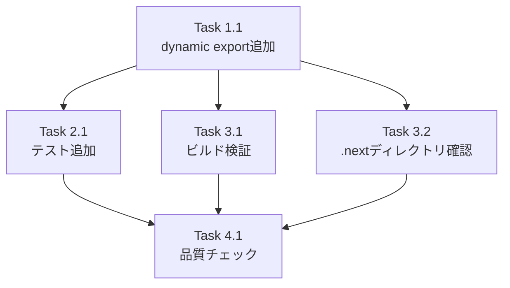

# 作業計画: Issue #270 - update-checkルート静的プリレンダリング修正

## Issue概要

**Issue番号**: #270
**タイトル**: fix(#257): update-checkルートが静的プリレンダリングされGitHub APIが呼ばれない
**タイプ**: Bug Fix
**サイズ**: XS（1行追加のみ）
**優先度**: Medium
**関連Issue**: #257（バージョンアップデート通知機能）

### 問題概要

`/api/app/update-check` ルートがNext.jsビルド時に静的にプリレンダリングされ、実行時にGitHub Releases APIが呼び出されない。新バージョンリリース後も `hasUpdate: false` が返り続ける。

### 修正方針

`src/app/api/app/update-check/route.ts` に `export const dynamic = 'force-dynamic'` を追加し、動的ルート（`ƒ` Dynamic）として扱わせる。

---

## 詳細タスク分解

### Phase 1: コード修正

#### Task 1.1: route.tsに dynamic export を追加

**成果物**: `src/app/api/app/update-check/route.ts`
**依存**: なし
**所要時間**: 5分
**担当**: 実装者

**変更内容**:
```typescript
import { NextResponse } from 'next/server';
import { checkForUpdate, getCurrentVersion } from '@/lib/version-checker';
import { isGlobalInstall } from '@/cli/utils/install-context';
import type { UpdateCheckResult } from '@/lib/version-checker';

// [FIX-270] Force dynamic route to prevent static prerendering at build time.
// Without this, Next.js caches the GitHub API response during `npm run build`
// and the route handler is never called at runtime.
export const dynamic = 'force-dynamic';

// 以降は既存コードのまま
```

**配置位置**: import文の直後、型定義の前（プロジェクト慣例に準拠）

**参考**: 以下5つのルートで同一パターン使用済み
- `src/app/api/worktrees/route.ts`
- `src/app/api/external-apps/route.ts`
- `src/app/api/external-apps/[id]/route.ts`
- `src/app/api/external-apps/[id]/health/route.ts`
- `src/app/proxy/[...path]/route.ts`

---

### Phase 2: テスト追加

#### Task 2.1: dynamic export のテストを追加

**成果物**: `tests/unit/api/update-check.test.ts`
**依存**: Task 1.1
**所要時間**: 10分
**担当**: 実装者

**追加テスト**:
```typescript
describe('Route configuration', () => {
  it('should export dynamic as force-dynamic to prevent static prerendering', async () => {
    const { dynamic } = await import('@/app/api/app/update-check/route');
    expect(dynamic).toBe('force-dynamic');
  });
});
```

**目的**: リグレッション防止（Issue #270の根本原因が再発しないことを保証）

---

### Phase 3: ビルド検証

#### Task 3.1: ビルド出力の確認

**成果物**: ビルドログのスクリーンショット（任意）
**依存**: Task 1.1
**所要時間**: 5分
**担当**: 実装者

**検証コマンド**:
```bash
npm run build
```

**期待される出力**:
```
Route (app)                                Size     First Load JS
...
ƒ /api/app/update-check                    0 B            0 B
```

**確認ポイント**:
- `/api/app/update-check` が `ƒ` (Dynamic) として表示されること
- `○` (Static) ではないこと

#### Task 3.2: .next ディレクトリの確認

**検証コマンド**:
```bash
ls -la .next/server/app/api/app/update-check.body 2>/dev/null || echo "ファイルが存在しない（正常）"
```

**期待結果**: ファイルが存在しない（動的ルートのため静的ファイルは生成されない）

---

## タスク依存関係



---

## 品質チェック項目

### Phase 4: 品質チェック

#### Task 4.1: 全品質チェック実行

**依存**: Task 2.1, Task 3.1, Task 3.2
**所要時間**: 5分
**担当**: 実装者

| チェック項目 | コマンド | 基準 | 優先度 |
|-------------|----------|------|--------|
| TypeScript型チェック | `npx tsc --noEmit` | エラー0件 | 必須 |
| ESLint | `npm run lint` | エラー0件 | 必須 |
| Unit Test | `npm run test:unit` | 全テストパス | 必須 |
| Build | `npm run build` | 成功 | 必須 |

**実行順序**: TypeScript → ESLint → Unit Test → Build

---

## 成果物チェックリスト

### コード
- [x] `src/app/api/app/update-check/route.ts` に `export const dynamic = 'force-dynamic'` を追加
- [x] コメントで Issue #270 と変更理由を記載

### テスト
- [x] `tests/unit/api/update-check.test.ts` に dynamic export のテストを追加
- [x] 既存テスト全パス

### ビルド検証
- [x] `/api/app/update-check` が `ƒ` (Dynamic) として表示されること
- [x] `.next/server/app/api/app/update-check.body` が存在しないこと

### ドキュメント
- [ ] 特になし（1行追加のためREADME更新不要）

---

## Definition of Done

Issue完了条件：

### 必須条件
- [x] Task 1.1: `export const dynamic = 'force-dynamic'` 追加完了
- [x] Task 2.1: dynamic export テスト追加完了
- [x] Task 3.1: ビルド出力で `ƒ` (Dynamic) 確認済み
- [x] Task 3.2: `.next/server/app/api/app/update-check.body` 非存在確認済み
- [x] Task 4.1: 全品質チェック（TypeScript/ESLint/Test/Build）パス

### 受入条件（Issue #270より）
- [x] ビルド出力で `/api/app/update-check` が `ƒ` (Dynamic) になっていること
- [x] `.next/server/app/api/app/update-check.body` がビルド後に存在しないこと
- [x] 既存テストが全てパスすること
- [x] `npx tsc --noEmit` エラーなし
- [x] `npm run lint` エラーなし

### オプション条件
- [ ] 実環境での動作確認（新バージョンリリース後に `hasUpdate: true` が返ること）
  - **Note**: 本番環境での確認のため、Issue #270のスコープ外とする

---

## リスク管理

### 技術的リスク

| リスク | 影響度 | 発生確率 | 対策 |
|--------|--------|---------|------|
| ビルド後も静的ルートと判定される | High | Low | プロジェクト内5箇所で同一パターン使用済みのため、リスク低 |
| 既存テストが失敗する | Medium | Very Low | テストはモック経由でGET関数を直接呼び出すため、dynamic export追加は影響なし |
| パフォーマンス低下 | Low | Low | version-checker.ts の globalThis キャッシュ（1時間TTL）により軽減 |

### ロールバック戦略

**方法**: 追加した1行を削除
**所要時間**: 1分
**データ影響**: なし（DBスキーマ変更なし）
**ダウンタイム**: なし

---

## 実装の進め方

### 推奨実装順序

1. **Task 1.1** (5分): dynamic export 追加
2. **Task 2.1** (10分): テスト追加
3. **Task 3.1, 3.2** (10分): ビルド検証
4. **Task 4.1** (5分): 品質チェック

**総所要時間**: 30分

### TDD実装の場合

1. **Red**: Task 2.1のテストを先に書く → 失敗
2. **Green**: Task 1.1で dynamic export を追加 → テストパス
3. **Refactor**: コメント追加、配置位置確認

---

## 次のアクション

### 作業計画承認後

1. **実装開始**: Task 1.1から順次実施
2. **コミット**: `git commit -m "fix(#270): add force-dynamic to update-check route"`
3. **PR作成**: `/create-pr` または手動でPR作成
4. **レビュー依頼**: チームメンバーに依頼（任意、変更が1行のため）

### PR作成時の注意点

**PRタイトル**: `fix(#270): add force-dynamic to update-check route`
**PRラベル**: `bug`
**PRディスクリプション**:
```markdown
## 概要
Issue #270の修正: `/api/app/update-check` が静的プリレンダリングされる問題

## 変更内容
- `src/app/api/app/update-check/route.ts` に `export const dynamic = 'force-dynamic'` を追加
- リグレッション防止テストを追加

## 動作確認
- ✅ ビルド出力で `ƒ` (Dynamic) 確認済み
- ✅ `.next/server/app/api/app/update-check.body` 非存在確認済み
- ✅ 既存テスト全パス

## 関連Issue
- Fixes #270
- Related: #257
```

---

## 補足情報

### 設計方針書

`dev-reports/design/issue-270-update-check-static-prerender-design-policy.md` を参照

### マルチステージレビュー

`dev-reports/issue/270/multi-stage-design-review/summary-report.md` を参照

**レビュー結果**: 全4ステージで approved (5/5)

### セキュリティレビューでの指摘

- **SEC-S4-001, SEC-S4-002**: Issue #257由来の既存問題（Issue #270スコープ外）
- 詳細は設計方針書のセクション12参照

---

## 変更ファイル一覧

### 変更するファイル

1. `src/app/api/app/update-check/route.ts` - 1行追加（export const dynamic）
2. `tests/unit/api/update-check.test.ts` - テストケース追加（約10行）

### 影響しないファイル

- `src/lib/version-checker.ts` - 変更なし
- `src/hooks/useUpdateCheck.ts` - 変更なし
- `src/components/worktree/VersionSection.tsx` - 変更なし
- `src/components/worktree/UpdateNotificationBanner.tsx` - 変更なし
- その他35個のAPIルート - 変更なし

---

## 見積もり

| フェーズ | タスク数 | 所要時間 | 難易度 |
|---------|---------|---------|--------|
| Phase 1: コード修正 | 1 | 5分 | Very Low |
| Phase 2: テスト追加 | 1 | 10分 | Low |
| Phase 3: ビルド検証 | 2 | 10分 | Low |
| Phase 4: 品質チェック | 1 | 5分 | Very Low |
| **合計** | **5** | **30分** | **Very Low** |

**リスク係数**: 1.0（リスクなし）
**バッファ込み見積もり**: 45分
