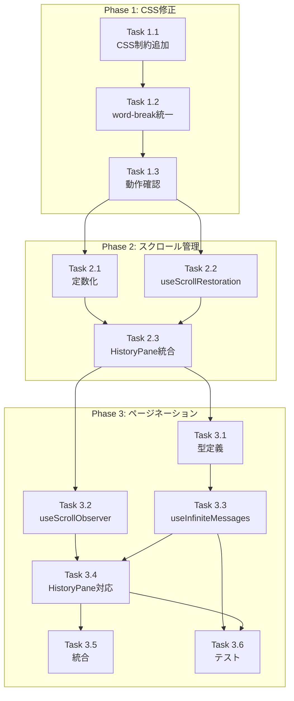

# Issue #28: 履歴表示改善 - 作業計画書

## Issue概要

| 項目 | 内容 |
|------|------|
| **Issue番号** | #28 |
| **タイトル** | 履歴表示改善 |
| **ラベル** | bug |
| **サイズ** | M（中規模） |
| **優先度** | High |
| **依存Issue** | なし |
| **設計方針書** | `dev-reports/design/issue28-history-display-design-policy.md` |

### 問題の概要
Assistantからの履歴表示が一部切れているケースが頻発している。

### 根本原因（設計方針書より）
1. **ページネーション未使用** - デフォルト50件のみ取得
2. **スクロール管理の問題** - sticky ヘッダーとの干渉
3. **CSSオーバーフロー制約** - アシスタント応答に max-w 制約なし

---

## 実装フェーズ概要

| Phase | 内容 | 優先度 | 工数目安 |
|-------|------|--------|---------|
| **Phase 1** | CSS修正（即時対応） | 高 | ~1h |
| **Phase 2** | スクロール管理改善 | 高 | ~2.5h |
| **Phase 3** | ページネーション実装 | 高 | ~7h |
| **Phase 4** | 仮想スクロール | 低 | 将来検討 |

---

## Phase 1: CSS修正（即時対応）

### タスク一覧

- [ ] **Task 1.1**: アシスタント応答のCSS制約追加
  - 成果物: `src/components/worktree/ConversationPairCard.tsx`
  - 依存: なし
  - 工数: 0.5h

- [ ] **Task 1.2**: word-break 統一（Safari対応）
  - 成果物: `src/components/worktree/ConversationPairCard.tsx`
  - 依存: Task 1.1
  - 工数: 0.25h

- [ ] **Task 1.3**: CSS修正の動作確認テスト
  - 成果物: 手動テスト完了
  - 依存: Task 1.2
  - 工数: 0.25h

### 詳細実装内容

#### Task 1.1: アシスタント応答のCSS制約追加

```diff
// src/components/worktree/ConversationPairCard.tsx L240付近
// AssistantMessageItem コンポーネント内
- <div className="text-sm text-gray-200 whitespace-pre-wrap break-words">
+ <div className="text-sm text-gray-200 whitespace-pre-wrap break-words [word-break:break-word] max-w-full overflow-x-hidden">
```

#### Task 1.2: word-break 統一

Safari対応のため `overflow-wrap: anywhere` ではなく `word-break: break-word` を使用。

### Phase 1 成果物チェックリスト

- [ ] ConversationPairCard.tsx の CSS 修正完了
- [ ] 長いテキストが正しく折り返されることを確認
- [ ] Safari でも正常に表示されることを確認

---

## Phase 2: スクロール管理改善

### タスク一覧

- [ ] **Task 2.1**: sticky ヘッダー高さの定数化
  - 成果物: `src/components/worktree/HistoryPane.tsx`
  - 依存: なし
  - 工数: 0.5h

- [ ] **Task 2.2**: useScrollRestoration フック作成
  - 成果物: `src/hooks/useScrollRestoration.ts`
  - 依存: なし
  - 工数: 1h

- [ ] **Task 2.3**: HistoryPane へのフック統合
  - 成果物: `src/components/worktree/HistoryPane.tsx`
  - 依存: Task 2.1, Task 2.2
  - 工数: 1h

### 詳細実装内容

#### Task 2.2: useScrollRestoration フック

```typescript
// src/hooks/useScrollRestoration.ts
export interface ScrollRestorationOptions {
  stickyHeaderHeight?: number;
  preserveOnNewMessage?: boolean;
}

export function useScrollRestoration(
  containerRef: RefObject<HTMLElement>,
  options: ScrollRestorationOptions
): {
  savePosition: () => void;
  restorePosition: () => void;
  scrollToBottom: () => void;
};
```

### Phase 2 成果物チェックリスト

- [ ] useScrollRestoration.ts 作成完了
- [ ] HistoryPane.tsx のスクロール管理改修完了
- [ ] スクロール位置が正しく復元されることを確認
- [ ] 単体テスト作成完了

---

## Phase 3: ページネーション実装

### タスク一覧

- [ ] **Task 3.1**: InfiniteMessagesError 型定義
  - 成果物: `src/types/infinite-messages.ts`
  - 依存: なし
  - 工数: 0.5h

- [ ] **Task 3.2**: useScrollObserver フック作成
  - 成果物: `src/hooks/useScrollObserver.ts`
  - 依存: なし
  - 工数: 1h

- [ ] **Task 3.3**: useInfiniteMessages フック作成
  - 成果物: `src/hooks/useInfiniteMessages.ts`
  - 依存: Task 3.1
  - 工数: 2h

- [ ] **Task 3.4**: HistoryPane のページネーション対応
  - 成果物: `src/components/worktree/HistoryPane.tsx`
  - 依存: Task 3.2, Task 3.3
  - 工数: 2h

- [ ] **Task 3.5**: WorktreeDetailRefactored 統合
  - 成果物: `src/components/worktree/WorktreeDetailRefactored.tsx`
  - 依存: Task 3.4
  - 工数: 1h

- [ ] **Task 3.6**: 単体テスト・結合テスト作成
  - 成果物: `tests/unit/hooks/*.test.ts`, `tests/integration/*.test.tsx`
  - 依存: Task 3.3, Task 3.4
  - 工数: 1.5h

### 詳細実装内容

#### Task 3.1: 型定義

```typescript
// src/types/infinite-messages.ts
export interface InfiniteMessagesError {
  code: 'NETWORK_ERROR' | 'SERVER_ERROR' | 'PARSE_ERROR' | 'UNKNOWN';
  message: string;
  retryable: boolean;
  originalError?: Error;
}
```

#### Task 3.3: useInfiniteMessages フック

```typescript
// src/hooks/useInfiniteMessages.ts
export interface UseInfiniteMessagesReturn {
  messages: ChatMessage[];
  conversationPairs: ConversationPair[];
  isLoading: boolean;
  isLoadingOlder: boolean;
  hasMore: boolean;
  error: InfiniteMessagesError | null;
  loadMore: () => Promise<void>;
  retry: () => Promise<void>;
  refresh: () => Promise<void>;
  clearCache: () => void;
}
```

### Phase 3 成果物チェックリスト

- [ ] 型定義ファイル作成完了
- [ ] useScrollObserver.ts 作成完了
- [ ] useInfiniteMessages.ts 作成完了
- [ ] HistoryPane.tsx ページネーション対応完了
- [ ] WorktreeDetailRefactored.tsx 統合完了
- [ ] 単体テスト作成完了（カバレッジ80%以上）
- [ ] 結合テスト作成完了

---

## タスク依存関係



---

## 品質チェック項目

| チェック項目 | コマンド | 基準 |
|-------------|----------|------|
| ESLint | `npm run lint` | エラー0件 |
| TypeScript | `npx tsc --noEmit` | 型エラー0件 |
| Unit Test | `npm run test:unit` | 全テストパス |
| Integration Test | `npm run test:integration` | 全テストパス |
| Build | `npm run build` | 成功 |

---

## テスト計画

### 単体テスト

| テストファイル | テスト対象 | テストケース数 |
|---------------|----------|---------------|
| `tests/unit/hooks/useScrollRestoration.test.ts` | useScrollRestoration | 4 |
| `tests/unit/hooks/useScrollObserver.test.ts` | useScrollObserver | 4 |
| `tests/unit/hooks/useInfiniteMessages.test.ts` | useInfiniteMessages | 11 |

### 結合テスト

| テストファイル | テスト対象 | テストケース数 |
|---------------|----------|---------------|
| `tests/integration/history-display.test.tsx` | 履歴表示全体 | 9 |
| `tests/integration/conversation-pair-card.test.tsx` | ConversationPairCard | 3 |

### E2Eテスト

| テストファイル | テスト対象 | テストケース数 |
|---------------|----------|---------------|
| `tests/e2e/history-display.spec.ts` | 履歴表示機能 | 4 |
| `tests/e2e/cross-browser.spec.ts` | クロスブラウザ互換性 | 2 |

---

## 成果物チェックリスト

### コード
- [ ] `src/components/worktree/ConversationPairCard.tsx` - CSS修正
- [ ] `src/components/worktree/HistoryPane.tsx` - スクロール管理・ページネーション
- [ ] `src/components/worktree/WorktreeDetailRefactored.tsx` - 統合
- [ ] `src/hooks/useScrollRestoration.ts` - 新規
- [ ] `src/hooks/useScrollObserver.ts` - 新規
- [ ] `src/hooks/useInfiniteMessages.ts` - 新規
- [ ] `src/types/infinite-messages.ts` - 新規

### テスト
- [ ] 単体テスト（3ファイル）
- [ ] 結合テスト（2ファイル）
- [ ] E2Eテスト（2ファイル）

---

## Definition of Done

Issue完了条件：
- [ ] Phase 1〜3 のすべてのタスクが完了
- [ ] 長いテキストが切れずに表示されることを確認（回帰テスト）
- [ ] 単体テストカバレッジ80%以上
- [ ] CIチェック全パス（lint, type-check, test, build）
- [ ] コードレビュー承認
- [ ] Issue #28 のスクリーンショットと同様の問題が解消されていることを確認

---

## リスクと緩和策

| リスク | 影響度 | 緩和策 |
|--------|-------|--------|
| スクロール位置ジャンプ | 中 | Phase 2 でプロトタイプ実装後に検証 |
| Safari互換性 | 中 | word-break: break-word を使用（確認済み） |
| レースコンディション | 低 | AbortController でリクエストキャンセル |

---

## 次のアクション

作業計画承認後：

1. **ブランチ作成**
   ```bash
   git checkout -b feature/28-history-display-improvement
   ```

2. **Phase 1 実装開始**
   - ConversationPairCard.tsx の CSS 修正

3. **進捗報告**
   - `/progress-report` で定期報告

4. **PR作成**
   - `/create-pr` で自動作成

---

## 関連ドキュメント

- [設計方針書](../design/issue28-history-display-design-policy.md)
- [アーキテクチャレビュー](../review/2026-01-12-architecture-review-issue28.md)
- [Issue #28](https://github.com/Kewton/MyCodeBranchDesk/issues/28)
