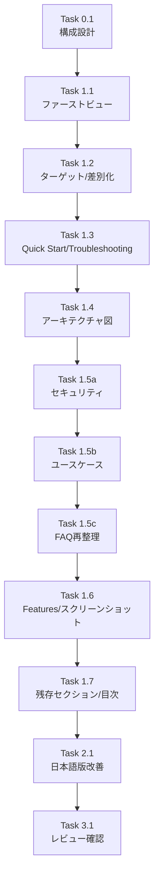

# 作業計画: Issue #286

## Issue: READMEをトップページとして利用するために改善

**Issue番号**: #286
**サイズ**: M
**優先度**: Medium
**依存Issue**: なし
**対象ファイル**: `README.md`, `docs/ja/README.md`

---

## 概要

GitHubトップページ（ランディングページ）として機能するよう、READMEを11のポイントに沿って改善する。現状の構成をベースに、初見ユーザーの「刺さり」と「迷わなさ」を向上させる。

---

## 詳細タスク分解

### Phase 0: 構成設計

#### Task 0.1: セクション構成マッピング設計
**成果物**: 新旧セクション対応表（本タスク内で確定）
**依存**: なし
**作業内容**:
- [ ] 現行READMEの全セクションを洗い出し、新構成での行き先を決定
- [ ] 新READMEのセクション順序を確定

**新旧セクション対応表**:

| # | 新セクション | 現行セクションの対応 | 備考 |
|---|-------------|-------------------|------|
| 1 | バッジ | (新規) | npm version, downloads, license, CI |
| 2 | 言語切替リンク | `[English] \| [日本語]` | 維持 |
| 3 | デモGIFプレースホルダー | (新規) | HTMLコメントのみ |
| 4 | キャッチコピー + ベネフィット3点 | キャッチコピー2行 → 1行化 | CTA付き |
| 5 | スクリーンショット（トップ1枚） | デスクトップ画像 | 維持 |
| 6 | What is this? + Who is this for? | What is this? + Target Users を統合 | 「こんな人向け」「向かない人」追加 |
| 7 | What makes it unique? | What it is NOT を発展 | 独自性の太字明記、CLI対応状況追加 |
| 8 | Quick Start (3 Steps) | Quick Start (Prerequisites / Installation / Setup) を圧縮 | 3ステップに簡略化 |
| 9 | Troubleshooting | (新規、FAQ/既存情報から抽出) | Top3 + tmuxセッション直接確認 |
| 10 | How it works | (新規) | Mermaidアーキテクチャ図 |
| 11 | Key Features | Key Features | 維持（スクリーンショット4枚は `
` 折りたたみ） |
| 12 | Use Cases | (新規) | 3つの具体例 |
| 13 | Security | Mobile Access を統合 | ローカル完結要点 + 推奨/NG構成 |
| 14 | CLI Commands | CLI Commands テーブル | 簡略化しつつ維持 |
| 15 | Developer Setup | Developer Setup + Manual Setup | 維持（`
` 折りたたみ検討） |
| 16 | FAQ | FAQ（再整理後） | 重複をTroubleshooting/Securityに移動 |
| 17 | Status | (新規) | Beta宣言のみ |
| 18 | Documentation | Documentation テーブル | 維持 |
| 19 | Contributing | Contributing | 維持 |
| 20 | License | License | 維持 |

**FAQ項目の行き先マッピング**:

| 現行FAQ項目 | 移動先 | 理由 |
|------------|--------|------|
| ローカル完結？ | → Security セクション冒頭 | セキュリティの文脈で回答 |
| 外出先アクセス？ | → Security セクション | 推奨構成の一部として記載 |
| Claude Code権限？ | → FAQ（残留） | セキュリティとは別の関心事 |
| Windowsで使える？ | → Quick Start の Prerequisites 注記 | 前提条件として早期に伝達 |
| Claude Code以外のCLI？ | → What makes it unique? セクション | 差別化ポイントとして記載 |
| 複数人で使える？ | → FAQ（残留） | 独立した質問として維持 |
| CLI更新後セッション失敗？ | → Troubleshooting | 詰まりどころTop3の1つ |
| CLAUDECODE=1問題？ | → Troubleshooting | 詰まりどころとして追加（Top3の補足） |

---

### Phase 1: 英語版README改善 (`README.md`)

#### Task 1.1: ファーストビュー改善
**成果物**: `README.md` (ファーストビュー部分)
**依存**: Task 0.1
**作業内容**:
- [ ] バッジ追加（npm version, npm downloads, license, CI status `ci-pr.yml`）
- [ ] 言語切替リンク維持（`[English] | [日本語]`）
- [ ] デモGIF用プレースホルダーコメント追加
- [ ] キャッチコピーを1本に絞る
- [ ] 3つの箇条書きベネフィット追加（Prompt待ち検知/リモート操作/worktree管理）
- [ ] CTA（`npm install` コマンド + Quick Startリンク）を明確化
- [ ] トップにデスクトップスクリーンショット1枚配置
- [ ] Status: Beta 宣言をバッジ横に小さく配置

---

#### Task 1.2: ターゲット明確化 + 差別化
**成果物**: `README.md` (What is this / Who is this for / What makes it unique セクション)
**依存**: Task 1.1
**作業内容**:
- [ ] What is this? と Target Users を統合
- [ ] 「こんな人向け」チェックリスト追加（育児/会議/worktree運用）
- [ ] 「向かない人」1行追加（GUI IDE完結派/マルチユーザSaaS期待）
- [ ] What it is NOT → What makes it unique? に発展
- [ ] 独自性を太字で明記（**Prompt待ち検知 + 返信UI + worktree整理**）
- [ ] CLI対応状況を明記（Claude Code / Codex CLI / Gemini CLI 対応、Strategy パターンで拡張可能）

---

#### Task 1.3: Quick Start圧縮 + Troubleshooting
**成果物**: `README.md` (Quick Start / Troubleshooting セクション)
**依存**: Task 1.2
**作業内容**:
- [ ] Quick Startを3ステップに圧縮（install / init / start）
- [ ] Prerequisites を簡潔に1行追加（macOS/Linux, Node.js v20+, tmux）
- [ ] Windows非対応を Prerequisites 注記として記載（FAQから移動）
- [ ] トラブル時の最短コマンド追加（`commandmate status` / `commandmate stop`）
- [ ] 詰まりどころTop3をTroubleshootingミニ枠として配置
  - Claude CLIパス問題（FAQから移動）
  - ポート競合
  - tmuxセッション直接確認（11ポイント目）
- [ ] tmuxセッション命名規則と確認コマンド追加
  - 命名形式: `mcbd-{cli_tool}-{worktree_id}`
  - `tmux list-sessions | grep mcbd`
  - `tmux capture-pane -t "mcbd-claude-{worktree}" -p`
  - `tmux attach -t "mcbd-claude-{worktree}"` （**注意書き追加**: 確認のみ推奨。セッション内での直接入力はCommandMateのセッション管理と干渉する可能性あり。操作は `Ctrl+b → d` でdetachしてCommandMate UIから行うこと）
  - `tmux kill-session -t "mcbd-claude-{worktree}"`
- [ ] CLAUDECODE=1問題をTroubleshooting補足として追加（FAQから移動）

---

#### Task 1.4: アーキテクチャ図追加
**成果物**: `README.md` (How it works セクション)
**依存**: Task 1.3
**作業内容**:
- [ ] Mermaid形式でアーキテクチャ図を追加
  - `Browser/Phone ↔ CommandMate Server ↔ Session Manager ↔ tmux sessions ↔ Claude Code CLI`
  - ローカルDB/state管理の表現
- [ ] Git worktree単位でのセッション管理を図示
- [ ] 簡潔な説明文を追加

---

#### Task 1.5a: セキュリティセクション
**成果物**: `README.md` (Security セクション)
**依存**: Task 1.4
**作業内容**:
- [ ] ローカル完結の要点を明記（FAQ「ローカル完結？」から内容移動）
- [ ] 推奨構成: localhost/同一LAN、VPN/認証付きリバプロ
- [ ] NG構成: 認証なしで 0.0.0.0 公開
- [ ] 現行 Mobile Access セクションの内容をここに統合
- [ ] Trust & Safety / Security Guide へのリンク

---

#### Task 1.5b: ユースケースセクション
**成果物**: `README.md` (Use Cases セクション)
**依存**: Task 1.5a
**作業内容**:
- [ ] 3つの具体例追加（各4〜5行）
  - 通勤中: 朝に投げる → 移動中に確認・指示 → 帰宅後マージ
  - 育児中: worktreeで分離 → 5分の隙間で次の一手
  - 並列開発: 複数worktreeの状態を一覧把握

---

#### Task 1.5c: FAQ再整理
**成果物**: `README.md` (FAQ セクション)
**依存**: Task 1.5b
**作業内容**:
- [ ] Task 0.1のマッピングに従い、FAQを再整理
- [ ] 残留FAQ項目:
  - Claude Code権限
  - 複数人利用
- [ ] 新規FAQ追加:
  - 「tmuxは必須？」（内部利用、ユーザーの直接操作は不要）
- [ ] 他セクションに移動した項目はFAQから削除

---

#### Task 1.6: Key Features + スクリーンショット配置
**成果物**: `README.md` (Key Features セクション)
**依存**: Task 1.5c
**作業内容**:
- [ ] Key Features リスト維持（現行11項目）
- [ ] スクリーンショット4枚を `
` 折りたたみで配置
  - Worktree Detail（Desktop / Mobile History / Mobile Terminal）
  - Top Page（Mobile）
- [ ] altテキストの確認・最適化

---

#### Task 1.7: 残存セクション整理 + 目次
**成果物**: `README.md` (CLI Commands / Developer Setup / Documentation / Contributing / License + TOC)
**依存**: Task 1.6
**作業内容**:
- [ ] CLI Commands テーブル維持（Quick Start直後からCommands独立セクションに移動）
- [ ] Developer Setup 維持（`
` 折りたたみ検討）
- [ ] Documentation テーブル維持
- [ ] Contributing 維持
- [ ] License 維持
- [ ] 手動目次を最上部（バッジ直後）に追加
- [ ] 全体のセクション順序を Task 0.1 の構成表と照合

---

### Phase 2: 日本語版README改善 (`docs/ja/README.md`)

#### Task 2.1: 日本語版全セクション改善
**成果物**: `docs/ja/README.md`
**依存**: Task 1.7（英語版完成後）
**作業内容**:
- [ ] Phase 1の全改善内容を日本語版に反映
  - バッジ（英語版と同一URL）
  - 言語切替リンク維持
  - ファーストビュー（キャッチ/ベネフィット/CTA）
  - ターゲット明確化（「こんな人向け」「向かない人」）
  - Quick Start圧縮 + Troubleshooting（tmuxセッション確認含む、注意書き含む）
  - アーキテクチャ図（Mermaidは英語のまま、説明文は日本語）
  - セキュリティ/ユースケース/FAQ
  - Key Features + スクリーンショット折りたたみ
  - CLI Commands / Developer Setup / Documentation / Contributing / License
  - 目次/ステータス
- [ ] 日本語特有の表現調整
- [ ] 画像パスの調整（`../../docs/images/` 形式）

---

### Phase 3: 品質確認

#### Task 3.1: レビュー・整合性確認
**成果物**: レビュー完了
**依存**: Task 2.1
**作業内容**:
- [ ] 英語版と日本語版のセクション構成・内容一致確認
- [ ] リンク切れチェック（内部リンク/外部リンク）
- [ ] 画像表示確認（altテキスト/サイズ最適化）
- [ ] Mermaid図のGitHubレンダリング確認
- [ ] バッジURLの動作確認
- [ ] `
` 折りたたみの動作確認
- [ ] tmux attach 注意書きの記載確認

---

## タスク依存関係

---

## 品質チェック項目

| チェック項目 | コマンド/方法 | 基準 |
|-------------|--------------|------|
| Markdown構文 | GitHub Preview | 正しくレンダリング |
| リンク | 手動確認 | 全リンク有効 |
| 画像 | GitHub Preview | 全画像表示、altテキストあり |
| Mermaid図 | GitHub Preview | 正しくレンダリング |
| バッジ | ブラウザ確認 | 全バッジ表示 |
| `
` 折りたたみ | GitHub Preview | 正しく動作 |
| CI | `npm run lint` | エラー0件 |

---

## 成果物チェックリスト

### Phase 0: 構成設計
- [ ] 新旧セクション対応表の確定
- [ ] FAQ項目行き先マッピングの確定

### Phase 1: 英語版
- [ ] バッジ/ステータス
- [ ] ファーストビュー（デモGIFプレースホルダー/キャッチ/ベネフィット/CTA）
- [ ] ターゲット明確化（チェックリスト/向かない人/差別化/CLI対応状況）
- [ ] Quick Start（3ステップ）+ Troubleshooting（Top3 + tmux + 注意書き）
- [ ] アーキテクチャ図（Mermaid）
- [ ] セキュリティ（ローカル完結/推奨・NG構成/Mobile Access統合）
- [ ] ユースケース（3例）
- [ ] FAQ再整理（残留項目 + 新規項目）
- [ ] Key Features + スクリーンショット折りたたみ
- [ ] 残存セクション整理 + 目次

### Phase 2: 日本語版
- [ ] 全セクション日本語化
- [ ] 画像パス調整
- [ ] 表現の自然さ確認

### Phase 3: 品質確認
- [ ] 英日整合性確認
- [ ] リンク動作確認
- [ ] 画像表示確認
- [ ] Mermaid図レンダリング確認
- [ ] バッジ動作確認
- [ ] `
` 折りたたみ動作確認

---

## Definition of Done

Issue完了条件：
- [ ] 英語版README (`README.md`) に11ポイント全て反映
- [ ] 日本語版README (`docs/ja/README.md`) に11ポイント全て反映
- [ ] 新旧セクション対応表に沿った構成になっている
- [ ] 全リンクが有効
- [ ] 全画像が正しく表示され、altテキストが設定されている
- [ ] Mermaid図がGitHub上で正しくレンダリング
- [ ] 全バッジが正しく動作
- [ ] tmux attach の注意書きが記載されている
- [ ] Gemini CLI対応が差別化セクションに記載されている
- [ ] CI（lint）チェックパス
- [ ] コードレビュー承認

---

## 次のアクション

作業計画承認後：

1. **ブランチ**: 現在の `feature/286-worktree` を使用
2. **タスク実行**: Phase 0 → Phase 1 → Phase 2 → Phase 3 の順に実装
3. **進捗報告**: 各Phase完了時に `/progress-report`
4. **PR作成**: `/create-pr` で自動作成

---

## 見積もり工数

| Phase | 作業時間 |
|-------|---------|
| Phase 0（構成設計） | 済（本計画で確定） |
| Phase 1（英語版） | 2-3時間 |
| Phase 2（日本語版） | 1-2時間 |
| Phase 3（品質確認） | 0.5-1時間 |
| **合計** | **3.5-6時間** |

---

## 備考

- Issue本文のドラフト改稿案は参考として利用し、現状READMEの構成をベースに改善
- デモGIF作成は別Issueとし、今回はプレースホルダーコメントのみ
- Roadmapセクションは設けない（ステータス宣言のみ）
- CI ワークフローファイル名は `ci-pr.yml` を使用（`ci.yml` ではない）
- Gemini CLI対応を差別化セクション/FAQ/CLI対応状況に反映
- tmux attach は確認用途のみ推奨とし、注意書きを明記

---

## レビュー指摘反映履歴

| # | 指摘内容 | 対応 |
|---|---------|------|
| 1 | 現READMEの既存セクションの扱いが不明確 | Task 0.1（構成設計）を追加、新旧対応表で全セクションの行き先を明確化 |
| 2 | Task 1.5 が過負荷 | Task 1.5a/1.5b/1.5c に3分割 |
| 3 | FAQの再整理方針が不足 | FAQ項目ごとの行き先マッピングを Task 0.1 に追加 |
| 4 | tmux attach の注意事項が不足 | Task 1.3 に注意書き追加（直接入力による干渉リスク） |
| 5 | Gemini CLI対応の記載漏れ | Task 1.2 に Gemini CLI 追加、Task 1.5c で FAQ更新 |
| 6 | スクリーンショット4枚の具体的配置先が不明 | Task 1.6 で `
` 折りたたみ配置を明記 |
