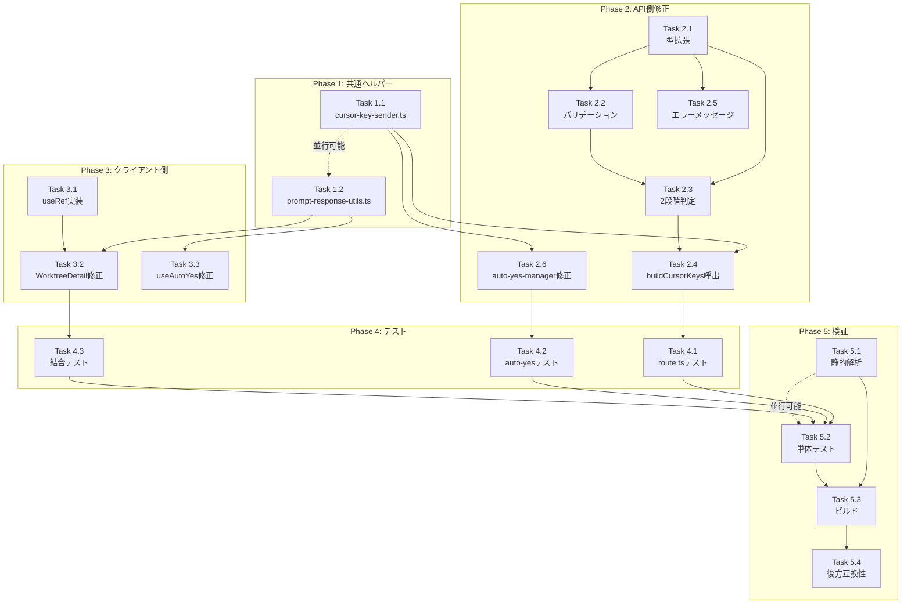

# 作業計画書: Issue #287

## Issue概要

**Issue番号**: #287
**タイトル**: fix: 選択肢プロンプトの送信がClaude Codeに認識されない（promptCheck再検証失敗時のフォールバック不備）
**種別**: bug
**サイズ**: M (Medium)
**優先度**: High
**依存Issue**: なし
**関連Issue**: #193 (カーソルキー方式導入), #161 (プロンプト再検証導入)

### 問題概要

`captureSessionOutput()` の例外発生により `promptCheck` が `null` になると、Claude Codeの選択肢プロンプトに対してテキスト入力方式で送信してしまい、入力が無視される。

### 解決方針

UI側から `promptType` / `defaultOptionNumber` を送信し、`promptCheck` が `null` の場合でも正しい送信方式を判定できるフォールバック機構を追加する。

### 設計方針書

`dev-reports/design/issue-287-prompt-response-fallback-design-policy.md`

---

## 詳細タスク分解

### Phase 1: 共通ヘルパー作成（基盤整備）

#### Task 1.1: cursor-key-sender.ts 実装（MF-001対応）

**目的**: `route.ts` と `auto-yes-manager.ts` の重複カーソルキー送信ロジックを共通化

**成果物**:
- `src/lib/cursor-key-sender.ts`
- `tests/unit/lib/cursor-key-sender.test.ts`

**実装内容**:
1. `CursorKeySendOptions` インターフェース定義
   - `sessionName: string`
   - `cliToolId: CLIToolType`
   - `answer: string`
   - `effectivePromptType: 'yes_no' | 'multiple_choice' | undefined`
   - `effectiveDefaultNum: number`
   - `options?: PromptOption[]` (multi-select判定用)

2. `CursorKeySendResult` インターフェース定義
   - `method: 'cursor_keys' | 'text'`
   - `keys?: string[]`

3. `buildCursorKeys()` 関数実装
   - `isClaudeMultiChoice` 判定
   - offset 計算
   - keys 配列構築（Up/Down + Enter、multi-select の Space + Enter）

4. JSDoc コメント記述

**テストケース**:
- TC 1.1.1: `effectivePromptType=multiple_choice`, `answer="1"`, `effectiveDefaultNum=1` → `['Enter']`
- TC 1.1.2: `effectivePromptType=multiple_choice`, `answer="2"`, `effectiveDefaultNum=1` → `['Down', 'Enter']`
- TC 1.1.3: `effectivePromptType=multiple_choice`, `answer="1"`, `effectiveDefaultNum=2` → `['Up', 'Enter']`
- TC 1.1.4: `effectivePromptType=yes_no`, `answer="yes"` → `method: 'text'`
- TC 1.1.5: `effectivePromptType=undefined`, `answer="1"` → `method: 'text'`
- TC 1.1.6: multi-select options 付き → Space + Enter パターン

**依存**: なし

**所要時間**: 2-3時間

---

#### Task 1.2: prompt-response-utils.ts 実装（SF-003対応）

**目的**: `handlePromptRespond` と `useAutoYes` のリクエストボディ構築ロジックを共通化

**成果物**:
- `src/lib/prompt-response-utils.ts`
- `tests/unit/lib/prompt-response-utils.test.ts`

**実装内容**:
1. `PromptResponseBody` インターフェース定義
   - `answer: string`
   - `cliTool?: string`
   - `promptType?: 'yes_no' | 'multiple_choice'`
   - `defaultOptionNumber?: number`

2. `buildPromptResponseBody()` 関数実装
   - `promptData` から `promptType` 導出
   - `multiple_choice` の場合に `defaultOptionNumber` 導出
   - `yes_no` の場合は `defaultOptionNumber` を `undefined`

3. JSDoc コメント記述

**テストケース**:
- TC 1.2.1: `promptData.type=multiple_choice`, `options=[{number:1, isDefault:true}]` → `{promptType: 'multiple_choice', defaultOptionNumber: 1}`
- TC 1.2.2: `promptData.type=yes_no` → `{promptType: 'yes_no', defaultOptionNumber: undefined}`
- TC 1.2.3: `promptData=null` → `{promptType: undefined, defaultOptionNumber: undefined}`
- TC 1.2.4: `promptData=undefined` → 同上

**依存**: なし

**所要時間**: 1-2時間

---

### Phase 2: API側修正（コア機能実装）

#### Task 2.1: route.ts - PromptResponseRequest 型拡張

**目的**: リクエストボディに `promptType` / `defaultOptionNumber` を追加

**成果物**:
- `src/app/api/worktrees/[id]/prompt-response/route.ts` (型定義部分)

**実装内容**:
1. `PromptResponseRequest` インターフェース拡張
   ```typescript
   interface PromptResponseRequest {
     answer: string;
     cliTool?: CLIToolType;
     promptType?: 'yes_no' | 'multiple_choice';     // NEW
     defaultOptionNumber?: number;                   // NEW
   }
   ```

2. フィールドのオプショナル（`?`）設計で後方互換性維持

**依存**: なし

**所要時間**: 0.5時間

---

#### Task 2.2: route.ts - ランタイムバリデーション追加（SEC-S4-001対応）

**目的**: セキュリティ強化（OWASP A08準拠）

**成果物**:
- `src/app/api/worktrees/[id]/prompt-response/route.ts` (バリデーション部分)

**実装内容**:
1. `promptType` ホワイトリスト検証
   ```typescript
   const ALLOWED_PROMPT_TYPES = ['yes_no', 'multiple_choice'] as const;
   const validatedPromptType = ALLOWED_PROMPT_TYPES.includes(body.promptType)
     ? body.promptType
     : undefined;
   ```

2. `defaultOptionNumber` 型・範囲チェック
   ```typescript
   const validatedDefaultOptionNumber =
     Number.isInteger(body.defaultOptionNumber) && body.defaultOptionNumber > 0
       ? body.defaultOptionNumber
       : undefined;
   ```

3. `params.id` 正規表現チェック（SEC-S4-002対応）
   ```typescript
   if (!/^[a-zA-Z0-9_-]+$/.test(params.id)) {
     return NextResponse.json({ error: 'Invalid worktree ID' }, { status: 400 });
   }
   ```

**依存**: Task 2.1

**所要時間**: 1時間

---

#### Task 2.3: route.ts - effectivePromptType 2段階判定（SF-002対応）

**目的**: 条件式の可読性向上

**成果物**:
- `src/app/api/worktrees/[id]/prompt-response/route.ts` (判定ロジック部分)

**実装内容**:
1. Step 0: ランタイムバリデーション（Task 2.2の結果を使用）
2. Step 1: `effectivePromptType` / `effectiveDefaultNum` の決定
   ```typescript
   const effectivePromptType: 'yes_no' | 'multiple_choice' | undefined =
     promptCheck?.promptData?.type ?? validatedPromptType;

   const effectiveDefaultNum: number =
     promptCheck
       ? (promptCheck.promptData?.options?.find(o => o.isDefault)?.number ?? 1)
       : (validatedDefaultOptionNumber ?? 1);
   ```

3. Step 2: `isClaudeMultiChoice` 判定
   ```typescript
   const isClaudeMultiChoice =
     cliToolId === 'claude' &&
     effectivePromptType === 'multiple_choice' &&
     /^\d+$/.test(answer);
   ```

**依存**: Task 2.1, Task 2.2

**所要時間**: 1時間

---

#### Task 2.4: route.ts - buildCursorKeys() 呼び出しに置換（MF-001対応）

**目的**: カーソルキー送信ロジックを共通ヘルパーに委譲

**成果物**:
- `src/app/api/worktrees/[id]/prompt-response/route.ts` (送信ロジック部分)

**実装内容**:
1. `cursor-key-sender.ts` から `buildCursorKeys` をインポート
2. 既存のカーソルキー送信ロジック（L96-158）を削除
3. `buildCursorKeys()` 呼び出しに置換
   ```typescript
   import { buildCursorKeys } from '@/lib/cursor-key-sender';

   if (isClaudeMultiChoice) {
     const result = buildCursorKeys({
       sessionName,
       cliToolId,
       answer,
       effectivePromptType,
       effectiveDefaultNum,
       options: promptCheck?.promptData?.options
     });

     if (result.method === 'cursor_keys' && result.keys) {
       await sendSpecialKeys(sessionName, result.keys);
     }
   }
   ```

4. コメント追加（SF-S3-003: auto-yes-manager.ts との差異を明記）

**依存**: Task 1.1, Task 2.3

**所要時間**: 1.5時間

---

#### Task 2.5: route.ts - エラーメッセージ固定化（SEC-S4-003対応）

**目的**: 情報漏洩防止

**実装内容**:
1. クライアント向けエラーメッセージを固定パターンに変更
   ```typescript
   // 非推奨: return NextResponse.json({ error: `Worktree '${params.id}' not found` }, { status: 404 });
   // 推奨:
   return NextResponse.json({ error: 'Worktree not found' }, { status: 404 });
   console.error(`[prompt-response] Worktree '${params.id}' not found`);
   ```

**依存**: Task 2.1

**所要時間**: 0.5時間

---

#### Task 2.6: auto-yes-manager.ts - buildCursorKeys() 呼び出しに置換（MF-001対応）

**目的**: カーソルキー送信ロジックを共通ヘルパーに委譲

**成果物**:
- `src/lib/auto-yes-manager.ts`

**実装内容**:
1. `cursor-key-sender.ts` から `buildCursorKeys` をインポート
2. 既存のカーソルキー送信ロジック（L343-399）を削除
3. `buildCursorKeys()` 呼び出しに置換
4. コメント追加（SF-S3-003: `effectivePromptType` 導出方法の差異を明記）
   ```typescript
   // Note: auto-yes-manager.ts では promptDetection が常に利用可能
   // （L321で promptDetection.isPrompt === false の場合は早期リターン済み）
   // route.ts とは異なり、リクエストボディからのフォールバックは不要
   ```

**依存**: Task 1.1

**所要時間**: 1.5時間

---

### Phase 3: クライアント側修正（UI連携）

#### Task 3.1: WorktreeDetailRefactored.tsx - useRef パターン実装（C-004対応）

**目的**: useCallback 依存配列の肥大化防止

**成果物**:
- `src/components/worktree/WorktreeDetailRefactored.tsx` (ref部分)

**実装内容**:
1. `promptDataRef` を `useRef` で作成
   ```typescript
   const promptDataRef = useRef(state.prompt.data);
   ```

2. `useEffect` で `state.prompt.data` を ref に同期
   ```typescript
   useEffect(() => {
     promptDataRef.current = state.prompt.data;
   }, [state.prompt.data]);
   ```

3. 実装時の注意点をコメントとして追記（SF-S3-001対応）
   ```typescript
   // Note: handleAutoYesToggle は activeCliTab を直接使用（ref化していない）
   // パフォーマンス影響が無視できるため、handlePromptRespond のみ ref化
   ```

**依存**: なし

**所要時間**: 0.5時間

---

#### Task 3.2: WorktreeDetailRefactored.tsx - buildPromptResponseBody() 呼び出し（SF-003対応）

**目的**: リクエストボディ構築を共通化

**成果物**:
- `src/components/worktree/WorktreeDetailRefactored.tsx` (handlePromptRespond部分)

**実装内容**:
1. `prompt-response-utils.ts` から `buildPromptResponseBody` をインポート
2. `handlePromptRespond` 内で `buildPromptResponseBody()` を使用
   ```typescript
   const handlePromptRespond = useCallback(
     async (answer: string): Promise<void> => {
       actions.setPromptAnswering(true);
       try {
         const promptData = promptDataRef.current;  // useRef から取得
         const cliTool = activeCliTabRef.current;    // 既存パターン
         const body = buildPromptResponseBody(answer, cliTool, promptData);

         const response = await fetch(`/api/worktrees/${worktreeId}/prompt-response`, {
           method: 'POST',
           headers: { 'Content-Type': 'application/json' },
           body: JSON.stringify(body),
         });
         if (!response.ok) {
           throw new Error(`Failed to send prompt response: ${response.status}`);
         }
         actions.clearPrompt();
         await fetchCurrentOutput();
       } catch (err) {
         console.error('[WorktreeDetailRefactored] Error sending prompt response:', err);
       } finally {
         actions.setPromptAnswering(false);
       }
     },
     [worktreeId, actions, fetchCurrentOutput]
     // Note: state.prompt.data は useRef 経由でアクセスするため依存配列に不要
   );
   ```

**依存**: Task 1.2, Task 3.1

**所要時間**: 1時間

---

#### Task 3.3: useAutoYes.ts - buildPromptResponseBody() 呼び出し（SF-003対応）

**目的**: Auto-Yesパスでのリクエストボディ構築を共通化

**成果物**:
- `src/hooks/useAutoYes.ts`

**実装内容**:
1. `prompt-response-utils.ts` から `buildPromptResponseBody` をインポート
2. `fetch` リクエストボディを `buildPromptResponseBody()` 経由で構築
   ```typescript
   import { buildPromptResponseBody } from '@/lib/prompt-response-utils';

   // L85-89 を置換
   const body = buildPromptResponseBody(answer, cliTool, promptData);
   fetch(`/api/worktrees/${worktreeId}/prompt-response`, {
     method: 'POST',
     headers: { 'Content-Type': 'application/json' },
     body: JSON.stringify(body),
   }).catch((err) => {
     console.error('[useAutoYes] Failed to send auto-response:', err);
   });
   ```

3. コメント追加（SF-S3-002: WorktreeDetailRefactored.tsx と異なり useRef は不要）
   ```typescript
   // Note: useAutoYes.ts は promptData を hook 引数として受け取るため
   // useRef パターンは不要（WorktreeDetailRefactored.tsx とは異なる設計）
   ```

**依存**: Task 1.2

**所要時間**: 0.5時間

---

### Phase 4: テスト更新（品質保証）

#### Task 4.1: prompt-response-verification.test.ts - テストケース追加・更新

**目的**: フォールバックパスとセキュリティバリデーションのテスト

**成果物**:
- `tests/unit/api/prompt-response-verification.test.ts`

**実装内容**:
1. 既存テスト（L163-177）の更新
   - `promptType` なしリクエスト → `sendKeys` が呼ばれる（後方互換性）
   - `promptType` 付きリクエスト → `sendSpecialKeys` が呼ばれる

2. 新規テストケース（フォールバックパス）
   - TC 4.1.1: `captureSessionOutput` 失敗 + `promptType=multiple_choice` + `answer="1"` → `sendSpecialKeys(['Enter'])`
   - TC 4.1.2: `captureSessionOutput` 失敗 + `promptType=yes_no` + `answer="yes"` → `sendKeys("yes")` + `sendKeys("", true)`
   - TC 4.1.3: `captureSessionOutput` 失敗 + `promptType` なし + `answer="1"` → `sendKeys("1")` (後方互換性)
   - TC 4.1.4: `captureSessionOutput` 失敗 + `promptType=multiple_choice` + `defaultOptionNumber=2` + `answer="1"` → `sendSpecialKeys(['Up', 'Enter'])`
   - TC 4.1.5: `captureSessionOutput` 失敗 + `promptType=multiple_choice` + `defaultOptionNumber=undefined` + `answer="2"` → `sendSpecialKeys(['Down', 'Enter'])` (`?? 1` フォールバック)

3. 新規テストケース（セキュリティバリデーション）
   - TC 4.1.6: `promptType='invalid'` → バリデーションで除外され `sendKeys` が呼ばれる
   - TC 4.1.7: `defaultOptionNumber=-1` → バリデーションで除外され `?? 1` フォールバック
   - TC 4.1.8: `defaultOptionNumber=1.5` → バリデーションで除外され `?? 1` フォールバック
   - TC 4.1.9: `params.id='../../../etc/passwd'` → 400エラー
   - TC 4.1.10: `params.id='test-wt; rm -rf /'` → 400エラー
   - TC 4.1.11: エラーメッセージに `params.id` が含まれないことを確認

4. 通常パス優先度テスト
   - TC 4.1.12: `captureSessionOutput` 成功 + `body.promptType=multiple_choice` だが `promptCheck.promptData.type=yes_no` → `promptCheck` が優先され `sendKeys`

**依存**: Task 2.1, Task 2.2, Task 2.3, Task 2.4

**所要時間**: 3-4時間

---

#### Task 4.2: auto-yes-manager.test.ts - テスト更新（MF-S3-001対応）

**目的**: カーソルキーロジック抽出後のテスト更新

**成果物**:
- `tests/unit/lib/auto-yes-manager.test.ts`

**実装内容**:
1. `buildCursorKeys` のモック追加
   ```typescript
   vi.mock('@/lib/cursor-key-sender', () => ({
     buildCursorKeys: vi.fn(),
   }));
   ```

2. テストケース更新（L707-945の20+ケース）
   - `sendSpecialKeys` の直接検証から `buildCursorKeys` の呼び出し検証に変更
   - 返り値を `buildCursorKeys` のモック結果として設定

**依存**: Task 2.6

**所要時間**: 2-3時間

---

#### Task 4.3: worktree-detail-integration.test.tsx - リクエストボディ検証追加

**目的**: 結合テストでリクエストボディ内容を検証

**成果物**:
- `tests/integration/worktree-detail-integration.test.tsx`

**実装内容**:
1. 既存テストのベースライン強化（SF-S3-002対応）
   - L423-426のfetch呼び出し検証を強化
   - リクエストボディの基本検証（`answer`, `cliTool`）を追加

2. 新規テストケース
   - TC 4.3.1: `multiple_choice` プロンプト表示中に応答送信 → リクエストボディに `promptType`, `defaultOptionNumber` が含まれる
   - TC 4.3.2: `yes_no` プロンプト表示中に応答送信 → リクエストボディに `promptType` が含まれ、`defaultOptionNumber` は含まれない

**依存**: Task 3.2

**所要時間**: 1.5-2時間

---

### Phase 5: 検証（最終確認）

#### Task 5.1: 静的解析・型チェック

**目的**: コード品質の確認

**実行コマンド**:
```bash
npm run lint          # ESLint
npx tsc --noEmit      # TypeScript型チェック
```

**合格基準**:
- ESLint: エラー0件
- TypeScript: 型エラー0件

**依存**: 全実装タスク完了

**所要時間**: 0.5時間

---

#### Task 5.2: 単体テスト実行

**目的**: ロジックの正確性確認

**実行コマンド**:
```bash
npm run test:unit
```

**合格基準**:
- 全テストパス
- カバレッジ80%以上（新規コード）

**依存**: 全テストタスク完了

**所要時間**: 0.5時間

---

#### Task 5.3: ビルド確認

**目的**: 本番環境での動作確認

**実行コマンド**:
```bash
npm run build
```

**合格基準**:
- ビルド成功（エラー0件）

**依存**: Task 5.1, Task 5.2

**所要時間**: 0.5時間

---

#### Task 5.4: 後方互換性確認

**目的**: 既存機能への影響がないことを確認

**確認内容**:
1. `promptType` / `defaultOptionNumber` なしリクエストが既存動作と同じ
2. Yes/Noプロンプトの動作に影響なし
3. Codexの動作に影響なし
4. Auto-Yesの動作に影響なし

**方法**: 手動テスト or E2Eテスト

**依存**: Task 5.3

**所要時間**: 1時間

---

## タスク依存関係



### 並行実行可能なタスク

| グループ | タスク |
|---------|-------|
| Phase 1 | Task 1.1, Task 1.2 (完全並行) |
| Phase 2 前半 | Task 2.1, Task 3.1 (API型拡張とUIのref実装) |
| Phase 2 後半 | Task 2.5, Task 2.6 (エラーメッセージとauto-yes-manager) |
| Phase 5 | Task 5.1, Task 5.2 (lint と test) |

---

## 品質チェック項目

| チェック項目 | コマンド | 基準 | タスク |
|-------------|----------|------|-------|
| ESLint | `npm run lint` | エラー0件 | Task 5.1 |
| TypeScript | `npx tsc --noEmit` | 型エラー0件 | Task 5.1 |
| Unit Test | `npm run test:unit` | 全テストパス | Task 5.2 |
| Build | `npm run build` | 成功 | Task 5.3 |
| Coverage | `npm run test:unit -- --coverage` | 新規コード80%以上 | Task 5.2 |

---

## 成果物チェックリスト

### コード（新規作成: 2ファイル）

- [ ] `src/lib/cursor-key-sender.ts` (Task 1.1)
- [ ] `src/lib/prompt-response-utils.ts` (Task 1.2)

### コード（修正: 4ファイル）

- [ ] `src/app/api/worktrees/[id]/prompt-response/route.ts` (Task 2.1-2.5)
- [ ] `src/lib/auto-yes-manager.ts` (Task 2.6)
- [ ] `src/components/worktree/WorktreeDetailRefactored.tsx` (Task 3.1-3.2)
- [ ] `src/hooks/useAutoYes.ts` (Task 3.3)

### テスト（新規作成: 2ファイル）

- [ ] `tests/unit/lib/cursor-key-sender.test.ts` (Task 1.1)
- [ ] `tests/unit/lib/prompt-response-utils.test.ts` (Task 1.2)

### テスト（修正: 3ファイル）

- [ ] `tests/unit/api/prompt-response-verification.test.ts` (Task 4.1)
- [ ] `tests/unit/lib/auto-yes-manager.test.ts` (Task 4.2)
- [ ] `tests/integration/worktree-detail-integration.test.tsx` (Task 4.3)

### ドキュメント

- [ ] `dev-reports/design/issue-287-prompt-response-fallback-design-policy.md` (既存)
- [ ] `dev-reports/issue/287/work-plan.md` (本ファイル)

---

## Definition of Done

Issue #287の完了条件：

### 機能要件
- [ ] `promptCheck` 再検証が失敗した場合でも、Claude Codeの複数選択肢プロンプトにカーソルキー方式で正しく応答できる
- [ ] Yes/Noプロンプトの既存動作に影響がない
- [ ] Codexの既存動作に影響がない
- [ ] Auto-Yesパスでも `promptType` / `defaultOptionNumber` が送信される

### 品質要件
- [ ] すべてのタスクが完了（Phase 1-5）
- [ ] 単体テストカバレッジ80%以上（新規コード）
- [ ] CIチェック全パス（lint, type-check, test, build）
- [ ] 後方互換性確認完了（`promptType` なしリクエストが既存動作と同じ）

### セキュリティ要件
- [ ] `promptType` / `defaultOptionNumber` のランタイムバリデーション実装
- [ ] `params.id` のエントリーポイント検証実装
- [ ] エラーメッセージの固定化完了
- [ ] セキュリティテストケース11件追加

### ドキュメント要件
- [ ] 設計方針書更新完了（4ステージレビュー反映済み）
- [ ] 作業計画書作成完了（本ファイル）
- [ ] README更新不要（本Issueはバグ修正のため）

---

## 進捗管理

### 推定所要時間

| Phase | タスク数 | 所要時間（合計） |
|-------|---------|-----------------|
| Phase 1 | 2 | 3-5時間 |
| Phase 2 | 6 | 7-9時間 |
| Phase 3 | 3 | 2-2.5時間 |
| Phase 4 | 3 | 6.5-9時間 |
| Phase 5 | 4 | 2.5-3時間 |
| **合計** | **18** | **21-28.5時間** |

### マイルストーン

| マイルストーン | 完了条件 | 期日（目安） |
|--------------|---------|-------------|
| M1: 共通ヘルパー完成 | Phase 1完了 | Day 1 |
| M2: API側実装完成 | Phase 2完了 | Day 2 |
| M3: クライアント側完成 | Phase 3完了 | Day 2-3 |
| M4: テスト完成 | Phase 4完了 | Day 3-4 |
| M5: 検証完了 | Phase 5完了 | Day 4 |

---

## 次のアクション

### 1. 作業計画承認

この作業計画を確認し、承認を得る。

### 2. ブランチ作成

```bash
git checkout -b feature/287-prompt-response-fallback
```

### 3. 実装開始

**推奨順序**: Phase 1 → Phase 2 → Phase 3 → Phase 4 → Phase 5

**TDD実装の場合**: `/tdd-impl 287` で自動化

### 4. 進捗報告

定期的に `/progress-report` で進捗を報告

### 5. PR作成

実装完了後、`/create-pr` で自動作成

---

## 参考資料

### 設計ドキュメント
- 設計方針書: `dev-reports/design/issue-287-prompt-response-fallback-design-policy.md`
- 設計レビューサマリー: `dev-reports/issue/287/multi-stage-design-review/summary-report.md`

### Issue関連
- Issue #287: https://github.com/Kewton/CommandMate/issues/287
- Issue #193: https://github.com/Kewton/CommandMate/issues/193
- Issue #161: https://github.com/Kewton/CommandMate/issues/161

### 既存コード参照
- `src/app/api/worktrees/[id]/prompt-response/route.ts` (L72-89, L96-158)
- `src/lib/auto-yes-manager.ts` (L343-399)
- `src/components/worktree/WorktreeDetailRefactored.tsx` (L1126-1147)
- `src/hooks/useAutoYes.ts` (L85-89)

---

*Generated by work-plan skill for Issue #287*
*Date: 2026-02-15*
