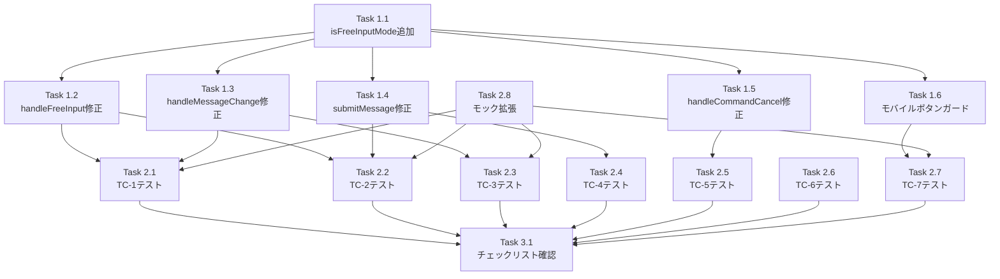

# 作業計画書: Issue #288

## Issue: Enter custom command選択後、カスタムコマンド入力中にセレクターが再表示されEnterで送信できない

**Issue番号**: #288
**サイズ**: S（小規模）
**優先度**: Medium
**ラベル**: bug
**依存Issue**: なし

---

## 概要

メッセージ入力欄のスラッシュコマンドセレクターで「Enter custom command...」を選択した後、カスタムコマンドを入力してもEnterキーで送信できないバグを修正する。`MessageInput` コンポーネントに `isFreeInputMode` フラグを追加し、フリー入力モード中のセレクター再表示を防ぐ。

**根本原因**: `handleMessageChange` のセレクター表示条件が、フリー入力モード中も動作し続けるため。

**対策**: `isFreeInputMode` ステート（`useState<boolean>`）を追加し、フリー入力モード中はセレクター表示ロジックをスキップする。

---

## 詳細タスク分解

### Phase 1: 実装タスク

#### Task 1.1: isFreeInputMode ステート追加
- **成果物**: `src/components/worktree/MessageInput.tsx` L38付近
- **作業内容**:
  ```typescript
  const [isFreeInputMode, setIsFreeInputMode] = useState(false);
  ```
- **依存**: なし
- **所要時間**: 5分

---

#### Task 1.2: handleFreeInput() の修正
- **成果物**: `src/components/worktree/MessageInput.tsx` L141-148
- **作業内容**:
  - `setIsFreeInputMode(true)` を L143 に追加
  ```typescript
  const handleFreeInput = () => {
    setShowCommandSelector(false);
    setIsFreeInputMode(true);  // ← 追加
    setMessage('/');
    setTimeout(() => {
      textareaRef.current?.focus();
    }, 50);
  };
  ```
- **依存**: Task 1.1
- **所要時間**: 5分

---

#### Task 1.3: handleMessageChange() の修正
- **成果物**: `src/components/worktree/MessageInput.tsx` L153-163
- **作業内容**:
  - 空文字時のフラグリセット追加（L127-131）
  - フリー入力モード中の早期リターン追加（L139-140）
  - 経路分析コメント追加（L134-138: SF-002対応）
  ```typescript
  const handleMessageChange = (e: React.ChangeEvent<HTMLTextAreaElement>) => {
    const newValue = e.target.value;
    setMessage(newValue);

    // フリー入力モードのリセット: メッセージ全削除時
    if (newValue === '') {
      setIsFreeInputMode(false);
      setShowCommandSelector(false);
      return;
    }

    // フリー入力モード中はセレクター表示をスキップ
    // NOTE: ここで setShowCommandSelector(false) は不要。
    // handleFreeInput() 内で既に setShowCommandSelector(false) を実行済みであり、
    // フリー入力モード中に showCommandSelector が true になる経路は存在しないため。
    // (Stage 1 SF-002: 防御的プログラミングとして冗長な再セットを検討したが、
    //  経路分析の結果、到達不可能なケースへのガードは KISS 原則に反するため不採用)
    if (isFreeInputMode) {
      return;
    }

    // 通常のセレクター表示ロジック
    if (newValue === '/' || (newValue.startsWith('/') && !newValue.includes(' '))) {
      setShowCommandSelector(true);
    } else {
      setShowCommandSelector(false);
    }
  };
  ```
- **依存**: Task 1.1
- **所要時間**: 15分

---

#### Task 1.4: submitMessage() の修正
- **成果物**: `src/components/worktree/MessageInput.tsx` L66-83
- **作業内容**:
  - `setIsFreeInputMode(false)` を L77（`setMessage('')` の直後）に追加
  ```typescript
  const submitMessage = async () => {
    if (isComposing || !message.trim() || sending) {
      return;
    }

    try {
      setSending(true);
      setError(null);
      const effectiveCliTool: CLIToolType = cliToolId || 'claude';
      await worktreeApi.sendMessage(worktreeId, message.trim(), effectiveCliTool);
      setMessage('');
      setIsFreeInputMode(false);  // ← 追加
      onMessageSent?.(effectiveCliTool);
    } catch (err) {
      setError(handleApiError(err));
    } finally {
      setSending(false);
    }
  };
  ```
- **依存**: Task 1.1
- **所要時間**: 5分

---

#### Task 1.5: handleCommandCancel() の修正
- **成果物**: `src/components/worktree/MessageInput.tsx` L132-135
- **作業内容**:
  - `setIsFreeInputMode(false)` を L134 に追加
  ```typescript
  const handleCommandCancel = () => {
    setShowCommandSelector(false);
    setIsFreeInputMode(false);  // ← 追加
    textareaRef.current?.focus();
  };
  ```
- **依存**: Task 1.1
- **所要時間**: 5分

---

#### Task 1.6: モバイルコマンドボタンのガード追加（Stage 2 SF-001対応）
- **成果物**: `src/components/worktree/MessageInput.tsx` L216-227
- **作業内容**:
  - L218 の `onClick` ハンドラーを修正してフラグリセット追加
  ```typescript
  <button
    type="button"
    onClick={() => {
      setIsFreeInputMode(false);  // ← 追加
      setShowCommandSelector(true);
    }}
    className="flex-shrink-0 p-2 text-gray-500 hover:text-blue-600 hover:bg-blue-50 rounded-full transition-colors"
    aria-label="Show slash commands"
    data-testid="mobile-command-button"
  >
  ```
- **依存**: Task 1.1
- **所要時間**: 5分
- **設計根拠**: ユーザーがフリー入力モードから通常のコマンド選択に戻る意図を尊重

---

### Phase 2: テストタスク

#### Task 2.1: TC-1 - handleFreeInput後のセレクター非表示テスト
- **成果物**: `tests/unit/components/worktree/MessageInput.test.tsx`
- **作業内容**:
  ```typescript
  it('should keep selector hidden after handleFreeInput and custom command input', async () => {
    const { groups } = mockSlashCommands(); // モック設定
    render(<MessageInput {...defaultProps} />);

    // Free input button click
    const freeInputButton = screen.getByTestId('free-input-button');
    fireEvent.click(freeInputButton);

    // Custom command input
    const textarea = screen.getByPlaceholderText(/Type your message/i);
    fireEvent.change(textarea, { target: { value: '/model' } });

    // Selector should remain hidden
    expect(screen.queryByTestId('slash-command-bottom-sheet')).not.toBeInTheDocument();
  });
  ```
- **カバレッジ目標**: `handleFreeInput` → `handleMessageChange` 経路をカバー
- **依存**: Task 1.2, Task 1.3
- **所要時間**: 20分

---

#### Task 2.2: TC-2 - handleFreeInput後のEnter送信テスト
- **成果物**: `tests/unit/components/worktree/MessageInput.test.tsx`
- **作業内容**:
  ```typescript
  it('should submit message with Enter key after handleFreeInput', async () => {
    const { worktreeApi } = await import('@/lib/api-client');
    const { groups } = mockSlashCommands();
    render(<MessageInput {...defaultProps} />);

    // Free input
    const freeInputButton = screen.getByTestId('free-input-button');
    fireEvent.click(freeInputButton);

    const textarea = screen.getByPlaceholderText(/Type your message/i);
    fireEvent.change(textarea, { target: { value: '/model gpt-4o' } });
    fireEvent.keyDown(textarea, { key: 'Enter', shiftKey: false });

    await waitFor(() => {
      expect(worktreeApi.sendMessage).toHaveBeenCalledWith(
        'test-worktree',
        '/model gpt-4o',
        'claude'
      );
    });
  });
  ```
- **依存**: Task 1.2, Task 1.4
- **所要時間**: 20分

---

#### Task 2.3: TC-3 - メッセージ全削除後のセレクター再表示テスト
- **成果物**: `tests/unit/components/worktree/MessageInput.test.tsx`
- **作業内容**:
  ```typescript
  it('should show selector again after clearing message in free input mode', async () => {
    const { groups } = mockSlashCommands();
    render(<MessageInput {...defaultProps} />);

    // Free input
    const freeInputButton = screen.getByTestId('free-input-button');
    fireEvent.click(freeInputButton);

    const textarea = screen.getByPlaceholderText(/Type your message/i);
    fireEvent.change(textarea, { target: { value: '/model' } });

    // Clear message
    fireEvent.change(textarea, { target: { value: '' } });

    // Type '/' again
    fireEvent.change(textarea, { target: { value: '/' } });

    // Selector should appear
    expect(screen.getByTestId('slash-command-bottom-sheet')).toBeInTheDocument();
  });
  ```
- **依存**: Task 1.3
- **所要時間**: 15分

---

#### Task 2.4: TC-4 - submitMessage後のフラグリセットテスト
- **成果物**: `tests/unit/components/worktree/MessageInput.test.tsx`
- **作業内容**:
  ```typescript
  it('should reset isFreeInputMode after submitMessage', async () => {
    const { worktreeApi } = await import('@/lib/api-client');
    const { groups } = mockSlashCommands();
    render(<MessageInput {...defaultProps} />);

    // Free input
    const freeInputButton = screen.getByTestId('free-input-button');
    fireEvent.click(freeInputButton);

    const textarea = screen.getByPlaceholderText(/Type your message/i);
    fireEvent.change(textarea, { target: { value: '/test' } });
    fireEvent.keyDown(textarea, { key: 'Enter', shiftKey: false });

    await waitFor(() => {
      expect(worktreeApi.sendMessage).toHaveBeenCalled();
    });

    // After submit, typing '/' should show selector
    fireEvent.change(textarea, { target: { value: '/' } });
    expect(screen.getByTestId('slash-command-bottom-sheet')).toBeInTheDocument();
  });
  ```
- **依存**: Task 1.4
- **所要時間**: 20分

---

#### Task 2.5: TC-5 - handleCommandCancel後のフラグリセットテスト
- **成果物**: `tests/unit/components/worktree/MessageInput.test.tsx`
- **作業内容**:
  ```typescript
  it('should reset isFreeInputMode after handleCommandCancel (Escape key)', async () => {
    const { groups } = mockSlashCommands();
    render(<MessageInput {...defaultProps} />);

    // Free input
    const freeInputButton = screen.getByTestId('free-input-button');
    fireEvent.click(freeInputButton);

    const textarea = screen.getByPlaceholderText(/Type your message/i);
    fireEvent.change(textarea, { target: { value: '/model' } });

    // Press Escape (selector already hidden, but cancel resets flag)
    fireEvent.keyDown(textarea, { key: 'Escape' });

    // Clear and type '/' - selector should appear
    fireEvent.change(textarea, { target: { value: '' } });
    fireEvent.change(textarea, { target: { value: '/' } });
    expect(screen.getByTestId('slash-command-bottom-sheet')).toBeInTheDocument();
  });
  ```
- **優先度**: Must（Stage 1 C-002で昇格検討）
- **依存**: Task 1.5
- **所要時間**: 20分

---

#### Task 2.6: TC-6 - 通常の / 入力時のセレクター表示テスト
- **成果物**: `tests/unit/components/worktree/MessageInput.test.tsx`
- **作業内容**:
  ```typescript
  it('should show selector on normal "/" input (not in free input mode)', async () => {
    const { groups } = mockSlashCommands();
    render(<MessageInput {...defaultProps} />);

    const textarea = screen.getByPlaceholderText(/Type your message/i);
    fireEvent.change(textarea, { target: { value: '/' } });

    // Selector should appear (normal behavior)
    expect(screen.getByTestId('slash-command-bottom-sheet')).toBeInTheDocument();
  });
  ```
- **依存**: なし（既存動作のリグレッションテスト）
- **所要時間**: 10分

---

#### Task 2.7: TC-7 - モバイルボタンによるフリー入力モード解除テスト（Stage 2 SF-001対応）
- **成果物**: `tests/unit/components/worktree/MessageInput.test.tsx`
- **作業内容**:
  ```typescript
  it('should reset isFreeInputMode when mobile command button is clicked', async () => {
    setMobileMode(true); // モバイルモード設定
    const { groups } = mockSlashCommands();
    render(<MessageInput {...defaultProps} />);

    // Open selector via mobile button
    const mobileButton = screen.getByTestId('mobile-command-button');
    fireEvent.click(mobileButton);

    // Select free input
    const freeInputButton = screen.getByTestId('free-input-button');
    fireEvent.click(freeInputButton);

    // Type custom command
    const textarea = screen.getByPlaceholderText(/Type your message/i);
    fireEvent.change(textarea, { target: { value: '/custom' } });

    // Click mobile button again - should reset free input mode
    fireEvent.click(mobileButton);

    // Selector should appear
    expect(screen.getByTestId('slash-command-bottom-sheet')).toBeInTheDocument();
  });
  ```
- **優先度**: Must（モバイル経路のバイパスパス修正）
- **依存**: Task 1.6
- **所要時間**: 25分

---

#### Task 2.8: useSlashCommands モック拡張
- **成果物**: `tests/unit/components/worktree/MessageInput.test.tsx`
- **作業内容**:
  - 既存の空配列モックを実際のコマンドグループを返すように変更
  ```typescript
  const mockSlashCommands = () => ({
    groups: [
      {
        name: 'Test Commands',
        commands: [
          { name: 'test', description: 'Test command' },
        ],
      },
    ],
  });

  vi.mock('@/hooks/useSlashCommands', () => ({
    useSlashCommands: vi.fn(() => mockSlashCommands()),
  }));
  ```
- **依存**: なし
- **所要時間**: 10分

---

### Phase 3: ドキュメントタスク

#### Task 3.1: 実装チェックリスト確認
- **成果物**: 設計方針書 Section 12 のチェックリスト完了確認
- **作業内容**:
  - [ ] コード実装 7項目すべて完了
  - [ ] テスト実装 7項目すべて完了
  - [ ] 設計根拠確認 2項目すべて完了
- **依存**: Phase 1, Phase 2
- **所要時間**: 10分

---

## タスク依存関係



---

## 品質チェック項目

| チェック項目 | コマンド | 基準 | タイミング |
|-------------|----------|------|----------|
| TypeScript | `npx tsc --noEmit` | 型エラー0件 | 各Task完了時 |
| ESLint | `npm run lint` | エラー0件 | Phase 1完了時 |
| Unit Test | `npm run test:unit` | 全テストパス | 各テスト追加時 |
| Test Coverage | - | isFreeInputMode関連 100% | Phase 2完了時 |
| Build | `npm run build` | 成功 | 最終確認時 |

---

## 成果物チェックリスト

### コード
- [ ] `src/components/worktree/MessageInput.tsx`
  - [ ] Task 1.1: `isFreeInputMode` ステート追加
  - [ ] Task 1.2: `handleFreeInput()` 修正
  - [ ] Task 1.3: `handleMessageChange()` 修正（経路分析コメント含む）
  - [ ] Task 1.4: `submitMessage()` 修正
  - [ ] Task 1.5: `handleCommandCancel()` 修正
  - [ ] Task 1.6: モバイルコマンドボタンガード追加

### テスト
- [ ] `tests/unit/components/worktree/MessageInput.test.tsx`
  - [ ] Task 2.8: `useSlashCommands` モック拡張
  - [ ] Task 2.1: TC-1（フリー入力後セレクター非表示）
  - [ ] Task 2.2: TC-2（フリー入力後Enter送信）
  - [ ] Task 2.3: TC-3（全削除後セレクター再表示）
  - [ ] Task 2.4: TC-4（submitMessage後フラグリセット）
  - [ ] Task 2.5: TC-5（handleCommandCancel後フラグリセット）
  - [ ] Task 2.6: TC-6（通常の / 入力セレクター表示）
  - [ ] Task 2.7: TC-7（モバイルボタンフラグリセット）

### ドキュメント
- [ ] Task 3.1: 設計方針書チェックリスト完了確認

---

## Definition of Done

Issue #288 完了条件：
- [ ] すべてのタスク（Phase 1-3）が完了
- [ ] 単体テストカバレッジ: `isFreeInputMode` 関連経路 100%
- [ ] CIチェック全パス（lint, type-check, test, build）
- [ ] 受入条件の機能要件 6項目すべて満たす
- [ ] 受入条件のテスト要件 4項目（+TC-5,6,7）すべて満たす
- [ ] 設計方針書のレビュー指摘事項すべて反映済み（Stage 1 SF-001/SF-002, Stage 2 SF-001/SF-002）

---

## 所要時間見積もり

| Phase | タスク数 | 合計所要時間 |
|-------|---------|------------|
| Phase 1: 実装 | 6タスク | 40分 |
| Phase 2: テスト | 8タスク | 150分 |
| Phase 3: ドキュメント | 1タスク | 10分 |
| **合計** | **15タスク** | **200分（約3.3時間）** |

---

## 次のアクション

作業計画承認後：
1. ~~**ブランチ作成**: `feature/288-free-input-mode-fix`~~（既存: `feature/288-worktree`）
2. **タスク実行**: Phase 1 → Phase 2 → Phase 3 の順に実装
3. **進捗報告**: 各Phase完了時に `/progress-report` で報告
4. **PR作成**: すべてのタスク完了後に `/create-pr` で自動作成

---

*Generated by work-plan skill for Issue #288*
*Based on design policy: dev-reports/design/issue-288-free-input-mode-fix-design-policy.md*
*Date: 2026-02-17*
