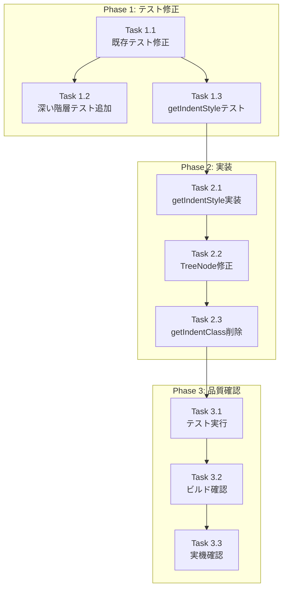

# Issue #30 作業計画書

## Issue概要

| 項目 | 内容 |
|------|------|
| **Issue番号** | #30 |
| **タイトル** | 深い階層のファイルが見れない |
| **種類** | Bug |
| **サイズ** | S (Small) |
| **優先度** | High |
| **依存Issue** | なし |
| **影響範囲** | モバイル・PC両方のFiles表示機能 |

### 問題の概要

5階層目以降のファイル・ディレクトリが表示されない、または正しくインデントされない。

### 根本原因

Tailwind CSSの動的クラス名生成の制限により、depth 6以上で `pl-26`, `pl-30` などのCSSクラスが生成されない。

### 解決策

`getIndentClass` 関数を `getIndentStyle` 関数に置き換え、インラインstyleでpaddingLeftを直接指定する。

---

## 関連ドキュメント

| ドキュメント | パス |
|-------------|------|
| 設計方針書 | `dev-reports/design/issue-30-deep-hierarchy-design-policy.md` |
| アーキテクチャレビュー | `dev-reports/review/2026-01-10-issue-30-architecture-review.md` |

---

## 詳細タスク分解

### Phase 1: テスト修正（TDD準備）

| Task | 内容 | 成果物 | 依存 |
|------|------|--------|------|
| **1.1** | 既存インデントテストの修正 | `tests/unit/components/worktree/FileTreeView.test.tsx` | なし |
| **1.2** | 深い階層テストケース追加 | 同上 | 1.1 |
| **1.3** | getIndentStyle関数のユニットテスト追加 | 同上 | 1.1 |

### Phase 2: 実装

| Task | 内容 | 成果物 | 依存 |
|------|------|--------|------|
| **2.1** | getIndentStyle関数の実装 | `src/components/worktree/FileTreeView.tsx` | 1.3 |
| **2.2** | TreeNodeコンポーネントの修正 | 同上 | 2.1 |
| **2.3** | getIndentClass関数の削除 | 同上 | 2.2 |

### Phase 3: 品質確認

| Task | 内容 | 成果物 | 依存 |
|------|------|--------|------|
| **3.1** | 全テスト実行・確認 | テスト結果 | 2.3 |
| **3.2** | ビルド確認 | ビルド成功 | 3.1 |
| **3.3** | 実機動作確認（モバイル・PC） | 動作確認レポート | 3.2 |

---

## タスク依存関係



---

## 各タスクの詳細

### Task 1.1: 既存インデントテストの修正

**修正箇所**: `tests/unit/components/worktree/FileTreeView.test.tsx:291`

```typescript
// Before (現在のテスト)
expect(indexItem).toHaveClass('pl-6');

// After (修正後)
expect(indexItem).toHaveStyle({ paddingLeft: '1.5rem' });
```

**作業内容**:
1. `toHaveClass('pl-6')` → `toHaveStyle({ paddingLeft: '1.5rem' })` に変更
2. テストが失敗することを確認（Red）

---

### Task 1.2: 深い階層テストケース追加

**追加テストケース**:

```typescript
describe('Deep hierarchy indentation', () => {
  it('should apply correct padding for depth 6', async () => {
    // Setup: 6階層のモックデータ
    // Assert: paddingLeft が 6.5rem であること
  });

  it('should apply correct padding for depth 10', async () => {
    // Setup: 10階層のモックデータ
    // Assert: paddingLeft が 10.5rem であること
  });

  it('should clamp padding at maxVisualDepth (20)', async () => {
    // Setup: 25階層のモックデータ
    // Assert: paddingLeft が 20.5rem であること（上限）
  });
});
```

---

### Task 1.3: getIndentStyle関数のユニットテスト追加

**追加テストケース**:

```typescript
describe('getIndentStyle', () => {
  it.each([
    [0, '0.5rem'],
    [1, '1.5rem'],
    [5, '5.5rem'],
    [6, '6.5rem'],
    [10, '10.5rem'],
    [20, '20.5rem'],
    [25, '20.5rem'], // clamped at maxVisualDepth
  ])('returns { paddingLeft: %s } for depth %i', (depth, expected) => {
    expect(getIndentStyle(depth)).toEqual({ paddingLeft: expected });
  });
});
```

---

### Task 2.1: getIndentStyle関数の実装

**実装コード**:

```typescript
/**
 * Calculate indent style based on depth
 * Uses inline style to avoid Tailwind dynamic class issues
 *
 * @param depth - The nesting depth (0 = root level)
 * @returns CSS properties with paddingLeft value
 */
function getIndentStyle(depth: number): React.CSSProperties {
  // Safety clamp to prevent excessive indentation
  const maxVisualDepth = 20;
  const effectiveDepth = Math.min(depth, maxVisualDepth);

  // Base: 8px (0.5rem), Step: 16px (1rem) per level
  const paddingLeft = 0.5 + effectiveDepth * 1;

  return {
    paddingLeft: `${paddingLeft}rem`,
  };
}
```

**配置場所**: `src/components/worktree/FileTreeView.tsx` (Lines 67-80付近)

---

### Task 2.2: TreeNodeコンポーネントの修正

**修正箇所**: `FileTreeView.tsx` TreeNodeコンポーネント内

```typescript
// Before (Line 208)
const indentClass = getIndentClass(depth);

// After
const indentStyle = getIndentStyle(depth);

// Before (Line 218)
className={`flex items-center gap-2 py-1.5 px-2 cursor-pointer hover:bg-gray-100 rounded transition-colors ${indentClass}`}

// After
className="flex items-center gap-2 py-1.5 px-2 cursor-pointer hover:bg-gray-100 rounded transition-colors"
style={indentStyle}
```

---

### Task 2.3: getIndentClass関数の削除

**削除対象**: `FileTreeView.tsx` Lines 67-80

```typescript
// 削除対象のコード
function getIndentClass(depth: number): string {
  const paddingMap: Record<number, string> = {
    0: 'pl-2',
    1: 'pl-6',
    2: 'pl-10',
    3: 'pl-14',
    4: 'pl-18',
    5: 'pl-22',
  };
  return paddingMap[depth] || `pl-${2 + depth * 4}`;
}
```

---

### Task 3.1: 全テスト実行・確認

```bash
# ユニットテスト
npm run test:unit

# 結合テスト
npm run test:integration

# 全テスト
npm test
```

**合格基準**: 全テストパス

---

### Task 3.2: ビルド確認

```bash
# 型チェック
npx tsc --noEmit

# リント
npm run lint

# ビルド
npm run build
```

**合格基準**: 全コマンドがエラーなく完了

---

### Task 3.3: 実機動作確認

**確認項目**:

| 環境 | 確認内容 | 期待結果 |
|------|---------|---------|
| PC (Chrome) | 6階層目のファイル表示 | 正しくインデントされて表示 |
| PC (Chrome) | 10階層目のファイル表示 | 正しくインデントされて表示 |
| モバイル (Safari) | 6階層目のファイル表示 | 正しくインデントされて表示 |
| モバイル (Safari) | スクロール動作 | 深い階層でもスクロール可能 |

---

## 品質チェック項目

| チェック項目 | コマンド | 基準 |
|-------------|----------|------|
| ESLint | `npm run lint` | エラー0件 |
| TypeScript | `npx tsc --noEmit` | 型エラー0件 |
| Unit Test | `npm run test:unit` | 全テストパス |
| Integration Test | `npm run test:integration` | 全テストパス |
| Build | `npm run build` | 成功 |

---

## 成果物チェックリスト

### コード修正

- [ ] `src/components/worktree/FileTreeView.tsx`
  - [ ] `getIndentStyle` 関数追加
  - [ ] `TreeNode` コンポーネントの style 属性修正
  - [ ] `getIndentClass` 関数削除

### テスト

- [ ] `tests/unit/components/worktree/FileTreeView.test.tsx`
  - [ ] 既存インデントテスト修正
  - [ ] 深い階層テストケース追加
  - [ ] `getIndentStyle` 関数テスト追加

### ドキュメント

- [ ] 作業計画書（本ドキュメント）
- [ ] 設計方針書（作成済み）
- [ ] アーキテクチャレビュー（作成済み）

---

## Definition of Done

Issue完了条件：

- [ ] すべてのタスクが完了
- [ ] depth 0-10 のファイル/ディレクトリが正しく表示される
- [ ] depth 6以降でもインデントが正しく適用される
- [ ] モバイル・デスクトップ両方で動作確認完了
- [ ] 既存テストがすべてパス
- [ ] 新規テスト（深い階層）がすべてパス
- [ ] CIチェック全パス（lint, type-check, test, build）
- [ ] コードレビュー承認

---

## 実行コマンド

### ブランチ作成

```bash
git checkout -b fix/30-deep-hierarchy-file-display
```

### TDD実装開始

```bash
/tdd-impl #30
```

### 進捗報告

```bash
/progress-report #30
```

### PR作成

```bash
/create-pr #30
```

---

## リスクと対策

| リスク | 発生確率 | 影響度 | 対策 |
|--------|:--------:|:------:|------|
| 既存テスト修正漏れ | 低 | 中 | 全テスト実行で検証 |
| インデント値のずれ | 低 | 低 | 計算式を既存と同等に設計済み |
| モバイル表示崩れ | 低 | 中 | 実機確認を必須化 |

---

## スケジュール目安

| Phase | タスク | 見積もり |
|-------|--------|---------|
| Phase 1 | テスト修正 | Task 1.1-1.3 |
| Phase 2 | 実装 | Task 2.1-2.3 |
| Phase 3 | 品質確認 | Task 3.1-3.3 |

**総合サイズ**: Small (S)

---

*作成日: 2026-01-10*
*作成者: Claude Code (Tech Lead)*
