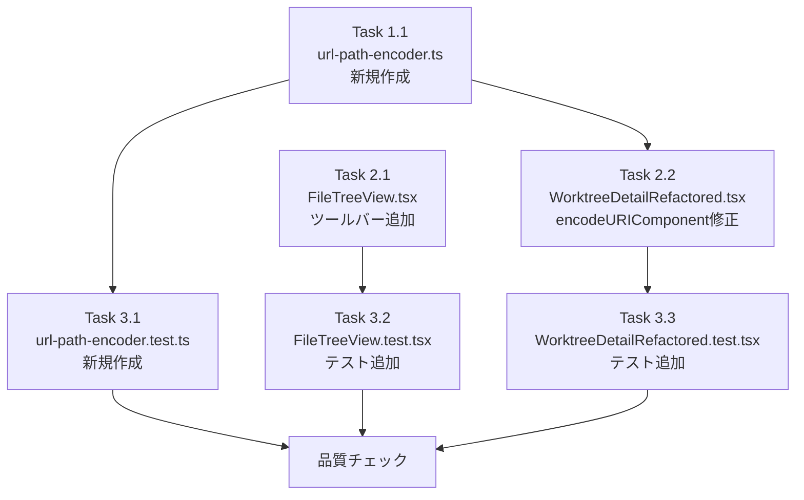

# Issue #300 作業計画書: ルートディレクトリにディレクトリを追加出来ない

## Issue概要

**Issue番号**: #300
**タイトル**: ルートディレクトリにディレクトリを追加出来ない
**サイズ**: S（変更ファイル数: 5ファイル、新規: 1ファイル）
**優先度**: High（バグ修正）
**ラベル**: bug
**依存Issue**: なし

### 問題
- `FileTreeView.tsx` が非空状態でルートレベルの「New Directory」「New File」ボタンを表示しない
- `WorktreeDetailRefactored.tsx` の5箇所で `encodeURIComponent` がパス全体をエンコードし、スラッシュが `%2F` に変換される

### 解決策
1. `FileTreeView.tsx` の非空状態にツールバーを追加
2. `encodePathForUrl()` ヘルパー関数を新規作成し、5箇所で置換

---

## 詳細タスク分解

### Phase 1: ユーティリティ実装

#### Task 1.1: url-path-encoder.ts 新規作成
- **成果物**: `src/lib/url-path-encoder.ts`
- **依存**: なし
- **内容**:
  ```typescript
  export function encodePathForUrl(path: string): string {
    if (!path) return '';
    return path.split('/').map(encodeURIComponent).join('/');
  }
  ```
- **エッジケース対応**:
  - 空文字列 → `''` を返す
  - 先頭スラッシュ（`/src/file`）: 各セグメントをエンコード（`/src/file` → `''`, `src`, `file` に分割、再結合）
  - 連続スラッシュ（`src//file`）: 正規化なし、各セグメントをそのままエンコード
  - 末尾スラッシュ（`src/`）: 末尾の空文字列も含めてエンコード

---

### Phase 2: コンポーネント実装

#### Task 2.1: FileTreeView.tsx ツールバー追加
- **成果物**: `src/components/worktree/FileTreeView.tsx`（修正）
- **依存**: なし
- **変更箇所**: L877付近の非空状態returnブロックに以下のツールバーを追加

```typescript
// 非空状態の return 内、filteredRootItems.map(...) の前に挿入
{(onNewFile || onNewDirectory) && (
  <div data-testid="file-tree-toolbar" className="flex items-center gap-1 p-1 border-b border-gray-200 dark:border-gray-700">
    {onNewFile && (
      <button
        data-testid="toolbar-new-file-button"
        onClick={() => onNewFile('')}
        className="flex items-center gap-1 px-2 py-1 text-xs text-gray-600 dark:text-gray-400 hover:bg-gray-100 dark:hover:bg-gray-700 rounded transition-colors"
        title="Create new file at root"
      >
        <FilePlus className="w-3.5 h-3.5" />
        <span>New File</span>
      </button>
    )}
    {onNewDirectory && (
      <button
        data-testid="toolbar-new-directory-button"
        onClick={() => onNewDirectory('')}
        className="flex items-center gap-1 px-2 py-1 text-xs text-gray-600 dark:text-gray-400 hover:bg-gray-100 dark:hover:bg-gray-700 rounded transition-colors"
        title="Create new directory at root"
      >
        <FolderPlus className="w-3.5 h-3.5" />
        <span>New Directory</span>
      </button>
    )}
  </div>
)}
```

**注意事項**:
- 空状態ボタン（L827-861）は既存のまま維持する
- `FolderPlus` はすでに import されているか確認（なければ lucide-react から追加）

#### Task 2.2: WorktreeDetailRefactored.tsx のencodeURIComponent修正
- **成果物**: `src/components/worktree/WorktreeDetailRefactored.tsx`（修正）
- **依存**: Task 1.1（url-path-encoder.ts）
- **変更箇所**: 5箇所

| 関数 | 行 | 変更前 | 変更後 | エンドポイント |
|------|-----|--------|--------|-------------|
| `handleNewFile` | L1252 | `encodeURIComponent(newPath)` | `encodePathForUrl(newPath)` | `/api/.../files/` |
| `handleNewDirectory` | L1279 | `encodeURIComponent(newPath)` | `encodePathForUrl(newPath)` | `/api/.../files/` |
| `handleRename` | L1305 | `encodeURIComponent(path)` | `encodePathForUrl(path)` | `/api/.../files/` |
| `handleDelete` | L1330 | `encodeURIComponent(path)` | `encodePathForUrl(path)` | `/api/.../files/` |
| `handleFileInputChange` | L1408 | `encodeURIComponent(uploadPath)` | `encodePathForUrl(uploadPath)` | `/api/.../upload/` |

**import追加**:
```typescript
import { encodePathForUrl } from '@/lib/url-path-encoder';
```

**注意事項**:
- `handleNewFile` の `.md` 自動付与ロジック（L1246-1247）は `encodePathForUrl()` 適用前に実行される。変更不要。
- `handleFileInputChange` は `/upload/` エンドポイントを使用（他4箇所は `/files/`）。変更内容は同じ（encodeURIComponent → encodePathForUrl）。

---

### Phase 3: テスト実装

#### Task 3.1: url-path-encoder.test.ts 新規作成
- **成果物**: `tests/unit/lib/url-path-encoder.test.ts`
- **依存**: Task 1.1
- **テストケース**:

```typescript
describe('encodePathForUrl', () => {
  // 基本ケース
  it('英数字パスはそのまま返す', () => {
    expect(encodePathForUrl('src/components')).toBe('src/components');
  });

  it('スラッシュを含むパスは各セグメントをエンコードしてスラッシュで結合', () => {
    expect(encodePathForUrl('src/my file.ts')).toBe('src/my%20file.ts');
  });

  it('特殊文字（スペース）をエンコード', () => {
    expect(encodePathForUrl('my file.ts')).toBe('my%20file.ts');
  });

  it('特殊文字（#）をエンコード', () => {
    expect(encodePathForUrl('src/file#1.md')).toBe('src/file%231.md');
  });

  it('特殊文字（?）をエンコード', () => {
    expect(encodePathForUrl('src/file?.ts')).toBe('src/file%3F.ts');
  });

  // スラッシュ保護の確認
  it('スラッシュはエンコードしない（catch-allルートのセグメント分割のため）', () => {
    expect(encodePathForUrl('src/components/Button.tsx')).toBe('src/components/Button.tsx');
  });

  // エッジケース（[SF-3]）
  it('空文字列は空文字列を返す', () => {
    expect(encodePathForUrl('')).toBe('');
  });

  it('先頭スラッシュは各セグメントをエンコード', () => {
    expect(encodePathForUrl('/src/file')).toBe('/src/file'); // 先頭スラッシュ保持
  });

  it('連続スラッシュは正規化しない', () => {
    expect(encodePathForUrl('src//file')).toBe('src//file'); // 各セグメント（空文字含む）をエンコード
  });

  it('末尾スラッシュを保持', () => {
    expect(encodePathForUrl('src/')).toBe('src/');
  });

  // セキュリティ（[Stage4 SF-1]）
  it('パストラバーサル文字列はエンコードされるが防御はサーバー側で行われる', () => {
    expect(encodePathForUrl('../etc/passwd')).toBe('..%2Fetc%2Fpasswd'); // encodeURIComponentで%2Fになる
  });
});
```

**注意**: 末尾の期待値は `encodePathForUrl` の実装に合わせて調整が必要。`path.split('/').map(encodeURIComponent).join('/')` の場合:
- `'src/components'` → `['src', 'components'].map(encodeURIComponent).join('/')` → `'src/components'`
- `'src/my file.ts'` → `['src', 'my%20file.ts'].join('/')` → `'src/my%20file.ts'`
- `'../etc/passwd'` → `['..', 'etc', 'passwd'].map(encodeURIComponent).join('/')` → `'../etc/passwd'`（`..` はencodeURIComponentでエンコードされない）

#### Task 3.2: FileTreeView.test.tsx テスト追加
- **成果物**: `tests/unit/components/worktree/FileTreeView.test.tsx`（追加）
- **依存**: Task 2.1
- **追加テストケース**:

```typescript
describe('非空状態のツールバー', () => {
  it('onNewDirectory提供時、ツールバーの"New Directory"ボタンが表示される', () => {
    // rootItemsに1つ以上のアイテムを含む状態でレンダリング
    // toolbar-new-directory-button が表示されることを確認
  });

  it('onNewFile提供時、ツールバーの"New File"ボタンが表示される', () => {
    // toolbar-new-file-button が表示されることを確認
  });

  it('ツールバーの"New Directory"ボタンクリックでonNewDirectory("")が呼ばれる', () => {
    // toolbar-new-directory-button クリック
    // onNewDirectory("") が呼ばれることを確認
  });

  it('ツールバーの"New File"ボタンクリックでonNewFile("")が呼ばれる', () => {
    // toolbar-new-file-button クリック
    // onNewFile("") が呼ばれることを確認
  });

  it('onNewDirectory/onNewFile未指定時、ツールバーが表示されない', () => {
    // コールバック未指定の場合
    // file-tree-toolbar が表示されないことを確認
  });

  it('空状態ボタン（empty-new-directory-button）は空状態で引き続き表示される', () => {
    // rootItemsが空の状態でレンダリング
    // empty-new-directory-button が表示されることを確認
  });
});
```

#### Task 3.3: WorktreeDetailRefactored.test.tsx テスト追加
- **成果物**: `tests/unit/components/WorktreeDetailRefactored.test.tsx`（追加）
- **依存**: Task 2.2, Task 1.1
- **追加テストケース**（[Stage3 SF-1] テスト戦略: fetchモック + URL検証）:

```typescript
describe('パスエンコード（encodePathForUrl）', () => {
  it('handleNewDirectoryはスラッシュを含むパスを正しくエンコードしてAPIを呼ぶ', async () => {
    // window.promptをモックして 'src/newdir' を返す
    // fetchモックでURLを検証: /api/worktrees/{id}/files/src/newdir
    // %2F が含まれないことを確認
  });

  it('handleNewFileはスラッシュを含むパスを正しくエンコードしてAPIを呼ぶ', async () => {
    // 同様にファイル作成のURLを検証
  });
});
```

---

## タスク依存関係



---

## 実装順序（推奨）

1. **Task 1.1**: `url-path-encoder.ts` 新規作成（他に依存なし）
2. **Task 3.1**: `url-path-encoder.test.ts` 新規作成（TDD: Red先行）
3. **Task 2.1**: `FileTreeView.tsx` ツールバー追加（他に依存なし）
4. **Task 3.2**: `FileTreeView.test.tsx` テスト追加（TDD: Red先行）
5. **Task 2.2**: `WorktreeDetailRefactored.tsx` encodeURIComponent修正
6. **Task 3.3**: `WorktreeDetailRefactored.test.tsx` テスト追加

---

## 変更ファイル一覧

| ファイル | 変更種別 | 内容 |
|---------|---------|------|
| `src/lib/url-path-encoder.ts` | 新規 | encodePathForUrl()ヘルパー |
| `src/components/worktree/FileTreeView.tsx` | 修正 | 非空状態にツールバー追加 |
| `src/components/worktree/WorktreeDetailRefactored.tsx` | 修正 | 5箇所のencodeURIComponent置換 |
| `tests/unit/lib/url-path-encoder.test.ts` | 新規 | encodePathForUrl()単体テスト |
| `tests/unit/components/worktree/FileTreeView.test.tsx` | 追加 | ツールバー表示・操作テスト |
| `tests/unit/components/WorktreeDetailRefactored.test.tsx` | 追加 | パスエンコードテスト |

---

## 品質チェック項目

| チェック項目 | コマンド | 基準 |
|-------------|----------|------|
| TypeScript | `npx tsc --noEmit` | エラー0件 |
| ESLint | `npm run lint` | エラー0件 |
| Unit Test | `npm run test:unit` | 全テストパス |
| Build | `npm run build` | 成功 |

---

## 成果物チェックリスト

### コード
- [ ] `src/lib/url-path-encoder.ts` 作成済み
- [ ] `FileTreeView.tsx` にツールバー追加済み
- [ ] `WorktreeDetailRefactored.tsx` の5箇所を `encodePathForUrl()` に置換済み

### テスト
- [ ] `url-path-encoder.test.ts` 全テストパス
- [ ] `FileTreeView.test.tsx` ツールバーテスト追加・パス
- [ ] `WorktreeDetailRefactored.test.tsx` パスエンコードテスト追加・パス

### 品質
- [ ] TypeScript エラー0件
- [ ] ESLint エラー0件
- [ ] 全単体テストパス

---

## Definition of Done

- [ ] 非空状態でツールバーボタン（`toolbar-new-directory-button`, `toolbar-new-file-button`）が表示される
- [ ] ツールバーボタンからルートレベルにディレクトリ/ファイルが作成できる
- [ ] 空状態ボタン（`empty-new-directory-button`, `empty-new-file-button`）が引き続き表示される
- [ ] スラッシュを含むパスが正しくエンコードされる（`%2F` を生成しない）
- [ ] `isPathSafe()` によるパストラバーサル検証が維持される
- [ ] 全テストパス
- [ ] TypeScript・ESLint エラー0件

---

## 次のアクション

作業計画確認後：
1. **TDD実装**: `/pm-auto-dev 300` で実装開始
2. **PR作成**: `/create-pr` で自動作成

---

## 関連ドキュメント

- 設計方針書: `dev-reports/design/issue-300-root-directory-creation-design-policy.md`
- Issueレビュー: `dev-reports/issue/300/issue-review/summary-report.md`
- 設計レビュー: `dev-reports/issue/300/multi-stage-design-review/summary-report.md`
