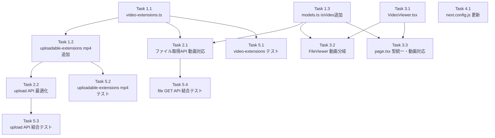

# 作業計画書: Issue #302 mp4ファイルアップロード・再生機能

---

## Issue概要

**Issue番号**: #302
**タイトル**: mp4ファイルをアップロード可能にしたい
**サイズ**: M（中規模: 新規ファイル3件、既存ファイル7件変更、テスト4ファイル）
**優先度**: Medium
**依存Issue**: なし
**ブランチ**: `feature/302-worktree`（作成済み）

### 実装方針サマリー

既存の画像ファイルパイプライン（upload → API → viewer）と同一のアーキテクチャパターンで mp4 をサポートする。
Base64 data URI 方式でファイルを配信し、HTML5 `<video>` タグでブラウザ内再生する。
ファイルサイズ上限は 15MB（mp4専用）、magic bytes 検証（offset 4 で `ftyp` シグネチャ）によるセキュリティ担保。

---

## 詳細タスク分解

### Phase 1: 設定・型定義層

#### Task 1.1: `src/config/video-extensions.ts` 新規作成
- **内容**: `image-extensions.ts` と同じパターンで動画拡張子ユーティリティを実装
- **成果物**: `src/config/video-extensions.ts`
- **依存**: なし
- **実装詳細**:
  - `VIDEO_EXTENSIONS: readonly string[]` 定数（`.mp4` のみ）
  - `VideoExtensionValidator` インターフェース
  - `VIDEO_EXTENSION_VALIDATORS` 配列（magic bytes: `{ bytes: [0x66, 0x74, 0x79, 0x70], offset: 4 }`）
  - `isVideoExtension(extension: string): boolean` 関数
  - `getMimeTypeByVideoExtension(extension: string): string | undefined` 関数
  - `VIDEO_MAX_SIZE_BYTES = 15 * 1024 * 1024` 定数

#### Task 1.2: `src/config/uploadable-extensions.ts` にmp4バリデータ追加
- **内容**: mp4 用エントリを `UPLOADABLE_EXTENSION_VALIDATORS` に追加
- **成果物**: `src/config/uploadable-extensions.ts`（変更）
- **依存**: Task 1.1（`VIDEO_MAX_SIZE_BYTES` 参照可能だが定数のみでも実装可）
- **実装詳細**:
  ```ts
  {
    extension: '.mp4',
    maxFileSize: 15 * 1024 * 1024,  // 15MB
    allowedMimeTypes: ['video/mp4'],
    magicBytes: [{ bytes: [0x66, 0x74, 0x79, 0x70], offset: 4 }], // ftyp signature
  }
  ```

#### Task 1.3: `src/types/models.ts` に `isVideo` フラグ追加
- **内容**: `FileContent` インターフェースに `isVideo?: boolean` を追加
- **成果物**: `src/types/models.ts`（変更）
- **依存**: なし
- **実装詳細**:
  - `isVideo?: boolean` をオプショナルで追加（後方互換性維持）
  - 既存の `isImage?: boolean` の直後に配置

### Phase 2: バックエンド層

#### Task 2.1: ファイル取得API に動画対応を追加
- **内容**: `GET /api/worktrees/[id]/files/[...path]/route.ts` に動画ファイル判定ロジックを追加
- **成果物**: `src/app/api/worktrees/[id]/files/[...path]/route.ts`（変更）
- **依存**: Task 1.1（`isVideoExtension`）、Task 1.3（`isVideo` フラグ）
- **実装詳細**:
  - 既存の `isImageExtension()` 分岐の直後に `isVideoExtension()` 分岐を追加
  - 動画の場合: `readFile()` → Base64 data URI → `{ isVideo: true, mimeType, content }` を返す
  - `import { isVideoExtension, getMimeTypeByVideoExtension } from '@/config/video-extensions'` を追加

#### Task 2.2: アップロードAPI のサイズ検証順序を最適化
- **内容**: `src/app/api/worktrees/[id]/upload/[...path]/route.ts` で `file.size` チェックを `arrayBuffer()` 呼び出し前に移動
- **成果物**: `src/app/api/worktrees/[id]/upload/[...path]/route.ts`（変更）
- **依存**: Task 1.2（mp4バリデータ追加後に動作確認）
- **実装詳細**:
  - `const fileSize = file.size;` → `if (fileSize > getMaxFileSize(ext)) { return error; }` を `const buffer = await file.arrayBuffer()` の前に移動
  - 15MB の mp4 ファイルで実アップロードが動作するか検証（Route Handler への `bodySizeLimit` 適用確認）
  - 適用されない場合は Route Segment Config を追加（`export const config = { api: { bodyParser: { sizeLimit: '16mb' } } }`）

### Phase 3: フロントエンド層

#### Task 3.1: `src/components/worktree/VideoViewer.tsx` 新規作成
- **内容**: HTML5 `<video>` タグを使用したローディングインジケーター付き動画プレーヤー
- **成果物**: `src/components/worktree/VideoViewer.tsx`（新規）
- **依存**: なし（`ImageViewer.tsx` を参考に実装）
- **実装詳細**:
  ```tsx
  interface VideoViewerProps {
    src: string;      // Base64 data URI
    mimeType?: string;
    onError?: () => void;
  }
  ```
  - ローディング中は `animate-spin` インジケーターを表示
  - `onLoadedData` でローディング状態を解除
  - `controls` 属性でブラウザネイティブ再生コントロールを使用
  - エラー時はフォールバックUIを表示（`ImageViewer` のエラー表示パターンに準拠）
  - `maxWidth: '100%'`、`maxHeight: '500px'` の表示制約

#### Task 3.2: `src/components/worktree/FileViewer.tsx` に動画分岐を追加
- **内容**: 動画表示分岐の追加と `canCopy` ロジックの修正
- **成果物**: `src/components/worktree/FileViewer.tsx`（変更）
- **依存**: Task 1.3（`isVideo` フラグ）、Task 3.1（`VideoViewer`）
- **実装詳細**:
  - `import { VideoViewer } from './VideoViewer'` を追加
  - `canCopy` の計算を `!content.isImage && !content.isVideo` に変更
  - `content.isVideo` 判定で `<VideoViewer>` をレンダリング（`ImageViewer` 分岐の直後）

#### Task 3.3: `src/app/worktrees/[id]/files/[...path]/page.tsx` の型統一と動画対応
- **内容**: ローカル `FileContent` 型を `src/types/models.ts` の import に切り替え、VideoViewer・ImageViewer の統合
- **成果物**: `src/app/worktrees/[id]/files/[...path]/page.tsx`（変更）
- **依存**: Task 1.3（`FileContent` 型更新）、Task 3.1（`VideoViewer`）
- **実装詳細**:
  - ローカル `interface FileContent` を削除
  - `import { FileContent } from '@/types/models'` を追加
  - `import { ImageViewer } from '@/components/worktree/ImageViewer'` を追加
  - `import { VideoViewer } from '@/components/worktree/VideoViewer'` を追加
  - `content.isVideo` → `<VideoViewer>` 分岐を追加
  - `content.isImage` → `<ImageViewer>` 分岐を追加（従来の Markdown/code 分岐の前に配置）

### Phase 4: インフラ設定

#### Task 4.1: `next.config.js` の更新
- **内容**: `bodySizeLimit` を 16mb に引き上げ、CSP ヘッダーに `media-src` を追加
- **成果物**: `next.config.js`（変更）
- **依存**: なし
- **実装詳細**:
  - `experimental.serverActions.bodySizeLimit` を `'6mb'` から `'16mb'` に変更（コメント更新）
  - `Content-Security-Policy` ヘッダーに `"media-src 'self' data:"` を追加

### Phase 5: テスト

#### Task 5.1: `tests/unit/config/video-extensions.test.ts` 新規作成
- **内容**: `image-extensions.test.ts` パターンに準拠したユニットテスト
- **成果物**: `tests/unit/config/video-extensions.test.ts`（新規）
- **依存**: Task 1.1
- **テストケース**:
  - `isVideoExtension('.mp4')` → true
  - `isVideoExtension('.MP4')` → true（大文字小文字非感知）
  - `isVideoExtension('.webm')` → false（対象外拡張子）
  - `isVideoExtension('')` → false
  - `getMimeTypeByVideoExtension('.mp4')` → `'video/mp4'`
  - `getMimeTypeByVideoExtension('.unknown')` → undefined

#### Task 5.2: `tests/unit/config/uploadable-extensions.test.ts` にmp4テストを追加
- **内容**: 既存テストファイルにmp4バリデーションケースを追加
- **成果物**: `tests/unit/config/uploadable-extensions.test.ts`（変更）
- **依存**: Task 1.2
- **テストケース**:
  - `isUploadableExtension('.mp4')` → true
  - `validateMimeType('.mp4', 'video/mp4')` → true
  - `validateMimeType('.mp4', 'video/webm')` → false
  - `validateMagicBytes('.mp4', validMp4Buffer)` → true（offset 4 に `ftyp` あり）
  - `validateMagicBytes('.mp4', invalidBuffer)` → false（magic bytes 不一致）
  - `getMaxFileSize('.mp4')` → `15728640`（15MB）

#### Task 5.3: `tests/integration/api/file-upload.test.ts` にmp4テストを追加
- **内容**: upload API の mp4 バリデーション結合テスト
- **成果物**: `tests/integration/api/file-upload.test.ts`（変更 or 新規）
- **依存**: Task 2.2
- **テストケース**:
  - 正常なmp4ファイル（15MB未満）→ 200 OK
  - 15MB超過のmp4 → 413 FILE_TOO_LARGE
  - 拡張子をmp4に偽装した非動画ファイル → 400 INVALID_MAGIC_BYTES
  - 不正なMIMEタイプ（video/webm として送信）→ 400 INVALID_MIME_TYPE

#### Task 5.4: `tests/integration/api-file-operations.test.ts` に動画GET テストを追加
- **内容**: GET API での動画ファイル取得の結合テスト
- **成果物**: `tests/integration/api-file-operations.test.ts`（変更）
- **依存**: Task 2.1
- **テストケース**:
  - mp4ファイル取得 → `isVideo: true`、`mimeType: 'video/mp4'`、Base64 data URI 形式の `content`
  - 画像ファイル取得 → 既存の `isImage: true` テストが引き続きパス

---

## タスク依存関係



### 並列実行可能グループ

| グループ | タスク | 備考 |
|---------|------|------|
| A（並列） | 1.1, 1.3, 3.1, 4.1 | 相互依存なし、最初に実施 |
| B（Aの後） | 1.2, 2.1, 2.2, 3.2, 3.3 | グループAの完了後 |
| C（Bの後） | 5.1, 5.2, 5.3, 5.4 | 全実装完了後 |

---

## 実装順序（推奨）

```
ステップ1（基盤）: Task 1.1 → Task 1.2, 1.3（並列） → Task 4.1
ステップ2（バックエンド）: Task 2.1, 2.2（並列）
ステップ3（フロントエンド）: Task 3.1 → Task 3.2, 3.3（並列）
ステップ4（テスト）: Task 5.1, 5.2, 5.3, 5.4（並列）
```

---

## 品質チェック項目

| チェック項目 | コマンド | 基準 |
|-------------|----------|------|
| ESLint | `npm run lint` | エラー 0件 |
| TypeScript型検査 | `npx tsc --noEmit` | 型エラー 0件 |
| ユニットテスト | `npm run test:unit` | 全テストパス |
| 結合テスト | `npm run test:integration` | 全テストパス |
| ビルド | `npm run build` | 成功 |

---

## 成果物チェックリスト

### 新規作成ファイル
- [ ] `src/config/video-extensions.ts`
- [ ] `src/components/worktree/VideoViewer.tsx`
- [ ] `tests/unit/config/video-extensions.test.ts`

### 変更ファイル
- [ ] `src/config/uploadable-extensions.ts`（mp4バリデータ追加）
- [ ] `src/types/models.ts`（`isVideo?` フラグ追加）
- [ ] `src/app/api/worktrees/[id]/files/[...path]/route.ts`（動画判定ロジック追加）
- [ ] `src/app/api/worktrees/[id]/upload/[...path]/route.ts`（サイズ検証順序最適化）
- [ ] `src/app/worktrees/[id]/files/[...path]/page.tsx`（型統一・動画対応）
- [ ] `src/components/worktree/FileViewer.tsx`（動画分岐・`canCopy` 修正）
- [ ] `next.config.js`（`bodySizeLimit`・CSP 更新）
- [ ] `tests/unit/config/uploadable-extensions.test.ts`（mp4ケース追加）
- [ ] `tests/integration/api-file-operations.test.ts`（動画GETテスト追加）
- [ ] `tests/integration/api/file-upload.test.ts`（mp4アップロードテスト追加）

---

## Definition of Done

- [ ] すべての実装タスク完了
- [ ] ユニットテスト・結合テストが全パス
- [ ] 既存テスト（画像・テキスト等）への影響なし
- [ ] CIチェック全パス（lint, type-check, test, build）
- [ ] 15MB mp4 での実アップロード動作確認済み
- [ ] Route Handler への bodySizeLimit 適用確認（または Route Segment Config 追加）
- [ ] コードレビュー承認

---

## 受入条件（Issue #302 より）

- [ ] mp4ファイルをUIからアップロードできること
- [ ] アップロードしたmp4ファイルがファイルツリーに表示されること
- [ ] mp4ファイルをクリックするとブラウザ内で再生（プレビュー）できること（再生/停止コントロール付き）
- [ ] 15MBを超えるmp4ファイルのアップロードが拒否されること
- [ ] 不正なファイル（拡張子をmp4に偽装した非動画ファイル）がmagic bytes検証で拒否されること
- [ ] 動画ファイル選択時にコピーボタンが表示されないこと
- [ ] 動画読み込み中にローディングインジケーターが表示されること
- [ ] `/worktrees/[id]/files/path/to/video.mp4` への直接URLアクセスで動画が正しく再生されること
- [ ] `/worktrees/[id]/files/path/to/image.png` への直接URLアクセスで画像が正しく表示されること
- [ ] 既存のアップロード機能（画像、テキスト等）に影響がないこと
- [ ] 全既存テストがパスすること

---

## 次のアクション

1. **実装開始**: `/tdd-impl` または `/pm-auto-dev` で自動開発フローを実行
2. **進捗報告**: `/progress-report` で定期報告
3. **PR作成**: `/create-pr` で自動作成（実装完了後）
