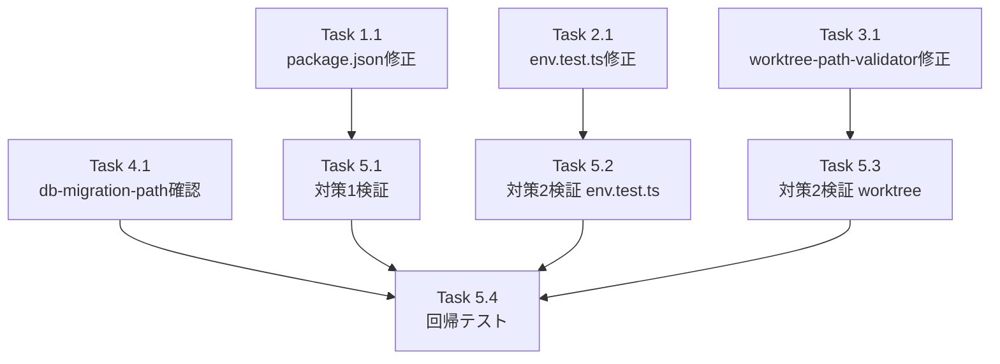

# 作業計画: Issue #304

## Issue概要

**Issue番号**: #304
**タイトル**: fix: テスト実行時にNODE_ENVが明示されず本番ビルドのReactが使用される
**ラベル**: bug
**サイズ**: S（設定変更のみ）
**優先度**: High（CIや開発フローに直接影響）
**依存Issue**: なし

---

## 問題サマリー

1. **問題1**: `NODE_ENV=production` がシェルに残留していると全UIテスト（61 unit + 4 integration）が失敗
2. **問題2**: `NODE_ENV=test` でも `env.test.ts` の9テストが `.env` ファイルの環境変数汚染で失敗

---

## 詳細タスク分解

### Phase 1: package.json 修正（対策1）

- [ ] **Task 1.1**: 全6テストスクリプトに `NODE_ENV=test` プレフィックスを追加
  - 対象ファイル: `package.json`
  - 変更内容:
    ```json
    "test": "NODE_ENV=test vitest",
    "test:ui": "NODE_ENV=test vitest --ui",
    "test:coverage": "NODE_ENV=test vitest --coverage",
    "test:unit": "NODE_ENV=test vitest run tests/unit",
    "test:integration": "NODE_ENV=test vitest run tests/integration",
    "test:watch": "NODE_ENV=test vitest --watch"
    ```
  - 変更しないスクリプト: `test:e2e`（Playwright / ブラウザ環境、スコープ外）
  - 依存: なし

### Phase 2: env.test.ts 修正（対策2-メイン）

- [ ] **Task 2.1**: `env.test.ts` の7つのdescribeブロックのbeforeEachに環境変数クリーンアップを追加
  - 対象ファイル: `tests/unit/env.test.ts`
  - 対象ブロック（process.envを操作する7ブロック、ソース出現順）:
    1. `getEnvWithFallback`
    2. `getEnvByKey`
    3. `resetWarnedKeys`
    4. `getEnv with fallback`
    5. `getLogConfig with fallback`
    6. `getDatabasePathWithDeprecationWarning`
    7. `getEnv with DB path resolution (Issue #135)`
  - 除外ブロック: `ENV_MAPPING`（process.envを操作せず、構造検証のみ）
  - 追加する変数クリーン処理（各beforeEachに追記）:

    ```typescript
    // 実装オプション1: ファイルローカルヘルパー関数（DR1-006、推奨）
    const ENV_VARS_TO_CLEAN = [
      'CM_ROOT_DIR', 'CM_PORT', 'CM_BIND', 'CM_DB_PATH',
      'CM_LOG_LEVEL', 'CM_LOG_FORMAT', 'CM_LOG_DIR',
      'MCBD_ROOT_DIR', 'MCBD_PORT', 'MCBD_BIND', 'MCBD_DB_PATH',
      'MCBD_LOG_LEVEL', 'MCBD_LOG_FORMAT', 'MCBD_LOG_DIR',
      'DATABASE_PATH',
    ] as const;

    function cleanEnvVars(): void {
      for (const key of ENV_VARS_TO_CLEAN) {
        delete process.env[key];
      }
    }

    // 各describeブロックのbeforeEachで呼び出す
    beforeEach(() => {
      process.env = { ...originalEnv };
      cleanEnvVars(); // ← 追加
      resetWarnedKeys();
      vi.spyOn(console, 'warn').mockImplementation(() => {});
    });
    ```

  - 注意: `getEnv with fallback` ブロックは `CM_DB_PATH` 未設定時に `getDefaultDbPath()` へフォールバックすることに暗黙依存している（DR3-006）。`ENV_VARS_TO_CLEAN` に `CM_DB_PATH` を含めることで解消される。
  - 依存: なし（Task 1.1 と独立）

### Phase 3: worktree-path-validator.test.ts 修正（対策2-サブ）

- [ ] **Task 3.1**: `beforeEach` に `ALLOWED_WORKTREE_PATHS` の delete を追加
  - 対象ファイル: `tests/unit/lib/worktree-path-validator.test.ts`
  - 変更箇所（L13-16）:
    ```typescript
    beforeEach(() => {
      vi.resetModules();
      process.env = { ...originalEnv };
      delete process.env.ALLOWED_WORKTREE_PATHS; // ← 追加
    });
    ```
  - 根拠: `worktree-path-validator.ts` は `ALLOWED_WORKTREE_PATHS` のみ参照（DR2-007）
  - 依存: なし

### Phase 4: db-migration-path.test.ts 確認（対策2-確認のみ）

- [ ] **Task 4.1**: `db-migration-path.test.ts` の現状確認（変更不要を確認）
  - 対象ファイル: `tests/unit/db-migration-path.test.ts`
  - 確認内容: `getLegacyDbPaths` describe の `beforeEach` に既に `delete process.env.DATABASE_PATH` が存在すること
  - 根拠: `db-migration-path.ts` は `DATABASE_PATH` のみ参照、既存のdeleteで十分（DR2-001）
  - **追加変更は不要**

### Phase 5: 動作確認

- [ ] **Task 5.1**: 対策1の検証
  ```bash
  NODE_ENV=production npm run test:unit
  NODE_ENV=production npm run test:integration
  ```
  期待: 全テストパス

- [ ] **Task 5.2**: 対策2の検証（env.test.ts）
  ```bash
  NODE_ENV=test npx vitest run tests/unit/env.test.ts
  ```
  期待: 25テスト全パス（現状9テスト失敗 → 0テスト失敗）

- [ ] **Task 5.3**: 対策2の検証（worktree-path-validator.test.ts）
  ```bash
  npm run test:unit -- tests/unit/lib/worktree-path-validator.test.ts
  ```
  期待: 全テストパス

- [ ] **Task 5.4**: 回帰テスト
  ```bash
  npm run test:unit
  npm run test:integration
  npx tsc --noEmit
  npm run lint
  ```
  期待: 全チェック通過

---

## タスク依存関係



Task 1.1、2.1、3.1、4.1 は互いに独立しており並列実装可能。

---

## 品質チェック項目

| チェック項目 | コマンド | 基準 |
|-------------|----------|------|
| TypeScript | `npx tsc --noEmit` | 型エラー0件 |
| ESLint | `npm run lint` | エラー0件 |
| Unit Test (通常) | `npm run test:unit` | 全テストパス |
| Unit Test (NODE_ENV=production) | `NODE_ENV=production npm run test:unit` | 全テストパス |
| Integration Test | `NODE_ENV=production npm run test:integration` | 全テストパス |

---

## 成果物チェックリスト

### 修正ファイル（ソースコード変更なし）
- [ ] `package.json`（全6テストスクリプトに `NODE_ENV=test` 追加）
- [ ] `tests/unit/env.test.ts`（7 describeブロックに環境変数クリーンアップ追加）
- [ ] `tests/unit/lib/worktree-path-validator.test.ts`（ALLOWED_WORKTREE_PATHS delete追加）
- [ ] `tests/unit/db-migration-path.test.ts`（変更不要を確認）

### 変更しないファイル
- `src/` 以下のすべてのファイル
- `vitest.config.ts`
- `.github/workflows/ci-pr.yml`

---

## Definition of Done

Issue完了条件：
- [ ] `NODE_ENV=production` が設定されたシェルで `npm run test:unit` を実行しても全テストがパスすること
- [ ] `NODE_ENV=production` が設定されたシェルで `npm run test:integration` を実行しても全テストがパスすること
- [ ] `tests/unit/env.test.ts` の全25テスト（現状9失敗）がパスすること
- [ ] `npx tsc --noEmit` がエラー0件
- [ ] `npm run lint` がエラー0件
- [ ] 既存テストに影響がないこと

---

## 次のアクション

1. **TDD実装**: `/pm-auto-dev` で自動開発フロー実行
2. **PR作成**: `/create-pr` で自動作成
