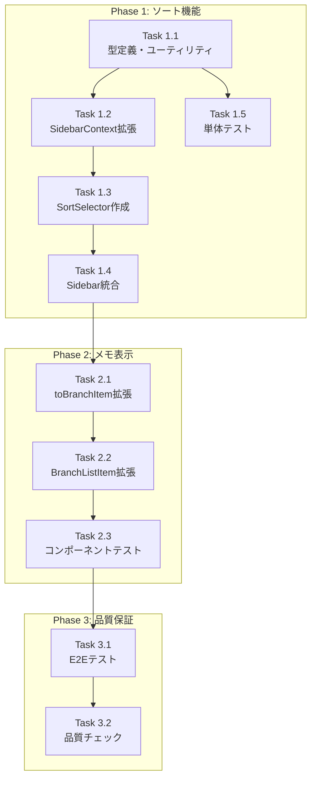

# Issue #31 作業計画書

## Issue: サイドバーのUX改善

| 項目 | 内容 |
|------|------|
| **Issue番号** | #31 |
| **サイズ** | M（中規模） |
| **優先度** | High |
| **依存Issue** | なし |
| **設計書** | `dev-reports/design/issue-31-sidebar-ux-design-policy.md` |
| **レビュー** | `dev-reports/review/2026-01-10-issue-31-architecture-review.md` |

---

## 1. 要件サマリ

| No | 要件 | 優先度 | Phase |
|----|------|--------|-------|
| 1 | ソート順を選択可能にする（リポジトリ名、ブランチ名、対応状況） | High | Phase 1 |
| 2 | Claude Codeからの対応状況を視覚的に表示 | High | 既存で対応済み |
| 3 | 選択中ブランチにリポジトリ名とメモを表記 | Medium | Phase 2 |

---

## 2. 詳細タスク分解

### Phase 1: ソート機能（基盤）

#### Task 1.1: 型定義・ユーティリティ実装
- **成果物**:
  - `src/lib/sidebar-utils.ts`（新規）
  - `src/types/sidebar.ts`（拡張）
- **依存**: なし
- **内容**:
  - `SortKey` 型定義
  - `sortBranches()` 関数実装
  - `statusPriority` 定数定義
  - `SidebarBranchItem` に `memo` フィールド追加

```typescript
// 実装する型
type SortKey = 'updatedAt' | 'repositoryName' | 'branchName' | 'status';

// 実装する関数
function sortBranches(branches: SidebarBranchItem[], sortKey: SortKey, direction: 'asc' | 'desc'): SidebarBranchItem[]
```

---

#### Task 1.2: SidebarContext拡張
- **成果物**: `src/contexts/SidebarContext.tsx`
- **依存**: Task 1.1
- **内容**:
  - `sortKey` 状態追加
  - `sortDirection` 状態追加
  - `setSortKey()` アクション追加
  - localStorage永続化

```typescript
// 追加する状態
interface SidebarState {
  // 既存...
  sortKey: SortKey;
  sortDirection: 'asc' | 'desc';
}

// 追加するアクション
type SidebarAction =
  | { type: 'SET_SORT_KEY'; sortKey: SortKey }
  | { type: 'SET_SORT_DIRECTION'; sortDirection: 'asc' | 'desc' };
```

---

#### Task 1.3: SortSelectorコンポーネント作成
- **成果物**: `src/components/sidebar/SortSelector.tsx`（新規）
- **依存**: Task 1.2
- **内容**:
  - ドロップダウンUI実装
  - ソートオプション表示
  - アクセシビリティ対応（aria属性）
  - モバイル対応

---

#### Task 1.4: Sidebar統合
- **成果物**: `src/components/layout/Sidebar.tsx`
- **依存**: Task 1.3
- **内容**:
  - SortSelector配置
  - useMemoでソート結果をメモ化
  - 既存の検索フィルタとの統合

---

#### Task 1.5: Phase 1 単体テスト
- **成果物**: `tests/unit/lib/sidebar-utils.test.ts`（新規）
- **依存**: Task 1.1
- **内容**:
  - `sortBranches()` の各ソートキーテスト
  - エッジケース（空配列、同値）テスト

---

### Phase 2: メモ表示改善

#### Task 2.1: toBranchItem拡張
- **成果物**: `src/types/sidebar.ts`
- **依存**: Phase 1完了
- **内容**:
  - `toBranchItem()` でmemoを含める

---

#### Task 2.2: BranchListItem拡張
- **成果物**: `src/components/sidebar/BranchListItem.tsx`
- **依存**: Task 2.1
- **内容**:
  - 選択時にメモ表示
  - truncate処理（長文対応）
  - アイコン追加（📝）

---

#### Task 2.3: Phase 2 コンポーネントテスト
- **成果物**: `tests/unit/components/sidebar/BranchListItem.test.tsx`
- **依存**: Task 2.2
- **内容**:
  - メモ表示の条件分岐テスト
  - 選択状態での表示確認

---

### Phase 3: 品質保証

#### Task 3.1: E2Eテスト
- **成果物**: `tests/e2e/sidebar-sort.spec.ts`（新規）
- **依存**: Phase 1-2完了
- **内容**:
  - ソート切り替え操作テスト
  - ソート結果の順序確認
  - メモ表示確認

---

#### Task 3.2: 品質チェック実行
- **成果物**: なし（確認のみ）
- **依存**: Task 3.1
- **内容**:
  - ESLint / TypeScript / テスト / ビルド確認

---

## 3. タスク依存関係



---

## 4. ファイル変更一覧

| ファイル | 変更種別 | Phase |
|---------|---------|-------|
| `src/lib/sidebar-utils.ts` | 新規 | 1 |
| `src/types/sidebar.ts` | 修正 | 1, 2 |
| `src/contexts/SidebarContext.tsx` | 修正 | 1 |
| `src/components/sidebar/SortSelector.tsx` | 新規 | 1 |
| `src/components/layout/Sidebar.tsx` | 修正 | 1 |
| `src/components/sidebar/BranchListItem.tsx` | 修正 | 2 |
| `tests/unit/lib/sidebar-utils.test.ts` | 新規 | 1 |
| `tests/unit/components/sidebar/BranchListItem.test.tsx` | 新規 | 2 |
| `tests/e2e/sidebar-sort.spec.ts` | 新規 | 3 |

---

## 5. 品質チェック項目

| チェック項目 | コマンド | 基準 |
|-------------|----------|------|
| ESLint | `npm run lint` | エラー0件 |
| TypeScript | `npx tsc --noEmit` | 型エラー0件 |
| Unit Test | `npm run test:unit` | 全テストパス |
| Build | `npm run build` | 成功 |

---

## 6. 成果物チェックリスト

### コード
- [ ] `src/lib/sidebar-utils.ts` - ソートユーティリティ
- [ ] `src/types/sidebar.ts` - 型定義拡張
- [ ] `src/contexts/SidebarContext.tsx` - Context拡張
- [ ] `src/components/sidebar/SortSelector.tsx` - ソート選択UI
- [ ] `src/components/layout/Sidebar.tsx` - 統合
- [ ] `src/components/sidebar/BranchListItem.tsx` - メモ表示

### テスト
- [ ] `tests/unit/lib/sidebar-utils.test.ts`
- [ ] `tests/unit/components/sidebar/BranchListItem.test.tsx`
- [ ] `tests/e2e/sidebar-sort.spec.ts`

---

## 7. Definition of Done

Issue完了条件：

- [ ] Phase 1-3の全タスクが完了
- [ ] 単体テストカバレッジ80%以上（新規コード）
- [ ] CIチェック全パス（lint, type-check, test, build）
- [ ] コードレビュー承認
- [ ] 動作確認完了
  - [ ] ソート切り替えが即座に反映される
  - [ ] ソート設定がリロード後も維持される
  - [ ] 選択中ブランチにメモが表示される
  - [ ] モバイルでも操作可能

---

## 8. リスクと対策

| リスク | 影響 | 対策 |
|--------|------|------|
| SidebarContext肥大化 | 保守性低下 | 将来的にSortContext分離を検討 |
| localStorage容量超過 | 設定消失 | キー名を短く、必要最小限の値のみ保存 |
| モバイルUI操作性 | UX低下 | ドロップダウンのタッチ領域確保 |

---

## 9. 次のアクション

作業計画承認後：

1. **ブランチ作成**:
   ```bash
   git checkout -b feature/31-sidebar-ux-improvement
   ```

2. **タスク実行**:
   - Phase 1 → Phase 2 → Phase 3 の順で実装
   - 各タスク完了時にコミット

3. **進捗報告**:
   - `/progress-report` で定期報告

4. **PR作成**:
   - `/create-pr` で自動作成

---

## 10. 参考情報

### 設計決定事項

| 決定事項 | 内容 |
|---------|------|
| ソート方式 | クライアントサイドソート |
| 状態管理 | SidebarContext拡張 + localStorage永続化 |
| ステータス | idle / running / waiting の3種類（generatingはrunningに統合） |
| メモ表示 | 選択中ブランチのみ |

### 関連ドキュメント

- [設計方針書](../design/issue-31-sidebar-ux-design-policy.md)
- [アーキテクチャレビュー](../review/2026-01-10-issue-31-architecture-review.md)
