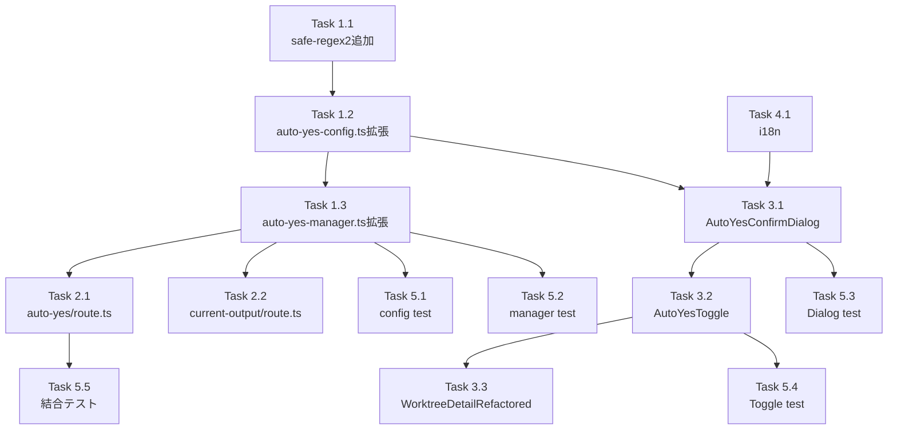

# Issue #314 作業計画書

## Issue: feat: Auto-Yesにターミナル出力のStop条件（正規表現）を追加

**Issue番号**: #314
**サイズ**: L
**優先度**: High
**依存Issue**: なし
**設計方針書**: `dev-reports/design/issue-314-auto-yes-stop-condition-design-policy.md`

---

## 概要

Auto-Yesモードにターミナル出力ベースのStop条件（正規表現）機能を追加する。ユーザーが指定した正規表現パターンにターミナル出力がマッチした場合、Auto-Yesを自動停止する。

### 主要変更ポイント

1. **設定層**: `auto-yes-config.ts` に `MAX_STOP_PATTERN_LENGTH` と `validateStopPattern()` を追加
2. **ビジネスロジック層**: `auto-yes-manager.ts` に `AutoYesState` 型拡張、`disableAutoYes()`、`checkStopCondition()` を追加
3. **APIルート層**: `auto-yes/route.ts` に stopPattern 受け渡し、`current-output/route.ts` に stopReason 返却追加
4. **プレゼンテーション層**: `AutoYesConfirmDialog.tsx`、`AutoYesToggle.tsx`、`WorktreeDetailRefactored.tsx` の変更
5. **i18n**: `locales/ja/autoYes.json`、`locales/en/autoYes.json` に翻訳キー追加
6. **セキュリティ**: `safe-regex2` 依存追加、`executeRegexWithTimeout()` 実装

---

## 詳細タスク分解

### Phase 1: 設定層・ビジネスロジック層（基盤実装）

#### Task 1.1: `safe-regex2` パッケージ追加
- **成果物**: `package.json`
- **依存**: なし
- **詳細**: `npm install safe-regex2` で依存追加
- **注意**: ReDoS対策のために必須（DS4-F001 Must Fix）

#### Task 1.2: `auto-yes-config.ts` 拡張
- **成果物**: `src/config/auto-yes-config.ts`
- **依存**: Task 1.1
- **変更内容**:
  - `MAX_STOP_PATTERN_LENGTH = 500` 定数追加
  - `validateStopPattern(pattern: string): { valid: boolean; error?: string }` 関数追加
    - 長さチェック（MAX_STOP_PATTERN_LENGTH）
    - `safe-regex2` によるカタストロフィックバックトラッキング検出
    - `new RegExp()` による構文検証
    - エラーメッセージは固定文字列のみ（XSS防止）
  - モジュールJSDoc更新（クライアント/サーバー共用バリデーション）
- **テスト**: `tests/unit/config/auto-yes-config.test.ts` に追加

#### Task 1.3: `auto-yes-manager.ts` 型・関数拡張
- **成果物**: `src/lib/auto-yes-manager.ts`
- **依存**: Task 1.2
- **変更内容**:
  - `AutoYesState` インターフェース拡張:
    ```typescript
    stopPattern?: string;
    stopReason?: 'expired' | 'stop_pattern_matched';
    ```
  - `setAutoYesEnabled()` 第4引数 `stopPattern?: string` 追加（enableパス）
  - `setAutoYesEnabled()` disableパスを `disableAutoYes()` に委譲
  - **`disableAutoYes(worktreeId: string, reason?: StopReason): AutoYesState` 新規追加** (Must Fix DS1-F003)
    - 全フィールドを明示的に設定
    - enabledAt/expiresAt/stopPattern を既存stateから引き継ぎ
  - `getAutoYesState()` 期限切れ処理を `disableAutoYes(id, 'expired')` に委譲
  - **`executeRegexWithTimeout(regex: RegExp, text: string, timeoutMs: number): boolean | null` 新規追加** (Must Fix DS4-F002)
    - `vm.runInNewContext` による100msタイムアウト保護
    - タイムアウト時のフェイルセーフ（stopPattern自動無効化）
  - **`checkStopCondition(worktreeId: string, cleanOutput: string): boolean` 新規追加** (@internal export) (SRP DS1-F001)
    - `getAutoYesState()` で最新状態取得
    - `safe-regex2` 安全性チェック（validateStopPattern経由）
    - `executeRegexWithTimeout()` でタイムアウト保護付き評価
    - マッチ時: `disableAutoYes(worktreeId, 'stop_pattern_matched')` + `stopAutoYesPolling(worktreeId)` + 構造化ログ
  - `pollAutoYes()` 修正: thinking check後、プロンプト検出前に `checkStopCondition()` 挿入
  - ログ出力を構造化ログ形式に変更（DS4-F005）
- **テスト**: `tests/unit/lib/auto-yes-manager.test.ts` に12-15個の新規テストケース追加

### Phase 2: APIルート層

#### Task 2.1: `auto-yes/route.ts` 拡張
- **成果物**: `src/app/api/worktrees/[id]/auto-yes/route.ts`
- **依存**: Task 1.3
- **変更内容**:
  - `validateStopPattern` を `auto-yes-config.ts` からimport
  - POSTハンドラに `body.stopPattern` 処理追加:
    - 空文字正規化: `body.stopPattern?.trim() || undefined`
    - `validateStopPattern()` でサーバーサイドバリデーション（Defense in Depth）
    - 無効時: `400 { error: result.error }`
    - 挿入位置: duration検証 (L120-129) の直後、cliToolId検証の前
  - `setAutoYesEnabled()` 呼び出しに `stopPattern` 引数追加

#### Task 2.2: `current-output/route.ts` 拡張
- **成果物**: `src/app/api/worktrees/[id]/current-output/route.ts`
- **依存**: Task 1.3
- **変更内容**:
  - GETハンドラ冒頭に `isValidWorktreeId(params.id)` チェック追加（DS4-F006）
  - レスポンスの `autoYes` オブジェクトに `stopReason` 追加:
    ```typescript
    autoYes: {
      enabled: autoYesState?.enabled ?? false,
      expiresAt: autoYesState?.expiresAt ?? null,
      stopReason: autoYesState?.stopReason,  // 新規
    }
    ```
  - JSDocにAPI解釈ルールを追記（stopReasonはenum値のみ、パターン内容は非返却）

### Phase 3: プレゼンテーション層（アトミック実装）

> **重要**: Task 3.1, 3.2, 3.3 はアトミックに実装すること（DS3-F003 Must Fix）。
> AutoYesConfirmDialog.onConfirm変更とAutoYesToggle.handleConfirm変更は同時に実施しないとstopPatternがコンポーネント境界で消失する。

#### Task 3.1: `AutoYesConfirmDialog.tsx` 変更
- **成果物**: `src/components/worktree/AutoYesConfirmDialog.tsx`
- **依存**: Task 1.2
- **変更内容**:
  - `AutoYesConfirmDialogProps.onConfirm` シグネチャ変更:
    ```typescript
    // Before
    onConfirm: (duration: AutoYesDuration) => void;
    // After
    onConfirm: (duration: AutoYesDuration, stopPattern?: string) => void;
    ```
  - `stopPattern` state追加 (`useState<string>('')`)
  - `regexError` state追加 (`useState<string | null>(null)`)
  - stopPattern入力フィールド追加（テキスト入力、プレースホルダー）
  - `useEffect` でリアルタイムバリデーション（`validateStopPattern()` 使用）
  - `isOpen` 変更時にstopPattern/regexErrorをリセットするuseEffect追加（DS1-F008）
  - onConfirm呼び出し: `onConfirm(selectedDuration, stopPattern.trim() || undefined)`（DS2-F006空文字正規化）
  - バリデーションエラー表示UI（regexErrorが存在する場合はsubmitボタン無効化）
  - i18n対応（`stopPatternLabel`, `stopPatternPlaceholder`, `invalidRegexPattern`, `patternTooLong`）

#### Task 3.2: `AutoYesToggle.tsx` 変更
- **成果物**: `src/components/worktree/AutoYesToggle.tsx`
- **依存**: Task 3.1
- **変更内容**:
  - `AutoYesToggleParams` インターフェース追加（exportする DS3-F011）:
    ```typescript
    export interface AutoYesToggleParams {
      enabled: boolean;
      duration?: AutoYesDuration;
      stopPattern?: string;
    }
    ```
  - `onToggle` シグネチャ変更:
    ```typescript
    // Before
    onToggle: (enabled: boolean, duration?: AutoYesDuration) => Promise<void>;
    // After
    onToggle: (params: AutoYesToggleParams) => Promise<void>;
    ```
  - `handleToggle`: `onToggle({ enabled: false })` に変更
  - `handleConfirm`: `onToggle({ enabled: true, duration, stopPattern })` に変更（stopPattern転送）
  - `handleConfirm` の `onConfirm` コールバックシグネチャを変更して `stopPattern` を受け取る

#### Task 3.3: `WorktreeDetailRefactored.tsx` 変更
- **成果物**: `src/components/worktree/WorktreeDetailRefactored.tsx`
- **依存**: Task 3.2
- **変更内容**:
  - `CurrentOutputResponse` 型（L85-88）に `stopReason` 追加（DS3-F002 Must Fix）:
    ```typescript
    autoYes: {
      enabled: boolean;
      expiresAt: number | null;
      stopReason?: 'expired' | 'stop_pattern_matched';  // 新規
    }
    ```
  - `handleAutoYesToggle` (L1188) シグネチャ変更（DS3-F001 Must Fix）:
    ```typescript
    // Before
    handleAutoYesToggle = useCallback(async (enabled: boolean, duration?: AutoYesDuration) => {
    // After
    handleAutoYesToggle = useCallback(async (params: AutoYesToggleParams) => {
    ```
  - `handleAutoYesToggle` fetch bodyに `stopPattern: params.stopPattern` 追加
  - `AutoYesToggleParams` を `AutoYesToggle.tsx` からimport
  - `prevAutoYesEnabledRef` 追加（useRef<boolean>でトースト重複防止）
  - `fetchCurrentOutput()` (L1037-1041) にstopReason検出・トースト表示ロジック追加:
    - `enabled: true -> false` 遷移時のみstopReasonをチェック
    - `stopReason === 'stop_pattern_matched'` の場合: 「Stop条件により自動停止」トースト表示
  - デスクトップ (L1811-1817) とモバイル (L1950-1957) の両AutoYesToggleコンポーネントが同じ `handleAutoYesToggle` を参照していることを確認
  - i18n: `stopPatternMatched` トーストメッセージ

### Phase 4: i18n

#### Task 4.1: 翻訳キー追加
- **成果物**: `locales/ja/autoYes.json`, `locales/en/autoYes.json`
- **依存**: なし（並行実装可能）
- **追加キー（6個）**:
  ```json
  {
    "stopPatternLabel": "Stop条件（正規表現）",
    "stopPatternPlaceholder": "例: rm -rf|DROP TABLE|force push",
    "stopPatternDescription": "ターミナル出力がこのパターンにマッチした場合、Auto-Yesを自動停止します",
    "invalidRegexPattern": "無効な正規表現パターンです",
    "patternTooLong": "パターンは500文字以内で入力してください",
    "stopPatternMatched": "Stop条件にマッチしたためAuto-Yesを自動停止しました"
  }
  ```

### Phase 5: テスト

#### Task 5.1: `auto-yes-config.test.ts` 更新
- **成果物**: `tests/unit/config/auto-yes-config.test.ts`
- **依存**: Task 1.2
- **新規テストケース**:
  - `validateStopPattern()` 有効パターン（正常な正規表現）
  - `validateStopPattern()` 空文字 → 有効（有効な空パターン）
  - `validateStopPattern()` 500文字超 → 無効
  - `validateStopPattern()` 無効な構文 → 無効
  - `validateStopPattern()` ReDoSパターン `(a+)+$` → safe-regex2で無効
  - `validateStopPattern()` エラーメッセージが固定文字列のみ（XSS防止）

#### Task 5.2: `auto-yes-manager.test.ts` 更新
- **成果物**: `tests/unit/lib/auto-yes-manager.test.ts`
- **依存**: Task 1.3
- **新規テストケース（12-15個）**:
  - `setAutoYesEnabled(id, true, duration, stopPattern)` でstopPatternが保存される
  - `disableAutoYes(id)` でenabled=false、stopReason=undefined
  - `disableAutoYes(id, 'stop_pattern_matched')` でstopReason設定
  - `disableAutoYes(id, 'expired')` でstopReason設定
  - `disableAutoYes()` でstopPattern/stopReasonが保持される
  - 再enableでstopReason/stopPatternがクリアされる
  - `checkStopCondition()` stopPatternなし → false
  - `checkStopCondition()` マッチあり → true + disableAutoYes呼び出し
  - `checkStopCondition()` マッチなし → false
  - `checkStopCondition()` ReDoSパターン → タイムアウト → stopPattern無効化
  - `getAutoYesState()` 期限切れ → stopReason='expired'
  - `executeRegexWithTimeout()` 100ms以内 → 結果返却
  - `executeRegexWithTimeout()` タイムアウト → null返却

#### Task 5.3: `AutoYesConfirmDialog.test.tsx` 更新
- **成果物**: `tests/unit/components/worktree/AutoYesConfirmDialog.test.tsx`
- **依存**: Task 3.1
- **既存テスト**: L119, L127, L135 は後方互換（optional引数追加のみ）で修正不要
- **新規テストケース**:
  - stopPattern入力フィールドが表示される
  - 無効な正規表現を入力するとエラー表示 + submitボタン無効化
  - 有効なstopPatternを入力してsubmitするとonConfirmにstopPatternが渡される
  - 空のstopPatternでsubmitするとonConfirmにundefinedが渡される
  - ダイアログ再表示時にstopPattern/regexErrorがリセットされる

#### Task 5.4: `AutoYesToggle.test.tsx` 更新
- **成果物**: `tests/unit/components/worktree/AutoYesToggle.test.tsx`
- **依存**: Task 3.2
- **破壊的変更対応（Before/After）**:
  | 行 | Before | After |
  |----|--------|-------|
  | L17 | `onToggle: vi.fn<[boolean, AutoYesDuration?], Promise<void>>()` | `onToggle: vi.fn<[AutoYesToggleParams], Promise<void>>()` |
  | L45 | `toHaveBeenCalledWith(true, DEFAULT_AUTO_YES_DURATION)` | `toHaveBeenCalledWith({ enabled: true, duration: DEFAULT_AUTO_YES_DURATION })` |
  | L59 | `toHaveBeenCalledWith(false)` | `toHaveBeenCalledWith({ enabled: false })` |
  | L81 | `toHaveBeenCalledWith(true, ...)` | `toHaveBeenCalledWith({ enabled: true, duration: ... })` |
- **新規テストケース**:
  - stopPatternを含めてonToggleが呼ばれる
  - stopPatternなしでonToggleが呼ばれる

#### Task 5.5: 結合テスト更新
- **成果物**: `tests/integration/auto-yes-persistence.test.ts`
- **依存**: Task 1.3
- **既存テスト**: `setAutoYesEnabled()` 3引数呼び出しはoptional引数のため後方互換（変更不要）
- **新規テストケース**:
  - Auto-Yesを stopPattern付きで有効化し、マッチング後に自動停止されることを確認

---

## タスク依存関係



### アトミック実装グループ
- **Group A**: Task 3.1 + Task 3.2 + Task 3.3 は同時コミット必須
  - AutoYesConfirmDialog.onConfirm と AutoYesToggle.handleConfirm の変更は片方だけではstopPatternが消失する

### 並行実装可能グループ
- Task 4.1（i18n）は他タスクと並行実装可能
- Task 2.1 と Task 2.2 は Task 1.3 完了後に並行実装可能
- Task 5.1〜5.5 は各依存タスク完了後に並行実装可能

---

## 推奨実装順序

```
Step 1: Task 1.1 (safe-regex2追加)
Step 2: Task 1.2 (auto-yes-config.ts)
Step 3: Task 1.3 (auto-yes-manager.ts)
Step 4a: Task 2.1 (auto-yes/route.ts) ← 並行可能
Step 4b: Task 2.2 (current-output/route.ts) ← 並行可能
Step 4c: Task 4.1 (i18n) ← 並行可能
Step 5: Task 3.1 (AutoYesConfirmDialog)
Step 6: Task 3.2 (AutoYesToggle)
Step 7: Task 3.3 (WorktreeDetailRefactored)
Step 8: Task 5.1〜5.5 (テスト) ← 各依存完了後に並行可能
```

---

## 品質チェック項目

| チェック項目 | コマンド | 基準 |
|-------------|----------|------|
| ESLint | `npm run lint` | エラー0件 |
| TypeScript | `npx tsc --noEmit` | 型エラー0件 |
| Unit Test | `npm run test:unit` | 全テストパス |
| Build | `npm run build` | 成功 |

---

## 成果物チェックリスト

### コード
- [ ] `package.json` (safe-regex2追加)
- [ ] `src/config/auto-yes-config.ts` (MAX_STOP_PATTERN_LENGTH, validateStopPattern)
- [ ] `src/lib/auto-yes-manager.ts` (AutoYesState拡張, disableAutoYes, checkStopCondition, executeRegexWithTimeout)
- [ ] `src/app/api/worktrees/[id]/auto-yes/route.ts` (stopPattern受け渡し)
- [ ] `src/app/api/worktrees/[id]/current-output/route.ts` (stopReason返却, worktreeIdバリデーション)
- [ ] `src/components/worktree/AutoYesConfirmDialog.tsx` (stopPattern入力UI)
- [ ] `src/components/worktree/AutoYesToggle.tsx` (AutoYesToggleParams)
- [ ] `src/components/worktree/WorktreeDetailRefactored.tsx` (handleAutoYesToggle変更, トースト通知)
- [ ] `locales/ja/autoYes.json` (6翻訳キー追加)
- [ ] `locales/en/autoYes.json` (6翻訳キー追加)

### テスト
- [ ] `tests/unit/config/auto-yes-config.test.ts` (validateStopPatternテスト)
- [ ] `tests/unit/lib/auto-yes-manager.test.ts` (12-15個の新規テスト)
- [ ] `tests/unit/components/worktree/AutoYesConfirmDialog.test.tsx` (stopPattern関連テスト)
- [ ] `tests/unit/components/worktree/AutoYesToggle.test.tsx` (破壊的変更対応)
- [ ] `tests/integration/auto-yes-persistence.test.ts` (Stop条件結合テスト)

---

## Definition of Done

Issue完了条件：
- [ ] 全タスク実装完了
- [ ] 全テストパス（既存テスト含む）
- [ ] TypeScriptエラー0件
- [ ] ESLintエラー0件
- [ ] ビルド成功
- [ ] コードレビュー承認

---

## セキュリティ実装チェックリスト

- [ ] `safe-regex2` によるReDoSパターン検出（DS4-F001 Must Fix）
- [ ] `executeRegexWithTimeout()` 100msタイムアウト保護（DS4-F002 Must Fix）
- [ ] `validateStopPattern()` でのエラーメッセージ固定文字列使用（error.message禁止）（DS4-F008）
- [ ] `current-output/route.ts` に `isValidWorktreeId()` 追加（DS4-F006）
- [ ] 構造化ログ形式の使用（ユーザー入力を直接連結しない）（DS4-F005）

---

## 注意事項

### 破壊的変更
- `AutoYesToggle.onToggle` のシグネチャ変更は破壊的変更
  - `tests/unit/components/worktree/AutoYesToggle.test.tsx` の L17/L45/L59/L81 を同時修正すること

### アトミック実装
- Task 3.1 (AutoYesConfirmDialog) + Task 3.2 (AutoYesToggle) + Task 3.3 (WorktreeDetailRefactored) は同一コミットが推奨
- onConfirm/handleConfirm の境界でstopPatternが消失しないよう注意

### 実装順序
設計方針書 Section 13 の実装チェックリストに従うこと:
1. `auto-yes-config.ts` (validateStopPattern + MAX_STOP_PATTERN_LENGTH)
2. `safe-regex2` パッケージ追加
3. `auto-yes-manager.ts` (AutoYesState型拡張)
4. `disableAutoYes()` 関数追加
5. `setAutoYesEnabled()` enableパスにstopPattern引数追加
6. `setAutoYesEnabled()` disableパスを `disableAutoYes()` に委譲
7. `getAutoYesState()` 期限切れを `disableAutoYes()` に委譲
8. `executeRegexWithTimeout()` 関数追加
9. `checkStopCondition()` 関数追加
10. `pollAutoYes()` に `checkStopCondition()` 挿入

---

## 次のアクション

作業計画承認後：
1. **ブランチ確認**: `feature/314-worktree`（既存）
2. **TDD実装**: `/pm-auto-dev 314` で自動実装開始
3. **進捗報告**: `/progress-report` で定期報告
4. **PR作成**: `/create-pr` で自動作成
